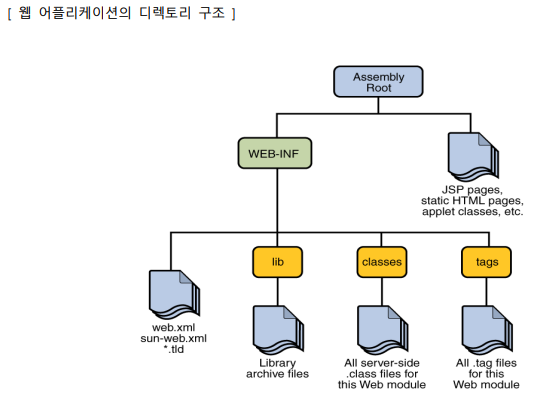
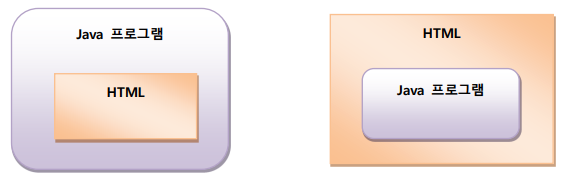

# MVC



## domain

### VO

### DTO


## Java EE 기반의 웹 어플리케이션
: Java EE(Enterprise Edition) 환경에서 Servlet 과 JSP 는 웹 컨테이너(엔진이라고도 함)에 의해 관리되고 수행되는 웹 컴포넌트로서 여러 웹 컴포넌트들이 모여 하나의 웹 어플리케이션을 구성한다


- Servlet: 상속 구문과 메서드 오버라이딩 구문을 적용한 Java 로 구현된 프로그램으로서 수행 결과를 HTML로 응답하도록 구현하는 기술
- JSP : HTML 문서 안에 JSP 태그와 동적인 처리를 담당하는 Java 코드를 삽입하여 구현하는 기술



- JSP : 스크립팅방식
- JSP + 자바클래스(자바빈) : 모델1
- **C**-Servlet + **V**-JSP + **M**-자바클래스(자바빈) : 모델2(MVC)
- Web Server(HTTP Server) + Application Server --> Web Application Server(WAS)

---

## Thymeleaf
: View Template Engine, 컨트롤러에서 전달받은 데이터를 추출해 동적인 페이지를 생성한다

- html 파일 내에서 태그의 속성으로 Thymeleaf 명령어 사용
- 기존 템플릿 기술들은 서버를 구동시켜야 하지만, Thymeleaf의 경우 static 파일을 사용하듯 해당 내용을 브라우저에서 바로 확인할 수 있다
    - Thymeleaf가 HTML 태그의 속성으로 작성되어 기존의 HTML구조를 건드리지 않기 때문
- Natural Template (내추럴 템플릿) : 서버를 구동하지 않으면 순수 HTML로 구성되는 정적인 페이지를, 서버를 구동하면 동적으로 페이지 생성
- default prefix : `src/main/resources/templates`
- suffix : `.html`

``` html
<!DOCTYPE html>
<html xmlns:th="http://www.thymeleaf.org"> <!-- Thymeleaf -->
<head>
<meta charset="UTF-8">
<title>Insert title here</title>
</head>
<body>
    <!-- 서버를 기동시키지 않으면 "Hi Thymeleaf", 컨트롤러를 거치면 say가 생기므로 "안녕? 타임리프" 출력 -->
    <p><span th:text="${say}">Hi</span>Thymeleaf</p> 
    <p>[[${say}]] Thymeleaf</p>

    <!-- user.name이 있으면 value로 사용, 없으면 unico를 value로 사용 -->
    <input type="text" name="userName" value="unico" th:value="${user.name}">

    <h2>전달된 데이터 : [[${ param.pageno }]]</h2>
</body>
</html>
```

---
### 문법

- `#locale` : 
- `param` : Request Parameter
    - param.query_name
    - param.size()
    - param.isEmpty()
    - param.containsKey('query_name')
- `@` : bean 객체
- `#temporals`
    - format(Time, '')
    - second, minute, hour
    - day, month, monthName, monthNameShort, year
    - dayOfWeek, dayOfWeekName, dayOfWeekNameShort
- `#dates`
    - `#dates.createNow()` : 시간까지 출력
    - `#dates.createToday()` : 시간은 00:00:00
    - `#dates.format(#dates.createNow(), 'YYYY/MM/dd HH:mm')`
    - `#calendars.dayOfWeekName(#dates.createNow())`
- 삼항연산자
- link
    - `<a th:href="@{/hello}">url</a>`

=== "date, strings"
    ``` html
    <span th:text="${#locale}"></span> <!-- 지역 출력 : "ko_KR" -->
    <span th:text="${@my.hello('Spring Boot!')}"> <!-- @ Bean 객체 출력 : "안녕? Spring boot!"-->

    <!-- #temporals -->
    [[${#temporals.format(startTime,'yyyy-MM-dd HH:mm:ss')}]]
    [[${#temporals.format(startTime,'yyyy년 MM월 dd일 HH시 mm분')}]]
    <span th:text="${#temporals.day(startTime)}"></span><

    <!-- #dates, #calendars -->
    [[${#dates}]]
    [[${#dates.createNow()}]]
    [[${#dates.createToday()}]]
    [[${#dates.format(#dates.createNow(), 'YYYY/MM/dd HH:mm')}]]
    [[${#calendars.dayOfWeekName(#dates.createNow())}]]

    <!-- #strings -->
    [[${#strings}]]
    [[${#strings.isEmpty(param.name)}]]
    [[${#strings.length(attributeName)}]]
    '[[${#strings.toLowerCase(attributeName)}]]'
    '[[${attributeName}]]'
    '[[${#strings.trim(attributeName)}]]'
    ```
=== "param, session, link" 
    ``` html
    <!-- Parameter -->
    <span th:text="${param.paramData}"></span> 

    <!-- session -->
    [[${session} ]]
    [[${session.sessionData} ]]
    [[${session.size()}]]
    [[${session.isEmpty()}]]
    [[${session.containsKey('attributeName')}]]
    [[${session.keySet()} ]]
    [[${session.count[0]}]]

    <!-- link -->
    <a th:href="@{/hello}">basic url</a>

    ```
=== "삼항연산자"    
    ``` html
    <!-- 삼항연산자 -->
    <tr th:each="notice : ${fixedNoticeList}">
        <td></td>
        <td th:text="${notice.showYn} == 'Y' ? 'O'"></td>
        <td th:text="${notice.noticeYn} == 'Y' ? 'O'"></td>
    </tr>
    ```

### 타임리프 URL 링크

- 절대 경로 `@{/hello}`
- 상대 경로 `@{hello}`

#### Basic url
- @{/hello}  ->  /hello
``` html
<a th:href="@{/hello}">단순 URL</a>​
```

#### Query parameter + url
- @{/hello(param1=${param1}, param2=${param2})}   -> /hello?param1=data1&param2=data2
``` html
th:href="@{/hello(param1=${param1}, param2=${param2})}">쿼리 파라미터 포함 URL</a>​
```

#### Path variable + url
- @{/hello/{param1}/{param2}(param1=${param1}, param2=${param2})} ->   /hello/data1/data2
``` html
<a th:href="@{/hello/{param1}/{param2}(param1=${param1}, param2=${param2})}">경로 변수가 포함된 URL</a>​
```

#### Query parameter + Path variable + url
- @{/hello/{param1}(param1=${param1}, param2=${param2})} ->    /hello/data1?param2=data2
``` html
<a th:href="@{/hello/{param1}(param1=${param1}, param2=${param2})}">path variable + query parameter</a>​
```

### 타임리프 Literal

``` html
<span th:text="'Hello ' + ${data}"></span> <!-- 'hello ' + ${data} -->
<span th:text="|Hello ${data}|"></span> <!-- 리터럴 대체 |hello ${data}|  -->
```


### 타임리프 연산

- `_` : No operation. 수행할 코드가 없음을 의미
- `&gt;` : >


``` html
<span th:text="10 + 2"></span>
<li>[[${10 + 2}]]</li>

<span th:text="10 % 2 == 0"></span> <!-- true or false  -->
[[${10 % 2 == 0}]]

<!-- 조건 -->
<span th:text="1 &gt; 10"></span> <!-- true or false  -->
<span th:text="1 gt 10"></span> <!-- true or false  -->
<span th:text="1 ge 10"></span> <!-- true or false  -->
<span th:text="1 != 10"></span> <!-- true or false  -->

<span th:text="(10 % 2 == 0)? '짝수':'홀수'"></span>
<span th:text="${data}?:'데이터가 없습니다.'"></span>
<span th:text="${data}?: _">데이터가 없습니다.</span> <!-- data가 없으면, "데이터가 없습니다." 출력  -->
```

### 타임리프 조건문

``` html
<span th:text="'미성년자'" th:if="${user.age lt 20}"></span> <!-- if, 20보다 작으면 -->
<span th:text="'미성년자'" th:unless="${user.age ge 20}"></span> <!-- unless -->

<td th:switch="${user.age}">
    <span th:case="10">10살</span>
    <span th:case="20">20살</span>
    <span th:case="*">기타</span>
</td>
```


### 타임리프 checked

- 속성 추가
    - attrappend : 해당 class의 뒤에 값 추가
    - attrprepend : 해당 class의 앞에 값 추가
    - classappend : 해당 class의 뒤에 값 추가

``` html
<!-- 속성 설정 -->
<input type="text" name="mock" th:name="userA" /> <!-- controller를 거치면, name값이 userA로 변경됨 -->

<!-- 속성 추가 -->
<input type="text" class="text" th:attrappend="class=' large'" /> <!-- class = "text large"  -->
<input type="text" class="text" th:attrprepend="class='large '" /> <!-- class = "large text"  -->
<input type="text" class="text" th:classappend="large" /> <!-- class = "text large"  -->

<!-- checked 처리 -->
<input type="checkbox" name="active" th:checked="true" />
<input type="checkbox" name="active" th:checked="false" />
<input type="checkbox" name="active" checked="false" />
```

### 타임리프 배열 

``` html
<table>
    <tr>
        <th>username</th>
        <th>age</th>
    </tr>
    <tr th:each="user : ${users}">
        <td th:text="${user.userName}">사용자명</td>
        <td th:text="${user.age}">0</td>
    </tr>
</table>

<table>
    <tr>
        <th>count</th>
        <th>username</th>
        <th>age</th>
        <th>etc</th>
    </tr>
    <tr th:each="user, userStat : ${users}">
        <td th:text="${userStat.count}">username</td>
        <td th:text="${user.userName}">username</td>
        <td th:text="${user.age}">0</td>
        <td>index = <span th:text="${userStat.index}"></span> <!-- 0~n -->
            count = <span th:text="${userStat.count}"></span> <!-- 1~n -->
            size = <span th:text="${userStat.size}"></span> <!-- 배열 사이즈 -->
            even? = <span th:text="${userStat.even}"></span> <!-- 홀수인지? -->
            odd? = <span th:text="${userStat.odd}"></span> <!-- 짝수인지? -->
            first? = <span th:text="${userStat.first}"></span> <!-- 첫번째 값인지 확인 -->
            last? = <span th:text="${userStat.last}"></span> <!-- 마지막 값인지 확인 -->
            current = <span th:text="${userStat.current}"></span> <!-- 현재 읽어온 유저 객체 출력 "User(userName=둘리, age=10)" -->
        </td>
    </tr>
</table>
```

### 타임리프 주석 `<!--/* */-->`

``` html
<!-- 아래처럼 HTMl 주석을 사용하면, 브라우저는 무시하므로 도큐먼트 영역에 출력되지는 않지만, 서버 상에서는 실행됨 -->
<!-- <span th:text="${data}">html data</span>  --> 

<!--/* [[${data}]] */-->
```

### 타임리프 블록

``` html
<!-- 두 쌍의 div태그가 user 수만큼 반복됨 --> 
<th:block th:each="user : ${users}">
    <div>
        사용자 이름1 <span th:text="${user.userName}"></span> 사용자 나이1 <span
            th:text="${user.age}"></span>
    </div>
    <div>
        요약 <span th:text="${user.userName} + ' / ' + ${user.age}"></span>
    </div>
</th:block>
```

### 타임리프 + JS :star:

=== "JS"
    ``` html
    <script>
        var username = [[${user.userName}]]; // Error, "듀크"가 아닌 듀크로 인식되어 오류 발생
    </script>
    ```
=== "타임리프 inline"
    ``` html
    <script th:inline="javascript"> // 타임리프가 JS에 구문에 맞춰줄 수 있도록 inline 태그 설정
        var username = [[${user.userName}]];
    </script>


    <script th:inline="javascript">
        [# th:each = "user, stat : ${users}"]
        var user[[${stat.count}]] = [[${user}]];
        console.log(user[[${stat.count}]])
        [/]
    </script>
    ```

### 타임리프 + html

- utext
- [()]

``` html
<h2 style="color:red;" th:utext="${lottoDTO.result}"></h2>
<h2 style="color:red;">[(${lottoDTO.result})]</h2>
```


---
## Lombok
: 반복해서 구현하게 되는 메소드를 Annotation을 사용해서 자동으로 작성해주는 Java의 확장 라이브러리

주요 어노테이션

#### @NonNull 
: null을 허용하지 않는 매개변수 정의

#### @Getter, @Setter
: getter, setter 생성

#### @ToString
: ToString 메서드 생성

#### @EqualsAndHashCode
: hashCode, equals 구현

#### @NoArgsConstructor
: 매개변수가 없는 생성자 구현

#### @RequiredArgsConstructor
: final, @NonNull이 있는 필드에 값을 초기화 하는 생성자 구현

#### @AllArgsConstructor
: 모든 필드에 값을 초기화 하는 생성자 구현

#### @Data
: 다음에 제시된 모든 Annotation 을 정의한 것과 동일

- @ToString, 
- @EqualsAndHashCode
-  @Getter on all fields,
-  @Setter on all non-final fields,
-  @RequiredArgsConstructor

---
!!! quote
    - 김정현 강사님
    - [jddng Blog - 타임리프 url](https://jddng.tistory.com/231)