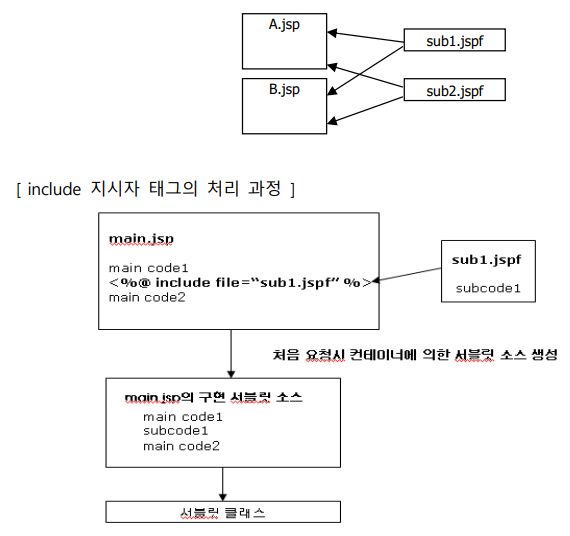
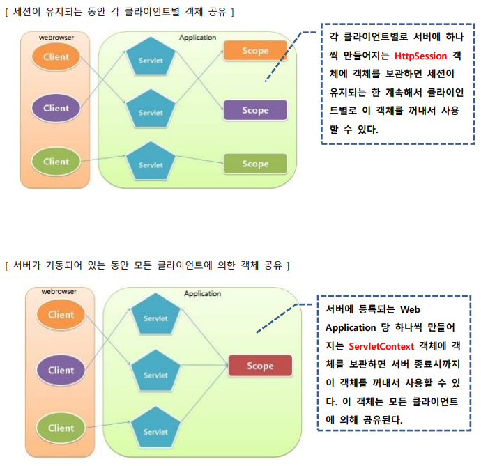
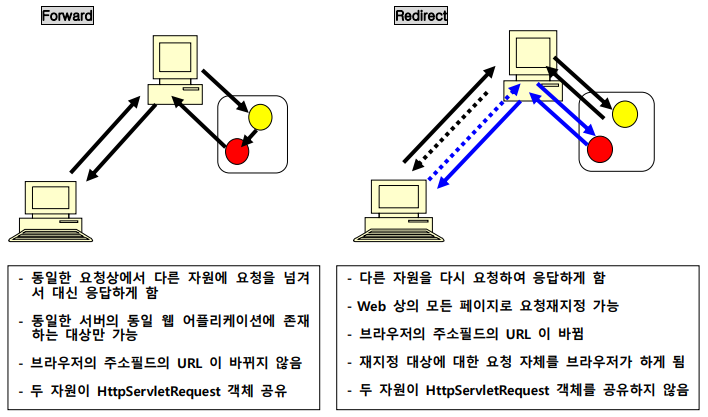
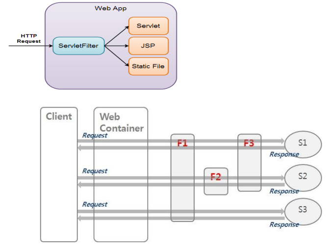

# Servlet + JSP
: Java Enterprise Edition Base Web Server Programming

- Servlet: Server-Side Application
- JSP : JavaServer Pages

## JSP (JavaServer Pages)
: 1999년에 발표된, HTML 파일 내에 서버상에서 동적 처리하는 부분을 구현하는 기술

- HTML 태그, JSP 태그/내장객체, 약간의 Java 코드로 구현
- servlet으로 구현할 수 있는 모든 기능을 JSP로도 구현할 수 있음
- HTML 문서에 스크립트 방식으로 작성되므로 servlet보다 비교적 구현하기 쉽다
- 실행 후, **Java Servlet으로 변환된 후 수행**되므로 servlet의 수행상 장점이 그대로 지원됨
    - JSP Converter(JSP엔진) : Jasper
- JSTL : JSP 태그 라이브러리
- EL : Expression language. 
- JSP 구현 시 알고 있어야 하는 내용
    - Servlet 프로그래밍
    - JSP 스크립트 태그
    - JSP 액션 태그
    - JSP 내장 객체

=== "Example"
    ``` java
    <%@ page language="java" contentType="text/html; charset=UTF-8" pageEncoding="UTF-8"%>
    <%@ page import="java.time.*, java.util.Date" %>
    <!DOCTYPE html>
    <html>
    <head>
        <meta charset="UTF-8">
        <title>스크립팅 예제</title>
    </head>
    <body>
        <%  // 수행문 태그, 지역 변수 생성
        String name = request.getParameter("name"); 
        java.time.LocalTime lt = java.time.LocalTime.now();
        %>
        <h3> Hello <%= name == null ? "Guest" : name %>! // 표현식
        방문 시간 : <%= lt.getHour()+ "시 " +lt.getMinute() +"분 " +lt.getSecond() +"초" %> </h3>
    </body>
    </html>
    ```
=== "Example-for"
    ``` java
    <% int number = 1000; %> //수행문
    <%=  number %> //표현식

    // 방법 1
    <%
    int dan= Integer.parseInt(request.getParameter("dan"));
    if (dan >= 1 && dan <= 9) {
        for (int i=1;i<=9;i++){
    %>
            <%= dan %> x <%=i %> = <%=dan*i%><br>
    <%	
        }
    %>

    // 방법2
    <%
        for (int i=1; i<=9; i++){
            out.print(dan + " x " + i + " = "  + dan*i + "<br>");	
        }
    } %>
    ```
=== "Example-선언문 태그"
    ``` java
    // trimDirectiveWhitespaces="false" : 선언문 태그에 의한 공백 제거 (false가 default) 
    <%@ page language="java" contentType="text/html; charset=UTF-8" pageEncoding="UTF-8"  trimDirectiveWhitespaces="false"%> 
        ...
    <%! 
        char getKorDay() { //getKorDay() 메서드 생성
            char result=' ';
            int day = new java.util.GregorianCalendar().get(java.util.Calendar.DAY_OF_WEEK);
            switch(day) {
            case 1 : result = '일'; break;
            case 2 : result = '월'; break;
            case 3 : result = '화'; break;
            case 4 : result = '수'; break;
            case 5 : result = '목'; break;
            case 6 : result = '금'; break;
            case 7 : result = '토'; 
            }
            return result;	
    }
    %>
    ```
=== "Example-Error"
``` java
<%@ page isErrorPage="true" %>
<!DOCTYPE html>
...
<%	
    String msg = "오류 원인 : " + exception;	
	System.out.println(msg);
	exception.printStackTrace();
%>
```


**JSP의 처리구조**
: 웹 클라이언트에서 JSP의 실행을 요청하면, 서버의 JSP 컨테이너(컨버터)에 의해 Servlet 소스코드로 변환되고 컴파일된 후 실행 가능한 Servlet 클래스가 된다
<br> Servlet 컨테이너에 의해 객체 생성되어 실행되므로 실행 흐름과 특성은 Servlet 과 동일
<br> JSP 가 Servlet 소스 코드로 변환되는 것은 JSP 가 작성 또는 수정된 후 최초 요청 시에만 처리됨


### JSP 태그

#### 스크립팅 태그
: JSP 페이지에 Java 코드를 끼워 넣을 수 있게 하는 태그 

- `<%-- --%>` : 주석문 태그
- `<%@  %>` : 지시자 태그
- `<%  %>` : 스크립트릿(수행문) 태그. Java 코드 포함. 여기서 선언된 변수는 **지역변수** . Java API를 이용하거나 기타 Java 를 이용한 소스 코드를 작성
- `<%!  %>` : 선언문(멤버변수 선언, 메서드 정의) 태그. Java 코드 포함. JSP 페이지 내부에서 사용할 멤버 변수나 메서드를 선언
- `<%=  %>` : 표현식(literal, variable, 메서드 호출 등) 태그. Java 코드 포함.  동적 데이터를 응답 정보에 추가하기 위한 식을 정의

#### 액션 태그

- `<jsp:include page="…" />` : JSP 페이지의 수행 결과 내에 다른 자원의 내용 또는 수행 결과를 포함한다.
- `<jsp:forward page="…" />` : 요청된 JSP 대신 다른 자원의 내용 또는 수행 결과를 대신 클라이언트로 응답
- `<jsp:useBean id="…" class="…" scope="…" />` :star: : 주어진 JavaBeans 클래스의 객체를 생성하거나 이미 생성된 객체를 추출
- `<jsp:setProperty name="…" property="…" />` :star: : JavaBeans 객체의 프로퍼티에 값을 설정한다. 
- `<jsp:getProperty name="…" property="…" />` :star: : JavaBeans 객체의 프로퍼티 값을 추출한다. 
- ~~`<jsp:plugin …… />`~~ : JSP 의 수행 결과 안에 Applet 을 수행시키고 결과를 포함
- `<jsp:param name="…" value="…" />`

``` java
<jsp:forward page="{relativeURL |'${' Expression'}' | <%= expression %>}" />
<jsp:forward page="{relativeURL | '${' Expression'}' | <%= expression %>}" { >
[<jsp:param name="parameterName" value="{parameterValue | '${' Expression '}' | <%= expression %>}" }/> ]+ </jsp:forward>}

<jsp:include page="{relativeURL | '${' Expression'}' | <%= expression %>}" [ flush="true| false" ] />
<jsp:useBean id=”name” scope=”page|request|session|application” class=”className” />
<jsp:getProperty name=”name” property=”property”>
<jsp:setProperty name=”beanName” prop_expr />
prop_expr ::= property=”*” |
property=”propertyName” |
property=”propertyName” param=”parameterName” |
property=”propertyName” value=”propertyValue”
propertyValue ::= string
```

### JSP 내장 객체
: Expression 태그와 Scriptlets 태그에서 스크립트 코드를 심플하게 작성할 수 있도록 지원하는 객체

- 내장 객체의 선언 및 초기화는 JSP 컨테이너가 JSP 소스를 Servlet 소스 코드로 변환하는 과정에서 자동적으로 추가한다
- JSP 에서 사용되는 객체의 클래스는 반드시 패키지화 되어야 하지만, 내장 객체는 이러한 과정이 필요치 않다

|  객체변수  |  클래스 및 인터페이스  |   설명   |
| :-------: | :-------------------: | :-----: |
| :star: request | http.HttpServletReuqest | 클라이언트에서 전송되는 다양한 요청 데이터 추출 |
| :star: response| http.HttpServletResponse | 응답 시 필요한 기능을 제공 |
| pageContext | jsp.PageContext | 페이지가 처리되는 시점에서의 외부 환경 데이터 추출 |
| :star: session | http.HttpSession | 클라이언트 별로 생성되는 HttpSession 객체 |
| :star: application | ServletContext | application scope 객체 생성과 관리 |
| config | ServletConfig | Servlet 구성 데이터 추출 |
| :star: out | jsp.JspWriter | 응답용 출력 스트림 |
| page | jsp.HttpJspPage | 페이지의 Servlet 인스턴스 |
| :star: exception | java.lang.Throwable  | 생성된 예외 객체를 참조 |

``` java
<%@ page language="java" contentType="text/html; charset=UTF-8" pageEncoding="UTF-8" import="java.util.Date"%>
...
[ request ]
getMethod() : <%=  request.getMethod()  %> //GET
getRequestURI() : <%=  request.getRequestURI()  %> // /edu/jspexam/exam10.jsp

// Mozilla/5.0 (Windows NT 10.0; Win64; x64) AppleWebKit/537.36 (KHTML, like Gecko) Chrome/117.0.0.0 Safari/537.36
getHeader("user-agent") : <%=  request.getHeader("user-agent")  %>  

[ application ]
getContextPath() : <%=  application.getContextPath()  %> // /edu
getServletContextName() : <%=  application.getServletContextName()  %> // null
getServerInfo() : <%=  application.getServerInfo()  %> // Apache Tomcat/9.0.80
getMajorVersion() : <%=  application.getMajorVersion()  %> // 4
getSessionTimeout() : <%=  application.getSessionTimeout()  %> // 30

[ session ]
getId() : <%=  session.getId()  %> // 25E3817F22A8EFC6B1496BDFFEB0BE6E
getCreationTime() : <%=  new Date(session.getCreationTime())  %> // Tue Sep 26 14:07:26 KST 2023

[ response ]
getStatus() : <%=  response.getStatus() %> // 200
getBufferSize() : <%=  response.getBufferSize() %> // 8192
getContentType() : <%=  response.getContentType() %> // text/html;charset=UTF-8
<H4>Web Application(/edu) 디렉토리의 파일 리스트 </H4>
<% 
java.util.Set<String> list = application.getResourcePaths("/");
if (list != null) {
   Object obj[] = list.toArray();
   for(int i=0; i < obj.length; i++) {
      out.print(obj[i]+", "); // /csslab1.html, /images/, /jspexam/, ...
   }
}
%>
```

### 지시자 태그
: JSP를 Servlet으로 변환할 때 지시하고자 하는 내용을 정의하는 태그

- page 지시자 : `<%@page {attr = value ..} %>`
- include 지시자 : `<%@include {attr = value ..} %>`
- taglib 지시자 : `<%@taglib {attr = value ..} %>`
- tag 지시자 : `<%@tag {attr = value ..} %>`
- variable 지시자 : `<%@variable {attr = value ..} %>` 
- attribute 지시자 : `<%@attribute {attr = value ..} %>` 

#### page 지시자 태그 :star:
: 컨테이너가 참조하는 다양한 정보 중 JSP 페이지에 종속적인 설정 정보들을 알려주기 위한 수단
<br> 해당 JSP가 어떤 문서를 생성하는지, 어떤 JAVA 클래스를 사용하는지, 세션에 참여하는지 등을 지정

``` java
<%@ page [ language="java" ]
[ extends="package.class" ]
[ import="{package.class | package.*}, ..." ] 🐳
[ session="true|false" ] 
[ buffer="none|8kb|sizekb" ] // default는 8kb
[ autoFlush="true|false" ]
[ isThreadSafe="true|false" ]
[ info="text" ]
[ errorPage="relativeURL" ] // relativeURL : 같은 웹 프로젝트 내에서만 적용 가능 
[ contentType="mimeType [ ; charset=characterSet ]" |
 "text/html ; charset=ISO-8859-1" ] // 한국어는 text/html에 utf-8이 기본 설정
[ isErrorPage="true|false" ] // 에러 처리를 전담하는 JSP임을 선언 (exception 내장 객체 사용 가능해짐)
[ pageEncoding="characterSet | ISO-8859-1" ] // 해당 JSP가 어떤 encoding을 사용하는지 지정
[ isELIgnored="true|false"]
%>
```

#### include 지시자 태그 :star:
: 반복되는 일정한 Java 코드나 정적데이터를 파일로 저장하고, 필요한 JSP페이지에서 불러쓸 때 사용



=== "exam9.jsp"
    ``` jsp
    <%@  include  file="part1.jspf"  %>

    ```
=== "part1.jspf"
    ``` 
    <%@  page pageEncoding="UTF-8"  %>
    <div>
    include 지시자에 의해 포함된 내용입니다.
    </div>
    ```

#### Get, POST
: JSP는 Get, POST를 구분하지 않으므로 if, else 를 이용해서 구분

``` jsp
<body>
	<% if (request.getMethod().equals("GET")) { %>
		<h2>원하는 컬러와 날짜를 선택하세요</h2>
		<form method="post" action="/edu/jspexam/exam11.jsp">
			칼라 : <input type="color"  name="fcolor" ><br>
			날짜 : <input type="date"  name="fdate"><br>
			<input type="submit" value="전송">
		</form>
	<% } else { %>	
			<script>
				document.body.style.backgroundColor = '<%= request.getParameter("fcolor") %>';
			</script>
			<h2>선택 날짜는 <%= request.getParameter("fdate") %> 이네요..</h2>
	<% } %>
</body>
```

### EL
: 특정 스코프 영역에 보관되어 있는 객체를 추출하여 이 객체의 값 또는 속성값을 추출하여 표현하고자 하는 경우 사용 (표현식 태그를 대체함)

**내장 객체**

- pageContext :star: - PageContext 객체
- pageScope - page 스코프에 포함된 객체들
- requestScope - request 스코프에 포함된 객체들
- sessionScope - session 스코프에 포함된 객체들
- applicationScope - application 스코프에 포함된 객체들
- param - HTTP의 파라메터들
- paramValues - 한 파라메터의 값들
- header - 헤더 정보들
- headerValues - 한 헤더의 값들
- cookie – 쿠키들
- initParam - 컨텍스트의 초기화 파라미터들


``` jsp
<% out.println(request.getParameter(“q”)); %> // 수행문 태그
<%= request.getParameter(“q”) %> // 표현식 태그

${param.q}  // EL
${param["q"]}

<!-- \$은 문자열로 처리, $은 EL식으로 처리 -->
\${ 10 eq 10 } : ${ 10 eq 10 }<br> <!-- true -->
\${ 10 lt 10 } : ${ 10 lt 10 }<br> <!-- false -->
\${ 10 gt 10 } : ${ 10 gt 10 }<br> <!-- false -->
\${ 10 le 10 } : ${ 10 le 10 }<br> <!-- true -->
\${ 10 ge 10 } : ${ 10 ge 10 }<br> <!-- true -->
\${10 > 5?'A':'B'} : ${10 > 5?'A':'B'}<br> <!-- A -->
\${100 + 200 + 300 } : ${100 + 200 + 300 }<br> <!-- 600 -->
\${100 += 200 += 300 } : ${100 += 200 += 300 }<br> <!-- 100200300 : 문자열 결합 연산 += -->

전달된 메시지의 존재 여부 : ${ !empty param.message }<hr> <!-- !empty : 비어있으면 true, 아니면 false -->

<!-- EL은 name이라는 이름으로 보관된 데이터를 뜻하기 때문에(setAttribute), name이라는 변수값을 출력하지 않음 -->
name 변수의 값 : ${name}<br> <!--  -->
<% String name="듀크"; %>
name 변수의 값(표현식 태그) : <%= name %><br> <!-- 듀크  -->
name 변수의 값(EL) : ${name}<br> <!--  -->
```
- EL이 데이터를 찾아가는 순서 : page scope -> request -> session -> application
- 변수명.xxx
    1. 변수의 참조 대상이 일반 Java 객체 : getXxx()를 호출한 결과
    2. 변수의 참조 대상이 Map 객체 : get("xxx")를 호출한 결과


---

## JSTL
: JSP 커스텀태그의 표준
<br> 코어 라이브러리, 포맷팅 라이브러리, XML 라이브러리:star:, SQL 라이브러리

---
## 객체 공유

- Page Scope : Servlet 또는 JSP가 수행되는 동안만 유효한 객체가 된다.
- Request Scope : Web 클라이언트로 부터의 요청이 끝날 때까지 유효한 객체가 된다.
     - HttpServletRequest 객체에 객체를 보관
- Session Scope : 요청을 보내온 Web 클라이언트가 기동되어 있는 동안 유효한 객체가 된다. (클라이언트별 세션)
    - HttpSession 객체에 객체를 보관
- Application Scope : 서버가 기동되어 있는 동안 유효한 객체가 된다. (모든 클라이언트 공유)
    - ServletContext 객체에 객체를 보관

- public void setAttribute(String key, Object value)
- public Object getAttribute(String key)
- public void removeAttribute(String key)


=== "ShareObjectServlet.java"
``` java
@WebServlet("/shaere")
public class ShareObjectServlet extends HttpServlet {
	private static final long serialVersionUID = 1L;
	protected void doGet(HttpServletRequest request, HttpServletResponse response) throws ServletException, IOException {

		request.setAttribute("myRequest", "요청동안 공유하는 객체"); // request scope - 요청 동안만 세션 유지
		request.getSession().setAttribute("mySession", "세션 객체가 유지되는 동안 공유하는 객체"); // session scope - 브라우저가 살아있는 동안만 세션 유지
		getServletContext().setAttribute("myApp", "서버가 기동되는 동안 공유하는 객체"); // application scope - 서버 죽을때까지 세션 유지

		request.getRequestDispatcher("/jspexam/shareexam.jsp").forward(request,  response);

	}
}
```
=== "shareexam.jsp"
    ``` jsp
    <body>
        <h1> 서블릿에서 보관된 객체 추출</h1>
        <hr>  
        <h3> request scope: <%= request.getAttribute("myRequest") %></h3>
        <h3> session scope: <%= session.getAttribute("mySession") %></h3>
        <h3> application scope: <%= application.getAttribute("myApp") %></h3> 
        
        <!-- el은 값이 없을때, null 대신 공백 반환 -->
        <hr>  
        <h3> request scope: ${requestScope.myRequest}</h3>
        <h3> session scope: ${sessionScope.mySession}</h3>
        <h3> application scope: ${applicationScope.myApp}</h3> 
        
        <hr>  
        <h3> request scope: ${myRequest}</h3>
        <h3> session scope: ${mySession}</h3>
        <h3> application scope: ${myApp}</h3> 
    </body>
    ```
- request scope :  A와 B가 forward 또는 include 관계에 있는 경우, A 가 생성하는 객체를 HttpServletRequest 객체에 보관하면 B 에서 추출할 수 있다. 요청이 끝나면 사라진다.
- session scope : 각 클라이언트별로 서버에 하나씩 만들어지는 HttpSession 객체에 객체를 보관하면 세션이 유지되는 한 계속해서 클라이언트별로 이 객체를 꺼내서 사용할 수 있다. 
- application scope : 서버에 등록되는 Web Application 당 하나씩 만들어지는 ServletContext 객체에 객체를 보관하면 서버 종료시까지 이 객체를 꺼내서 사용할 수 있다. 이 객체는 모든 클라이언트에 의해 공유된다.




---
## Servlet
: 1998년 발표된 웹 애플리케이션 개발을 위한 자바 표준 API로, Java EE 사양의 일부분

1. 웹 서버에서 실행, 클라이언트와 상호작용하여 동적 웹페이지 생성 및 데이터 처리에 사용
2. request마다 **스레드 기반**으로 응답하여 **CGI**에 비해 가볍게 클라이언트의 요청 처리
3. request로 인해 생성된 Servlet 객체는 response 이후에도 바로 수행될 수 있도록 객체 상태 유지
4. **HttpServlet**이라는 클래스를 상속하여 구현하며 Request method에 따라 `doGet()` 또는 `doPost()` 메서드를 오버라이딩 함

!!! note
	- 다만, HTML content를 검열할 수 없음 :material-arrow-right-thick: JSP (Model-1):material-arrow-right-thick: MVC pattern (Model-2)
		- MVC pattern : 요청은 Servlet, 응답은 JSP
	- 서블릿은 `.class`라는 확장자를 갖는 실행 파일이 되는데, 웹에서 `.class`은 Applet에서 이미 사용하기 때문에 **등록과 매핑**이라는 설정을 web.xml이라는 디스크립터 파일에 작성해주어야 한다
		- `web.xml` : Web application에 대한 다양한 정보를 설정하는 파일, 디스크립터 파일이라고도 함 (./WEB-INF/web.xml)
	- web.xml 대신 Annotation구문으로 대신할 수 있음.
		- @WebServlet: Servlet 프로그램을 등록과 매핑을 정의
		- @WebInitParam: Servlet 프로그램에 전달할 초기 파라미터를 정의
		- @WebListener: 리스너를 정의
		- @WebFilter: 필터를 정의
		- @MultipartConfig: Servlet 프로그램에서 다중 파티션으로 전달되는 파일 업로드를 처리할 수 있음을 정의
	- 여러 클라이언트의 동시 요청 시, 하나의 Servlet 객체를 공유하여 다중 스레드 기반에서 처리되어 응답 성능 향상 (메서드 안 변수는 무조건 지역변수)
	```mermaid
	graph TB
		subgraph Web Container
			R1(Request) --> T1(Thread)
			R2(Request) --> T2(Thread)
			R3(Request) --> T3(Thread)
			T1 --> S(Servlet)
			T2 --> S
			T3 --> S
		end
	```

=== "Example"
	``` java 
	@WebServlet({ "/FirstServlet", "/first" })
	public class FirstServlet extends HttpServlet {
		private static final long serialVersionUID = 1L; // HttpServlet이 serializable을 추가상속하므로 해당 코드 제시
		protected void doGet(HttpServletRequest request, HttpServletResponse response) throws ServletException, IOException {
	//		response.getWriter().append("Served at: ").append(request.getContextPath());
			System.out.println("FirstServlet 실행 .....");
			response.setContentType("text/html; charset=utf-8");
			PrintWriter out = response.getWriter();
			out.print("<h1> Hello, Servlet </h1>");
			out.close();
		}
	}
	```
=== "Example-variable"
	``` java 
	/*
	요청할 때마다 member 변수는 +1씩 늘어나고, 지역변수는 1인 채로 가만히 있음
	서블릿 객체는 하나로 공유되기 때문에 member 변수는 여러 클라이언트에게 공유됨
	*/
	@WebServlet("/memberlocal")
	public class MemberLocalServlet extends HttpServlet {
		private static final long serialVersionUID = 1L;
		int member_v = 0; //멤버 변수, 클라이언트 요청이 최초로 전달되었을 때 생성
		protected void doGet(HttpServletRequest request, HttpServletResponse response) throws ServletException, IOException {
			response.setContentType("text/html; charset=utf-8");
			PrintWriter out = response.getWriter();
			int local_v = 0; //지역 변수
			member_v++;
			local_v++;
			out.print("<h2>member_v(멤버변수) : " + member_v + "</h2>");
			out.print("<h2>local_v(지역변수) : " + local_v + "</h2>");
			out.close();
		}
	}
	```

- Overriding :star:
    - **doGet()**
    - **doPost()**
- `getContextPath()` : request URI에서 request의 Context 반환
- `protected void doGet(HttpServletRequest request, HttpServletResponse response) throws ServletException, IOException`
    - HttpServletRequest : 요청과 관련된 객체 생성 
    - HttpServletResponse : 응답과 관련된 객체 생성
- `response.setContentType("text/html; charset=utf-8");`
: utf-8로 charset을 맞춰줌으로써 한글 정상 출력 (설정하지 않을 시, `?`로 출력됨)


---
### HttpServletRequest 객체
: 웹 클라이언트에서 전송되는 Request 정보 추출

|   Method  |   설명  |
| :-------: | :-----:|
| `getHeader(name)` | |
| `getHeaders(name)` | |
| `etHeaderNames()` | |
| `getContentLength()` | |
| `getContentType()` | |
| `getCookies()` | |
| `getRequestURI()`| |
| `getQueryString()` | |
| `getProtocol()`| |
| `getMethod()`| |


### HttpServletResponse 객체 
: 웹 클라이언트로의 Response 처리

|   Method  |   설명  |
| :-------: | :-----:|
| `setStatusCode(int statuscode)` | |
| `sendError(int code, String message)` | |
| `sendRedirect(url)` | |
| `setHeader(String headerName, String headerValue)` | |
| `setContentType(String mimeType)` | |
| `setContentLength(int length)` | |


---
### Servlet 객체 생성과 해제
: HttpServletRequest 와 HttpServletResponse 객체를 생성한 후, Servlet 컨테이너는 요청된 Servlet의 객체가 생성된 상태인지 검사한다

- Q. 요청된 서블릿 객체가 이미 생성되어 있는가?
	- Y -> service() 호출, 요청방식에 따라 doGet() 또는 doPost() 호출
	- N -> 서블릿 객체 생성, init() 호출, doGet() 또는 doPost() 호출
- 서블릿 객체의 삭제 : (서버가 종료될 때 || 자동 reload될 때) 삭제되며 destroy() 호출


---
### Servlet Request
- GET
	- 하이퍼링크 텍스트(`<A>`태그)를 클릭하여 요청
	- URL 을 주소필드에 입력하여 직접 요청
	- ``태그로 요청
	- `<IFRAME>` 태그로 요청
- POST
	- `<FORM>`태그로 요청 → method 속성의 값에 따라서 GET 방식 또는 POST 방식


### `<FORM>` 태그 속성

- action : 사용자의 입력 데이터를 처리할 CGI 프로그램의 URL 주소를 지정
- method : GET은 입력 내용을 요청 URI 뒤에 붙여서 전송, POST는 요청 바디에 담아 전송
- enctype : 서버로 보내지는 데이터의 형식을 지정 
	- `application/x-www-form-urlencoded` : default, 서버로 전송되기 전 url-encode된다는 뜻
	- `mutipart/form-data` : 이미지나 파일을 서버로 전송할 경우의 방식
	- `text/plain` : 인코딩을 하지 않은 문자 그대로의 상태 전송

### Query
: 웹 클라이언트에서 웹 서버에 요청을 보낼 때 추가로 전달하는 name 과 value 로 구성되는 문자열

- Naver: `https://search.naver.com/search.naver?where=nexearch&sm=top_hty&fbm=0&ie=utf8&query=%EA%B0%80%EB%82%98%EB%8B%A4+123`
- Google: `https://www.google.com/search?q==%EA%B0%80%EB%82%98%EB%8B%A4+123&`
- Example: `../edu/queryget?guestName=둘리&num=11&food=갈비&food=떡볶이`

- GET
	- 전달되는 Query 문자열의 길이에 제한이 있고 내용이 브라우저의 주소 필드에 보여진다
	- <FORM> 태그를 사용해도 되고 요청 URL 에 ? 기호와 함께 직접 Query 문자열을 붙여서 전달하는 것도 가능
- POST
	- 전달되는 Query 문자열의 길이에 제한이 없고 내용이 브라우저의 주소 필드에 보여지지 않는다
	- 전달 내용이 요청 바디에 담겨져서 전달되며 `<FORM>` 태그를 사용하여 요청할 때만 사용할 수 있다

#### Query 추출

- name으로 하나의 value 값이 전달될 때 : `String address = request.getParameter(“address”);`
- name으로 여러 개의 value 값들이 전달될 때 : `String hobby[ ] = request.getParameterValues(“hobby”);`
- ** POST에서 한글 문자가 발생한다면, `HttpServletRequest.setCharacterEncoding(“utf-8”)` 사용

- HTTP referer : 


---
### 요청 재지정 
: 클라이언트에서 요청한 페이지 대신 다른 페이지를 클라이언트가 보게 되는 기능

- forward : RequestDispatcher의 `forward()`. contextPath 공유
``` java
// 여기서는, contextPath인 /edu 생략 (공유하기 때문)
RequestDispatcher rd = request.getRequestDispatcher("/clientexam/output.html");
rd.forward(request,  response);
```
- redirect : HttpServletResponse의 `sendRedirect()` 
``` java
response.sendRedirect("/edu/clientexam/output.html"); // 
```




#### RequestDispatcher

- forward() : 요청 페이지 대신 다른 페이지가 대신 응답
- include() : 요청 페이지 안에 다른 페이지의 처리 내용이 포함되어 같이 응답

---

### 상태정보 유지 기술
: 웹 브라우저에서 웹 서버에 정보를 요청할 때, 이전 접속시의 결과물(상태정보)을 일정시간 동안 유지하는 것
<br> 클라이언트(브라우저)에 저장하거나, 웹 서버에 저장하거나 
<br> 객체 유지는 하되(멤버 변수 장점) 개별적으로 운영(지역 변수 장점)하고 싶을 때 사용 

- Cookie를 이용하는 방법 : 클라이언트 보관
- HttpSession 객체 이용 : 서버 보관
- URL 문자열 뒤에 추가
- `<form>` 태그의 hidden 타입 사용

#### HttpSession 객체를 이용한 상태정보 유지

- 객체로 만들어서 서버에 보관
- 상태 정보가 유지되는 최대 시간은 요청을 보내온 브라우저가 기동되어 있는 동안임
- 구현 방법
	- HttpSession 객체를 생성하거나 추출
	- HttpSession 객체에 상태정보를 보관할 객체 등록 (한 번이면 됨)
	- HttpSession 객체에 등록되어 있는 상태정보 객체의 참조값을 얻어 사용 (읽기, 변경)
	- HttpSession 객체에 등록되어 있는 객체가 더이상 필요 없으면 삭제

``` java
// 객체 생성
//request.getSession(false) : HttpSession 객체를 추출하여 리턴하는데, 없으면 null 반환
HttpSession session = request.getSession(); // request.getSession(true);와 동일

// 정보를 객체로 만들어 HttpSession객체에 저장
session.setAttribute(“xxx”, new Data()); // xxx라는 이름으로 객체 참조값 보관

Data ref = (Data)session.getAttribute(“xxx”); // xxx라는 이름으로 보관된 객체 참조값 삭제
 
session.removeAttribute(“xxx”); // 객체 강제 삭제
```

!!! note
	서버상에 생성되는 HttpSession 객체는 웹 클라이언트별로 하나씩 생성된다.
	<br> HttpSession 객체 당 세션ID가 하나 부여되며, 해당 ID는 클라이언트의 브라우저에 쿠키 기술로 저장된다. (브라우저가 기동되어 있는 동안 쿠키 유지)
	<br> 브라우저가 재기동 되어 세션ID가 분실되거나 클라이언트로부터 일정시간 동안 요청이 없는 경우 (Inactive Interval Time) HttpSession 객체는 사용불가 상태가 된다

---
### FileUpload 구현

1. 웹사용자가 전송하려는 파일을 선택할 수 있게 `<form>` 안에 `<input type="file">` 구현
2. 요청 방식은 POST, `enctype="form-data"` 설정을 통해 전송하려는 파일의 내용이 인코딩되지 않은 상태로 전송되도록 구현
	- `enctype="form-data"`은 입력폼에 사용자가 입력한 내용이 name=value&name=value형식으로 인코딩되어 전달되는 것이 아니고, 여러 파티션(multipart)로 나뉘어서 서버에 전송됨
	- `<form>` 태그를 구성하는 각각의 `<input>` 태그별로, 업로드되는 파일별로, 하나의 파트를 이루며 각각의 파티션은 `"------boundaryID"`로 구분된다
	- 이렇게 구성하는 Content-Type을 **multipart/form-data**라 함

``` java title="Example"
@WebServlet("/part")
// 저장할 경로(없으면 생성), 파일의 최대 사이즈, 한 request 당파일 최대 사이즈 * 개수
@MultipartConfig (location = "c:/uploadtest", maxFileSize = 1024 * 1024 * 5, maxRequestSize = 1024 * 1024 * 5 * 5) 
public class PartTestServlet extends HttpServlet {   
	private static final long serialVersionUID = 1L;
    protected void doPost(HttpServletRequest request, HttpServletResponse response) 
	  throws ServletException, IOException {    	
        
		Collection<Part> parts = request.getParts(); // 여러 파일 수용 가능

        for(Part part : parts) {        	
            System.out.println(part.getName());  // html 요소 name   
			if (part.getContentType() != null) // null이라면, upload 파일이 아닌 사용자가 입력한 데이터임을 의미
				String fileName = part.getSubmittedFileName(); //upload 파일의 이름 추출
				part.write("file-path"); // file 생성       

			//헤더 정보
            for(String headerName : part.getHeaderNames()) {
                System.out.print(headerName + " : "); // content-disposition, content-type
                System.out.println(part.getHeader(headerName)); // form-data; name=""; filename=""
            }													// image/jpeg			
            
			System.out.println(part.getSize()); // binary size ?
        }        
    }
}
```

---
#### HttpSession 주요 메서드

|               Method             |         설명        |
| :------------------------------: | :-----------------:|
| `public Enumeration getAttributeNames()` | 세션에 등록된 객체들의 이름 열거 |
| `public long getCreationTime()` | 1970. 1.1 GMT 부터 세션이 만들어졌을 때까지의 시간을 밀리초의 단위로 리턴 |
| `public String getId()` | 세션에 지정된 세션 ID를 리턴 |
| `public long getLastAccessedTime()` | 클라이언트 요청이 마지막으로 시도된 시간을 밀리초로 리턴 |
| `public int getMaxInactiveInterval()` | 클라이언트의 요구가 없을 때 서버가 현재의 세션을 언제까지 유지할지를 초시간 단위로 리턴 (default 세션 마감 시간: 30m) |
| `public boolean isNew()` | 서버측에서 새로운 세션을 생성한 경우에는 true를 리턴하고 기존의 세션이 유지되고 있는 경우라면 false를 리턴 |
| `public void setMaxInactiveInterval(int seconds)` | 세션 유지 시간 설정. 이 시간이 지나면 세션은 자동 종료(HttpSession객체 삭제) |

``` java
HttpSession session = request.getSession();	
long time = session.getCreationTime(); //
session.isNew(); // 이번에 새로 만들어진 session이면 true, 아니면 false 리턴
String id = session.getId(); //id 추출
session.invalidate(); //삭제
```

---
#### Servlet method

getServletContext() : 현재 실행중인 servlet의 ServletContext

|     Method     |      설명       |
| :------------: | :-------------: |
| getServletContext().getServerInfo() |servlet container의 이름 및 버전 반환 <br> (ex. Apache Tomact/9.0.80)  |
| getServletContext().getContextPath() |일반적으로 Project name |
| getServletContext().getRealPath("/") |지정된 virtual path에 해당하는 경로 |
| getServletContext().getMajorVersion() |servlet의 major 버전 |
| getServletContext().getMinorVersion() |servlet의 minor 버전 |  


---
### Filter
: 웹 클라이언트에서 요청한 웹자원들(servlet/JSP)이 수행되기 전후에 수행되는 객체

- request/response에 영향을 주거나 특정 처리 가능
- 웹 자원이 하나 이상의 Filter들의 chain 에 의해 순서대로 필터링 되도록 설정 가능 
- 인증, 로깅, 이미지 변환, 데이터 압축, 암호화, 스트림 토큰화, XML 변환 등 
- `javax.servlet.Filter`라는 인터페이스를 상속하여 `init()`, `doFilter()`, `destroy()` 오버라이딩




``` java title="Example"
// @WebFilter : 같은 프로젝트 내에서만 해당 Filter 사용 가능
@WebFilter(dispatcherTypes = {DispatcherType.REQUEST }, urlPatterns = { "/*" })
public class HangulFilter implements Filter {
    public void doFilter(ServletRequest request, ServletResponse response, FilterChain chain) throws IOException, ServletException {
    	HttpServletRequest req = (HttpServletRequest)request;
    	if (req.getMethod().equals("POST"))
    		request.setCharacterEncoding("utf-8");
		
		chain.doFilter(request, response);
		// 웹 자원의 수행 후에 처리할 기능
	}
}
```

---
#### MIME 타입 [MDN](https://developer.mozilla.org/en-US/docs/Web/HTTP/Basics_of_HTTP/MIME_types)
: 전달된 메시지(content)의 타입
- major type/minor type 
- `text/html`, `text/xml`, `text/plain`, `text/json(application/json)`
- `image/gif`, `image/jpg`, `image/png`

#### CGI (Common Gateway Interface)
: 언어 제한이 없고, HTTP 표준을 따름
<br> 하지만 API가 거의 없고, 여러 클라이언트 요청에 대해 다중 프로세스로 서비스하므로 동시요청 시 비효율적이다.
해당 단점을 보완하여 멀티 스레드 기반의 FastCGI가 개발되었지만, 구현의 어려움이 컸다
<br> ASP : 실행될 때 CGI로 변경됨

- `.../xxx.cgi`
- `.../cgi-bin/xxx`

#### Error handle
query를 입력하지 않고 api를 호출했을 때, getParameter 값에는 null이 들어간다
이때 equals 메서드가 있다면, NullException 에러가 발생함

``` java
String command = request.getParameter("comm"); // null
if(command.equals("view")) //Cannot invoke "String.equals(Object)" because "command" is null
```

---
!!! quote
    - openai
	- 김정현 강사님
