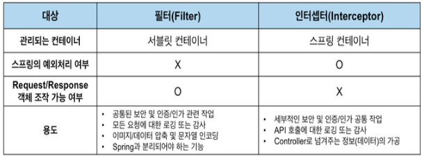
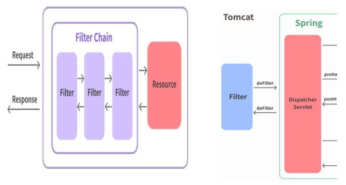
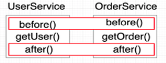
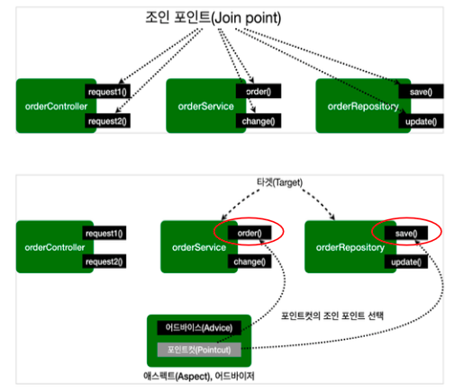
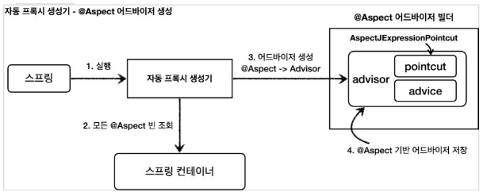
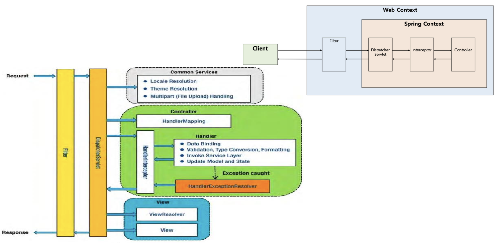
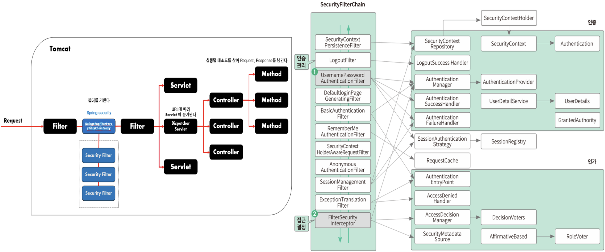
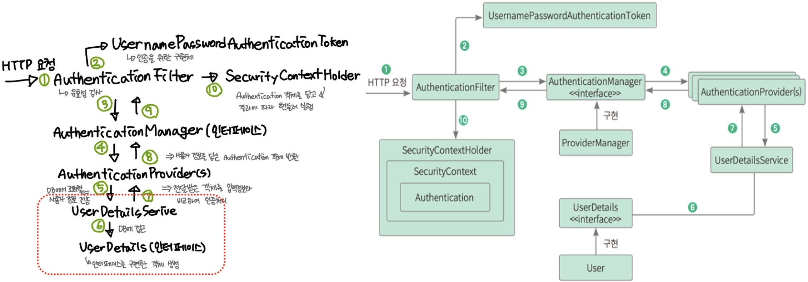

# Sprint Boot Advanced

## @Service
``` java title="Example"
package com.example.springedu.service;
import org.springframework.stereotype.Service;
import com.example.springedu.domain.FriendDTO;

@Service
public class FriendService {
	public FriendDTO get(int num) {
		FriendDTO vo = null;
		if (num == 10) {
			vo = new FriendDTO();
			vo.setPhoneNum("010-1111-2222");
			vo.setName("Dooly");			
		}
		return vo;
	}
}
```

---
## Spring Scheduling(TASK)

: 특정 시간에 반복적으로 처리되는 코드를 스케줄링 할 수 있으며 이때 반복되는 코드를 Task라 한다

### Setting

1. [Spring.io](https://start.spring.io)
    - Dependencies에 Quartz Scheduler 추가
    - EXPLOR -> build.gradle 추가
    ```gradle
    dependencies {
        implementation 'org.springframework.boot:spring-boot-starter-quartz'
        testImplementation 'org.springframework.boot:spring-boot-starter-test'
    }
    ```
2. [mvnrepository](https://mvnrepository.com)

### Use
: 설정된 Scheduling에 맞춰 호출되는 Task Method 앞에 `@Scheduled`라는 어노테이션 제시한 다음 속성 정의

- `cron` : CronTab에서의 설정과 같이 cron="0/10 * * * * ?" 과 같은 설정 가능
- `fixedDelay` : 이전에 실행된 Task의 종료시간으로 부터 정의된 시간만큼 지난 후 Task 실행
- `fixedRate` : 이전에 실행된 Task의 시작시간으로 부터 정의된 시간만큼 지난 후 Task 실행

``` java title="Example"
package com.example.springedu.service;
import org.springframework.scheduling.annotation.Scheduled;
import java.text.SimpleDateFormat;
import java.util.Calendar;

//@Component
public class SpringSchedulerTest {	
	//@Scheduled(cron = "10 08 18 * * 2")// 초, 분, 시, 일, 월, 요일(0:일요일)
	@Scheduled(fixedDelay = 5000) // 5초에 한 번씩
	public void scheduleRun() {
		Calendar calendar = Calendar.getInstance();
		SimpleDateFormat dateFormat = 
				new SimpleDateFormat("yyyy-MM-dd HH:mm:ss");
		System.out.println("**** 스케줄 실행 : " + 
				dateFormat.format(calendar.getTime()));	
	}
}
```

### Cron

|  시간  |  단위  | |  기호  |  의미  |
| :----:| :---: | :--: | :--: | :--: |
| Seconds | 0 ~ 59 | | ? | Day of Month, Day of Week에만 사용 특별한 값이 없음을 의미 |
| Minutes | 0 ~ 59 | | - | 기간 설정 |
| Hours | 0 ~ 23 | | , | 특정 시간 설정 |
| Day of Month | 1 ~ 31 | | / | 증가 표현 |
| Month | 1 ~ 12 | | L | Day of Month, 마지막날에 실행하라는 의미 | 
| Day of Week | 1 ~ 7 (일요일~토요일) | | W | Day of Month, 가장 가까운 평일을 의미 | 
| Years(optional) | 1970 ~ 2099 | | LW | L+W, 그 달의 마지막 평일 |
| | | | # | Day of Week, 6#3의 경우 3번째 주 금요일 실행 
| | | | * | 모든 수, Minutes일때 매분마다를 의미 |


---
## 오류 처리
: @ExceptionHandler, @ControllerAdvice 둘 다 존재할 때는 더 가까운 @ExceptionHandler 수행

### @ExceptionHandler
: 에러나 예외를 지역적으로 처리하며 컨트롤러 클래스마다 각각 정의된다
<br>- 컨트롤러에서 정의한 메서드(@RequestMapping)에서 기술한 예외가 발생되면 자동으로 받아냄
<br>- 이를 이용하여 컨트롤러에서 발생하는 예외를 View단인 JSP나 타임리프로 보내서 처리할 수 있다

``` java title="Example"
package com.example.springedu.controller;
import ...

@Controller
public class ExceptionLocalController {

	@Autowired
	FriendService ms;

    @RequestMapping("/exceptionTest")
	public String detail(int num, Model model) throws FriendNotFoundException {
		FriendDTO vo = ms.get(num);
		if (vo == null) {
			throw new FriendNotFoundException();
		}
		model.addAttribute("friend", vo);
		return "friendView";
	}

	@ExceptionHandler(MethodArgumentTypeMismatchException.class)
	public ModelAndView handleTypeMismatchException(MethodArgumentTypeMismatchException ex) {
		System.out.println("TypeMismatchException 발생시 처리하는 핸들러가 오류 처리합니다.");
		ModelAndView mav = new ModelAndView();
		mav.addObject("msg", "타입을 맞춰주세용!!");
		mav.setViewName("errorPage");
		return mav;
	}

	@ExceptionHandler(FriendNotFoundException.class)
	public String handleNotFoundException() throws IOException {
		System.out.println("FriendNotFoundException 발생시 처리하는 핸들러가 오류 처리합니다.");
		return "noFriend";
	}

	@ExceptionHandler(IllegalStateException.class)
	public ModelAndView handleIllegalStateException() throws IOException {
		System.out.println("IllegalStateException 발생시 처리하는 핸들러가 오류 처리합니다.");
		ModelAndView mav = new ModelAndView();
		mav.addObject("msg", "num=숫자 형식의 쿼리를 전달하세요!!");
		mav.setViewName("errorPage");
		return mav;
	}
}

```

### @ControllerAdvice
: 스프링 3.2 이상에서 사용 가능, @Controller/@RestController 에서 발생하는 예외 등을 catch
<br> -> 예외처리를 전담하는 클래스 생성

- 클래스 위에 @ControllerAdvice를 붙이고, 어떤 예외를 잡아낼 것인지 내부 메서드를 선언하여 메서드 상단에 `@ExceptionHandler(예외클래스명.class)`와 같이 기술
``` java title="Example"
// 모든 RuntimeException에 대해 적용
package com.example.springedu.service;
import ...

@ControllerAdvice
public class CommonExceptionHandler {
    @ExceptionHandler(RuntimeException.class)
    private ModelAndView errorModelAndView(Exception ex) {
       ModelAndView modelAndView = new ModelAndView();
       modelAndView.setViewName("commonErrorPage");
       modelAndView.addObject("exceptionInfo", ex );
       return modelAndView;
   }
}
```

---
## Spring Websocket


|    코드    |    설명    |
| :-------: | :-------: |
| HTML5가 제공하는 WebSocket 객체를 통해 서버 연결 수행  | |
| `let ws = new WebSocket("웹 소켓 URL 문자열");` | 일반 통신 <br> 웹 소켓 URL 문자열 : `ws://서버주소/웹 소켓 서버 프로그램의 매핑명` |
| `let wss = new WebSocket("웹 소켓 URL 문자열");` | 보안 통신은 wss 프로토콜 이용 <br> 웹 소켓 URL 문자열 : `wss://서버주소/웹 소켓 서버 프로그램의 매핑명` |
| | |
| 데이터 송신 | |
| `ws.send ("전송하려는 메시지")` | WebSocket 객체의 send() 메서드로 데이터를 서버로 송신 |
| | |
| 데이터 수신 | |
| `ws.onmessage = function(e) { e.data로 추출하여 수신받은 메시지 처리}` | 서버에서 전송되는 데이터 수신을 위해 **message 이벤트** 구현 |
| | |
| 웹소켓 이벤트 | |
| `ws.onopen = function(e) { 핸들러 }` | 웹 소켓 서버와 접속이 일어나면 발생하는 이벤트 |
| `ws.onclose = function(e) { 핸들러 }` | 웹 소켓 서버와 접속이 해제되면 발생되는 이벤트 |
| `ws.onerror = function(e) { 핸들러 }` | 웹 소켓 오류가 생기면 발생되는 이벤트 |
| `ws.onmessage = function(e) { 핸들러 }` | 웹 소켓 서버로 부터 메시지가 수신되면 발생되는 이벤트 |

- **@ServerEndpoint** 어노테이션이 선언되어 있는 클래스
- **WebSocketConfig** 웹 소켓 환경 설정 파일
: Spring에서 Bean은 싱글톤으로 관리되지만, @ServerEndpoint 클래스는 WebSocket이 생성될 때마다 인스턴스가 생성되고 관리되기 때문에 Spring의 @Autowired가 설정된 멤버들이 초기화 되지 않는다. 따라서 클라이언트로부터 웹 소켓 접속이 요청될 때마다 @ServerEndpoint 클래스의 객체를 생성해 줄 초기화 클래스의 Bean 등록 필요


=== "html"
    ``` html
    <!DOCTYPE html>
    <html xmlns:th="http://www.thymeleaf.org">
    <head>
    <meta charset="UTF-8">
    <title>Insert title here</title>
    <link rel='stylesheet' type='text/css' href='/css/chatt.css'>
    </head>
    <body>
        <div id='chatt'>
            <h1>웹 소켓 채팅</h1>
            <input type='text' id='mid' value='게스트'>
            <input type='button' value='채팅참여' id='btnJoin'>
            <br/>
            <div id='talk'></div>
            <div id='sendZone'>
                <textarea id='msg' >안녕...</textarea>
                <input type='button' value='전송' id='btnSend'>
            </div>
        </div>
    </body>
    </html>
    ```
=== "js"
    ``` js hl_lines="16 18 27 28 29 30 72"

	function getId(id){
		return document.getElementById(id);
	}
	let data = {};//전송 데이터(JSON)

	let ws ;
	let mid = getId('mid');
	let btnJoin = getId('btnJoin');
	let btnSend = getId('btnSend');
	let talk = getId('talk');
	let msg = getId('msg');
	let myclose = false;

	btnJoin.onclick = function(){
	   if (btnJoin.value == '채팅참여') {
			ws = new WebSocket("ws://" + location.host + "/chatt");
		
			ws.onmessage = function(msg){
				let data = JSON.parse(msg.data);
				let css;
			
				if(data.mid == mid.value){
					css = 'class=me';
				}else{
					css = 'class=other';
				}
				let item = `<div ${css}>
			               <span><b>${data.mid}</b></span> [ ${data.date} ]<br/>
	                       <span>${data.msg}</span>
						   </div>`;
		    	console.log("R:"+item);
				talk.innerHTML += item;
				talk.scrollTop=talk.scrollHeight;//스크롤바 하단으로 이동
			}
			ws.onclose = function() {
				btnJoin.style.color = 'black';
				btnJoin.value = '채팅참여';
				if (myclose) {
					alert("서버와의 채팅을 끝냅니다.");
					myclose = false;
				}else
					alert("일정 시간 동안 통신을 하지 않아 자동으로 클로즈 됩니다.");
			}
			btnJoin.style.color = 'blue';
			btnJoin.value = '채팅참여중';
	  } else {
	  		btnJoin.style.color = 'black';
			btnJoin.value = '채팅참여';
			myclose = true;
	  		ws.close();
	  }
	}

	msg.onkeyup = function(ev){
		if(ev.keyCode == 13){
			send();
		}
	}

	btnSend.onclick = function(){
		send();
	}

	function send(){
		if(msg.value.trim() != '' && ws && ws.readyState == ws.OPEN){
			data.mid = getId('mid').value;
			data.msg = msg.value;
			data.date = new Date().toLocaleString();
			let temp = JSON.stringify(data);
			console.log("S:"+temp);

			ws.send(temp);
		}
		msg.value ='';		
	}
	window.onunload = function() {
		console.log("종료");
		ws.close();
	}
    ```
=== "WebSocketConfig"
    ``` java hl_lines="5"
    @Component
    public class WebSocketConfig {
            @Bean
            public ServerEndpointExporter serverEndpointExporter() {
                return new ServerEndpointExporter();
            }
    }
    ```
=== "java"
    ``` java
    @Service
    @ServerEndpoint(value="/chatt")
    public class WebSocketChatt {
        private static Set<Session> clientSet = 
                            Collections.synchronizedSet(new HashSet<Session>());
        @OnOpen
        public void onOpen(Session s) {
            if(!clientSet.contains(s)) {
                clientSet.add(s);
                s.setMaxIdleTimeout(60000);
                System.out.println("[세션 오픈] " + s);
            }else {
                System.out.println("이미 연결된 세션임!!!");
            }
        }
        
        @OnMessage
        public void onMessage(String msg, Session session) throws Exception{
            System.out.println("[수신 메시지] " + msg);
            for(Session s : clientSet) {
                System.out.println("[송신 메시지] " + msg);
                s.getBasicRemote().sendText(msg);
            }		
        }
        
        @OnClose
        public void onClose(Session s) {
            System.out.println("[세션 종료] " + s);
            try {
                s.close();
            } catch(Exception e) {}
            clientSet.remove(s);
        }
    }
    ```

---
## Builder Pattern
: 복잡한 객체 생성 과정과 표현 방법을 분리하여 다양한 구성의 인스턴스를 만드는 생성 패턴

별도의 Builder 클래스를 만들어 메소드를 통해 step-by-step 으로 값을 입력받은 후에 최종적으로 build() 메소드로 하나의 인스턴스를 생성하여 리턴하는 패턴

- 생성자 오버로딩 열거 X
- 데이터의 순서에 상관없이 객체를 생성하므로 생성자 인자 순서를 파악할 필요 X
- 잘못된 값을 넣는 실수 X


=== "Lombok"
	``` java
	// Person 클래스
	@Builder // Xxx.Builder 클래스와 이를 반환하는 builder() 메서드, 맴버 변수명의 메서드 생성
	@AllArgsConstructor(access = AccessLevel.PRIVATE) // @Builder 어노테이션을 선언하면 전체 인자를 갖는 생성자를 자동으로 만드는데, 이를 private 생성자로 설정
	@ToString // toString() 메서드 자동 생성
	class Person {
		// 필수 매개변수
		private final String name; 
		private final String age; 
		// 선택 매개변수
		private final String gender; 
		private final String job;

		public static PersonBuilder builder(String name, String age) { 
			// 빌더의 파라미터 검증
			if(name == null || age == null) {
				throw new IllegalArgumentException("필수 파라미터 누락"); } 
			return new PersonBuilder().name(name).age(age); } // 필수 파라미터를 미리 빌드한 빌더 객체를 반환 (지연 빌더 원리)
	}
	// Main 클래스
	public static void main(String[] args) {
		Person person = Person.builder("또치", 10).gender("female").job("학생").build();
	}
	```
=== "Vanila"
	``` java 
	// Student 클래스
	class Student {
		private int id;
		private String name = "학생";
	}
		public Student(int id, String name){
			this.id = id;
			this.name = name;
		}
	// Builder 클래스
	class StudentBuilder{
		private int id;
		private String name;

		public StudentBuilder id(int id){
			this.id = id;
			return this;
		}

		public StudentBuilder name(int name){
			this.name = name;
			return this;
		}

		public Student build(){
			return new Student(id, name);
		}
	}
	// Main 클래스
	public static void main(String[] args) {
		Student student = new StudentBuilder().id(123456789).name("둘리").build();
	}
	```
- `@Builder` : GOF의 디렉터 빌더가 아닌 심플 빌더 패턴

---
## 로깅 Logging


- LogBack : 가장 많이 사용되었던 로깅 라이브러리인 Log4j 의 후속 버전인 Java 의 오픈 소스 Logging Framework ([Log4J 의 보안 취약점](https://www.lgcns.com/blog/cns-tech/security/22605/77))

### Level
: TRACE < DEBUG < INFO < WARN < ERROR

- ERROR : 요청을 처리하는 중 **오류가 발생한 경우** 표시
- WARN : 처리 가능한 문제,향후 시스템 에러의 원인이 될 수 있는 경고성 메시지
- INFO : 상태 변경과 같은 정보성 로그
- DEBUG : 프로그램을 디버깅하기 위한 정보
- TRACE : Debug 보다 훨씬 상세한 정보

### Setting

**1. application.properties**

``` properties
# 루트레벨(전체레벨)전체 로깅 레벨 지정 (default: info)
logging.level.root=info 

# 패키지별로 로깅 레벨 지정
logging.level.org.springframework.web=info
logging.level.com.example.springedu=debug
logging.level.thymeleaf.exam=trace
```

**2. resources에 `logback-spring.xml` 파일 생성**

- LogBack 이용에 필요한 주요 설정요소로는 Logger, Appender, Encoder 등이 있다
- Dynamic Reloading 기능을 지원한다 <br>(ex. 60초 주기로 logback-spring.xml의 변화를 검사하고 바뀌었으면 프로그램 갱신)
- 대소문자를 구별하지 않음
- name attribute를 반드시 지정

``` xml
<?xml version="1.0" encoding="UTF-8"?>
<configuration>
    <property name="LOGS_ABSOLUTE_PATH" value="./logs" />

    <appender name="STDOUT" class="ch.qos.logback.core.ConsoleAppender">
        <layout class="ch.qos.logback.classic.PatternLayout">
            <pattern>[%d{yyyy-MM-dd HH:mm:ss}][%thread] %-5level %logger{36} - %msg%n</pattern>
        </layout>
    </appender>

    <appender name="FILE" class="ch.qos.logback.core.FileAppender">
        <file>${LOGS_ABSOLUTE_PATH}/mylogback.log</file>
        <encoder>
            <pattern>[%d{yyyy-MM-dd HH:mm:ss}] %-5level %logger{35} - %msg%n</pattern>
        </encoder>
    </appender>

    <appender name="ROLLINGFILE" class="ch.qos.logback.core.rolling.RollingFileAppender">
        <encoder>
            <pattern>[%d{yyyy-MM-dd HH:mm:ss}:%-3relative][%thread] %-5level %logger{35} - %msg%n</pattern>
        </encoder>
        <rollingPolicy class="ch.qos.logback.core.rolling.TimeBasedRollingPolicy">
            <fileNamePattern>${LOGS_ABSOLUTE_PATH}/logback.%d{yyyy-MM-dd}.log</fileNamePattern>
        </rollingPolicy>
    </appender>

    <root level="INFO">
        <appender-ref ref="STDOUT" />
    </root>

    <logger name="com.example.springedu.controller.LogTestController1" level="DEBUG">
        <appender-ref ref="STDOUT" />
        <appender-ref ref="ROLLINGFILE" />
    </logger>
    <logger name="com.example.springedu.controller.LogTestController2" level="TRACE" additivity="false">
        <appender-ref ref="STDOUT" />
        <appender-ref ref="FILE" />
    </logger>
</configuration>
```

**:material-numeric-1-box-multiple-outline: appender** : 로그 메시지가 출력될 대상을 결정하는 요소

|   class  |   의미   |
| :------: | :-----: |
| `ch.qos.logback.core.ConsoleAppender` | 로그를 OutputStream에 작성하여 콘솔에 출력 |
| `ch.qos.logback.core.FileAppender` | 파일에 로그를 찍음, 최대 보관 일 수 등 지정 가능 |
| `ch.qos.logback.core.rolling.RollingFileAppender` | 여러 개의 파일을 롤링, 순회하면서 로그 작성 <br> (지정 용량이 넘어간 로그 파일을 넘버링하여 나누거나 <br> 일별로 로그 파일을 생성하여 저장 가능) |
| `ch.qos.logback.classic.net.SMTPAppender` | 로그를 메일로 전송 |
| `ch.qos.logback.classic.db.DBAppender` | DB(데이터베이스)에 로그를 저장 |

**%logger** 

|   %logger  |   출력   |
| :------: | :-----: |
| `%logger` | mainPackage.sub.sample.Bar |
| `%logger{0}` | Bar |
| `%logger{5}` | m.s.s.Bar |
| `%logger{10}` | m.s.s.Bar |
| `%logger{15}` | m.s.sample.Bar |
| `%logger{16}` | m.sub.sample.Bar |
| `%logger{26}` | mainPackage.sub.sample.Bar |

**:material-numeric-2-box-multiple-outline: root와 logger**
: package와 level을 설정하고, appender를 참조하게 정의

- root : 전역 로거 설정, 항상 마지막에 수행되는 기본 로거
- logger : 지역 로거 설정, **additivity 속성으로 root 설정을 마저 수행할 것인지**의 여부 결정 가능 (default = true)

**:material-numeric-3-box-multiple-outline: property** : 설정파일에서 사용될 변수값 선언

**:material-numeric-4-box-multiple-outline: layout과 encoder** 

- layout : 로그의 출력 포맷 지정 [참고](https://logback.qos.ch/manual/layouts.html)
- encoder : Appender에 포함되며, 출력될 로그메시지를 원하는 형식으로 변환하는 역할 <br>(FileAppender 에서는 encoder를 사용하여 layout 설정)

**:material-numeric-5-box-multiple-outline: file** : 기록할 파일명과 경로 설정

|   class  |   의미   |
| :------: | :-----: |
| rollingPolicy class | |
| `ch.qos.logback.core.rolling.TimeBasedRollingPolicy` | 일자별 적용 |
| `ch.qos.logback.core.rolling.SizeAndTimeBasedFNATP` | 일자별 + 크기별 적용 |
| | |
| fileNamePattern | 파일 쓰기가 종료된 log 파일명의 패턴 지정 <br> `.gz`나 `.zip`으로 자동 압축 가능 |
| maxFileSize | 한 파일당 최대 파일 용량 지정 (최대 10MB 내외 권장) <br> KB, MB, GB 지정 가능 <br> RollingFile 이름 패턴에 .gz 이나 .zip 을 입력할 경우 로그파일을 자동으로 압축 |
| maxHistory | 최대 파일 생성 개수 <br> (ex. maxHistory 가 30 이고 Rolling 정책을 일 단위로 하면 30 일동안만 저장되고, 월 단위로 하면 30 개월간 저장) | 

**:material-numeric-6-box-multiple-outline: pattern** 

|   pattern  |   의미   |   pattern   |   의미   | 
| :------: | :-----: | :-----------: | :-----: |
| `%logger{length}` | logger name 축약 | `%-5level` | 로그 레벨 <br>(-5 는 출력의 고정폭 값(5 글자)) |
| `%msg` | 로그 메세지 | `${PID:-}` | 프로세스 아이디 | 
| `%d` | 로그 기록시간 | `%p` | 로깅 레벨 |
| `%F` | 로깅이 발생한 프로그램 파일명 | `%M` | 로깅이 발생한 메서드명 |
| `%l` | 로깅이 발생한 호출지의 정보 | `%L` | 로깅이 발생한 호출지의 라인 수 | 
| `%thread` | 현재 thread명 | `%t` | 로깅이 발생한 thread명 |
| `%c` | 로깅이 발생한 카테고리 | `%C` | 로깅이 발생한 클래스명 |
| `%m` | 로그 메세지 | `%n` | 줄바꿈 |
| `%%` | % 출력 | `%r` | 애플리케이션 시작 이후부터 로깅이 발생한 시점까지의 시간 (ms)


``` java
@Slf4j
@Controller
public class LogTestController2 {
	@RequestMapping("/log2")
	public String xxx(HttpServletRequest req){
		log.error(req.getRemoteHost() +"로 부터 요청이 왔어요!");
		log.warn(req.getRemoteHost() +"로 부터 요청이 왔어요!");
		log.info(req.getRemoteHost() +"로 부터 요청이 왔어요!");
		log.debug(req.getRemoteHost() +"로 부터 요청이 왔어요!");
		log.trace(req.getRemoteHost() +"로 부터 요청이 왔어요!");
		return "logView";
	}
}
```

---
## Filter vs Interceptor



Spring MVC 전체적인 처리 흐름


---
## Filter 
: J2EE 표준 스펙 기능, DispatcherServlet(Dispatcher Servlet)에 요청이 전달되기 전/후에 url 패턴에 맞는 모든 요청에 대해 부가 작업 처리 (중복 코드 제거 가능)
<br> 스프링 컨테이너가 아닌 톰캣과 같은 웹 컨테이너에 의해 관리된다 (스프링 빈으로 등록은 됨)




### Method

**init**
: 필터 객체를 초기화하고 서비스에 추가하기 위한 메서드. 웹 컨테이너가 1회 init 메서드를 호출하여 필터 객체를 초기화하면 이후의 요청들은 doFilter를 통해 처리된다

**doFilter**
: url-pattern에 맞는 모든 HTTP 요청이 DispatcherServlet으로 전달되기 전에 웹 컨테이너에 의해 실행되는 메서드
- doFilter의 파라미터로는 FilterChain이 있는데, FilterChain의 doFilter 통해 다음 대상으로 요청을 전달
- chain.doFilter() 전/후에 우리가 필요한 처리 과정을 넣어줌으로써 원하는 처리를 진행할 수 있다

**destroy**
: 필터 객체를 서비스에서 제거하고 사용하는 자원을 반환하기 위한 메서드 웹 컨테이너에 의해 1번 호출되며 이후에는 이제 doFilter에 의해 처리되지 않는다


필터를 추가하기 위해서는 Jakarta.servlet의 Filter 인터페이스를 구현(implements)해야 하며 이는 다음의 3가지 메서드를 가진다

``` java title="Example"
@Component
@Slf4j
@Order(1)
public class TestFilter2 implements Filter {
    public void doFilter(ServletRequest request, ServletResponse response, FilterChain chain)
                        throws IOException, ServletException {
        log.info("[필터2] 요청 자원 수행 전");
        chain.doFilter(request, response);
        log.info("[필터2] 요청 자원 수행 후");
    }
}
```

---
## Interceptor
: J2ee 표준 스펙인 Filter와 달리 Spring이 제공하는 기술로써, Dispatcher Servlet이 컨트롤러를 호출하기 전과 후에 요청과 응답을 참조하거나 가공할 수 있는 기능 제공
<br> Filter와 달리 스프링 컨텍스트에서 동작

- Dispatcher Servlet은 핸들러 매핑을 통해 적절한 컨트롤러를 찾도록 요청하는데, 그 결과로 실행 체인(HandlerExecutionChain)을 리턴한다
- 이 실행 체인은 1개 이상의 인터셉터가 등록되어 있다면, 순차적으로 인터셉터들을 거쳐 컨트롤러가 실행되도록 하고, 인터셉터가 없다면 바로 컨트롤러를 실행
- 인터셉터는 스프링 컨테이너 내에서 동작하므로 필터를 거쳐 프론트 컨트롤러인 Dispatcher Servlet이 요청을 받은 이후에 동작


### Method

**preHandle()**
: 컨트롤러가 호출되기 전에 실행, 컨트롤러 이전에 처리해야 하는 전처리 작업이나 요청 정보를 가공하거나 추가하는 경우

preHandle의 3번째 파라미터인 handler 파라미터는 핸들러 매핑이 찾아준 컨트롤러 빈에 매핑되는 HandlerMethod라는 새로운 타입의 객체로써, @RequestMapping이 붙은 메서드의 정보를 추상화한 객체이다.

preHandle의 반환 타입은 **boolean**인데 반환 값이 true이면 다음 단계로 진행이 되지만, false라면 작업을 중단하여 이후의 작업(다음 인터셉터 또는 컨트롤러)은 진행되지 않는다

**postHandle()**
: 컨트롤러가 호출된 후에 실행, 컨트롤러 이후에 처리해야 하는 후처리 작업이 있을 때 사용

postHandle()에는 컨트롤러가 반환하는 ModelAndView 타입의 정보가 제공되는데, 최근에는 Json 형태로 데이터를 제공하는 RestAPI 기반의 컨트롤러(@RestController)를 만들면서 자주 사용되지는 않는다

또한 컨트롤러 하위 계층에서 작업을 진행하다가 중간에 예외가 발생하면 postHandle은 호출되지 않는다

**afterCompletion()**
: 모든 뷰에서 최종 결과를 생성하는 일을 포함해 모든 작업이 완료된 후에 실행, 요청 처리 중에 사용한 리소스를 반환할 때 사용

postHandler과 달리 컨트롤러 하위 계층에서 작업을 진행하다가 중간에 예외가 발생하더라도 afterCompletion은 반드시 호출된다

Example

- `addInterceptor()` : 등록할 인터셉터 설정
- `addPathPatterns()` : 적용할 URL 패턴 설정
- `excludePathPatterns()` : 인터셉터를 제외할 URL 패턴 등록

=== "WebMvcConfig"
	``` java
	@Configuration
	public class WebMvcConfig implements WebMvcConfigurer {
		@Override
		public void addInterceptors(InterceptorRegistry registry) {
			registry.addInterceptor(new TestInterceptor())
					.addPathPatterns("/hello");
			/*
			registry.addInterceptor(인터셉터객체)
					.addPathPatterns("/*")                
					.excludePathPatterns("/sample"); 
			*/
		}
	}
	```
=== "java"
	``` java 
	@Slf4j
	public class TestInterceptor implements HandlerInterceptor {
		public boolean preHandle(HttpServletRequest request, HttpServletResponse response, Object handler)
				throws Exception {
			log.info("[인터셉터] preHandle 수행");
			return true;
		}

		public void postHandle(
				HttpServletRequest request, HttpServletResponse response, Object handler, ModelAndView modelAndView)
				throws Exception {
			log.info("[인터셉터] postHandle 수행");
		}

		public void afterCompletion(
				HttpServletRequest request, HttpServletResponse response, Object handler, Exception ex)
				throws Exception{
			log.info("[인터셉터] afterCompletion 수행");
		}
	}
	```

---
## AOP :star:
: Aspect-Oriented Programming, 핵심 기능과 공통 기능(부가 기능)을 분리하여 애플리케이션 전체에 걸쳐 사용되는 공통 로직(부가 기능)을 분리하여 재사용할 수 있도록 지원하는 것

- 애플리케이션 전체에 흩어져 구현되는 공통 기능이 하나의 장소에서 관리되어 유지보수에 좋다
- 핵심 기능과 부가 기능의 명확한 분리로, 핵심 로직은 자신의 기능에만 집중할 수 있다

 각 Service 의 핵심 기능으로 getUser() 와 getOrder() 를 호출하며 두 서비스 모두 before() 와 after() 라는 기능을 공통 기능으로 처리하고 있다.

부가기능 관점에서 바라보면 각 Service 의 getXxx() 메서드를 호출하는 전후에 before(), after() 라는 메서드가 공통으로 사용된다

부가 기능적인 측면에서 보았을 때 공통된 요소를 분리하자는 것이 AOP 프로그래밍의 주요 사상으로써, 가로 영역의 공통된 부분을 잘라냈다고 하여 AOP를 **Cross Cutting**이라 부르기도 한다

- OOP : 비즈니스 로직(핵심 기능)의 모듈화
- AOP : 공통기능(부가 기능)의 모듈화 <br>모니터링 및 로깅, 동기화, 오류검사 및 처리, 성능 최적화(캐싱), 각 모듈의 부가적인 기능 등

OOP에선 공통 기능 재사용의 방법으로 **상속**이나 위임을 사용하지만, 전체 애플리케이션에서 여기저기 사용되는 부가기능들은 상속이나 위임으로 처리하기에는 깔끔한 모듈화가 어렵다.

따라서, 각각의 비즈니스 로직에 추가로 구현되는 공통된 기능을 재사용하는 기법으로 AOP가 등장했다.

### 적용 방식

**컴파일 시점**
: 컴파일러를 통해 .java 파일을 .class 파일로 만드는 시점에 부가 기능을 추가하는 방식

- 모든 지점에 적용 가능
- AspectJ 가 제공하는 특별한 컴파일러를 사용해야 하기 때문에 추가 컴파일러가 필요하고 복잡하다
<br> AspectJ: PARC에서 개발한 자바 프로그래밍 언어용 관점 지향 프로그래밍 확장 기능

**클래스 로딩 시점**
: .class 파일이 JVM 내부의 클래스 로더에 올리기 전에 조작하여 부가 기능 로직을 추가하는 방식

- 모든 지점에 적용 가능
- 특별한 옵션과 클래스 로더 조작기를 지정해야 하므로 운영하기 어렵다

**런타임 시점 :star:**
: 클래스 로딩이 완료된 후 자바 프로그램이 실행된 다음에 동작하는 방식, **스프링이 지원하는 방식**

- 실제 대상 코드는 그대로 유지되고, 프록시 객체를 통해 부가 기능 적용
- 프록시 객체는 메서드 오버라이딩 개념으로 동작하기 때문에 메서드에만 적용 가능
- 또는, 스프링 빈에만 AOP 적용 가능
- 특별한 컴파일러나, 복잡한 옵션, 클래스 로더 조작기 등을 사용하지 않아도 AOP를 적용할 수 있기 때문에 스프링 AOP 는 런타임 방식 사용
- 스프링에서는 AspectJ가 제공하는 애노테이션이나 관련 인터페이스만 사용하고 실제로 AspectJ 가 제공하는 위빙 컴파일 이나 로드타임 위버 등은 사용하지 않는다

### 용어

** 스프링 AOP 는 AspectJ 문법을 차용하고 프록시 방식으로 지원하는 AOP를 제공한다**



|  용어  |  의미  |
| :---: | :---: |
| JoinPoint | 공통기능(부가기능) 적용될 수 있는 모든 수행 위치 <br> ex) 메서드 실행 시점, 생성자 호출 시점, 필드 값 접근 시점 등 |
| Pointcut | 조인 포인트 중에서 공통기능(부가기능)이 적용될 위치를 선별하는 기능 <br>스프링 AOP 는 프록시 방식을 사용하므로 조인 포인트는 항상 메서드 실행 시점 |
| Target | 공통기능(부가기능)을 필요로 하는 대상 객체, Pointcut으로 결정됨 |
| Advice | 공통기능(부가기능)의 로직을 정의하는 객체 |
| Aspect | Advice + Pointcut 을 모듈화 한 것, **@Aspect** |
| Advisor | Advice + Pointcut, 스프링 AOP에서만 사용되는 용어 |
| Weaving | Pointcut 에 의해 정해진 Target 의 JoinPoint 에 Advice 를 적용하는 것 |
| AOP 프록시 | AOP 기능을 구현하기 위해 만든 프록시 객체 <br> 스프링에서의 AOP 에서는 JDK 동적 프록시 또는 CGLIB 프록시를 지원 <br> 스프링 부트 2.0 부터 스프링 AOP의 기본값은 CGLIB 프록시 |


- Target은 비즈니스 로직(핵심 기능)만 구현한 객체이며, Target을 감싸고 있는 존재를 Proxy라 한다 
- Proxy는 내부적으로 Target을 호출하지만, 중간에 필요한 공통기능(Advice)들을 거쳐서 Target의 메서드들이 호출되도록 만들어진다.
- Proxy는 대부분 스프링 AOP 기능을 이용해서 자동으로 생성되는(auto- proxy) 방식을 이용한다
- JoinPoint 는 Target 객체가 가진 메서드로서 외부에서의 호출은 Proxy 객체를 통해서 Target 객체의 JoinPoint 를 호출하는 방식이라고 할 수 있다

Advice & JoinPoint

- Joinpoint는 Target이 가진 메서드들이며, Target에는 여러 메서드가 존재하기 때문에 어떤 메서드에 공통기능(Advice) 결합할 것인지를 결정해야 하는데 이 결정을 Pointcut이라 한다.
- Pointcut 은 공통기능과 핵심기능(비즈니스 로직)이 결합되는 지점을 결정하는 것으로 앞의 Proxy 는 이 결합이 완성된 상태이므로 메서드를 호출하게 되면 자동으로 공통기능이 결합된 상태로 동작하게 된다.
- AOP 에서 Target 은 결과적으로 Pointcut 에 의해서 자신에게는 없는 부가기능들을 가지게 된다
- 스프링 3 버전 이후부터는 Target 에 어떤 Advice 를 적용할 것인지는 XMl 기반의 설정을 사용할 수도 있고, 애노테이션을 이용하는 방식을 사용할 수도 있다

### Pointcut
: Advice를 어떤 JoinPoint 에 결합할 것인지를 결정하는 설정

|  설정  |  기능  |
| :---: | :---: |
| exeution `@execution` | 메서드의 호출을 기반으로 Pointcut 설정 |
| within `@within` | 특정한 타입(클래스)을 기반으로 Pointcut 설정 |
| this | 주어진 인터페이스를 구현한 객체를 기반으로 Pointcut 설정 |
| args `@args` | 특정한 파라미터를 가지는 대상들 만을 Pointcut으로 설정 |
| `@annotation` | 특정한 애노테이션이 적용된 대상들 만을 Pointcut으로 설정 |

### @Aspect
: Advisor 를 더욱 쉽게 구현할 수 있도록 하는 Annotation

build.gradle에 Dependency 추가
``` gradle
implementation 'org.springframework.boot:spring-boot-starter-aop'
```



### Advice
: 프록시에서 수행하게 되는 공통기능(부가기능)을 구현하는 클래스
<br> 애노테이션의 종류에 따라 포인트컷에 지정된 대상 메서드에서 Advice가 실행되는 시점을 정할 수 있다.

|  Annotation  |  의미  | 
| :----------: | :---: |
| `@Around` | 다른 4가지 애노테이션을 모두 포함하는 애노테이션 <br> 메서드 실행 전,후 또는 Exception 발생시점 등 다양한 시점에 원하는 기능 삽입 <br> 입력 값 및 반환 값 변경이나 예외 처리 조작 가능 <br> 조인 포인트를 여러 번 실행 가능(재시도) |
| `@Before` | 대상 객체의 메서드(JOINPOINT) 호출 전 공통기능 실행 <br> 입력 값 자체는 변경할 수 없지만 입력 값의 내부에 setter같은 수정자가 있다면 내부 값은 수정 가능 |
| `@AfterReturning` | 대상 객체의 메서드가 Exception없이 정상적으로 실행된 이후 공통기능 실행 <br> 반환 값 자체는 변경할 수 없지만 반환 값의 내부에 setter같은 수정자가 있다면 내부 값은 수정 가능 |
| `@AfterThrowing` | 대상 객체의 메서드가 Exception이 발생했을 때 공통기능 실행 <br> 예외 조작 불가능 |
| `@After` | 조인 포인트의 정상, 예외 동작과 무관하게 실행 <br> (실제 target 메서드가 정상적 수행을 하든 예외를 던지든 수행 이후에 무조건 실행) |

-> Arround를 제외한 메서드들은 첫번째 인자값으로 JoinPoint를 정의할 수 있으며, Arround 메서드는 인자로 ProceedingJoinPoint를 정의할 수 있다 

**동작 순서**
: Around -> Before -> AfterThrowing -> AfterReturning -> After -> Around


=== "Example"
``` java

```


### JoinPoint 

|  Method  |  의미  | 
| :----------: | :---: |
| `getArgs()` | 메서드 인수 반환 |
| `getThis()` | 프록시 객체 반환 |
| `getTarget()` | 대상 객체 반환 |
| `getSignature()` | 조인되는 메서드에 대한 설명 반환 |
| `toString()` | 조인되는 방법에 대한 유용한 설명 인쇄 |


### PointCut
: Advice가 적용될 위치를 선별하는 기능, 스프링 AOP는 프록시 기반이기 때문에 메서드만 적용 가능하므로 어느 메서드에 적용할 것인지 명시하는 것

**execution**:star:

``` bash
execution([접근제어자] 반환타입 [선언타입]메서드이름(파리미터) [예외])
```

- `*` 패턴을 통해 모든 타입 허용 가능
- `..` 패턴을 통해 모든 타입/파라미터 수 허용 가능
- 기본적으로 상위 타입을 명시하면, 하위 타입에도 적용 가능
- 반환 타입이나 파라미터 타입은 정확해야만 매칭 가능

**within**
: 클래스 타입을 지정하는 것으로 그 안에 모든 메서드가 매칭됨
<br>execution 에서 타입부분만 사용하는 것과 동일, 정확하게 타입이 맞아야만 동작

**bean**
: 스프링 빈의 이름으로 AOP 적용 여부 지정, 스프링에서만 사용할 수 있는 특별한 지시자


---
## 스프링 FW의 핵심 3대 요소 (Spring Triangle)
: IoC(제어의 역전)/DI(의존성 주입), AOP(관점 지향 프로그래밍), PSA(이식 가능한 서비스 추상화)


## PSA (이식 가능한 서비스 추상화)
: Portable Service Abstraction, 환경의 변화와 관계없이 일관된 방식으로 접근할 수 있도록 하는 인터페이스로 POJO 원칙을 철저히 따른 Spring의 기능을 뜻함

- SLF4J 은 다양한 자바 로깅 시스템을 사용할 수 있도록 해주는 facade 패턴의 인터페이스
- 스프링에서 JPA, MyBatis, JDBC 등 뭐든 일관된 방식으로 DB에 접근하도록 인터페이스 지원
- 어떤 WAS를 사용해도 기존 코드를 그대로 사용할 수 있음


**Spring MVC의 Request 처리 과정**


---
## springdoc-openapi
: 스프링 부트 프로젝트를 사용하여 Swagger API 문서 생성을 자동화한다

1. build.gradle 의 dependencies 블록에 다음 내용 추가
``` gradle
implementation 'org.springdoc:springdoc-openapi-starter-webmvc-ui:2.2.0'
```
2. application.properties 파일에 다음 내용 추가
``` properties
springdoc.api-docs.path=/api-docs 
springdoc.swagger-ui.path=/swagger-ui.html
```

|  Annotation  |  기능  |
| :---------: | :----: |
| @Tag | API 그룹 설정을 위한 애노테이션 <br> name 속성으로 태그의 이름을 설정할 수 있고, description 속성으로 태그에 대한 설명을 추가할 수 있다 <br> @Tag에 설정된 name이 같은 것 끼리 하나의 api 그룹으로 묶이게 된다 |
| @Operation |  API 상세 정보를 위한 애노테이션 <br> summary 속성으로 API에 대한 간략한 설명, description 속성으로 API에 대한 상세 설명을 추가할 수 있다 <br> responses, parameters 속성 등을 추가로 적용 가능 |
| @ApiResponse | API의 response 설정을 위한 애노테이션 <br> 
| @ApiResponses | 여러 개의 @ApiReponse를 묶기 위한 애노테이션 | responseCode 속성으로 http 상태 코드를 설정할 수 있고, description으로 response에 대한 설명 추가 가능 |

---
## Spring Security
: 스프링 FW에서 애플리케이션의 보안(인증과 권한, 인가 등)을 담당하는 스프링 하위 프레임워크
<br> Principal을 아이디로, Credential을 비밀번호로 사용하는 Credential 기반의 인증 방식 사용

- 인증 : 사이트에 대해서 유효한 사용자인지 확인
- 인가 : 인증된 사용자가 사용할 수 있는 기능인지 확인
- Principal(접근 주체) : 보호 받는 리소스에 접근하는 대상 (사용자)
- Credential(비밀번호) : 리소스에 접근하는 대상의 비밀번호

<br>
**특징**

- Filter 기반으로 동작하기 때문에 Spring MVC와 분리되어 관리 및 동작한다
- 세션 & 쿠키 방식으로 인증을 처리한다
- 스프링의 DispatcherServlet 앞단에 다양한 역할의 Filter로 구성되어 있다
- DispathcerServlet으로 넘어가기 전에 Filter가 요청을 가로채서 클라이언트의 리소스 접근 권한을 확인하고, 없는 경우에는 인증 요청 화면으로 자동으로 리다이렉트한다



|    필터명    |    설명    |
| :--------: | :-------: |
| SecurityContextPersistenceFilter | SecurityContextRepository에서 SecurityContext를 가져오거나 저장하는 역할<br>SecurityContext에는 접근 주체와 인증에 대한 정보를 담고 있다 |
| ==**LogoutFilter**== | 설정해둔 로그아웃 url에 요청을 확인하고 사용자를 로그아웃 처리하는 역할 |
| ==**UsernamePasswordAuthenticationFilter**== | 인증 관리자로 폼 기반 로그인을 사용할 때 사용되는 필터<br>필터로 아이디, 패스워드 데이터를 파싱하여 인증 요청을 위임하고 인증 성공 여부에 따라서 핸들러를 실행한다 |
| DefaultLoginPageGenerationFilter | 개발자가 로그인 페이지를 따로 지정하지 않았을 때 기본적으로 설정하는 로그인 페이지에 관련된 필터 |
| BasicAuthenticationFilter | 요청 헤더에 있는 아이디와 패스워드를 파싱해서 인증 요청을 위임하는 필터 <br> 성공 여부에 따라 핸들러 실행 |
| **RequestCacheAwareFilter** | 로그인(인증)이 성공하면 관련 있는 캐시 요청이 있는지 확인하고 캐시 요청을 처리해주는 필터 <br> 로그인하지 않은 상태에서 방문했던 마지막 페이지를 기억해두었다가 로그인에 성공하면 해당 페이지로 이동시켜주는 등의 처리 가능| 
| SecurityContextHolderAwareRequestFilter | HttpServletRequest 정보를 감싸고 있는 필터 <br> 필터 체인 상의 다음 필터들에게 부가적인 정보를 제공하기 위해서 사용 |
| AnoymousAuthenticationFilter | 필터가 호출되는 시점까지 인증이 되지 않았을 때, 익명 사용자 객체(AnonymousAuthentication)를 만들어서 SecurityContext에 넣어주기 위해 사용되는 필터 |
| SessionManagementFilter | 인증된 사용자와 관련된 세션 작업을 실행할 때 사용하는 필터<br> 세션 변조 방지 전략에 대한 설정과 유효하지 않은 세션에 대한 처리, 세션 생성 전략을 세우는 등의 작업 수행 |
| ExceptionTranslationFilter | 요청 처리 중 발생하는 Exception을 위임하거나 전달하는 필터 |
| ==**FilterSecurityIntercetor**== | 접근 결정 관리자 필터, AccessDecisionManager애개 권한 부여 처리를 위임하여 접근 제어 결정 을 쉽게 할 수 있도록 도와준다<br> 이미 사용자가 인증되어 있는 상태에서 사용하기 때문에 유효한 사용자인지 권한에 대한 확인용 | 

**setting**

build.gradle의 dependemncies 블록에 추가
``` gradle
implementation 'org.springframework.boot:spring-boot-starter-security'
```

<br>

#### ==CSRF==
: 사이트 간 요청 위조, Cross-site request forgery

공격자가 인증된 브라우저에 저장된 쿠키의 세션 정 보를 활용하여 웹 서버에 사용자가 의도하지 않은 요청을 전달하는 것이다. CSRF 설정이 되어있는 경우 `<form>` 태그에서 요청시 CSRF 토큰 값을 넘겨 주어야 요청을 수신할 수 있다.

**Example**

=== "SpringSecurityConfig.java"
	``` java hl_lines="5 12"
	@Configuration
	@EnableMethodSecurity
	public class SpringSecurityConfig {
		@Bean
		public PasswordEncoder passwordEncoder() {
			return new BCryptPasswordEncoder();
		}
		@Bean
		public SecurityFilterChain filterChain(HttpSecurity http) throws Exception {
			http.csrf().disable().cors().disable()
					.authorizeHttpRequests(request -> request
							.dispatcherTypeMatchers(DispatcherType.FORWARD).permitAll()
							.requestMatchers("/status", "/images/**", "/view/signup", "/auth/signup").permitAll()
							.anyRequest().authenticated()
					)
					.formLogin(login -> login
							.loginPage("/view/login")
							.loginProcessingUrl("/login-process")
							.usernameParameter("userid")
							.passwordParameter("pw")
							.defaultSuccessUrl("/view/memberpage", true)
							.permitAll()
					)
					.logout(withDefaults());

			return http.build();
		}
	}
	``` 
=== "FormLoginSecurityConfig"
	``` java
	@Configuration
	@EnableWebSecurity
	public class FormLoginSecurityConfig1 {
		// 인증받지 않은 사용자도 접근 가능 (/images/**)
		@Bean
		public WebSecurityCustomizer configure() throws Exception {
			return (web) -> web.ignoring().requestMatchers("/images/**");
		}
		// USER Role을 가지면서 formLogin을 인증 받은 사용자
		// formLogin() arg가 없으므로 스프링에 내장된 arg로 처리
		@Bean
		public SecurityFilterChain securityFilterChain(HttpSecurity http) throws Exception {
			http.authorizeHttpRequests()
					.requestMatchers("/**")
					.hasRole("USER")
					.and()
					.formLogin();
			return http.build();
		}
		// username, password, user role 설정
		@Bean
		public UserDetailsService userDetailsService() {
			UserDetails user = User.withDefaultPasswordEncoder()
					.username("unico")
					.password("1234")
					.roles("USER")
					.build();
			return new InMemoryUserDetailsManager(user);
		}
	}
	```

<br>

**인증관련 Spring Security 처리 흐름**



1. 사용자가 인증에 필요한 정보(아이디, 패스워드)를 입력하면, HTTPServletRequest에 데이터가 전달된다. 이때 AuthenticationFilter가 데이터의 유효성 검사 실시
2. 유효성 검사를 한 뒤에 UsernamePasswordAuthenticationToken에 넘겨준다
3. 인증용 객체인 UsernamePasswordAuthenticationToken을 AuthenticationManager에게 전송
4. UsernamePasswordAuthenticationFilterToken을 AuthenticationProvier에게 전송
5. 사용자 아이디를 UserDetailService에 보내고, 사용자 아이디를 갖고 찾은 정봅를 UserDetails 객체로 만들어서 AuthenticationProvider에게 전달
6. DB에 있는 사용자 정보 불러옴
7. 입력된 정보와 UserDetails의 정보를 비교해서 인증 처리를 진행
8. 인증 여부에 따라 AuthenticationSuccessHandler, AuthenticationFailureHandler를 실행
9. 최종적으로 SecurityContextHolder는 세션 영역에 있는 SecurityContext에 Authentication 객체를 저장
<br>(사용자 정보를 저장한다는 것은 스프링 시큐리티가 전통적인 세선-쿠키 기반의 인증 방식을 사용함을 의미)


**인증관련 Spring Security 주요 모듈**

|    Module    |    설명    |
| :----------: | :-------: |
| SecuirtyContextHolder | SecurityContext를 제공하는 static 메소드(getContext) 지원 |
| SecurityContext | 접근 주체와 인증에 대한 정보를 담고 있는 Context (=Autentication객체) |
| Authentication | Principal과 GrantAuthority를 제공 <br> 인증이 이루어지면 해당 Authentication이 SecurityContext에 저장된다. SecurityContextHolder를 통해 SecurityContext에 접근하고, SecurityContext를 통해 Authentication에 접근할 수 있다 |
| ==Principal== | 유저에 해당하는 정보, 보통 Principal로 UserDetails 객체 반환 |
| GrantAuthority | ROLE_ADMIN, ROLE_USER 등 Principal이 가지고 있는 권한을 나타냄 <br> prefix로 'ROLE'이 붙으며 인증 이후에 인가를 할 때 사용한다 <br> 권한은 여러 개일 수 있기 때문에 `Collection<(GrantedAuthority)>` 형태로 제공 |
| UsernamePasswordAuthenticationToken | Authentication을 implements한 AbstractAuthenticationToken의 하위 클래스 <br> 첫번째 생성자는 인증 전의 객체를 생성하고, 두번째 생성자는 인증이 완료된 객체를 생성한다 |
| Authentication Provider | 실제 인증에 대한 부분 처리, Authentication 객체를 받아서 인증이 완료된 객체를 반환하는 역할 |
| Authentiaction Manager | 인증에 대한 부분은 실질적으로 Authentication Manager에 등록된 Authentication Provider에 의해서 처리된다 <br> 인증 상태를 유지하기 위해 ==세션== 에 보관하며, 인증이 실패하면 AuthenticationException 발생, 성공하면 UserDetails 객체를 Security Context에 저장 |
| ==UserDetails== | 인증에 성공하여 생성된 UserDetails 객체는 Authentication 객체를 구현 <br> UsernamePasswordAuthentication을 생성하기 위해 사용 |
| ==UserDetailsService== | UserDetailsService 인터페이스는 UserDetails 객체를 반환하는 하나의 메소드를 가지고 있다 <br> `public UserDetails loadUserByUsername(String insertedUserId)` |
| PasswordEncoding | AuthenticationManagerBuilder.userDetailsService().passwordEncoder()를 통해 패스워드 암호화에 사용될 PasswordEncoder 구현체 지정 |

=== "UserDetailsService"
	``` java
	@Component
	public class MyUserDetailService implements UserDetailsService {
		private final MemberService memberService;

		@Autowired
		public MyUserDetailService(MemberService memberService) {
			this.memberService = memberService;
		}

		@Override
		public UserDetails loadUserByUsername(String insertedUserId) throws UsernameNotFoundException {
			Optional<Member> findOne = memberService.findOne(insertedUserId);
			Member member = findOne.orElseThrow(() -> new UsernameNotFoundException("없는 회원입니다 ㅠ"));
			return User.builder()
					.username(member.getUserid())
					.password(member.getPw())
					.roles(member.getRoles())
					.build();
		}
	}
	```
=== "컨트롤러에서 로그인한 사용자 정보가 필요할 때"
	``` java hl_lines="3"
	// @AuthenticationPrincipal 애노테이션 사용
    @GetMapping("/memberpage")
    public String dashboardPage(@AuthenticationPrincipal User user) {
        log.info(user.getUsername()+"님("+user.getAuthorities()+")이 멤버페이지에 접근함 - "+ LocalDateTime.now());
        return "member_page";
		
	// 또는, SecurityContextHolder 에서 가져오기
	// 컨트롤러 메서드의 매개변수를 Principal이나 Authentication 타입으로 선언해서 받아오기
    }
	```


---
!!! quote
	- 김정현 강사님
	- 스프링 부트 3 백엔드 개발자 되기 (지은이: 신선영 | 출판사: 골든래빗(주))