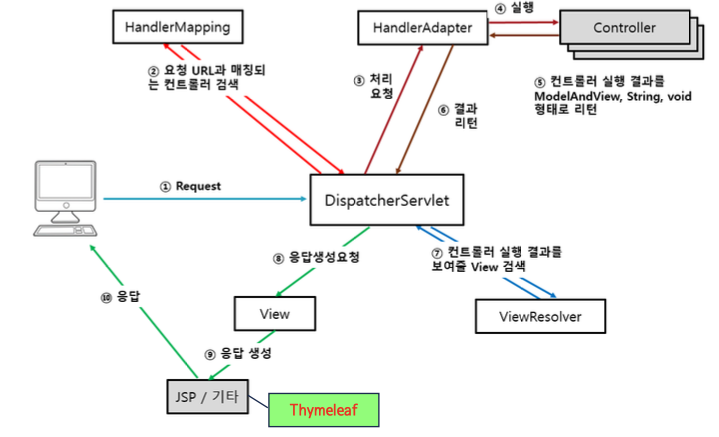
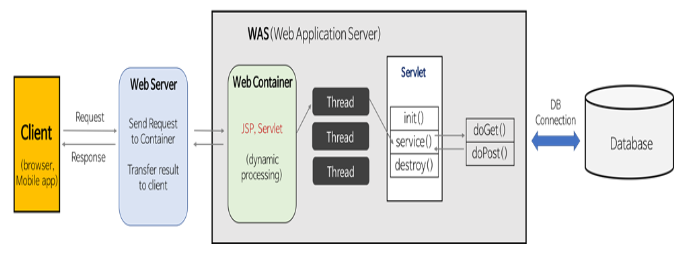
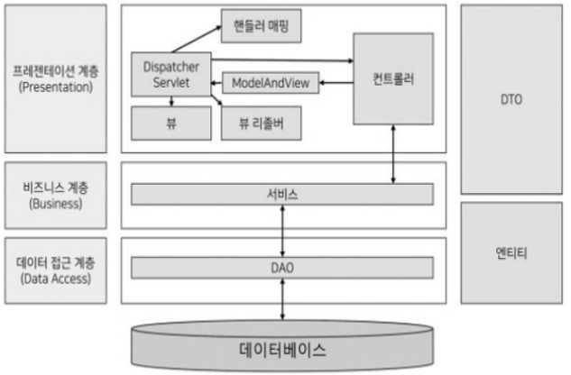
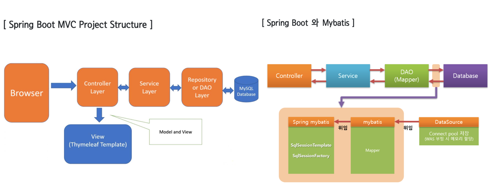
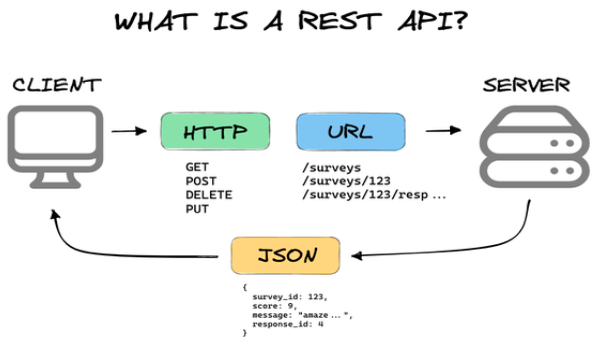
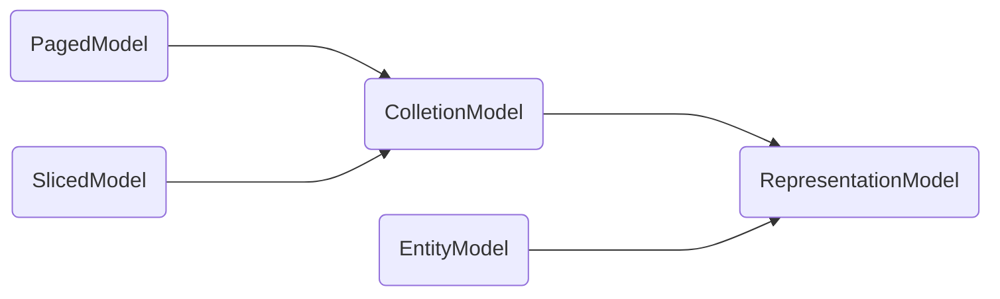
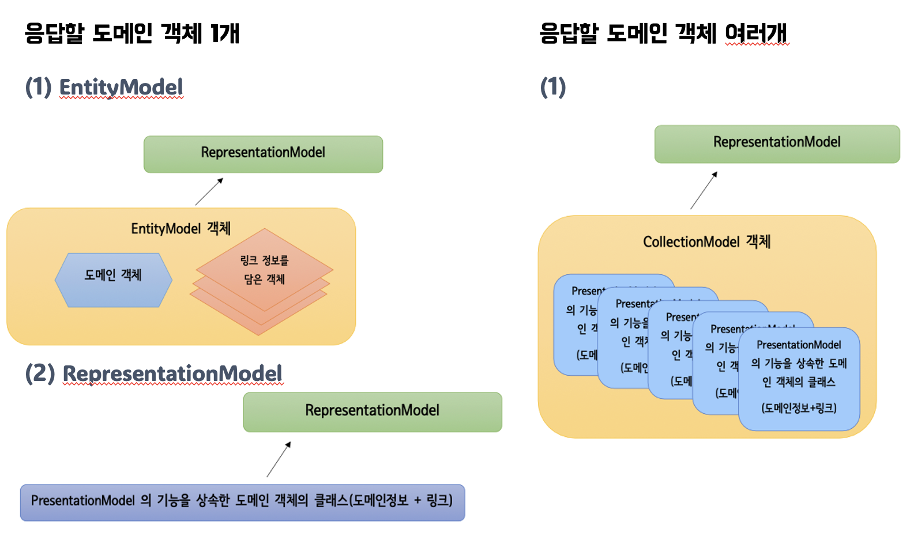

# Sprint Boot (+ Spring MVC)

## 처리 흐름
: 프론트 컨트롤러 패턴 
<br>-> 하나의 핸들러 객체를 통해서 요청을 할당하고, 일관된 처리를 작성할 수 있게 한다




1. DispatcherServlet 
: =FrontController, 스프링 프레임워크의 중심이 되는 서블릿으로 클라이언트의 모든 요청을 받아 흐름을 제어한다.
<br> 각 컨트롤러에 요청을 전달하고 컨트롤러가 반환한 결과값을 View에 전달해 응답

2. HandlerMapping 
: 클라이언트의 요청 URL을 처리할 컨트롤러를 결정해 DispatcherServlet에 반환
<br> @Controller 어노테이션이 적용된 객체의 @RequestMapping 값을 이용해 요청을 처리할 컨트롤러 탐색

3. HandlerAdapter 
: DispatcherServlet의 처리 요청을 변환해서 컨트롤러에게 전달, 컨트롤러의 응답을 DispatcherServlet이 요구하는 형식으로 변환한다

4. **Controller** 
: 실제 클라이언트의 요청을 처리한 뒤, 처리 결과를 void, String, ModelAndView 형태로 반환. 
<br>GET, POST 방식 등 전송 방식에 대한 처리를 어노테이션으로 처리

5. ViewResolver : 컨트롤러의 처리 결과를 보여줄 View 결정

---
## 어노테이션

### @Controller
: Spring MVC의 Controller 클래스 선언 단순화 annotation, Bean 객체를 자동으로 생성한다

- 스프링의 컨트롤러 클래스는 서블릿을 상속할 필요가 없다
- Controller로 사용하고자 하는 클래스에 @Controller를 지정하면, component-scan 으로 자동 등록
- `<context:component-scan base-package=“패키지명"/>`

``` java 
@Controller
@RequestMapping(value="/requestmethod")
public class RequestMethodController {
	public RequestMethodController() {
		System.out.println("RequestMethodController 객체 생성!!");
	}
	@GetMapping // @RequestMapping(value="/select") : Get, post 둘 다 지원
	public String myGet() {
		return  "getResult";
	}	
	@PostMapping
	public String myPost() {
		return  "postResult";
	}
}

```

@Controller 메서드의 파라미터 타입

|  파라미터 타입  |    설명    |
| :----------: | :------: |
| HttpServletRequest<br>HttpServletResponse<br>HttpSession | Servlet API |
| java.util.Locale | 현재 요청에 대한 Locale (클라이언트의 위치) |
| InputStream, Reader | 요청 컨텐츠에 직접 접근할 때 사용 | 
| OutputStream, Writer | 응답 컨텐츠를 생성할 때 사용 | 
| **@PathVariable** <br>(어노테이션 적용 파라미터) | URI 템플릿 변수에 접근할 때 사용 |
| **@RequestParam** <br>(어노테이션 적용 파라미터) | HTTP 요청 파라미터를 매핑 |
| @RequestHeader <br>(어노테이션 적용 파라미터) | HTTP 요청 헤더를 매핑 |
| @CookieValue  <br>(어노테이션 적용 파라미터) | HTTP 쿠키 매핑 |
| @RequestBody <br>(어노테이션 적용 파라미터) |  HTTP 요청의 몸체 내용에 접근할 때 사용 <br>HttpMessageConverter를 이용하여 HTTP 요청 파라미터를 해당 타입으로 변환한다 |
| Map, Model, ModelMap | 뷰에 전달할 모델 데이터를 설정할 때 사용 |
| 커맨드 객체 | HTTP 요청 파라미터를 저장한 객체<br>클래스 이름을 모델명으로 사용하며 @ModelAttribute 어노테이션을 사용하여 <br>모델명을 설정할 수 있다 |
| Errors, BindingResult | HTTP 요청 파라미터를 커맨드 객체에 저장한 결과 <br>커맨드 객체를 위한 파라미터 바로 다음에 위치한다 |
| SessionStatus | 폼처리를 완료했음을 처리하기 위해 사용 <br>@SessionAttribute 어노테이션을 명시한 session 속성을 제거하도록 이벤트를 발생시킨다 |


@Controller 메서드의 리턴 타입

|  파라미터 타입  |    설명    |
| :----------: | :------: |
| ModelAndView | 뷰 정보 및 모델 정보를 담고 있는 ModelAndView 객체 |
|  Model | 뷰에 전달할 객체 정보를 담고 있는 Model을 리턴, <br> 뷰 이름은 요청 URL로부터 결정되며 RequestToViewNameTranslator 통해 뷰 결정 |
| void | 메서드가 ServletResponse나 HttpServletResponse 타입의 파라미터를 갖는 경우 메서드가 직접 응답을 처리한다고 가정 <br> 아니면 요청 URL로부터 결정된 뷰를 보여준 RequestToViewNameTranslator 통해 뷰 결정 |
| Map, ModelMap | 뷰에 전달할 객체 정보를 담고 있는 Map 혹은 ModelMap을 리턴 <br>뷰이름은 요청 URL로부터 결정되며 RequestToViewNameTranslator 통해 뷰 결정 | 
| String | 뷰 이름 리턴 |
| View 객체 | View 객체를 직접 리턴, 해당 View 객체를 이용해서 뷰를 생성한다 | 
| @ResponseBody <br>어노테이션 적용 | 메서드에서 @ResponseBody 어노테이션이 적용된 경우, 리턴 객체를 HTTP 응답으로 전송 <br>HttpMessageConverter를 이용해서 객체를 HTTP 응답 스트림으로 변환한다 | 

### @Service
: @Service를 적용한 Class는 비즈니스 로직이 들어가는 Service로 등록 된다

- Controller에 있는 @Autowired는 @Service("xxxService")에 등록된 xxxService와 변수명이 같아야 한다
- Service에 있는 @Autowired는 @Repository("xxxDao")에 등록된 xxDao와 변수명이 같아야 한다

``` java
@Service("myHelloService")
    public class HelloServiceImpl implements HelloService {
    @Autowired
    private HelloDao helloDao;
        public void hello() { 
            System.out.println("HelloServiceImpl :: hello()"); 
            helloDao.selectHello();
    } 
}
```

### @RequestMapping
: URL 문자열을 클래스 또는 메서드와 매핑시켜주는 역할
<br>- 클래스 위에 @RequestMapping("/{url}")을 지정하며, GET 또는 POST 방식 등의 옵션 할당
<br>- 해당되는 method 실행 후, return 페이지가 정의되어 있지 않으면 @RequestMapping("/{url}")에서 **설정된 url로 다시 돌아간다**

- value : 매핑 URL 값(endpoint), value만 정의하는 경우 'value='은 생략 가능
- method : `method=RequestMethod.GET` 형식으로 사용, 정의하지 않는 경우에는 모든 HTTP Request method에 대해 처리

``` java
@RequestMapping("/hello")
public ModelAndView hello(String name){} // name으로 값을 받음

@RequestMapping(value = "/", method = RequestMethod.GET) 
public String home(Locale locale, Model model) { }
```

### @ModelAttribute
: 도메인 오브젝트나 DTO 또는 VO의 프로퍼티에 요청 파라미터를 바인딩해서 한 번에 받을 때 사용
<br>- 하나의 오브젝트에 클라이언트의 요청 정보를 담아서 한 번에 전달되는 것 이기 때문에 이를 커맨드 패턴에서 말하는 커맨드 오브젝트라고 부르기도 한다
<br>- 모델을 가리키는 이름 변경 가능 
=== "Example 1"
    ``` java
    @Controller
    public class TestModelController2 {
        @ModelAttribute("data1")
        public int createModel1() {	
            System.out.println("createModel1() 호출");
            return 100;
        }
        @ModelAttribute("data2")
        public int createModel2() {	
            System.out.println("createModel2() 호출");
            return 200;
        }
        @RequestMapping(value="/modeltest2")
        public String handle(@ModelAttribute("data1") int vo1, 
                    @ModelAttribute("data2") int vo2) {		
            System.out.println("handle 에서 출력 : "+vo1 + " - " + vo2);
            System.out.println("=============================");
            return "modelResult2";
        }	
    }
    ```
=== "Example 2"
    ``` java
    @Controller
    public class TestModelController1 {
        @ModelAttribute("v1")
        public String createString() {
            System.out.println("객체 생성 자동호출1");
            return "테스트!!";
        }
        @ModelAttribute("v2")
        public int[] createArray() {
            System.out.println("객체 생성 자동호출2");
            return new int[]{10, 20, 30, 40, 50};
        }
        @ModelAttribute("v3")
        public MyVO createVO() {
            System.out.println("객체 생성 자동호출3");
            MyVO vo = new MyVO( 23, "yellow");
            return vo;
        }	
        @ModelAttribute("v4")
        public Date createDate() {
            System.out.println("객체 생성 자동호출4");		
            return new Date();
        }	
        @ModelAttribute("v5")
        public List<MyVO> createList() {
            System.out.println("객체 생성 자동호출5");
            List<MyVO> list = new ArrayList<MyVO>();
            MyVO vo = new MyVO(7, "red");
            list.add(vo);
            vo = new MyVO(11, "pink");
            list.add(vo);
            return list;
        }	
        @RequestMapping("/modeltest1")
        public String handle() {
            System.out.println("handle() 메서드 호출");		
            return "modelResult1";
        }
    }
    ```

### @SessionAttributes
: 세션 객체 생성

- SessionStatus : @SessionAttribute 어노테이션을 명시한 session 속성을 제거하도록 이벤트 발생 
<br> 부분 삭제가 불가능하므로, 이를 위해서는 직접 세션 프로그래밍 진행 

=== "@SessionAttributes"
    ``` java
    @Controller
    @SessionAttributes("data1") 
    public class TestModelController3 {
        @ModelAttribute("data1")
        public StringBuffer createModel1() { // data1은 SessionAttributes, 함수 실행 후에는 세션이 초기화되어야 다시 실행된다
            System.out.println("createModel1() 호출");
            return new StringBuffer();
        }
        @ModelAttribute("data2")
        public StringBuffer createModel2() {	
            System.out.println("createModel2() 호출");
            return new StringBuffer();
        }
        @RequestMapping(value="/modeltest3")
        public String handle(@ModelAttribute("data1") StringBuffer vo1, 
                @ModelAttribute("data2") StringBuffer vo2, String str) {
            vo1.append(str+"#");
            vo2.append(str+"@");
            System.out.println("handle 에서 출력 : "+vo1 + " - " + vo2);
            System.out.println("=============================");
            return "modelResult2";
        }	

        @RequestMapping(value="/countdel")
        public void handle(SessionStatus s) {
            s.setComplete(); // Session 객체 초기화
        }	
    }
    ```
=== "세션 프로그래밍"
    ``` java
    @Controller
    public class CountController2 {	
        @RequestMapping(value="/count2")
        public void handle(int num1, int num2, HttpSession s) { // 세션 프로그래밍을 위해 HttpSession 선언
            System.out.println(s.getId());
            if(s.getAttribute("count3") == null )
                s.setAttribute("count3", new CountDTO());
            if(s.getAttribute("count4") == null )
                s.setAttribute("count4", new CountDTO());
            
            CountDTO vo3 = (CountDTO)s.getAttribute("count3");
            CountDTO vo4 = (CountDTO)s.getAttribute("count4");
            
            vo3.setCountNum(num1);
            vo4.setCountNum(num2);
            System.out.println("handle() : "+ 
                    vo3.getCountNum() + " : " + vo4.getCountNum());
            
            System.out.println("=============================");
        }
        @RequestMapping(value="/countdel2")
        public void handle(HttpSession s, String who) { //who : 삭제할 세션 객체명(count3 or count4)
            if(who != null) {
                s.removeAttribute(who);
                System.out.println(who + " deleted!");		
            }		
            System.out.println("=============================");
        }
    }
    ```

### @RequestParam
: 요청 파라미터(Query 문자열)를 메서드의 매개변수로 1:1 대응해서 받는 것

- `@RequestParam("myname1") String name1` : myname1로 값을 받음, 디폴트로 required=true
- `@RequestParam(value="myname2", required=false) String name2` : myname2로 값을 받으며 해당 쿼리는 필수가 아니다 (값이 없으면, null 값을 가짐)
- `@RequestParam(defaultValue="10") int number1` : number1의 default 값을 설정함으로써 해당 쿼리가 들어오지 않았을 때 사용
- `@RequestParam(value="NUM2", defaultValue="100")int number2)` : NUM2로 값을 받으며 number2의 default 값을 설정함으로써 해당 쿼리가 들어오지 않았을 때 사용
``` java
@RequestMapping("/querystring4")
public ModelAndView proc(
@RequestParam("myname1") String name1,
@RequestParam(value="myname2", required=false) String name2,
@RequestParam(defaultValue="10") int number1, /
@RequestParam(value="NUM2", defaultValue="100")int number2){ 
    ModelAndView mav = new ModelAndView();
    mav.addObject("spring", name1+":"+(number1 + number2) 
            +":"+name2);
    mav.setViewName("queryView1");
    return mav;
}
```

### @PathVariable
: URL 문자열의 특정 부분을 변수화 하는 기능

``` java
@RestController
public class HomeController{
    @RequestMapping("/{name}")
    public String home(@PathVariable String name){
        return "Hello,"+name;
    }
}
```

---
### + @ComponentScan

- `___Application.java` : proejct 생성시 자동으로 생성되는 application 파일
- @ComponentScan : 여러 패키지 관리
``` java title="___Application.java"
@SpringBootApplication(exclude = DataSourceAutoConfiguration.class)
@ComponentScan(basePackages={"com.example.springedu", "thymeleaf.exam"})
public class SpringeduApplication {
	public static void main(String[] args) {

		SpringApplication.run(SpringeduApplication.class, args);
	}
}
```

---
### + 이전 페이지로 이동
=== "HttpServletRequest" 
    ``` java
    // thymeleaf: <a th:href="${refinfo}">이전 페이지로 돌아가기</a>
    @RequestMapping("/")
    public ModelAndView proc(HttpServletRequest req) { 
        ModelAndView mav = new ModelAndView();
        mav.addObject("refinfo", req.getHeader("referer"));
        mav.setViewName("View");
        return mav;
    }
    ```
=== "@RequestHeader"
    ``` java
    @RequestMapping("/")
    public ModelAndView proc(@RequestHeader String referer) {
        ModelAndView mav = new ModelAndView();
        mav.addObject("refinfo", referer);
        mav.setViewName("View");
        return mav;
    }
    ```

### + Model 객체
=== "ModelAndView" 
    ``` java
    protected ModelAndView proc1(@RequestParam(value = "name") String name){
        ModelAndView mav = new ModelAndView();
        mav.addObject("refinfo", referer);
        mav.setViewName("View");
        return mav;
    }
    ```
=== "Model"
    ``` java
    @RequestMapping("/")
    public String proc2(@ModelAttribute("member") MemberDTO dto, HttpServletRequest req, Model model) {
        model.addAttribute("refinfo", req.getHeader("referer"));
        return "View";
    }
    ```

### + End-point
- 아래 코드의 경우, url은 `http://localhost:8088/step1/hithymeleaf`가 됨
``` java
@Controller
@RequestMapping("/step1")
public class ThymeleafController1 {
	@GetMapping("/hithymeleaf")
    public String hiThymeleaf(Model model) {
        model.addAttribute("say", "안녕?");
        return "basic/hithymeleaf";
    }
}
```

### + Static Controller
: 보통의 view는 /templates(thymeleaf)에서 찾지만 /static(html)에서 찾고싶을 때는 다음과 같은 방법 사용
<br>(스프링에서 권장하지 않는 방식)

``` java
@Controller
public class StaticController {	
	public StaticController() {
		System.out.println("HelloController Create object");
	}
	@RequestMapping("/static")
	public ModelAndView xxx(){
		InternalResourceView view = new InternalResourceView("/staticview.html");
		ModelAndView viewModel = new ModelAndView(view);
		return viewModel;
	}	
}
```

---
## Log

- error : 
- warn : 
- info : 
- debug : 
- trace : 

``` java
@Controller
public class HomeController {
	private static final Logger logger = LoggerFactory.getLogger(HomeController.class);
	@GetMapping("/home")
	public String home(Locale locale, Model model) {
		logger.error("클라이언트의 로케일 - {}.", locale);
		logger.warn("클라이언트의 로케일 - {}.", locale);
		logger.info("클라이언트의 로케일 - {}.", locale);
		logger.debug("클라이언트의 로케일 - {}.", locale);
		logger.trace("클라이언트의 로케일 - {}.", locale);
		
		Date date = new Date();
		DateFormat dateFormat = DateFormat.getDateTimeInstance(DateFormat.LONG, DateFormat.LONG, locale);
		String formattedDate = dateFormat.format(date);
		model.addAttribute("serverTime", formattedDate );
		return "home";
	}
}
```

---
## 파일 업로드

`multipart/form-data` : 클라이언트에서 업로드 되는 파일은 여러 개의 파트로 구성되어 전달된다

- multipart를 argument로 받기 위해서는 Controller의 매개변수 타입을 아래처럼 지정한다
    1. `xxx(MultipartFile mfile)`
    2. `xxx(MultipartFile 타입을 멤버변수로 정의한 VO클래스 vo)`
    3. `xxx(MultipartFile[] 타입을 멤버변수로 정의한 VO클래스 vo)` -> 다중 파일
    4. `xxx(MultipartRequest mreq)` -> 다중 파일

Multipart의 주요 메서드

|   Method  |  설명  | 
| :-------: | :---: |
| String getName() | 파라미터의 이름 리턴 |
| String getOriginalFilename() | 업로드 한 파일의 실제 이름 리턴 |
| boolean isEmpty() | 업로드 한 파일이 존재하지 않으면 true 리턴 |
| long getSize() | 업로드 한 파일의 크기 리턴 |
| byte[] getBytes() throws IOException | 업로드 한 파일의 데이터를 byte 배열로 리턴 |
| InputStream getInputStream() | InputStrem 객체 리턴 |
| void transferTo(File dest) | 업로드 한 파일 데이터를 지정한 파일에 저장 |

=== "File Upload"
    ``` java
    @Getter
    @AllArgsConstructor
    public class FileVO1 {
        private MultipartFile uploadFile;
    }
    -----------------------------------------
    @Controller
    public class UploadController1 {
        @RequestMapping("/uploadForm1")
        public void formFile() {	   
        }
        @RequestMapping("/upload1")
        public ModelAndView saveFile(FileVO1 vo) {
            String fileName =  vo.getUploadFile().getOriginalFilename();

            byte[] content = null;
            ModelAndView mav = new ModelAndView();
            mav.setViewName("uploadForm1");
            try {

                content =  vo.getUploadFile().getBytes();
                File f = new File("c:/uploadtest/"+fileName);
                if ( f.exists() ) {
                    mav.addObject("msg", fileName + " : 파일이 이미 존재해요!!");
                } else {
                    FileOutputStream fos = new FileOutputStream(f);
                    fos.write(content);
                    fos.close();
                    mav.addObject("msg", fileName + ": 파일이 저장되었어요!!");
                }
            } catch (IOException e) {
                e.printStackTrace();
                mav.addObject("msg", "오류가 발생했어요!!");
            }	    
            return mav;
        }
    }
    ```
=== "Files Upload"
    ``` java
    @Getter
    @AllArgsConstructor
    public class FileVO2 {
        private MultipartFile[] uploadFiles;
    }
    -----------------------------------------
    @Controller
    public class UploadController2 {
        ...
        @RequestMapping("/upload2")
        public ModelAndView saveFile(FileVO2 vo) {
            System.out.println(vo.getUploadFiles().length+"개가 업로드 됨");
            String resultStr = "";
            String path = "c:/uploadtest/multi";
            File isDir = new File(path);
            if (!isDir.isDirectory()) {
                isDir.mkdirs();
            }
            ModelAndView mav = new ModelAndView();
            mav.setViewName("uploadForm2");
            
            for (MultipartFile mfile : vo.getUploadFiles()) {
                    String fileName = mfile.getOriginalFilename();
                    try {
                        File f = new File("c:/uploadtest/multi/" + fileName);
                        if (f.exists()) {
                            resultStr += fileName + " : 파일이 이미 존재해요!!<br>";
                        } else {
                            mfile.transferTo(f);
                            resultStr += fileName + " : 파일이 저장되었어요!!<br>";
                        }
                    } catch (IOException e) {
                        e.printStackTrace();
                        resultStr += fileName + " : 오류가 발생했어요!!";				
                    }
            }	   
            mav.addObject("msg", resultStr);	
            return mav;
        }
    }
    ```
=== "MultipartRequest"
    ``` java
    // <form  th:unless="${ msg }" action="/upload3"  enctype="multipart/form-data" method="post">
    // <input type="file" name="mfile" multiple/>

    @Controller
    public class UploadController3 {
        @Autowired
        ServletContext context; 
        @RequestMapping("/uploadForm3")
        public void formFile() {
        }

        @RequestMapping("/upload3")
        public ModelAndView saveFile(MultipartRequest mreq) {
            ModelAndView mav = new ModelAndView();
            List<MultipartFile> list = mreq.getFiles("mfile");
            System.out.println(list.size()+"개가 업로드 됨");
            String resultStr = "";
            String path = "c:/uploadtest/multi";
            File isDir = new File(path);
            if (!isDir.isDirectory()) {
                isDir.mkdirs();
            }
            mav.setViewName("uploadForm3");
            for (MultipartFile mfile : list) {
                String fileName = mfile.getOriginalFilename();
                try {
                    File f = new File("c:/uploadtest/multi/" + fileName);
                    //String fileInfo = context.getRealPath("/") + "images/"+fileName;
                    //System.out.println(fileInfo);
                    //File f = new File(fileInfo);
                    if (f.exists()) {
                        resultStr += fileName + " : 파일이 이미 존재해요!!<br>";
                    } else {
                        mfile.transferTo(f);
                        resultStr += fileName + " : 파일이 저장되었어요!!<br>";
                    }
                } catch (IOException e) {
                    e.printStackTrace();
                    resultStr += fileName + " : 오류가 발생했어요!!<br>";				
                }
            }
            mav.addObject("msg", resultStr);	
            return mav;
        }
    }
    ```
=== "Canvas"
    ``` java
    @RestController
    public class UploadController4 {
        @RequestMapping(value="/canvasupload",
                produces="text/plain; charset=utf-8")	
        public String saveFile(MultipartFile mfile) {	    
            String fileName =  mfile.getOriginalFilename();	  
            byte[] content = null;
            String result="OK";
            try {
                content =  mfile.getBytes();
                File f = new File("c:/uploadtest/"+fileName);
                FileOutputStream fos = new FileOutputStream(f);
                fos.write(content);
                fos.close();	   		 
            } catch (IOException e) {
                e.printStackTrace();
                result="FAIL";
            }	    
            return result;
        }
        @RequestMapping(value="/canvasdownload",
                produces="text/plain; charset=utf-8")	
        public String downloadFile() {	    
            String path = "C:/uploadtest/";
            char[] buffer =  null;		
            try {
                FileReader reader = new FileReader(path+"test.png");
                buffer = new 
                        char[(int)(new File(path+"test.png").length())];
                reader.read(buffer);
                reader.close();
            } catch (Exception e) {
                e.printStackTrace();
            }		
            return new String(buffer);
        }
    }
    ```

---
#### 웹 애플리케이션
: 클라이언트와 서버 사이에 HTTP 프로토콜을 이용하여 데이터를 주고 받으면서 동작하는 소프트웨어 프로그램



구조

- 티어 : 어플리케이션의 구조를 물리적으로 나눈 것
- 레이어 : 어플리케이션의 구조를 논리적으로 나눈 것

-> 최대한 레이어 간 의존 관계를 줄여야 유지보수성이 좋아진다


- 중간층
    - 프리젠테이션 레이어 : 컨트롤러, 뷰
    - 비즈니스 로직 레이어 : 서비스, 도메인(DTO, VO, Entity)
    - 데이터 액세스 레이어 : DAO 

---
## Spring Boot
: 스프링으로 애플리케이션 생성할 때, 필요한 초기 설정을 간편하게 처리해주는 별도의 프레임워크


- Spring : Java 기반의 애플리케이션 개발을 위한 오픈소스 프레임워크
- Spring MVC : 웹 애플리케이션 개발에 있어 MVC 패턴을 적용할 수 있도록 Spring에서 제공하는 프레임워크
- Spring Boot : Spring 설정들을 자동화하는 Spring 기반의 프레임워크

### 특징

1. 의존성 관리
    - 스프링 : 개발에 필요한 각 모듈의 의존성을 직접 설정
    - 스프링 부트 : 'spring0boot- starter'를 통해 의존성 및 서로 호환되는 버전의 모듈 조합 제공
2. 내장 WAS
    - 스프링: 배포 시 별도의 외장 웹 서버를 설치하고, 프로젝트를 War 파일로 빌드하여 배포
    - 스프링 부트 : 각 웹 애플리케이션에는 자체적인 WAS 내장되어있으며, 가장 기본 의존성인 'spring-boot-starter-web'의 경우 '톰캣'을 내장하고 있음
3. 자동 설정 : 애플리케이션에 추가된 라이브러리를 실행하는 데 필요한 환경설정을 자동으로 설정함
4. 모니터링 : 스프링 부트 actuator라는 자체 모니터링 도구를 통해 서비스 운영에서 필요한 요소들 모니터링 가능
5. 빌드 : 
    - 스프링 : 프로젝트를 War 파일로 빌드하여 배포
    - 독립적으로 실행 가능한 Jar 파일로 프로젝트를 빌드할 수 있어, 클라우드/컨테이너 환경에 빠르게 배포 가능

### 동작 방식
: spring-boot-starter-web 모듈을 사용하면, 톰캣을 사용하는 스프링 MVC 구조로 동작한다


1. 서블릿 : 클라이언트의 요청을 처리하고 결과를 반환하는 웹 프로그래밍 기술. 서블릿 컨테이너에서 서블릿 인스턴스를 생성하고 관리하는 역할을 하며 **톰캣**은 WAS의 역할과 서블릿 컨테이너의 역할을 수행하는 대표적인 컨테이너이다
    - 서블릿 객체를 생성, 초기화, 호출, 종료하는 생명주기 관리
    - 서블릿 객체는 싱글톤 패턴으로 관리
    - 멀티 스레딩 지원
    - **스프링에서는 DispathcerServlet이 서블릿의 역할 수행** :star:
2. 동작구조 
    1. DispatcherServlet으로 요청이 들어오면, DispatcherServlet은 핸들러 매핑을 통해 요청 URI에 매핑된 컨트롤러를 탐색한다
    2. 핸들러 어댑터로 컨트롤러를 호출하고, 컨트롤러의 응답이 돌아오면 ModelAndView로 응답을 가공해 반환한다
    3. 뷰 형식으로 리턴하는 컨트롤러를 사용할 때는 View Resolver를 통해 View를 받아 리턴한다


- restcontroller : view를 거치지 않고 직접 전달

### 스프링의 레이어드 아키텍처



- 프레젠테이션 계층 : UI 계층, 클라이언트로부터 데이터와 함께 요청을 받고 처리 결과를 응답으로 전달한다
- 비즈니스 계층 : 서비스 계층, 핵심 비즈니스 로직을 구현하는 영역이자 트랜잭션 처리나 유효성 검사 등의 작업도 수행한다
- 데이터접근계층 : 영속(Persistance)계층, 데이터베이스에 접근해야하는 작업을 수행하며 Spring Data JPA에서는 DAO의 역할을 Repository가 수행한다

---

Spring Initializr
(https://start.spring.io)

### 


---
## Spring REST API

### REST

REpresentational State Transferm
<br> 하나의 URI는 하나의 고유한 리소스(Resource)를 대표하도록 설계된다는 개념
<br> 자원을 이름으로 구분하여 해당 자원의 상태(정보)를 주고받는 모든 것을 의미한다

REST는 월드 와이드 웹과 같은 분산 하이퍼미디어 시스템을 위 한 소프트웨어 아키텍처의 한 형식으로써 2000년 **Roy Fielding**의 박사학위 논문에서 소개되었다.

네트워크 아키텍처 원리의 모음으로서 자원을 정의하고 자원에 대한 주소를 지정하는 방법 전반을 일컬으며 REST 원리를 따르는 시스템은 RESTful이란 용어로 지칭된다

- HTTP URI를 통해 자원(Resource) 명명
- HTTP Method(POST, GET, PUT, DELETE)를 통해 해당 자원에 대한 CRUD 작업 적용

**필요성**

- 애플리케이션 분리 및 통합
- Web을 기반으로 하는 비즈니스 환경의 다양한 프로그램 개발
- 다양한 클라이언트의 등장
- 서버와 클라이언트의 독립적 진화 가능 -> 서버의 기능이 변경되어도 클라이언트는 업데이트 필요 X

**특징**

1. Server-Client(서버-클라이언트 구조) : 자원이 있는 쪽이 Server, 자원을 요청하는 쪽이 Client
    - REST Server: API를 제공하고 비즈니스 로직 처리 및 저장을 책임진다
    - Client: 사용자 인증이나 Context(세션, 로그인 정보) 등을 직접 관리하고 책임진다
2. Stateless(무상태) : HTTP 프로토콜은 Stateless Protocol이므로 REST 역시 무상태성을 갖는다
    - Client의 Context를 Server에 저장하지 않는다
    - 각 API 서버는 해당 Client의 요청만을 단순 처리한다
3. Cacheable(캐시 처리 가능) : 웹 표준 HTTP 프로토콜을 사용하므로 웹에서 사용하는 인프라를 그대로 활용할 수 있다
    - HTTP가 가진 가장 강력한 특징 중 하나인 캐싱 기능을 적용할 수 있다 (Last-Modified 태그, E-Tag 등)
    - 캐시 사용을 통해 응답시간이 빨라지고 REST Server 트랜잭션이 발생하지 않기 때문에 전체 응 답시간, 성능, 서버의 자원 이용률을 향상시킬 수 있다
4. Layered System(계층화) : REST Server는 다중 계층으로 구성될 수 있다
    - API Server는 순수 비즈니스 로직을 수행하고 그 앞단에 보안, 로드밸런싱, 암호화, 사용자 인증 등을 추가하여 구조상의 유연성을 줄 수 있다
    - 로드밸런싱, 공유 캐시 등을 통해 확장성과 보안성을 향상시킬 수 있다
    - Client는 REST API Server만 호출한다
5. Uniform Interface(인터페이스 일관성) 
    - URI로 지정한 Resource에 대한 조작을 통일되고 규격화된 인터페이스로 수행한다
    - HTTP 표준 프로토콜에 따르는 모든 플랫폼에서 사용 가능
    - 특정 언어나 기술에 종속되지 않는다

!!! note
    1. 리소스가 URI로 식별되게 한다
    2. 리소스를 만들거나 업데이트 하거나 삭제하거나 할 때 REST Message에 표현을 담아 전송하고 처리한다
    3. Self-descriptive message : 메시지의 내용만으로 해석이 가능해야 한다
    4. Hypermedia As The Engine of Application State(HATEOAS) 
    <br> HAL 규약(application/han+json)으로 작성되는 응답 메시지를 통해 애플리케이션의 상태 전이는 응답 시 함께 제공되는 Hyperlink 를 이용한다.


---
### REST API
: REST 아키텍처 스타일을 따르는 API로서 분산 하이퍼미디어 시스템(웹)을 위한 아키텍처 스타일(제약조건 집합)
<br> 사용자가 요청했을 때 HTML을 리턴하지 않고, 사용자가 필요로하는 데이터만을 리턴 (JSON 등)



**Self-Decriptive**

확장 가능한 커뮤니케이션, 서버나 클라이언트가 변경되더라도 오고 가는 메시지가 Self-descriptive 하므로 추가적인 처리없이 해석 가능하다

**HATEOAS**

애플리케이션 상태 전이의 Late Binding, 어떤 상태로 전이가 완료되고 나서야 그 다음 전이될 수 있는 상태가 결정된다. 즉, 링크는 동적으로 변경 가능하다. 하이퍼미디어를 애플리케이션의 상태를 관리하기 위한 매커니즘으로 사용

---

### @RequestBody & @ResponseBody
: 웹 시스템 간 JSON 형식의 데이터를 주고받는 경우, 스프링 MVC는 컨트롤러에서 DOM 객체나 자바 객체로 변환해서 수신하는 기능과 역으로 전송하는 기술을 제공한다

- @RequestBody : HTTP request **body**를 전달 형식 또는 자바 객체로 변환하여 수신
<br> POST에서만 가능하며, JSON 형태로 전달된 데이터를 해당 파라미터 타입에 자동으로 저장함
- @ResponseBody : HTTP response body로 전송, **view를 거치지 않고 컨트롤러가 직접 응답**하므로 **응답 형식** 설정
<br>컨트롤러 메서드가 리턴하는 객체를 자동으로 JSON형식으로 변환하여 전달하는 역할 수행
<br>==HTTP 규격 구성 요소 중 하나인 Header에 대해 유연하게 설정할 수 없고, StatusCode 또한 따로 설정해주어야 하는 단점이 있다==

-> DTO 객체를 리턴하면 헤더영역의 Content-Type이 'text/plain'에서 'application/json'으로 변경된다


=== "@RequestBody"
    ``` java
    @Controller
    public class RequestBodyController {
        @GetMapping("/bodystart")
        public String test0() {
            System.out.println("요청 성공");
            return "resultold";
        }
        @PostMapping("/rb1")
        public ModelAndView test1(String name, int age) {
            System.out.println(">>> " + name+":"+age);
            ModelAndView mav = new ModelAndView();
            mav.addObject("msg", "폼태그로 전달된 파라미터 : "+name+":"+age);
            mav.setViewName("resultold");
            return mav;
        }
        @PostMapping(value = "/rb2", produces = "application/json; charset=utf-8")
        @ResponseBody
        public String test2(@RequestBody String param) {
            System.out.println(">>> " + param);
            return param;
        }
        @PostMapping(value = "/rb3", produces = "application/json; charset=utf-8")
        @ResponseBody
        public PersonVO test3(@RequestBody PersonVO vo) {
            System.out.println(">>> " + vo.getName()+":"+vo.getAge());
            return vo;
        }
        @PostMapping(value = "/rb4", produces = "application/json; charset=utf-8")
        @ResponseBody
        public Map test4(@RequestBody Map<String,String> map) {
            System.out.println(">>> " + map);
            return map;
        }
    }
    ```
=== "@ResponseBody"
    ``` java
    @Controller
    public class ResponseBodyController {
        @RequestMapping(value = "/body/text/{id}", produces="text/plain; charset=utf-8")
        @ResponseBody
        public String getByIdInTEXT(@PathVariable String id) {
            return "<h1>컨트롤러에서 바로 문자열을 리턴해요 : "+id+"</h1>";
        }
        @RequestMapping(value = "/body/htmltext/{id}", 	produces="text/html; charset=utf-8")
        @ResponseBody
        public String getByIdInHTMLTEXT(@PathVariable String id) {
            return "<h1>컨트롤러에서 바로 HTML 문자열을 리턴해요 : " + id +"</h1>";
        }
        @RequestMapping(value = "/body/json/{id}", produces = "application/json; charset=utf-8")  // text/json
        @ResponseBody
        public MyModel getByIdInJSON(@PathVariable String id) {
            MyModel my = new MyModel();
            my.setFlowerName("장미");
            my.setNum(5);
            my.setId(id);
            System.out.println(my);
            return my;
        }
    }
    ```

---


### @RestController
: @Controller를 상속하여 **@Controller + @ResponseBody** 기능 지원
<br> 도메인 객체의 웹서비스 노출이 가능해짐으로써 **각각의 @RequestMapping method에 @ResponseBody를 할 필요가 없다**

``` java
@RestController
public class JsonResponseController {
    @RequestMapping(value = "/getJSON1", produces = "application/json; charset=utf-8")
    public String test1(String id) {
        String s = "{ \"name\":\"둘리\",\"id\":\"" + id +"\"}";
        return s;
    }

    @RequestMapping(value = "/getJSON2", produces = "application/json; charset=utf-8")
    public HashMap<String, String> test2(String id) {
        HashMap<String, String> map = new HashMap<String, String>();
        map.put("name", "유니코");
        map.put("id", id);
        return map;
    }
    
    @RequestMapping(value = "/getJSON3", produces = "application/json; charset=utf-8")
    public TestVO test3(String id) {
        TestVO vo = new TestVO();
        vo.setName("올라프");
        vo.setId(id);
        return vo;
    }
}
```

RestController 기반의 DispatcherServlet 의 동작 과정


---
### ResponseEntity
: @ResponseBody의 단점 해결, @ResponseBody와 달리 annotation이 아닌 객체로 사용된다

- 응답으로 변환될 정보를 모두 담은 요소들을 객체로 만들어서 반환
- 객체의 구성요소에서 HttpMessageConverter는 응답이 되는 본문을 처리해준 뒤, RESTTemplate에 나머지 구성 요소인 Status를 넘겨준다
- 생성자 사용보다는 **Bulder** 사용이 권장된다
``` java title="Builder Example"
return ResponseEntity
        .status(HttpStatus.OK)
        .body(dto);
```

**Example**

=== "Example"
    ``` java
    @RestController
    public class ResponseEntityController {
        
        // body 추가
        @GetMapping("/test1")
        public ResponseEntity<String> work1(){
            return new ResponseEntity<>("*success*", HttpStatus.OK);
        }

        // Content-type 없이 HTTPStausCode만 전송
        @GetMapping(value="/test3")
        public ResponseEntity work3(){
            return new ResponseEntity(HttpStatus.INTERNAL_SERVER_ERROR);
        }

        // header 추가
        @GetMapping("/test6")
        public ResponseEntity work6(){
            MultiValueMap<String, String> header = new LinkedMultiValueMap<>();
            header.add("AUTHCODE","xxxxxxx");
            header.add("TOKEN", "yyyyyyy");
            return new ResponseEntity(header, HttpStatus.OK);
        }
        
        // Builder
        @GetMapping("/test7")
        public ResponseEntity<MemberDTO> work7(){
            MemberDTO dto = new MemberDTO();
            dto.setName("유니코");
            return ResponseEntity
                    .status(HttpStatus.OK)
                    .body(dto);
        }
    }
    ```

---
### HATEOAS

: Hypermedia As The Engine Of Application State
<br> REST API를 사용하는 클라이언트가 전적으로 서버와 동적인 상호작용이 가능하도록 하는 것을 의미

- 응답에 데이터 뿐만 아니라 해당 데이터와 관련된 가능한 작업도 링크 형식으로 포함
- 서버의 정보를 하이퍼미디어 링크를 이용해서 동적으로 주고 받는다
- 애플리케이션의 상태는 상태의 변화에 따라서 링크 정보가 변경되는데, 이러한 HATEOAS를 쉽게 개발하도록 지원하는 API가 **Spring HATEOAS**이다

**Spring HATEOAS**



- 응답할 도메인 객체가 1개일 때
    1. EntityModel 객체 사용 
    2. RepresentationModel을 상속한 커스텀 모델 클래스 생성
- 응답할 도메인 객체가 여러 개일 때
    1. ColletionModel 객체 사용



**링크 객체 생성**

1. 컨트롤러 메서드의 호출 URL 정보를 추출하여 Link 객체 생성
    - WebMvcLinkBuilder의 static 메서드 `linkTo( )` : 요청 패스를 가지고 클라이언트에서 요청 가능한 컨트롤러 클래스의 메서드에 대한 링크 정보를 담 고 있는 WebMvcLinkBuilder 객체 반환
``` java
linkTo(methodOn(getClass()).hateoasTest1()).withSelfRel()
linkTo(methodOn(UserController.class).retrieveUser(2)).withRel("test3")
```
2. URL 문자열을 직접 지정해서 Link 객체 생성
``` java
Link.of(“정적 URL 문자열”, “이름”) // 지정된 이름과 URL 문자열을 가지고 Link 객체 생성, org.springframework.hateoas의 클래스
```

|  주요 메서드  |  기능  |
| :--------: | :---: |
| WebMvcLinkBuilder의 static 메서드 `methodOn( )` | 타겟 메소드(sample())의 가짜 메소드 콜이 있는 컨트롤러 프록시 클래스의 객체 생성 <br> org.springframework.hateoas.server.mvc.WebMvcLinkBuilder 객체의 static 메서드 |
| LinkBuilderSuppoert의 `withSelfRel( )` | _self 명으로 Link 객체 생성 |
| LinkBuilderSuppoert의 `withRel(“이름”)` | 지정된 이름으로 Link 객체 생성 |


``` java title="Example"
@RestController
public class RepresentationModelController {
    @GetMapping("/representation")
    public PersonModel representation() {
        PersonModel model = new PersonModel();
        model.setFirstName("길동");
        model.setLastName("고");
        model.add(Link.of("http://localhost:8088/entity"));
        model.add(Link.of("http://localhost:8088/collection"));
        return model;
    }

    @GetMapping("/entity")
    public EntityModel<Person> entity() {
        Person person = new Person("길동", "고");
        EntityModel<Person> model = EntityModel.of(person);
        model.add(Link.of("http://localhost:8088/entity"));
        Link link = Link.of("http://localhost:8088/representation", IanaLinkRelations.NEXT);
        model.add(link.withRel("next"));
        return model;
    }

    @GetMapping("/collection1")
    public CollectionModel<Person> collection1() {
        Collection<Person> people = new java.util.ArrayList<>();
        people.add(new Person("길동", "고"));
        people.add(new Person("이콜", "마"));
        CollectionModel<Person> model = CollectionModel.of(people);

        Link oriLink = Link.of("http://localhost:8088/collection");
        Link firstLink = Link.of("http://localhost:8088/representation");
        Link secondLink = Link.of("http://localhost:8088/ajaxHome");
        model.add(oriLink.withSelfRel());
        model.add(firstLink.withRel("repre"));
        model.add(secondLink.withRel("ajax"));

        return model;
    }

    @GetMapping("/collection2")
    public ResponseEntity<List<PersonModel>> collection2()
    {
        List<PersonModel> list = new java.util.ArrayList<>();
        PersonModel pm1 = new PersonModel("길동", "고");
        PersonModel pm2 = new PersonModel("이콜", "마");
        pm1.add(Link.of("http://localhost:8088/entity"));
        pm2.add(Link.of("http://localhost:8088/representation", IanaLinkRelations.NEXT));
        list.add(pm1);
        list.add(pm2);
        return ResponseEntity.ok().body(list);
    }
}
```


---
!!! quote
    - 김정현 강사님