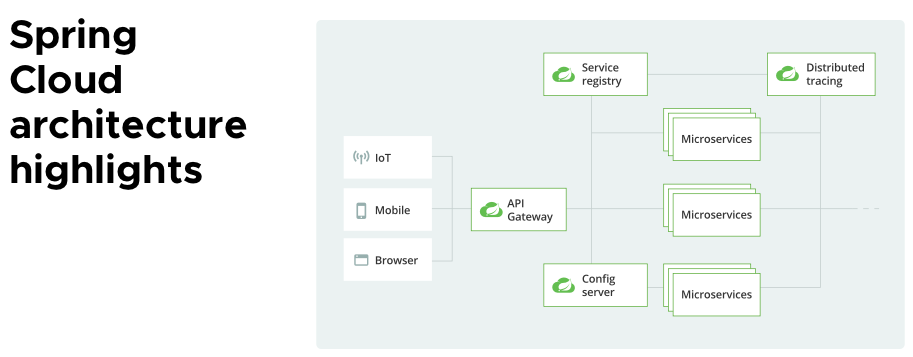

# Spring MSA


## Spring Cloud
: MicroServices 기반의 개발, 빌드, 배포, 운영에 필요한 아키텍처를 쉽게 구성할 수 있게 도와주고 개발할 수 있게 지원하는 Spring Boot 기반 프레임워크



**Service -> Spring Boot Project(Spring Boot Application)**

- 비지니스 로직 처리를 담당하기 위한 어플리케이션 서버 
- 특정 경로에 대한 컨트롤러를 통해 요청 처리를 진행

**Spring Cloud Gateway: SCG**
: URL 주소에 대해서 세부 경로에 따라 각각의 스프링 부트 어플리케이션에 분배하는 분배기 역할

**Spring Cloud Eureka Server**

- 모니터링 서버로 등록된 Eureka Client 관리
- 모니터링 기능과 함께 추가적으로 Spring Cloud Gateway에 목록을 전달하여 Gateway가 로드밸런싱 대상을 설정하도록 작업

**Spring Cloud Eureka Client**
: Eureka Server에 등록되는 스프링 부트 어플리케이션

**Spring Config Server**

- 변수 값(구성 정보)들을 제공하는 서버로 특정 경로로 접근하면 미리 사전에 설정해둔 변수 값들을 제공
- MSA를 구축하면 각각의 스프링 부트 어플리케이션에 application.properties에 값을 명시하는 것이 아닌 Config Server로 부터 데이터를 받아서 사용

**Config Repository**
: Config Server는 단순하게 데이터를 전달하는 매개체로 실제 데이터는 Config Server 뒷단에 깃허브 리포지토리와 같은 저장소를 물려서 사용

**Spring Config Client**
: Config Server로 부터 변수 데이터를 받기 위한 Client 서버 설정

---
### Config Github Repository
: Git Service, RDB, Document NoSQL, Redis, File, Vault 등등 여러 영속성 도구 중 Git Service를 가장 많이 사용한다

1. Github Private Repository 생성

2. 설정 파일 생성 (`이름-환경.properties`, `이름-환경.yml`)
: Config 서버가 읽어갈 설정 파일 생성

    - 이름 : 사용자가 식별할 수 있는 ==마이크로 서비스 이름==
    - 환경 : `dev`, `prod`
    - 파일명은 대시`-` 구분자를 필수로 넣어야 한다

3. Repository 외부 접속을 위한 비대칭 키 생성 
``` bash
ssh-keygen -m PEM -t rsa -b 4096
```
4. Github Repository Deploy keys 설정
---
### Config Server

1. Dependencies
: https://start.spring.io -> **Config Server**, **Spring Security**

2. Annotation 추가 `@EnableConfigServer`
``` java hl_lines="8" title="ConfigApplication.java"
package com.example.config;

import org.springframework.boot.SpringApplication;
import org.springframework.boot.autoconfigure.SpringBootApplication;
import org.springframework.cloud.config.server.EnableConfigServer;

@SpringBootApplication
@EnableConfigServer
public class ConfigApplication {

	public static void main(String[] args) {
		SpringApplication.run(ConfigApplication.class, args);
	}

}
```
3. application.yml
``` yaml
server:
  port: 9000

spring:
  application:
    name: spring-cloud-config-client
  cloud:
    config:
      server:
        git:
          uri: 
          ignore-local-ssh-settings: true
          private-key:
```

-> Tiary 프로젝트에 활용! 

- [Tiary MSA 바로가기](https://github.com/KOSA-ToT/tiary/tree/feature/SCRUM-128--MSA)
- [Tiary MSA DOCS](https://github.com/KOSA-ToT/tiary/blob/feature/SCRUM-128--MSA/docs/msa-guide.md)


---
!!! quote
    - https://spring.io/cloud/
    - 김정현 강사님