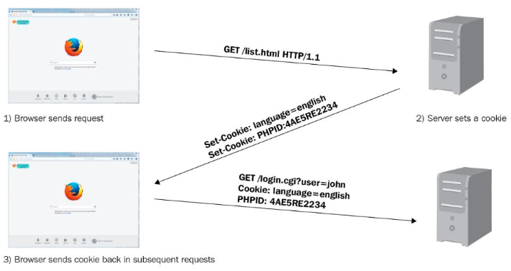
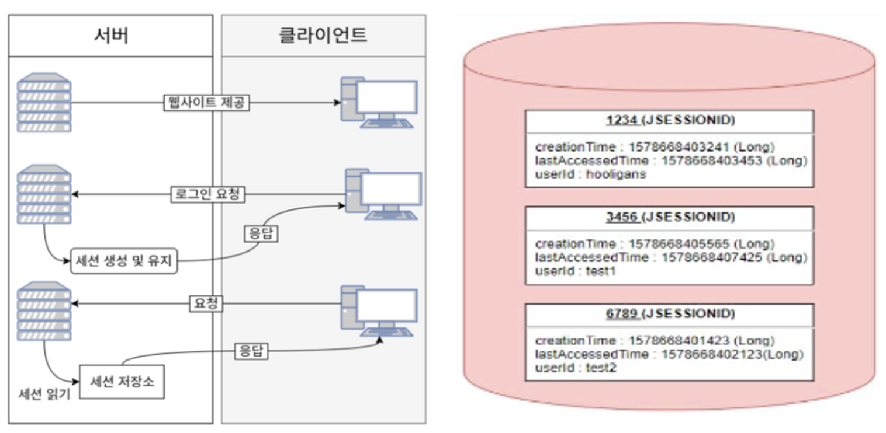
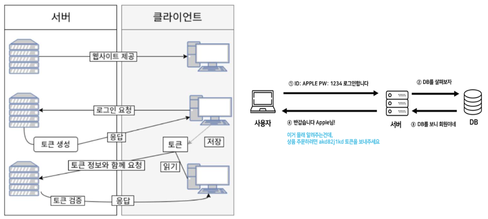
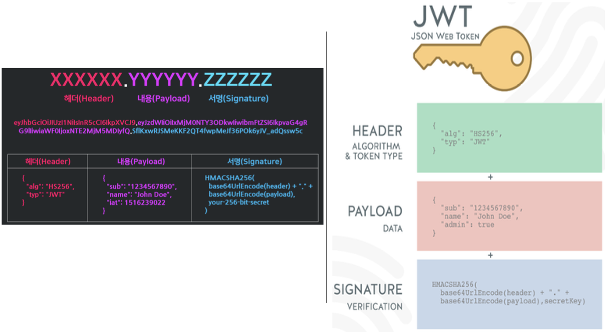
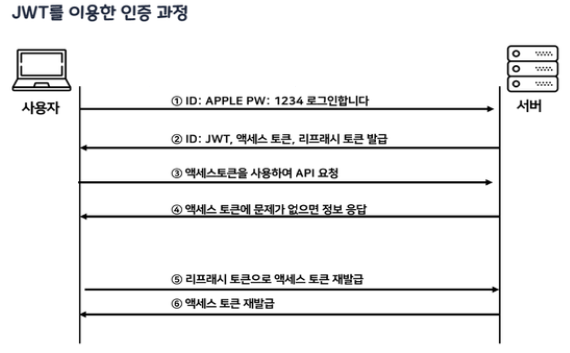
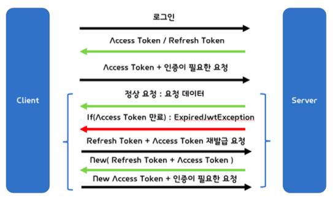

# Security

## Cookie / Session / Token
: 서버가 클라이언트 인증을 확인하는 대표적인 3가지 방식

### Cookie
: Key-Value 형식의 문자열 덩어리
<br> - 클라이언트가 어떠한 웹사이트를 방문할 경우 그 사이트가 사용하고 있는 서버를 통해 클라이언트의 브라우저에 설치되는 작은 기록 정보 파일
<br> - 각 사용자마다의 브라우저에 정보를 저장하므로 고유 정보 식별이 가능하다



1. 브라우저(클라이언트)가 서버에 요청(접속)을 보낸다
2. 서버는 클라이언트의 요청에 대한 응답을 작성할 때, 클라이언트 측에 저장하고 싶은 정보를 응답 헤더의 Set-Cookie에 담는다
3. 이후 해당 클라이언트는 요청을 보낼 때마다, 매번 저장된 쿠키를 요청 헤더의 Cookie에 담아 보낸다
4. 서버는 쿠키에 담긴 정보를 바탕으로 해당 요청의 클라이언트가 누구인지 식별하거나 정보를 바탕으로 추천 광고를 띄우거나 한다

**단점**

- 보안에 취약
- 요청 시 쿠키의 값을 그대로 보내기 때문에 유출 및 조작당할 위험이 존재함
- 용량 제한이 있어 많은 정보를 담을 수 없다
- 웹 브라우저마다 쿠키에 대한 지원 형태가 다르기 때문에 브라우저간 공유가 불가능
- 쿠키의 사이즈가 커질수록 네트워크에 부하가 심해진다

### Session
: 세션은 비밀번호 등 클라이언트의 민감한 인증 정보를 쿠키와 달리 브라우저가 아닌 서버 측에 저장하고 관리한다. 
<br> - 서버의 메모리에 저장하기도 하고, 서버의 로컬 파일이나 데이터베이스에 저장하기도 한다.
<br> - 세션 객체는 Key에 해당하는 SESSION ID와 이에 대응하는 Value로 구성되어 있다. Value에는 세션 생성 시간, 마지막 접근 시간 및 User가 저장한 속성 등이 Map 형태로 저장된다


{style: width=80%, height=80%}

1. 유저가 로그인하면 세션이 서버 메모리(혹은 데이터베이스) 상에 저장된다.
<br> (이때, 세션을 식별하기 위한 Session Id를 기준으로 정보를 저장)
2. 서버에서 쿠키 기술로 브라우저에 Session Id를 저장한다.
3. 쿠키에 정보가 담겨있기 때문에 브라우저는 해당 사이트에 대한 모든 Request에 Session Id를 쿠키에 담아 전송한다.
4. 서버는 클라이언트가 보낸 Session Id 와 서버 메모리로 관리하고 있는 Session Id를 비교하여 인증을 수행한다.

**단점**

- 쿠키를 포함한 요청이 외부에 노출되더라도 세션 ID 자체는 유의미한 개인정보를 담고 있지 않는다
- 그러나 해커가 세션 ID 자체를 탈취하여 클라이언트인척 위장할 수 있다는 한계 존재 (서버에서 IP특정은 가능)
- ==서버에서 세션 저장소를 사용하므로 요청이 많아지면 서버에 부하가 심해진다==


### Token
: 클라이언트가 서버에 접속을 하면 서버에서 해당 클라이언트에게 인증되었다는 의미로 '토큰'을 부여한다

- 토큰은 유일하며, 토큰을 발급받은 클라이언트는 또 다시 서버에 요청을 보낼 때 요청 헤더에 토큰을 심어서 보낸다
- 서버에서는 클라이언트로부터 받은 토큰 = 서버에서 제공한 토큰과의 일치 여부를 체크하여 인증 과정을 처리한다
- 기존의 세션기반 인증은 서버가 파일이나 데이터베이스에 세션정보를 가지고 있어야 하고 이를 조회 하는 과정이 필요하기 때문에 서버에 오버헤드가 발생할 수 있지만,
-  토큰은 클라이언트에 저장하므로 메모리나 스토리지 등을 통해 세션을 관리했던 서버의 부담을 덜 수 있다
<br> (토큰 자체에 데이터가 들어있기 때문에 클라이언트에서 받아 위조되었는지 판별만 하면 되기 때문)
- ==토큰은 앱과 서버가 통신 및 인증할 때 가장 많이 사용된다== (-> 웹에는 쿠키와 세션이 있지만 앱은 없음)



1. 사용자가 아이디와 비밀번호로 로그인을 한다.
2. 서버 측에서 사용자(클라이언트)에게 유일한 토큰을 발급한다.
3. 클라이언트는 서버 측에서 전달받은 토큰을 쿠키나 스토리지에 저장해 두고, 서버에 요청을 할 때마다 해당 토큰을 HTTP 요청 헤더에 포함시켜 전달한다.
4. 서버는 전달받은 토큰을 검증하고 요청에 응답한다.
5. 토큰에는 요청한 사람의 정보가 담겨있으므로 서버는 DB를 조회하지 않고 누가 요청하는지 알 수 있다.

**장점**

- 로그인한 사용자의 상태 정보를 클라이언트에 저장하므로 서버 단 저장소의 오버헤드를 신경 쓸 필요 없음
- 복잡한 구성과 환경에서 로그인한 사용자의 상태 정보를 기억해야 하는 부담이 없으니 서버 확장에 유리

**단점**

- 토큰 자체에 로그인한 사용자의 상태 정보가 담겨 있으므로 클라이언트에서 토큰이 탈취당하면 몇몇 개인정보까지 탈취당할 위험 존재
- 서버는 이미 한 번 발급한 토큰을 무효화시킬 방법이 없기 때문에 탈취된 토큰은 그 유효 기한이 지나기 전까지 마음껏 사용 가능
<br> -> 발급된 토큰의 유효시간을 제한하여 위험을 최소화 해야함


---
## ==[JWT](https://jwt.io)== 
: Json Web Token, 인증에 필요한 정보들을 암호화시킨 JSON 토큰
<br> - JSON 데이터를 Base64 URL-safe Encode를 통해 인코딩하여 직렬화한 것
<br> - 토큰 내부에는 위변조 방지를 위해 개인키를 통한 전자서명도 들어있어, 사용자가 JWT를 서버로 전송하면 서버는 서명을 검증하는 과정을 거쳐 요청한 응답을 돌려준다

**JWT 기반 인증**
: JWT 토큰(Access Token)을 HTTP 헤더에 포함하여 전송함으로써 서버가 클라이언트를 식별하는 방식

토큰은 아래처럼 요청 헤더의 Authorization 필드에 담아져 서버로 보내진다
``` bash
Authorization: <type> <credentials>
```



**Header**
: JWT에서 사용할 알고리즘 타입과 해시 알고리즘의 종류가 담겨있다

- alg : 서명 암호화 알고리즘(ex: HMAC SHA256, RSA)
- typ : 토큰 유형

**Payload**
: 토큰에서 사용할 정보의 조각들인 Claim -> 서버에서 첨부한 사용자 권한 정보와 실제로 사용될 정보에 대한 내용을 담는 섹션
<br> (==Claim== : key-value로 이루어진 한 쌍의 정보, JWT 를 통해서 알 수 있는 데이터, 정보의 한 조각)

- Registered claims : 미리 정의된 클레임
    - iss(issuer) : 발행자
    - exp(expiration time) : 만료 시간
    - sub(subject) : 제목
    - iat(issued At) : 발행 시간
    - jti(JWT ID) : 토큰의 고유 식별자
- Public claims : 사용자가 정의할 수 있는 클레임으로서 공개용 정보 전달을 위해 사용
- Private claims : 당사자들 간에 정보를 공유하기 위해 만들어진 사용자 지정 클레임, 외부에 공개되어도 상관없지만, 해당 유저를 특정할 수 있는 정보를 담음


**Signature**
: Header, Payload를 Base64 URL-safe Encode 한 이후, Header에 명시된 해시함수를 적용하고, 개인키(Private key)로 서명한 전자 서명이 담겨있다

- 시그니처에서 사용하는 알고리즘은 헤더에서 정의한 알고리즘 방식(alg)을 활용한다
- 시그니처의 구조는 (헤더 + 페이로드)와 서버가 갖고 있는 유일한 key 값을 합친 것을 헤더에서 정의한 알고리즘으로 암호화한다
``` bash
Signature = HS256[ Base64Url(Header) + . + Base64Url(PayLoad) + Server's key ]
```
- Header와 Payload는 단순히 인코딩된 값이므로 제 3자가 복호화 및 조작할 수 있지만,
- ==Signature는 서버 측에서 관리하는 비밀키가 유출되지 않는 이상 복호화할 수 없다==
- 따라서, ==토큰의 위변조 여부를 확인== 하는 데 사용된다


<br>

### 다양한 인증 타입 (알고리즘)
: 토큰에는 많은 종류가 있고, 서버는 다양한 종류의 토큰을 처리하기 위해 전송받은 type에 따라 토큰을 다르게 처리한다

- Basic : 사용자 아이디와 암호를 Base64로 인코딩한 값을 토큰으로 사용한다. (RFC 7617)
- **Bearer** : JWT 혹은 OAuth에 대한 토큰을 사용한다. (RFC 6750)
- Digest : 서버에서 난수 데이터 문자열을 클라이언트에 보낸다. 클라이언트는 사용자 정보와 nonce를 포함하는 해시값을 사용하여 응답한다 (RFC 7616)
- HOBA : 전자 서명 기반 인증 (RFC 7486)
- Mutual : 암호를 이용한 클라이언트-서버 상호 인증 (draft-ietf-httpauth-mutual)
- **AWS4-HMAC-SHA256** : AWS 전자 서명 기반 인증

<br>


1. 사용자가 ID, PW를 입력하여 서버에 로그인 인증을 요청한다.
2. 서버에서 클라이언트로부터 인증 요청을 받으면 ==Header, PayLoad, Signature== 를 정의한다.
<br> ==Hedaer, PayLoad, Signature를 각각 Base64로 한 번 더 암호화하여 JWT를 생성== 하고 이를 쿠키에 담아(응답 헤더) 클라이언트에게 발급한다.
<br> 클라이언트는 서버로부터 받은 JWT를 로컬 스토리지에 저장한다. (쿠키나 다른 곳에 저장 가능)
3. API를 서버에 요청할 때 ==Authorization header에 Access Token== 을 담아서 보낸다.
4. 클라이언트가 Header에 담아서 보낸 JWT가 내 서버에서 발행한 토큰인지 일치 여부를 확인하
여 일치한다면 인증을 통과시켜주고 아니라면 통과시키지 않는 인가 과정을 수행한다.
5. 인증이 통과되었으므로 페이로드에 들어있는 유저의 정보들을 select해서 클라이언트가 요청한
컨텐츠를 응답한다.
6. 클라이언트가 서버에 요청을 했는데, 만일 액세스 토큰의 시간이 만료되면 클라이언트는 ==Refresh 토큰을 이용해서 서버로부터 새로운 엑세스 토큰을 발급== 받는다.


**토큰 인증이 신뢰성을 가지는 이유**

유저의 JWT = A(Header) + B(Payload) + C(Signature)일 때,
``` 
다른 유저가 B를 임의로 수정 -> 유저 JWT: A + B'+ C
수정한 토큰을 서버에 요청을 보내면 서버는 유효성 검사 시행
서버에서 검증 후 생성한 JWT : A + B' + C' -> Signature 불일치 (유저 JWT : A + B' + C)
```
-> 대조 결과가 일치하지 않아 유저의 정보가 임의로 조작되었음을 알 수 있다

서버는 토큰 안에 들어있는 정보가 무엇인지 아는 게 중요한 것이 아니라 ==해당 토큰이 유효한 토큰인지 확인== 하는 것이 중요하기 때문에, 클라이언트로부터 받은 ==JWT의 헤더, 페이로드를 서버의 key 값을 이용해 시그니처를 다시 만들고== 이를 비교하며 일치했을 경우 인증을 통과시킨다

**장점**

- Header와 Payload를 가지고 Signature를 생성하므로 데이터 위변조를 막을 수 있다.
- 인증 정보에 대한 별도의 저장소가 필요없다.
- JWT는 토큰에 대한 기본 정보와 전달할 정보 및 토큰이 검증됐음을 증명하는 서명 등 필요한
모든 정보를 자체적으로 지니고 있다.
- 클라이언트 인증 정보를 저장하는 세션과 다르게, 서버는 무상태(StateLess)가 되어 서버 확장성이
우수해질 수 있다.
- 토큰 기반으로 다른 로그인 시스템에 접근 및 권한 공유가 가능하다. (쿠키와 차이)
- OAuth(Open Authorization )의 경우 Facebook, Google 등 소셜 계정을 이용하여 다른 웹서비스
에서도 로그인을 할 수 있다. 
<br> 모바일 어플리케이션 환경에서도 잘 동작한다. (모바일은 세션 사용 불가능)

**단점**

- Self-contained : 토큰 자체에 정보를 담고 있으므로 양날의 검이 될 수 있다.
- 토큰 길이 : 토큰의 Payload에 3종류의 클레임을 저장하기 때문에, 정보가 많아질수록 토큰의 길이가 늘어나 네트워크에 부하를 줄 수 있다.
- Payload 인코딩 : payload 자체는 암호화 된 것이 아니라 BASE64로 인코딩 된 것이기 때문에, 중간에 Payload를 탈취하여 디코딩하면 데이터를 볼 수 있으므로, Payload에 중요 데이터를 넣지않아야 한다.
- Store Token : stateless 특징을 가지기 때문에, 토큰은 클라이언트 측에서 관리하고 저장한다. 때문에 토큰 자체를 탈취당하면 대처하기가 어렵게 된다


!!! note
    **JWT은 서명(인증)이 목적이다**
    : JWT는 Base64로 암호화를 하기 때문에 디버거를 사용해서 인코딩된 JWT를 1초만에 복호화할 수 있다
    <br> 복호화하면 사용자의 데이터를 담은 Payload 부분이 그대로 노출되므로 Payload에는 비밀번호와 같은 민감한 정보는 넣지 않는다
    <br> {++토큰의 진짜 목적은 정보보호가 아닌, 위변조 방지이다++}
    <br> 시그니처에 사용된 비밀번호가 노출되지 않는 이상, 데이터를 위조해도 시그니처 부분에서 바로 걸러지기 때문

    **서버에서 가장 피해야 할 것은 데이터베이스 조회**
    : DB가 터지면서 서버도 같이 죽는 경우가 허다하다는 점에서, JWT 토큰은 DB 조회를 하지 않아도 된다는 장점을 가진다
    <br> 만일 payload에 유저이름과 유저등급을 같이 두고 보내면, 서버에서는 유저이름을 가지고 DB를 조 회해서 유저 등급을 얻지 않아도 바로 원하는 정보를 취할 수 있다


### Access Token / Refresh Token
: JWT도 제 3자에게 토큰 탈취의 위험성이 있기 때문에, 그대로 사용하는 것이 아닌 Access Token,
Refresh Token 으로 이중으로 나누어 인증을 하는 방식을 취한다

Access Token은 접근에 관여하는 토큰, Refresh Token은 재발급에 관여하는 토큰의 역할로 사용되는 JWT라고 할 수 있다.


- Access Token : 클라이언트가 갖고 있는 실제로 유저의 정보가 담긴 토큰, 클라이언트에서 요청 이 오면 서버에서 해당 토큰에 있는 정보를 활용하여 사용자 정보에 맞게 응답을 진행한다
- Refresh Token : 새로운 Access Token을 발급해주기 위해 사용하는 토큰으로 짧은 수명을 가지는 Access Token에게 새로운 토큰을 발급해주기 위해 사용. 해당 토큰은 보통 데이 터베이스에 유저 정보와 같이 기록.

**JWT 인증절차**

1. 사용자가 로그인을 한다.
2. 서버에서는 계정 정보를 읽어 사용자를 확인 후, 사용자의 고유 ID 값을 부여한 후 기타 정보와 함께 Payload 에 집어넣는다.
3. JWT 토큰의 유효기간을 설정한다.
4. 암호화할 Secret key 를 이용해 Access Token 을 발급한다. 
5. 클라이언트는 Access Token 을 받 아 저장(쿠키, 스토리지 등) 후, 인증이 필요한 요청마다 토큰을 헤더에 실어 보낸다.
6. 서버에서는 해당 토큰의 Verify Signature 를 Secret key 로 복호화한 후, 조작 여부, 유효기간을 확인한다
7. 검증이 완료되었을 경우, Payload를 디코딩하여 사용자의 ID 에 맞는 데이터를 가져온다



**Refresh Token**
: 보통 보안 문제로 인해 Access Token의 유효기간은 매우 짧으므로 Access Token이 만료되면 새로운 JWT를 발급할 수 있는 토큰. 즉, Refresh Token을 따로 발급한다

1. 클라이언트에서 로그인한다.
2. 서버는 클라이언트에게 Access Token과 Refresh Token을 발급한다. 동시에 Refresh Token은 서버에 저장된다. 클라이언트는 local 저장소에 두 Token을 저장한다.
3. 매 요청마다 Access Token을 헤더에 담아서 요청한다.
4. 이 때, Access Token이 만료가 되면 서버는 만료되었다는 Response를 하게 된다.
5. 클라이언트는 해당 Response를 받으면 Refresh Token을 보낸다.
6. 서버는 Refresh Token 유효성 체크를 하게 되고, 새로운 Access Token을 발급한다.
7. 클라이언트는 새롭게 받은 Access Token을 기존의 Access Token에 덮어쓰게 된다.

---
!!! quote
	- 김정현 강사님