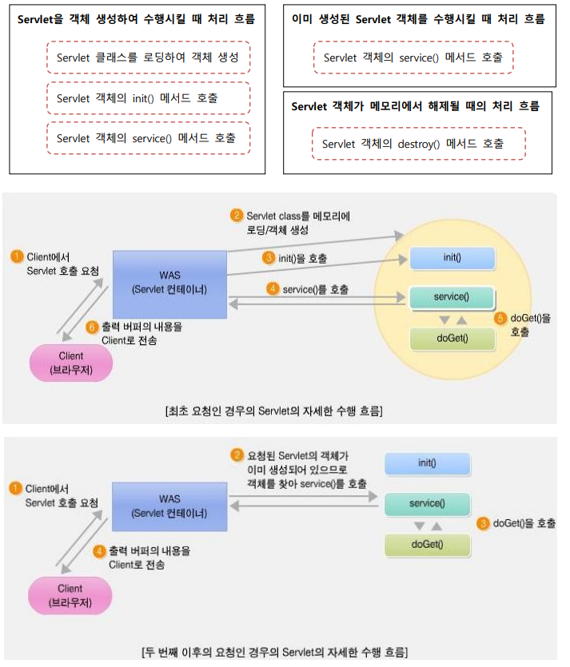

# Servlet + JSP
: Java Enterprise Edition Base Web Server Programming

- Servlet: Server-Side Application
- JSP(JavaServer Pages) : 

---
## Servlet
: 1998년 발표된 웹 애플리케이션 개발을 위한 자바 표준 API로, Java EE 사양의 일부분

1. 웹 서버에서 실행되며, 클라이언트와 상호작용하여 동적인 웹페이지를 생성하거나 데이터를 처리하는 데 사용됨
2. request마다 스레드 기반으로 응답하여 **CGI**에 비해 가볍게 클라이언트의 요청 처리
3. request로 인해 생성된 Servlet 객체는 response 이후에도 바로 수행될 수 있도록 객체 상태를 유지한다
4. 여러 클라이언트의 동시 요청 시, 하나의 Servlet 객체를 공유하여 다중 스레드 기반에서 처리되어 응답 성능 향상 (메서드 안 변수는 무조건 지역변수)
5. 다만, HTML content를 검열할 수 없음 :material-arrow-right-thick: JSP (Model-1):material-arrow-right-thick: MVC pattern (Model-2)
	- MVC pattern : 요청은 Servlet, 응답은 JSP
6. 서블릿은 **HttpServlet**이라는 클래스를 상속하여 구현하며 Request method에 따라 `doGet()` 또는 `doPost()` 메서드를 오버라이딩 함
8. 서블릿은 `.class`라는 확장자를 갖는 실행 파일이 되는데, 웹에서 `.class`은 Applet에서 이미 사용하기 때문에 **등록과 매핑**이라는 설정을 web.xml이라는 디스크립터 파일에 작성해주어야 한다
	- `web.xml` : Web application에 대한 다양한 정보를 설정하는 파일, 디스크립터 파일이라고도 함 (./WEB-INF/web.xml)
9. web.xml 대신 Annotation구문으로 대신할 수 있음.
	- @WebServlet: Servlet 프로그램을 등록과 매핑을 정의
	- @WebInitParam: Servlet 프로그램에 전달할 초기 파라미터를 정의
	- @WebListener: 리스너를 정의
	- @WebFilter: 필터를 정의
	- @MultipartConfig: Servlet 프로그램에서 다중 파티션으로 전달되는 파일 업로드를 처리할 수 있음을 정의


```mermaid
graph TB
    subgraph Web Container(Servlet Engine)
        R1(Request) --> T1(Thread)
        R2(Request) --> T2(Thread)
		R3(Request) --> T3(Thread)
		T1 --> S(Servlet)
		T2 --> S
		T3 --> S
    end
```
=== "Example"
	``` java 
	@WebServlet({ "/FirstServlet", "/first" })
	public class FirstServlet extends HttpServlet {
		private static final long serialVersionUID = 1L;
		protected void doGet(HttpServletRequest request, HttpServletResponse response) throws ServletException, IOException {
	//		response.getWriter().append("Served at: ").append(request.getContextPath());
			System.out.println("FirstServlet 실행 .....");
			response.setContentType("text/html; charset=utf-8");
			PrintWriter out = response.getWriter();
			out.print("<h1> Hello, Servlet </h1>");
			out.close();
		}
	}
	```
=== "Example-variable"
	``` java 
	/*
	요청할 때마다 member 변수는 +1씩 늘어나고, 지역변수는 1인 채로 가만히 있음
	서블릿 객체는 하나로 공유되기 때문에 member 변수는 여러 클라이언트에게 공유됨
	*/
	@WebServlet("/memberlocal")
	public class MemberLocalServlet extends HttpServlet {
		private static final long serialVersionUID = 1L;
		int member_v = 0; //멤버 변수, 클라이언트 요청이 최초로 전달되었을 때 생성
		protected void doGet(HttpServletRequest request, HttpServletResponse response) throws ServletException, IOException {
			response.setContentType("text/html; charset=utf-8");
			PrintWriter out = response.getWriter();
			int local_v = 0; //지역 변수
			member_v++;
			local_v++;
			out.print("<h2>member_v(멤버변수) : " + member_v + "</h2>");
			out.print("<h2>local_v(지역변수) : " + local_v + "</h2>");
			out.close();
		}
	}
	```

- Overriding :star
    - **doGet()**
    - **doPost()**
- getContextPath() : request URI에서 request의 Context 반환
- `protected void doGet(HttpServletRequest request, HttpServletResponse response) throws ServletException, IOException`
    - HttpServletRequest : 요청과 관련된 객체 생성 
    - HttpServletResponse : 응답과 관련된 객체 생성
- `response.setContentType("text/html; charset=utf-8");`
: utf-8로 charset을 맞춰줌으로써 한글 정상 출력 (설정하지 않을 시, `?`로 출력됨)


### HttpServletRequest 객체
: 웹 클라이언트에서 전송되는 Request 정보 추출

getHeader(name), getHeaders(name), getHeaderNames(),
getContentLength(), getContentType(), getCookies(),
getRequestURI(), getQueryString(), getProtocol(), getMethod()

### HttpServletResponse 객체 
: 웹 클라이언트로의 Response 처리

setStatusCode(int statuscode), sendError(int code, String message), sendRedirect(url), setHeader(String headerName, String headerValue), 
setContentType(String mimeType), setContentLength(int length)

### Servlet 객체 생성과 해제
: HttpServletRequest 와 HttpServletResponse 객체를 생성한 후, Servlet 컨테이너는 요청된 Servlet의 객체가 생성된 상태인지 검사한다

- 요청된 서블릿 객체가 이미 생성되어 있는지?
	- Y -> service() 호출, 요청방식에 따라 doGet() 또는 doPost() 호출
	- N -> 서블릿 객체 생성, init() 호출, doGet() 또는 doPost() 호출
- 서블릿 객체의 삭제 : 서버가 종료될 때, 자동 reload될 때 삭제됨, destroy() 호출




### Servlet Request
- GET
	- 하이퍼링크 텍스트(<A>태그)를 클릭하여 요청
	- URL 을 주소필드에 입력하여 직접 요청
	- ``태그로 요청
	- `<IFRAME>` 태그로 요청
- POST
	- `<FORM>`태그로 요청 → method 속성의 값에 따라서 GET 방식 또는 POST 방식


### `<FORM>` 태그 속성

- action : 사용자의 입력 데이터를 처리할 CGI 프로그램의 URL 주소를 지정
- method : GET은 입력 내용을 요청 URI 뒤에 붙여서 전송, POST는 요청 바디에 담아 전송
- enctype : 서버로 보내지는 데이터의 형식을 지정 
	- `application/x-www-form-urlencoded` : default, 서버로 전송되기 전 url-encode된다는 뜻
	- `mutipart/form-data` : 이미지나 파일을 서버로 전송할 경우의 방식
	- `text/plain` : 인코딩을 하지 않은 문자 그대로의 상태 전송

### Query
: 웹 클라이언트에서 웹 서버에 요청을 보낼 때 추가로 전달하는 name 과 value 로 구성되는 문자열

- Naver: `https://search.naver.com/search.naver?where=nexearch&sm=top_hty&fbm=0&ie=utf8&query=%EA%B0%80%EB%82%98%EB%8B%A4+123`
- Google: `https://www.google.com/search?q==%EA%B0%80%EB%82%98%EB%8B%A4+123&`
- Example: `../edu/queryget?guestName=둘리&num=11&food=갈비&food=떡볶이`

- GET
	- 전달되는 Query 문자열의 길이에 제한이 있고 내용이 브라우저의 주소 필드에 보여진다
	- <FORM> 태그를 사용해도 되고 요청 URL 에 ? 기호와 함께 직접 Query 문자열을 붙여서 전달하는 것도 가능
- POST
	- 전달되는 Query 문자열의 길이에 제한이 없고 내용이 브라우저의 주소 필드에 보여지지 않는다
	- 전달 내용이 요청 바디에 담겨져서 전달되며 `<FORM>` 태그를 사용하여 요청할 때만 사용할 수 있다

#### Query 추출

- name으로 하나의 value 값이 전달될 때 : `String address = request.getParameter(“address”);`
- name으로 여러 개의 value 값들이 전달될 때 : `String hobby[ ] = request.getParameterValues(“hobby”);`
- ** POST에서 한글 문자가 발생한다면, `HttpServletRequest.setCharacterEncoding(“utf-8”)` 사용

- HTTP referer : 

---
#### MIME 타입 [MDN](https://developer.mozilla.org/en-US/docs/Web/HTTP/Basics_of_HTTP/MIME_types)
: 전달된 메시지(content)의 타입
- major type/minor type 
- `text/html`, `text/xml`, `text/plain`, `text/json(application/json)`
- `image/gif`, `image/jpg`, `image/png`

#### CGI (Common Gateway Interface)
: 언어 제한이 없고, HTTP 표준을 따름
<br> 하지만 API가 거의 없고, 여러 클라이언트 요청에 대해 다중 프로세스로 서비스하므로 동시요청 시 비효율적이다.
해당 단점을 보완하여 멀티 스레드 기반의 FastCGI가 개발되었지만, 구현의 어려움이 컸다
<br> ASP : 실행될 때 CGI로 변경됨

- `.../xxx.cgi`
- `.../cgi-bin/xxx`

---
!!! quote
    - openai
	- 김정현 강사님
