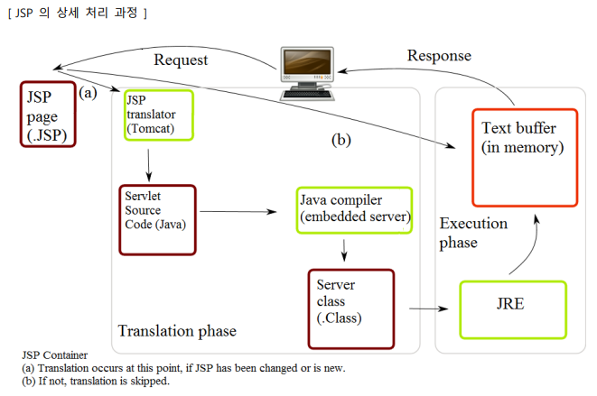
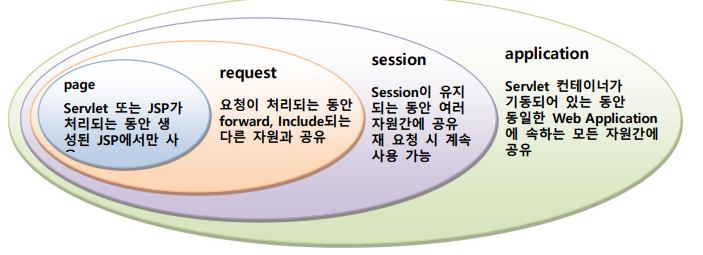
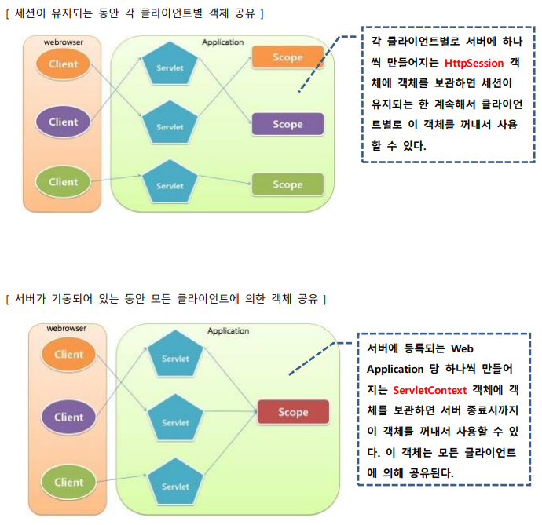

# JSP (JavaServer Pages)
: 1999년에 발표된, HTML 파일 내에 서버상에서 동적 처리하는 부분을 구현하는 기술

- HTML 태그, JSP 태그/내장객체, 약간의 Java 코드로 구현
- servlet으로 구현할 수 있는 모든 기능을 JSP로도 구현할 수 있음
- HTML 문서에 스크립트 방식으로 작성되므로 servlet보다 비교적 구현하기 쉽다
- 실행 후, **Java Servlet으로 변환된 후 수행**되므로 servlet의 수행상 장점이 그대로 지원됨
    - JSP Converter(JSP엔진) : Jasper
- JSTL : JSP 태그 라이브러리
- EL : Expression language. 
- JSP 구현 시 알고 있어야 하는 내용
    - Servlet 프로그래밍
    - JSP 스크립트 태그
    - JSP 액션 태그
    - JSP 내장 객체

=== "Example"
    ``` java
    <%@ page language="java" contentType="text/html; charset=UTF-8" pageEncoding="UTF-8"%>
    <%@ page import="java.time.*, java.util.Date" %>
    <!DOCTYPE html>
    <html>
    <head>
        <meta charset="UTF-8">
        <title>스크립팅 예제</title>
    </head>
    <body>
        <%  // 수행문 태그, 지역 변수 생성
        String name = request.getParameter("name"); 
        java.time.LocalTime lt = java.time.LocalTime.now();
        %>
        <h3> Hello <%= name == null ? "Guest" : name %>! // 표현식
        방문 시간 : <%= lt.getHour()+ "시 " +lt.getMinute() +"분 " +lt.getSecond() +"초" %> </h3>
    </body>
    </html>
    ```
=== "Example-for"
    ``` java
    <% int number = 1000; %> //수행문
    <%=  number %> //표현식

    // 방법 1
    <%
    int dan= Integer.parseInt(request.getParameter("dan"));
    if (dan >= 1 && dan <= 9) {
        for (int i=1;i<=9;i++){
    %>
            <%= dan %> x <%=i %> = <%=dan*i%><br>
    <%	
        }
    %>

    // 방법2
    <%
        for (int i=1; i<=9; i++){
            out.print(dan + " x " + i + " = "  + dan*i + "<br>");	
        }
    } %>
    ```
=== "Example-선언문 태그"
    ``` java
    // trimDirectiveWhitespaces="false" : 선언문 태그에 의한 공백 제거 (false가 default) 
    <%@ page language="java" contentType="text/html; charset=UTF-8" pageEncoding="UTF-8"  trimDirectiveWhitespaces="false"%> 
        ...
    <%! 
        char getKorDay() { //getKorDay() 메서드 생성
            char result=' ';
            int day = new java.util.GregorianCalendar().get(java.util.Calendar.DAY_OF_WEEK);
            switch(day) {
            case 1 : result = '일'; break;
            case 2 : result = '월'; break;
            case 3 : result = '화'; break;
            case 4 : result = '수'; break;
            case 5 : result = '목'; break;
            case 6 : result = '금'; break;
            case 7 : result = '토'; 
            }
            return result;	
    }
    %>
    ```
=== "Example-Error"
``` java
<%@ page isErrorPage="true" %>
<!DOCTYPE html>
...
<%	
    String msg = "오류 원인 : " + exception;	
	System.out.println(msg);
	exception.printStackTrace();
%>
```


#### JSP의 처리구조
: 웹 클라이언트에서 JSP의 실행을 요청하면, 서버의 JSP 컨테이너(컨버터)에 의해 Servlet 소스코드로 변환되고 컴파일된 후 실행 가능한 Servlet 클래스가 된다
<br> Servlet 컨테이너에 의해 객체 생성되어 실행되므로 실행 흐름과 특성은 Servlet 과 동일
<br> JSP 가 Servlet 소스 코드로 변환되는 것은 JSP 가 작성 또는 수정된 후 최초 요청 시에만 처리됨




## JSP 태그

#### 스크립팅 태그
: JSP 페이지에 Java 코드를 끼워 넣을 수 있게 하는 태그 

- `<%-- --%>` : 주석문 태그
- `<%@  %>` : 지시자 태그
- `<%  %>` : 스크립트릿(수행문) 태그. Java 코드 포함. 여기서 선언된 변수는 **지역변수** . Java API를 이용하거나 기타 Java 를 이용한 소스 코드를 작성
- `<%!  %>` : 선언문(멤버변수 선언, 메서드 정의) 태그. Java 코드 포함. JSP 페이지 내부에서 사용할 멤버 변수나 메서드를 선언
- `<%=  %>` : 표현식(literal, variable, 메서드 호출 등) 태그. Java 코드 포함.  동적 데이터를 응답 정보에 추가하기 위한 식을 정의

#### 액션 태그

- `<jsp:include page="…" />` : JSP 페이지의 수행 결과 내에 다른 자원의 내용 또는 수행 결과를 포함한다.
- `<jsp:forward page="…" />` : 요청된 JSP 대신 다른 자원의 내용 또는 수행 결과를 대신 클라이언트로 응답
- `<jsp:useBean id="…" class="…" scope="…" />` :star: : 주어진 JavaBeans 클래스의 객체를 생성하거나 이미 생성된 객체를 추출
- `<jsp:setProperty name="…" property="…" />` :star: : JavaBeans 객체의 프로퍼티에 값을 설정한다. 
- `<jsp:getProperty name="…" property="…" />` :star: : JavaBeans 객체의 프로퍼티 값을 추출한다. 
- ~~`<jsp:plugin …… />`~~ : JSP 의 수행 결과 안에 Applet 을 수행시키고 결과를 포함
- `<jsp:param name="…" value="…" />`

``` java
<jsp:forward page="{relativeURL |'${' Expression'}' | <%= expression %>}" />
<jsp:forward page="{relativeURL | '${' Expression'}' | <%= expression %>}" { >
[<jsp:param name="parameterName" value="{parameterValue | '${' Expression '}' | <%= expression %>}" }/> ]+ </jsp:forward>}

<jsp:include page="{relativeURL | '${' Expression'}' | <%= expression %>}" [ flush="true| false" ] />
<jsp:useBean id=”name” scope=”page|request|session|application” class=”className” />
<jsp:getProperty name=”name” property=”property”>
<jsp:setProperty name=”beanName” prop_expr />
prop_expr ::= property=”*” |
property=”propertyName” |
property=”propertyName” param=”parameterName” |
property=”propertyName” value=”propertyValue”
propertyValue ::= string
```

## JSP 내장 객체
: Expression 태그와 Scriptlets 태그에서 스크립트 코드를 심플하게 작성할 수 있도록 지원하는 객체

- 내장 객체의 선언 및 초기화는 JSP 컨테이너가 JSP 소스를 Servlet 소스 코드로 변환하는 과정에서 자동적으로 추가한다
- JSP 에서 사용되는 객체의 클래스는 반드시 패키지화 되어야 하지만, 내장 객체는 이러한 과정이 필요치 않다

|  객체변수  |  클래스 및 인터페이스  |   설명   |
| :-------: | :-------------------: | :-----: |
| :star: request | http.HttpServletReuqest | 클라이언트에서 전송되는 다양한 요청 데이터 추출 |
| :star: response| http.HttpServletResponse | 응답 시 필요한 기능을 제공 |
| pageContext | jsp.PageContext | 페이지가 처리되는 시점에서의 외부 환경 데이터 추출 |
| :star: session | http.HttpSession | 클라이언트 별로 생성되는 HttpSession 객체 |
| :star: application | ServletContext | application scope 객체 생성과 관리 |
| config | ServletConfig | Servlet 구성 데이터 추출 |
| :star: out | jsp.JspWriter | 응답용 출력 스트림 |
| page | jsp.HttpJspPage | 페이지의 Servlet 인스턴스 |
| :star: exception | java.lang.Throwable  | 생성된 예외 객체를 참조 |

``` java
<%@ page language="java" contentType="text/html; charset=UTF-8" pageEncoding="UTF-8" import="java.util.Date"%>
...
[ request ]
getMethod() : <%=  request.getMethod()  %> //GET
getRequestURI() : <%=  request.getRequestURI()  %> // /edu/jspexam/exam10.jsp

// Mozilla/5.0 (Windows NT 10.0; Win64; x64) AppleWebKit/537.36 (KHTML, like Gecko) Chrome/117.0.0.0 Safari/537.36
getHeader("user-agent") : <%=  request.getHeader("user-agent")  %>  

[ application ]
getContextPath() : <%=  application.getContextPath()  %> // /edu
getServletContextName() : <%=  application.getServletContextName()  %> // null
getServerInfo() : <%=  application.getServerInfo()  %> // Apache Tomcat/9.0.80
getMajorVersion() : <%=  application.getMajorVersion()  %> // 4
getSessionTimeout() : <%=  application.getSessionTimeout()  %> // 30

[ session ]
getId() : <%=  session.getId()  %> // 25E3817F22A8EFC6B1496BDFFEB0BE6E
getCreationTime() : <%=  new Date(session.getCreationTime())  %> // Tue Sep 26 14:07:26 KST 2023

[ response ]
getStatus() : <%=  response.getStatus() %> // 200
getBufferSize() : <%=  response.getBufferSize() %> // 8192
getContentType() : <%=  response.getContentType() %> // text/html;charset=UTF-8
<H4>Web Application(/edu) 디렉토리의 파일 리스트 </H4>
<% 
java.util.Set<String> list = application.getResourcePaths("/");
if (list != null) {
   Object obj[] = list.toArray();
   for(int i=0; i < obj.length; i++) {
      out.print(obj[i]+", "); // /csslab1.html, /images/, /jspexam/, ...
   }
}
%>
```

## 지시자 태그
: JSP를 Servlet으로 변환할 때 지시하고자 하는 내용을 정의하는 태그

- page 지시자 : `<%@page {attr = value ..} %>`
- include 지시자 : `<%@include {attr = value ..} %>`
- taglib 지시자 : `<%@taglib {attr = value ..} %>`
- tag 지시자 : `<%@tag {attr = value ..} %>`
- variable 지시자 : `<%@variable {attr = value ..} %>` 
- attribute 지시자 : `<%@attribute {attr = value ..} %>` 

### page 지시자 태그 :star:
: 컨테이너가 참조하는 다양한 정보 중 JSP 페이지에 종속적인 설정 정보들을 알려주기 위한 수단
<br> 해당 JSP가 어떤 문서를 생성하는지, 어떤 JAVA 클래스를 사용하는지, 세션에 참여하는지 등을 지정

``` java
<%@ page [ language="java" ]
[ extends="package.class" ]
[ import="{package.class | package.*}, ..." ] 🐳
[ session="true|false" ] 
[ buffer="none|8kb|sizekb" ] // default는 8kb
[ autoFlush="true|false" ]
[ isThreadSafe="true|false" ]
[ info="text" ]
[ errorPage="relativeURL" ] // relativeURL : 같은 웹 프로젝트 내에서만 적용 가능 
[ contentType="mimeType [ ; charset=characterSet ]" |
 "text/html ; charset=ISO-8859-1" ] // 한국어는 text/html에 utf-8이 기본 설정
[ isErrorPage="true|false" ] // 에러 처리를 전담하는 JSP임을 선언 (exception 내장 객체 사용 가능해짐)
[ pageEncoding="characterSet | ISO-8859-1" ] // 해당 JSP가 어떤 encoding을 사용하는지 지정
[ isELIgnored="true|false"]
%>
```

### include 지시자 태그 :star:
: 반복되는 일정한 Java 코드나 정적데이터를 파일로 저장하고, 필요한 JSP페이지에서 불러쓸 때 사용


=== "exam9.jsp"
    ``` jsp
    <%@  include  file="part1.jspf"  %>

    ```
=== "part1.jspf"
    ``` 
    <%@  page pageEncoding="UTF-8"  %>
    <div>
    include 지시자에 의해 포함된 내용입니다.
    </div>
    ```

### Get, POST
: JSP는 Get, POST를 구분하지 않으므로 if, else 를 이용해서 구분

``` jsp
<body>
	<% if (request.getMethod().equals("GET")) { %>
		<h2>원하는 컬러와 날짜를 선택하세요</h2>
		<form method="post" action="/edu/jspexam/exam11.jsp">
			칼라 : <input type="color"  name="fcolor" ><br>
			날짜 : <input type="date"  name="fdate"><br>
			<input type="submit" value="전송">
		</form>
	<% } else { %>	
			<script>
				document.body.style.backgroundColor = '<%= request.getParameter("fcolor") %>';
			</script>
			<h2>선택 날짜는 <%= request.getParameter("fdate") %> 이네요..</h2>
	<% } %>
</body>
```

## EL
: 특정 스코프 영역에 보관되어 있는 객체를 추출하여 이 객체의 값 또는 속성값을 추출하여 표현하고자 하는 경우 사용 (표현식 태그를 대체함)

#### 내장 객체

- pageContext :star: - PageContext 객체
- pageScope - page 스코프에 포함된 객체들
- requestScope - request 스코프에 포함된 객체들
- sessionScope - session 스코프에 포함된 객체들
- applicationScope - application 스코프에 포함된 객체들
- param - HTTP의 파라메터들
- paramValues - 한 파라메터의 값들
- header - 헤더 정보들
- headerValues - 한 헤더의 값들
- cookie – 쿠키들
- initParam - 컨텍스트의 초기화 파라미터들


``` jsp
<% out.println(request.getParameter(“q”)); %> // 수행문 태그
<%= request.getParameter(“q”) %> // 표현식 태그

${param.q}  // EL
${param["q"]}

<!-- \$은 문자열로 처리, $은 EL식으로 처리 -->
\${ 10 eq 10 } : ${ 10 eq 10 }<br> <!-- true -->
\${ 10 lt 10 } : ${ 10 lt 10 }<br> <!-- false -->
\${ 10 gt 10 } : ${ 10 gt 10 }<br> <!-- false -->
\${ 10 le 10 } : ${ 10 le 10 }<br> <!-- true -->
\${ 10 ge 10 } : ${ 10 ge 10 }<br> <!-- true -->
\${10 > 5?'A':'B'} : ${10 > 5?'A':'B'}<br> <!-- A -->
\${100 + 200 + 300 } : ${100 + 200 + 300 }<br> <!-- 600 -->
\${100 += 200 += 300 } : ${100 += 200 += 300 }<br> <!-- 100200300 : 문자열 결합 연산 += -->

전달된 메시지의 존재 여부 : ${ !empty param.message }<hr> <!-- !empty : 비어있으면 true, 아니면 false -->

<!-- EL은 name이라는 이름으로 보관된 데이터를 뜻하기 때문에(setAttribute), name이라는 변수값을 출력하지 않음 -->
name 변수의 값 : ${name}<br> <!--  -->
<% String name="듀크"; %>
name 변수의 값(표현식 태그) : <%= name %><br> <!-- 듀크  -->
name 변수의 값(EL) : ${name}<br> <!--  -->
```
- EL이 데이터를 찾아가는 순서 : page scope -> request -> session -> application
- 변수명.xxx
    1. 변수의 참조 대상이 일반 Java 객체 : getXxx()를 호출한 결과
    2. 변수의 참조 대상이 Map 객체 : get("xxx")를 호출한 결과


---

## JSTL
: JSP 커스텀태그의 표준
<br> 코어 라이브러리, 포맷팅 라이브러리, XML 라이브러리:star:, SQL 라이브러리


---
## 객체 공유

- Page Scope : Servlet 또는 JSP가 수행되는 동안만 유효한 객체가 된다.
- Request Scope : Web 클라이언트로 부터의 요청이 끝날 때까지 유효한 객체가 된다.
     - HttpServletRequest 객체에 객체를 보관
- Session Scope : 요청을 보내온 Web 클라이언트가 기동되어 있는 동안 유효한 객체가 된다. (클라이언트별 세션)
    - HttpSession 객체에 객체를 보관
- Application Scope : 서버가 기동되어 있는 동안 유효한 객체가 된다. (모든 클라이언트 공유)
    - ServletContext 객체에 객체를 보관

- public void setAttribute(String key, Object value)
- public Object getAttribute(String key)
- public void removeAttribute(String key)



=== "ShareObjectServlet.java"
``` java
@WebServlet("/shaere")
public class ShareObjectServlet extends HttpServlet {
	private static final long serialVersionUID = 1L;
	protected void doGet(HttpServletRequest request, HttpServletResponse response) throws ServletException, IOException {

		request.setAttribute("myRequest", "요청동안 공유하는 객체"); // request scope - 요청 동안만 세션 유지
		request.getSession().setAttribute("mySession", "세션 객체가 유지되는 동안 공유하는 객체"); // session scope - 브라우저가 살아있는 동안만 세션 유지
		getServletContext().setAttribute("myApp", "서버가 기동되는 동안 공유하는 객체"); // application scope - 서버 죽을때까지 세션 유지

		request.getRequestDispatcher("/jspexam/shareexam.jsp").forward(request,  response);

	}
}
```
=== "shareexam.jsp"
    ``` jsp
    <body>
        <h1> 서블릿에서 보관된 객체 추출</h1>
        <hr>  
        <h3> request scope: <%= request.getAttribute("myRequest") %></h3>
        <h3> session scope: <%= session.getAttribute("mySession") %></h3>
        <h3> application scope: <%= application.getAttribute("myApp") %></h3> 
        
        <!-- el은 값이 없을때, null 대신 공백 반환 -->
        <hr>  
        <h3> request scope: ${requestScope.myRequest}</h3>
        <h3> session scope: ${sessionScope.mySession}</h3>
        <h3> application scope: ${applicationScope.myApp}</h3> 
        
        <hr>  
        <h3> request scope: ${myRequest}</h3>
        <h3> session scope: ${mySession}</h3>
        <h3> application scope: ${myApp}</h3> 
    </body>
    ```
- request scope :  A와 B가 forward 또는 include 관계에 있는 경우, A 가 생성하는 객체를 HttpServletRequest 객체에 보관하면 B 에서 추출할 수 있다. 요청이 끝나면 사라진다.
- session scope : 각 클라이언트별로 서버에 하나씩 만들어지는 HttpSession 객체에 객체를 보관하면 세션이 유지되는 한 계속해서 클라이언트별로 이 객체를 꺼내서 사용할 수 있다. 
- application scope : 서버에 등록되는 Web Application 당 하나씩 만들어지는 ServletContext 객체에 객체를 보관하면 서버 종료시까지 이 객체를 꺼내서 사용할 수 있다. 이 객체는 모든 클라이언트에 의해 공유된다.

