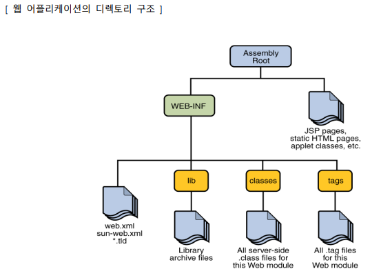

# MVC + Java

## domain

### VO

### DTO

## Java EE 기반의 웹 어플리케이션
: Java EE(Enterprise Edition) 환경에서 Servlet 과 JSP 는 웹 컨테이너(엔진이라고도 함)에 의해 관리되고 수행되는 웹 컴포넌트로서 여러 웹 컴포넌트들이 모여 하나의 웹 어플리케이션을 구성한다

- Servlet: 상속 구문과 메서드 오버라이딩 구문을 적용한 Java 로 구현된 프로그램으로서 수행 결과를 HTML로 응답하도록 구현하는 기술
- JSP : HTML 문서 안에 JSP 태그와 동적인 처리를 담당하는 Java 코드를 삽입하여 구현하는 기술

- JSP : 스크립팅방식
- JSP + 자바클래스(자바빈) : 모델1
- **C**-Servlet + **V**-JSP + **M**-자바클래스(자바빈) : 모델2(MVC)
- Web Server(HTTP Server) + Application Server --> Web Application Server(WAS)

