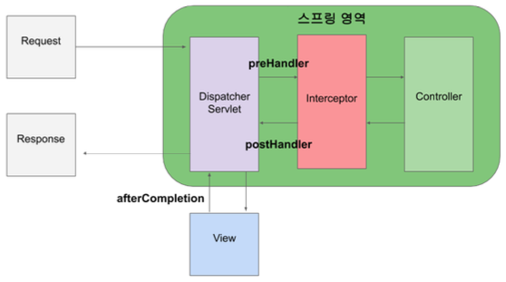
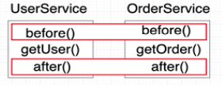
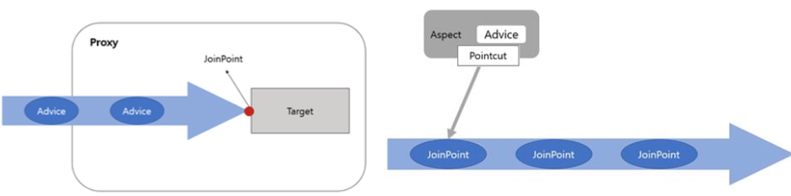
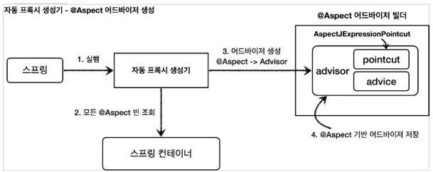
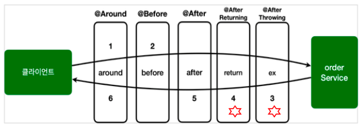
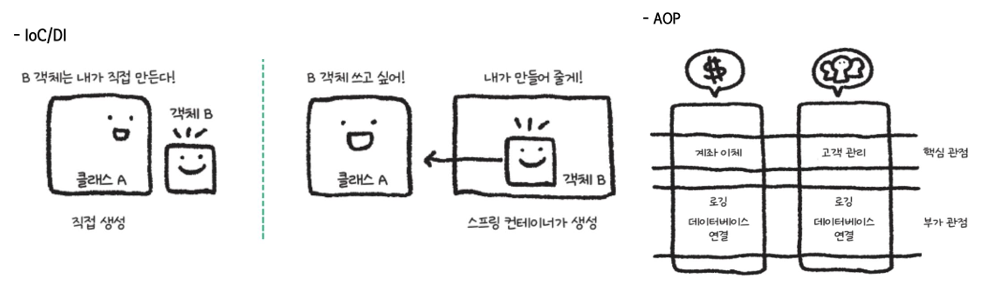
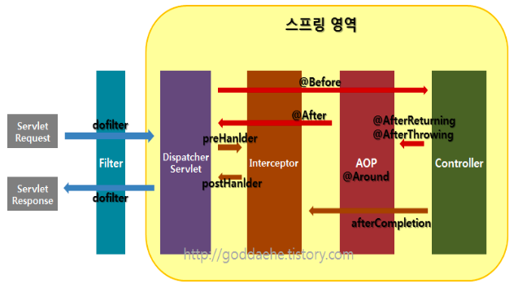

# Sprint Boot Advanced

## @Service
``` java title="Example"
package com.example.springedu.service;
import org.springframework.stereotype.Service;
import com.example.springedu.domain.FriendDTO;

@Service
public class FriendService {
	public FriendDTO get(int num) {
		FriendDTO vo = null;
		if (num == 10) {
			vo = new FriendDTO();
			vo.setPhoneNum("010-1111-2222");
			vo.setName("Dooly");			
		}
		return vo;
	}
}
```

---
## Spring Scheduling(TASK)

: 특정 시간에 반복적으로 처리되는 코드를 스케줄링 할 수 있으며 이때 반복되는 코드를 Task라 한다

### Setting

1. [Spring.io](https://start.spring.io)
    - Dependencies에 Quartz Scheduler 추가
    - EXPLOR -> build.gradle 추가
    ```gradle
    dependencies {
        implementation 'org.springframework.boot:spring-boot-starter-quartz'
        testImplementation 'org.springframework.boot:spring-boot-starter-test'
    }
    ```
2. [mvnrepository](https://mvnrepository.com)

### Use
: 설정된 Scheduling에 맞춰 호출되는 Task Method 앞에 `@Scheduled`라는 어노테이션 제시한 다음 속성 정의

- `cron` : CronTab에서의 설정과 같이 cron="0/10 * * * * ?" 과 같은 설정 가능
- `fixedDelay` : 이전에 실행된 Task의 종료시간으로 부터 정의된 시간만큼 지난 후 Task 실행
- `fixedRate` : 이전에 실행된 Task의 시작시간으로 부터 정의된 시간만큼 지난 후 Task 실행

``` java title="Example"
package com.example.springedu.service;
import org.springframework.scheduling.annotation.Scheduled;
import java.text.SimpleDateFormat;
import java.util.Calendar;

//@Component
public class SpringSchedulerTest {	
	//@Scheduled(cron = "10 08 18 * * 2")// 초, 분, 시, 일, 월, 요일(0:일요일)
	@Scheduled(fixedDelay = 5000) // 5초에 한 번씩
	public void scheduleRun() {
		Calendar calendar = Calendar.getInstance();
		SimpleDateFormat dateFormat = 
				new SimpleDateFormat("yyyy-MM-dd HH:mm:ss");
		System.out.println("**** 스케줄 실행 : " + 
				dateFormat.format(calendar.getTime()));	
	}
}
```

### Cron

|  시간  |  단위  | |  기호  |  의미  |
| :----:| :---: | :--: | :--: | :--: |
| Seconds | 0 ~ 59 | | ? | Day of Month, Day of Week에만 사용 특별한 값이 없음을 의미 |
| Minutes | 0 ~ 59 | | - | 기간 설정 |
| Hours | 0 ~ 23 | | , | 특정 시간 설정 |
| Day of Month | 1 ~ 31 | | / | 증가 표현 |
| Month | 1 ~ 12 | | L | Day of Month, 마지막날에 실행하라는 의미 | 
| Day of Week | 1 ~ 7 (일요일~토요일) | | W | Day of Month, 가장 가까운 평일을 의미 | 
| Years(optional) | 1970 ~ 2099 | | LW | L+W, 그 달의 마지막 평일 |
| | | | # | Day of Week, 6#3의 경우 3번째 주 금요일 실행 
| | | | * | 모든 수, Minutes일때 매분마다를 의미 |


---
## 오류 처리
: @ExceptionHandler, @ControllerAdvice 둘 다 존재할 때는 더 가까운 @ExceptionHandler 수행

### @ExceptionHandler
: 에러나 예외를 지역적으로 처리하며 컨트롤러 클래스마다 각각 정의된다
<br>- 컨트롤러에서 정의한 메서드(@RequestMapping)에서 기술한 예외가 발생되면 자동으로 받아냄
<br>- 이를 이용하여 컨트롤러에서 발생하는 예외를 View단인 JSP나 타임리프로 보내서 처리할 수 있다

``` java title="Example"
package com.example.springedu.controller;
import ...

@Controller
public class ExceptionLocalController {

	@Autowired
	FriendService ms;

    @RequestMapping("/exceptionTest")
	public String detail(int num, Model model) throws FriendNotFoundException {
		FriendDTO vo = ms.get(num);
		if (vo == null) {
			throw new FriendNotFoundException();
		}
		model.addAttribute("friend", vo);
		return "friendView";
	}

	@ExceptionHandler(MethodArgumentTypeMismatchException.class)
	public ModelAndView handleTypeMismatchException(MethodArgumentTypeMismatchException ex) {
		System.out.println("TypeMismatchException 발생시 처리하는 핸들러가 오류 처리합니다.");
		ModelAndView mav = new ModelAndView();
		mav.addObject("msg", "타입을 맞춰주세용!!");
		mav.setViewName("errorPage");
		return mav;
	}

	@ExceptionHandler(FriendNotFoundException.class)
	public String handleNotFoundException() throws IOException {
		System.out.println("FriendNotFoundException 발생시 처리하는 핸들러가 오류 처리합니다.");
		return "noFriend";
	}

	@ExceptionHandler(IllegalStateException.class)
	public ModelAndView handleIllegalStateException() throws IOException {
		System.out.println("IllegalStateException 발생시 처리하는 핸들러가 오류 처리합니다.");
		ModelAndView mav = new ModelAndView();
		mav.addObject("msg", "num=숫자 형식의 쿼리를 전달하세요!!");
		mav.setViewName("errorPage");
		return mav;
	}
}

```

### @ControllerAdvice
: 스프링 3.2 이상에서 사용 가능, @Controller/@RestController 에서 발생하는 예외 등을 catch
<br> -> 예외처리를 전담하는 클래스 생성

- 클래스 위에 @ControllerAdvice를 붙이고, 어떤 예외를 잡아낼 것인지 내부 메서드를 선언하여 메서드 상단에 `@ExceptionHandler(예외클래스명.class)`와 같이 기술
``` java title="Example"
// 모든 RuntimeException에 대해 적용
package com.example.springedu.service;
import ...

@ControllerAdvice
public class CommonExceptionHandler {
    @ExceptionHandler(RuntimeException.class)
    private ModelAndView errorModelAndView(Exception ex) {
       ModelAndView modelAndView = new ModelAndView();
       modelAndView.setViewName("commonErrorPage");
       modelAndView.addObject("exceptionInfo", ex );
       return modelAndView;
   }
}
```

---
## Spring Websocket


|    코드    |    설명    |
| :-------: | :-------: |
| HTML5가 제공하는 WebSocket 객체를 통해 서버 연결 수행  | |
| `let ws = new WebSocket("웹 소켓 URL 문자열");` | 일반 통신 <br> 웹 소켓 URL 문자열 : `ws://서버주소/웹 소켓 서버 프로그램의 매핑명` |
| `let wss = new WebSocket("웹 소켓 URL 문자열");` | 보안 통신은 wss 프로토콜 이용 <br> 웹 소켓 URL 문자열 : `wss://서버주소/웹 소켓 서버 프로그램의 매핑명` |
| | |
| 데이터 송신 | |
| `ws.send ("전송하려는 메시지")` | WebSocket 객체의 send() 메서드로 데이터를 서버로 송신 |
| | |
| 데이터 수신 | |
| `ws.onmessage = function(e) { e.data로 추출하여 수신받은 메시지 처리}` | 서버에서 전송되는 데이터 수신을 위해 **message 이벤트** 구현 |
| | |
| 웹소켓 이벤트 | |
| `ws.onopen = function(e) { 핸들러 }` | 웹 소켓 서버와 접속이 일어나면 발생하는 이벤트 |
| `ws.onclose = function(e) { 핸들러 }` | 웹 소켓 서버와 접속이 해제되면 발생되는 이벤트 |
| `ws.onerror = function(e) { 핸들러 }` | 웹 소켓 오류가 생기면 발생되는 이벤트 |
| `ws.onmessage = function(e) { 핸들러 }` | 웹 소켓 서버로 부터 메시지가 수신되면 발생되는 이벤트 |

- **@ServerEndpoint** 어노테이션이 선언되어 있는 클래스
- **WebSocketConfig** 웹 소켓 환경 설정 파일
: Spring에서 Bean은 싱글톤으로 관리되지만, @ServerEndpoint 클래스는 WebSocket이 생성될 때마다 인스턴스가 생성되고 관리되기 때문에 Spring의 @Autowired가 설정된 멤버들이 초기화 되지 않는다. 따라서 클라이언트로부터 웹 소켓 접속이 요청될 때마다 @ServerEndpoint 클래스의 객체를 생성해 줄 초기화 클래스의 Bean 등록 필요


=== "html"
    ``` html
    <!DOCTYPE html>
    <html xmlns:th="http://www.thymeleaf.org">
    <head>
    <meta charset="UTF-8">
    <title>Insert title here</title>
    <link rel='stylesheet' type='text/css' href='/css/chatt.css'>
    </head>
    <body>
        <div id='chatt'>
            <h1>웹 소켓 채팅</h1>
            <input type='text' id='mid' value='게스트'>
            <input type='button' value='채팅참여' id='btnJoin'>
            <br/>
            <div id='talk'></div>
            <div id='sendZone'>
                <textarea id='msg' >안녕...</textarea>
                <input type='button' value='전송' id='btnSend'>
            </div>
        </div>
    </body>
    </html>
    ```
=== "js"
    ``` js hl_lines="16 18 27 28 29 30 72"

	function getId(id){
		return document.getElementById(id);
	}
	let data = {};//전송 데이터(JSON)

	let ws ;
	let mid = getId('mid');
	let btnJoin = getId('btnJoin');
	let btnSend = getId('btnSend');
	let talk = getId('talk');
	let msg = getId('msg');
	let myclose = false;

	btnJoin.onclick = function(){
	   if (btnJoin.value == '채팅참여') {
			ws = new WebSocket("ws://" + location.host + "/chatt");
		
			ws.onmessage = function(msg){
				let data = JSON.parse(msg.data);
				let css;
			
				if(data.mid == mid.value){
					css = 'class=me';
				}else{
					css = 'class=other';
				}
				let item = `<div ${css}>
			               <span><b>${data.mid}</b></span> [ ${data.date} ]<br/>
	                       <span>${data.msg}</span>
						   </div>`;
		    	console.log("R:"+item);
				talk.innerHTML += item;
				talk.scrollTop=talk.scrollHeight;//스크롤바 하단으로 이동
			}
			ws.onclose = function() {
				btnJoin.style.color = 'black';
				btnJoin.value = '채팅참여';
				if (myclose) {
					alert("서버와의 채팅을 끝냅니다.");
					myclose = false;
				}else
					alert("일정 시간 동안 통신을 하지 않아 자동으로 클로즈 됩니다.");
			}
			btnJoin.style.color = 'blue';
			btnJoin.value = '채팅참여중';
	  } else {
	  		btnJoin.style.color = 'black';
			btnJoin.value = '채팅참여';
			myclose = true;
	  		ws.close();
	  }
	}

	msg.onkeyup = function(ev){
		if(ev.keyCode == 13){
			send();
		}
	}

	btnSend.onclick = function(){
		send();
	}

	function send(){
		if(msg.value.trim() != '' && ws && ws.readyState == ws.OPEN){
			data.mid = getId('mid').value;
			data.msg = msg.value;
			data.date = new Date().toLocaleString();
			let temp = JSON.stringify(data);
			console.log("S:"+temp);

			ws.send(temp);
		}
		msg.value ='';		
	}
	window.onunload = function() {
		console.log("종료");
		ws.close();
	}
    ```
=== "WebSocketConfig"
    ``` java hl_lines="5"
    @Component
    public class WebSocketConfig {
            @Bean
            public ServerEndpointExporter serverEndpointExporter() {
                return new ServerEndpointExporter();
            }
    }
    ```
=== "java"
    ``` java
    @Service
    @ServerEndpoint(value="/chatt")
    public class WebSocketChatt {
        private static Set<Session> clientSet = 
                            Collections.synchronizedSet(new HashSet<Session>());
        @OnOpen
        public void onOpen(Session s) {
            if(!clientSet.contains(s)) {
                clientSet.add(s);
                s.setMaxIdleTimeout(60000);
                System.out.println("[세션 오픈] " + s);
            }else {
                System.out.println("이미 연결된 세션임!!!");
            }
        }
        
        @OnMessage
        public void onMessage(String msg, Session session) throws Exception{
            System.out.println("[수신 메시지] " + msg);
            for(Session s : clientSet) {
                System.out.println("[송신 메시지] " + msg);
                s.getBasicRemote().sendText(msg);
            }		
        }
        
        @OnClose
        public void onClose(Session s) {
            System.out.println("[세션 종료] " + s);
            try {
                s.close();
            } catch(Exception e) {}
            clientSet.remove(s);
        }
    }
    ```

---
## Builder Pattern
: 복잡한 객체 생성 과정과 표현 방법을 분리하여 다양한 구성의 인스턴스를 만드는 생성 패턴

별도의 Builder 클래스를 만들어 메소드를 통해 step-by-step 으로 값을 입력받은 후에 최종적으로 build() 메소드로 하나의 인스턴스를 생성하여 리턴하는 패턴

- 생성자 오버로딩 열거 X
- 데이터의 순서에 상관없이 객체를 생성하므로 생성자 인자 순서를 파악할 필요 X
- 잘못된 값을 넣는 실수 X


=== "Lombok"
	``` java
	// Person 클래스
	@Builder // Xxx.Builder 클래스와 이를 반환하는 builder() 메서드, 맴버 변수명의 메서드 생성
	@AllArgsConstructor(access = AccessLevel.PRIVATE) // @Builder 어노테이션을 선언하면 전체 인자를 갖는 생성자를 자동으로 만드는데, 이를 private 생성자로 설정
	@ToString // toString() 메서드 자동 생성
	class Person {
		// 필수 매개변수
		private final String name; 
		private final String age; 
		// 선택 매개변수
		private final String gender; 
		private final String job;

		public static PersonBuilder builder(String name, String age) { 
			// 빌더의 파라미터 검증
			if(name == null || age == null) {
				throw new IllegalArgumentException("필수 파라미터 누락"); } 
			return new PersonBuilder().name(name).age(age); } // 필수 파라미터를 미리 빌드한 빌더 객체를 반환 (지연 빌더 원리)
	}
	// Main 클래스
	public static void main(String[] args) {
		Person person = Person.builder("또치", 10).gender("female").job("학생").build();
	}
	```
=== "Vanila"
	``` java 
	// Student 클래스
	class Student {
		private int id;
		private String name = "학생";
	}
		public Student(int id, String name){
			this.id = id;
			this.name = name;
		}
	// Builder 클래스
	class StudentBuilder{
		private int id;
		private String name;

		public StudentBuilder id(int id){
			this.id = id;
			return this;
		}

		public StudentBuilder name(int name){
			this.name = name;
			return this;
		}

		public Student build(){
			return new Student(id, name);
		}
	}
	// Main 클래스
	public static void main(String[] args) {
		Student student = new StudentBuilder().id(123456789).name("둘리").build();
	}
	```
- `@Builder` : GOF의 디렉터 빌더가 아닌 심플 빌더 패턴

---
## 로깅 Logging


- LogBack : 가장 많이 사용되었던 로깅 라이브러리인 Log4j 의 후속 버전인 Java 의 오픈 소스 Logging Framework ([Log4J 의 보안 취약점](https://www.lgcns.com/blog/cns-tech/security/22605/77))

### Level
: TRACE < DEBUG < INFO < WARN < ERROR

- ERROR : 요청을 처리하는 중 **오류가 발생한 경우** 표시
- WARN : 처리 가능한 문제,향후 시스템 에러의 원인이 될 수 있는 경고성 메시지
- INFO : 상태 변경과 같은 정보성 로그
- DEBUG : 프로그램을 디버깅하기 위한 정보
- TRACE : Debug 보다 훨씬 상세한 정보

### Setting

**1. application.properties**

``` properties
# 루트레벨(전체레벨)전체 로깅 레벨 지정 (default: info)
logging.level.root=info 

# 패키지별로 로깅 레벨 지정
logging.level.org.springframework.web=info
logging.level.com.example.springedu=debug
logging.level.thymeleaf.exam=trace
```

**2. resources에 `logback-spring.xml` 파일 생성**

- LogBack 이용에 필요한 주요 설정요소로는 Logger, Appender, Encoder 등이 있다
- Dynamic Reloading 기능을 지원한다 <br>(ex. 60초 주기로 logback-spring.xml의 변화를 검사하고 바뀌었으면 프로그램 갱신)
- 대소문자를 구별하지 않음
- name attribute를 반드시 지정

``` xml
<?xml version="1.0" encoding="UTF-8"?>
<configuration>
    <property name="LOGS_ABSOLUTE_PATH" value="./logs" />

    <appender name="STDOUT" class="ch.qos.logback.core.ConsoleAppender">
        <layout class="ch.qos.logback.classic.PatternLayout">
            <pattern>[%d{yyyy-MM-dd HH:mm:ss}][%thread] %-5level %logger{36} - %msg%n</pattern>
        </layout>
    </appender>

    <appender name="FILE" class="ch.qos.logback.core.FileAppender">
        <file>${LOGS_ABSOLUTE_PATH}/mylogback.log</file>
        <encoder>
            <pattern>[%d{yyyy-MM-dd HH:mm:ss}] %-5level %logger{35} - %msg%n</pattern>
        </encoder>
    </appender>

    <appender name="ROLLINGFILE" class="ch.qos.logback.core.rolling.RollingFileAppender">
        <encoder>
            <pattern>[%d{yyyy-MM-dd HH:mm:ss}:%-3relative][%thread] %-5level %logger{35} - %msg%n</pattern>
        </encoder>
        <rollingPolicy class="ch.qos.logback.core.rolling.TimeBasedRollingPolicy">
            <fileNamePattern>${LOGS_ABSOLUTE_PATH}/logback.%d{yyyy-MM-dd}.log</fileNamePattern>
        </rollingPolicy>
    </appender>

    <root level="INFO">
        <appender-ref ref="STDOUT" />
    </root>

    <logger name="com.example.springedu.controller.LogTestController1" level="DEBUG">
        <appender-ref ref="STDOUT" />
        <appender-ref ref="ROLLINGFILE" />
    </logger>
    <logger name="com.example.springedu.controller.LogTestController2" level="TRACE" additivity="false">
        <appender-ref ref="STDOUT" />
        <appender-ref ref="FILE" />
    </logger>
</configuration>
```

**:material-numeric-1-box-multiple-outline: appender** : 로그 메시지가 출력될 대상을 결정하는 요소

|   class  |   의미   |
| :------: | :-----: |
| `ch.qos.logback.core.ConsoleAppender` | 로그를 OutputStream에 작성하여 콘솔에 출력 |
| `ch.qos.logback.core.FileAppender` | 파일에 로그를 찍음, 최대 보관 일 수 등 지정 가능 |
| `ch.qos.logback.core.rolling.RollingFileAppender` | 여러 개의 파일을 롤링, 순회하면서 로그 작성 <br> (지정 용량이 넘어간 로그 파일을 넘버링하여 나누거나 <br> 일별로 로그 파일을 생성하여 저장 가능) |
| `ch.qos.logback.classic.net.SMTPAppender` | 로그를 메일로 전송 |
| `ch.qos.logback.classic.db.DBAppender` | DB(데이터베이스)에 로그를 저장 |

**%logger** 

|   %logger  |   출력   |
| :------: | :-----: |
| `%logger` | mainPackage.sub.sample.Bar |
| `%logger{0}` | Bar |
| `%logger{5}` | m.s.s.Bar |
| `%logger{10}` | m.s.s.Bar |
| `%logger{15}` | m.s.sample.Bar |
| `%logger{16}` | m.sub.sample.Bar |
| `%logger{26}` | mainPackage.sub.sample.Bar |

**:material-numeric-2-box-multiple-outline: root와 logger**
: package와 level을 설정하고, appender를 참조하게 정의

- root : 전역 로거 설정, 항상 마지막에 수행되는 기본 로거
- logger : 지역 로거 설정, **additivity 속성으로 root 설정을 마저 수행할 것인지**의 여부 결정 가능 (default = true)

**:material-numeric-3-box-multiple-outline: property** : 설정파일에서 사용될 변수값 선언

**:material-numeric-4-box-multiple-outline: layout과 encoder** 

- layout : 로그의 출력 포맷 지정 [참고](https://logback.qos.ch/manual/layouts.html)
- encoder : Appender에 포함되며, 출력될 로그메시지를 원하는 형식으로 변환하는 역할 <br>(FileAppender 에서는 encoder를 사용하여 layout 설정)

**:material-numeric-5-box-multiple-outline: file** : 기록할 파일명과 경로 설정

|   class  |   의미   |
| :------: | :-----: |
| rollingPolicy class | |
| `ch.qos.logback.core.rolling.TimeBasedRollingPolicy` | 일자별 적용 |
| `ch.qos.logback.core.rolling.SizeAndTimeBasedFNATP` | 일자별 + 크기별 적용 |
| | |
| fileNamePattern | 파일 쓰기가 종료된 log 파일명의 패턴 지정 <br> `.gz`나 `.zip`으로 자동 압축 가능 |
| maxFileSize | 한 파일당 최대 파일 용량 지정 (최대 10MB 내외 권장) <br> KB, MB, GB 지정 가능 <br> RollingFile 이름 패턴에 .gz 이나 .zip 을 입력할 경우 로그파일을 자동으로 압축 |
| maxHistory | 최대 파일 생성 개수 <br> (ex. maxHistory 가 30 이고 Rolling 정책을 일 단위로 하면 30 일동안만 저장되고, 월 단위로 하면 30 개월간 저장) | 

**:material-numeric-6-box-multiple-outline: pattern** 

|   pattern  |   의미   |   pattern   |   의미   | 
| :------: | :-----: | :-----------: | :-----: |
| `%logger{length}` | logger name 축약 | `%-5level` | 로그 레벨 <br>(-5 는 출력의 고정폭 값(5 글자)) |
| `%msg` | 로그 메세지 | `${PID:-}` | 프로세스 아이디 | 
| `%d` | 로그 기록시간 | `%p` | 로깅 레벨 |
| `%F` | 로깅이 발생한 프로그램 파일명 | `%M` | 로깅이 발생한 메서드명 |
| `%l` | 로깅이 발생한 호출지의 정보 | `%L` | 로깅이 발생한 호출지의 라인 수 | 
| `%thread` | 현재 thread명 | `%t` | 로깅이 발생한 thread명 |
| `%c` | 로깅이 발생한 카테고리 | `%C` | 로깅이 발생한 클래스명 |
| `%m` | 로그 메세지 | `%n` | 줄바꿈 |
| `%%` | % 출력 | `%r` | 애플리케이션 시작 이후부터 로깅이 발생한 시점까지의 시간 (ms)


``` java
@Slf4j
@Controller
public class LogTestController2 {
	@RequestMapping("/log2")
	public String xxx(HttpServletRequest req){
		log.error(req.getRemoteHost() +"로 부터 요청이 왔어요!");
		log.warn(req.getRemoteHost() +"로 부터 요청이 왔어요!");
		log.info(req.getRemoteHost() +"로 부터 요청이 왔어요!");
		log.debug(req.getRemoteHost() +"로 부터 요청이 왔어요!");
		log.trace(req.getRemoteHost() +"로 부터 요청이 왔어요!");
		return "logView";
	}
}
```

---
## Filter vs Interceptor


Spring MVC 전체적인 처리 흐름


---
## Filter 
: J2EE 표준 스펙 기능, DispatcherServlet(Dispatcher Servlet)에 요청이 전달되기 전/후에 url 패턴에 맞는 모든 요청에 대해 부가 작업 처리 (중복 코드 제거 가능)
<br> 스프링 컨테이너가 아닌 톰캣과 같은 웹 컨테이너에 의해 관리된다 (스프링 빈으로 등록은 됨)


### Method

**init**
: 필터 객체를 초기화하고 서비스에 추가하기 위한 메서드. 웹 컨테이너가 1회 init 메서드를 호출하여 필터 객체를 초기화하면 이후의 요청들은 doFilter를 통해 처리된다

**doFilter**
: url-pattern에 맞는 모든 HTTP 요청이 DispatcherServlet으로 전달되기 전에 웹 컨테이너에 의해 실행되는 메서드
- doFilter의 파라미터로는 FilterChain이 있는데, FilterChain의 doFilter 통해 다음 대상으로 요청을 전달
- chain.doFilter() 전/후에 우리가 필요한 처리 과정을 넣어줌으로써 원하는 처리를 진행할 수 있다

**destroy**
: 필터 객체를 서비스에서 제거하고 사용하는 자원을 반환하기 위한 메서드 웹 컨테이너에 의해 1번 호출되며 이후에는 이제 doFilter에 의해 처리되지 않는다


필터를 추가하기 위해서는 Jakarta.servlet의 Filter 인터페이스를 구현(implements)해야 하며 이는 다음의 3가지 메서드를 가진다

``` java title="Example"
@Component
@Slf4j
@Order(1)
public class TestFilter2 implements Filter {
    public void doFilter(ServletRequest request, ServletResponse response, FilterChain chain)
                        throws IOException, ServletException {
        log.info("[필터2] 요청 자원 수행 전");
        chain.doFilter(request, response);
        log.info("[필터2] 요청 자원 수행 후");
    }
}
```

---
## Interceptor
: J2ee 표준 스펙인 Filter와 달리 Spring이 제공하는 기술로써, Dispatcher Servlet이 컨트롤러를 호출하기 전과 후에 요청과 응답을 참조하거나 가공할 수 있는 기능 제공
<br> Filter와 달리 스프링 컨텍스트에서 동작

- Dispatcher Servlet은 핸들러 매핑을 통해 적절한 컨트롤러를 찾도록 요청하는데, 그 결과로 실행 체인(HandlerExecutionChain)을 리턴한다
- 이 실행 체인은 1개 이상의 인터셉터가 등록되어 있다면, 순차적으로 인터셉터들을 거쳐 컨트롤러가 실행되도록 하고, 인터셉터가 없다면 바로 컨트롤러를 실행
- 인터셉터는 스프링 컨테이너 내에서 동작하므로 필터를 거쳐 프론트 컨트롤러인 Dispatcher Servlet이 요청을 받은 이후에 동작




### Method

**preHandle()**
: 컨트롤러가 호출되기 전에 실행, 컨트롤러 이전에 처리해야 하는 전처리 작업이나 요청 정보를 가공하거나 추가하는 경우

preHandle의 3번째 파라미터인 handler 파라미터는 핸들러 매핑이 찾아준 컨트롤러 빈에 매핑되는 HandlerMethod라는 새로운 타입의 객체로써, @RequestMapping이 붙은 메서드의 정보를 추상화한 객체이다.

preHandle의 반환 타입은 **boolean**인데 반환 값이 true이면 다음 단계로 진행이 되지만, false라면 작업을 중단하여 이후의 작업(다음 인터셉터 또는 컨트롤러)은 진행되지 않는다

**postHandle()**
: 컨트롤러가 호출된 후에 실행, 컨트롤러 이후에 처리해야 하는 후처리 작업이 있을 때 사용

postHandle()에는 컨트롤러가 반환하는 ModelAndView 타입의 정보가 제공되는데, 최근에는 Json 형태로 데이터를 제공하는 RestAPI 기반의 컨트롤러(@RestController)를 만들면서 자주 사용되지는 않는다

또한 컨트롤러 하위 계층에서 작업을 진행하다가 중간에 예외가 발생하면 postHandle은 호출되지 않는다

**afterCompletion()**
: 모든 뷰에서 최종 결과를 생성하는 일을 포함해 모든 작업이 완료된 후에 실행, 요청 처리 중에 사용한 리소스를 반환할 때 사용

postHandler과 달리 컨트롤러 하위 계층에서 작업을 진행하다가 중간에 예외가 발생하더라도 afterCompletion은 반드시 호출된다

Example

- `addInterceptor()` : 등록할 인터셉터 설정
- `addPathPatterns()` : 적용할 URL 패턴 설정
- `excludePathPatterns()` : 인터셉터를 제외할 URL 패턴 등록

=== "WebMvcConfig"
	``` java
	@Configuration
	public class WebMvcConfig implements WebMvcConfigurer {
		@Override
		public void addInterceptors(InterceptorRegistry registry) {
			registry.addInterceptor(new TestInterceptor())
					.addPathPatterns("/hello");
			/*
			registry.addInterceptor(인터셉터객체)
					.addPathPatterns("/*")                
					.excludePathPatterns("/sample"); 
			*/
		}
	}
	```
=== "java"
	``` java 
	@Slf4j
	public class TestInterceptor implements HandlerInterceptor {
		public boolean preHandle(HttpServletRequest request, HttpServletResponse response, Object handler)
				throws Exception {
			log.info("[인터셉터] preHandle 수행");
			return true;
		}

		public void postHandle(
				HttpServletRequest request, HttpServletResponse response, Object handler, ModelAndView modelAndView)
				throws Exception {
			log.info("[인터셉터] postHandle 수행");
		}

		public void afterCompletion(
				HttpServletRequest request, HttpServletResponse response, Object handler, Exception ex)
				throws Exception{
			log.info("[인터셉터] afterCompletion 수행");
		}
	}
	```

---
## AOP :star:
: Aspect-Oriented Programming, 핵심 기능과 공통 기능(부가 기능)을 분리하여 애플리케이션 전체에 걸쳐 사용되는 공통 로직(부가 기능)을 분리하여 재사용할 수 있도록 지원하는 것

- 애플리케이션 전체에 흩어져 구현되는 공통 기능이 하나의 장소에서 관리되어 유지보수에 좋다
- 핵심 기능과 부가 기능의 명확한 분리로, 핵심 로직은 자신의 기능에만 집중할 수 있다

 각 Service 의 핵심 기능으로 getUser() 와 getOrder() 를 호출하며 두 서비스 모두 before() 와 after() 라는 기능을 공통 기능으로 처리하고 있다.

부가기능 관점에서 바라보면 각 Service 의 getXxx() 메서드를 호출하는 전후에 before(), after() 라는 메서드가 공통으로 사용된다

부가 기능적인 측면에서 보았을 때 공통된 요소를 분리하자는 것이 AOP 프로그래밍의 주요 사상으로써, 가로 영역의 공통된 부분을 잘라냈다고 하여 AOP를 **Cross Cutting**이라 부르기도 한다

- OOP : 비즈니스 로직(핵심 기능)의 모듈화
- AOP : 공통기능(부가 기능)의 모듈화 <br>모니터링 및 로깅, 동기화, 오류검사 및 처리, 성능 최적화(캐싱), 각 모듈의 부가적인 기능 등

OOP에선 공통 기능 재사용의 방법으로 **상속**이나 위임을 사용하지만, 전체 애플리케이션에서 여기저기 사용되는 부가기능들은 상속이나 위임으로 처리하기에는 깔끔한 모듈화가 어렵다.

따라서, 각각의 비즈니스 로직에 추가로 구현되는 공통된 기능을 재사용하는 기법으로 AOP가 등장했다.

### 적용 방식

**컴파일 시점**
: 컴파일러를 통해 .java 파일을 .class 파일로 만드는 시점에 부가 기능을 추가하는 방식

- 모든 지점에 적용 가능
- AspectJ 가 제공하는 특별한 컴파일러를 사용해야 하기 때문에 추가 컴파일러가 필요하고 복잡하다
<br> AspectJ: PARC에서 개발한 자바 프로그래밍 언어용 관점 지향 프로그래밍 확장 기능

**클래스 로딩 시점**
: .class 파일이 JVM 내부의 클래스 로더에 올리기 전에 조작하여 부가 기능 로직을 추가하는 방식

- 모든 지점에 적용 가능
- 특별한 옵션과 클래스 로더 조작기를 지정해야 하므로 운영하기 어렵다

**런타임 시점 :star:**
: 클래스 로딩이 완료된 후 자바 프로그램이 실행된 다음에 동작하는 방식, **스프링이 지원하는 방식**

- 실제 대상 코드는 그대로 유지되고, 프록시 객체를 통해 부가 기능 적용
- 프록시 객체는 메서드 오버라이딩 개념으로 동작하기 때문에 메서드에만 적용 가능
- 또는, 스프링 빈에만 AOP 적용 가능
- 특별한 컴파일러나, 복잡한 옵션, 클래스 로더 조작기 등을 사용하지 않아도 AOP를 적용할 수 있기 때문에 스프링 AOP 는 런타임 방식 사용
- 스프링에서는 AspectJ가 제공하는 애노테이션이나 관련 인터페이스만 사용하고 실제로 AspectJ 가 제공하는 위빙 컴파일 이나 로드타임 위버 등은 사용하지 않는다

### 용어

** 스프링 AOP 는 AspectJ 문법을 차용하고 프록시 방식으로 지원하는 AOP를 제공한다**


|  용어  |  의미  |
| :---: | :---: |
| JoinPoint | 공통기능(부가기능) 적용될 수 있는 모든 수행 위치 <br> ex) 메서드 실행 시점, 생성자 호출 시점, 필드 값 접근 시점 등 |
| Pointcut | 조인 포인트 중에서 공통기능(부가기능)이 적용될 위치를 선별하는 기능 <br>스프링 AOP 는 프록시 방식을 사용하므로 조인 포인트는 항상 메서드 실행 시점 |
| Target | 공통기능(부가기능)을 필요로 하는 대상 객체, Pointcut으로 결정됨 |
| Advice | 공통기능(부가기능)의 로직을 정의하는 객체 |
| Aspect | Advice + Pointcut 을 모듈화 한 것, **@Aspect** |
| Advisor | Advice + Pointcut, 스프링 AOP에서만 사용되는 용어 |
| Weaving | Pointcut 에 의해 정해진 Target 의 JoinPoint 에 Advice 를 적용하는 것 |
| AOP 프록시 | AOP 기능을 구현하기 위해 만든 프록시 객체 <br> 스프링에서의 AOP 에서는 JDK 동적 프록시 또는 CGLIB 프록시를 지원 <br> 스프링 부트 2.0 부터 스프링 AOP의 기본값은 CGLIB 프록시 |



- Target은 비즈니스 로직(핵심 기능)만 구현한 객체이며, Target을 감싸고 있는 존재를 Proxy라 한다 
- Proxy는 내부적으로 Target을 호출하지만, 중간에 필요한 공통기능(Advice)들을 거쳐서 Target의 메서드들이 호출되도록 만들어진다.
- Proxy는 대부분 스프링 AOP 기능을 이용해서 자동으로 생성되는(auto- proxy) 방식을 이용한다
- JoinPoint 는 Target 객체가 가진 메서드로서 외부에서의 호출은 Proxy 객체를 통해서 Target 객체의 JoinPoint 를 호출하는 방식이라고 할 수 있다

Advice & JoinPoint

- Joinpoint는 Target이 가진 메서드들이며, Target에는 여러 메서드가 존재하기 때문에 어떤 메서드에 공통기능(Advice) 결합할 것인지를 결정해야 하는데 이 결정을 Pointcut이라 한다.
- Pointcut 은 공통기능과 핵심기능(비즈니스 로직)이 결합되는 지점을 결정하는 것으로 앞의 Proxy 는 이 결합이 완성된 상태이므로 메서드를 호출하게 되면 자동으로 공통기능이 결합된 상태로 동작하게 된다.
- AOP 에서 Target 은 결과적으로 Pointcut 에 의해서 자신에게는 없는 부가기능들을 가지게 된다
- 스프링 3 버전 이후부터는 Target 에 어떤 Advice 를 적용할 것인지는 XMl 기반의 설정을 사용할 수도 있고, 애노테이션을 이용하는 방식을 사용할 수도 있다

### Pointcut
: Advice를 어떤 JoinPoint 에 결합할 것인지를 결정하는 설정

|  설정  |  기능  |
| :---: | :---: |
| exeution `@execution` | 메서드의 호출을 기반으로 Pointcut 설정 |
| within `@within` | 특정한 타입(클래스)을 기반으로 Pointcut 설정 |
| this | 주어진 인터페이스를 구현한 객체를 기반으로 Pointcut 설정 |
| args `@args` | 특정한 파라미터를 가지는 대상들 만을 Pointcut으로 설정 |
| `@annotation` | 특정한 애노테이션이 적용된 대상들 만을 Pointcut으로 설정 |

### @Aspect
: Advisor 를 더욱 쉽게 구현할 수 있도록 하는 Annotation

build.gradle에 Dependency 추가
``` gradle
implementation 'org.springframework.boot:spring-boot-starter-aop'
```



### Advice
: 프록시에서 수행하게 되는 공통기능(부가기능)을 구현하는 클래스
<br> 애노테이션의 종류에 따라 포인트컷에 지정된 대상 메서드에서 Advice가 실행되는 시점을 정할 수 있다.

|  Annotation  |  의미  | 
| :----------: | :---: |
| `@Around` | 다른 4가지 애노테이션을 모두 포함하는 애노테이션 <br> 메서드 실행 전,후 또는 Exception 발생시점 등 다양한 시점에 원하는 기능 삽입 <br> 입력 값 및 반환 값 변경이나 예외 처리 조작 가능 <br> 조인 포인트를 여러 번 실행 가능(재시도) |
| `@Before` | 대상 객체의 메서드(JOINPOINT) 호출 전 공통기능 실행 <br> 입력 값 자체는 변경할 수 없지만 입력 값의 내부에 setter같은 수정자가 있다면 내부 값은 수정 가능 |
| `@AfterReturning` | 대상 객체의 메서드가 Exception없이 정상적으로 실행된 이후 공통기능 실행 <br> 반환 값 자체는 변경할 수 없지만 반환 값의 내부에 setter같은 수정자가 있다면 내부 값은 수정 가능 |
| `@AfterThrowing` | 대상 객체의 메서드가 Exception이 발생했을 때 공통기능 실행 <br> 예외 조작 불가능 |
| `@After` | 조인 포인트의 정상, 예외 동작과 무관하게 실행 <br> (실제 target 메서드가 정상적 수행을 하든 예외를 던지든 수행 이후에 무조건 실행) |

-> Arround를 제외한 메서드들은 첫번째 인자값으로 JoinPoint를 정의할 수 있으며, Arround 메서드는 인자로 ProceedingJoinPoint를 정의할 수 있다 

**동작 순서**
: Around -> Before -> AfterThrowing -> AfterReturning -> After -> Around



=== "Example"
``` java

```


### JoinPoint 

|  Method  |  의미  | 
| :----------: | :---: |
| `getArgs()` | 메서드 인수 반환 |
| `getThis()` | 프록시 객체 반환 |
| `getTarget()` | 대상 객체 반환 |
| `getSignature()` | 조인되는 메서드에 대한 설명 반환 |
| `toString()` | 조인되는 방법에 대한 유용한 설명 인쇄 |


### PointCut
: Advice가 적용될 위치를 선별하는 기능, 스프링 AOP는 프록시 기반이기 때문에 메서드만 적용 가능하므로 어느 메서드에 적용할 것인지 명시하는 것

**execution**:star:

``` bash
execution([접근제어자] 반환타입 [선언타입]메서드이름(파리미터) [예외])
```

- `*` 패턴을 통해 모든 타입 허용 가능
- `..` 패턴을 통해 모든 타입/파라미터 수 허용 가능
- 기본적으로 상위 타입을 명시하면, 하위 타입에도 적용 가능
- 반환 타입이나 파라미터 타입은 정확해야만 매칭 가능

**within**
: 클래스 타입을 지정하는 것으로 그 안에 모든 메서드가 매칭됨
<br>execution 에서 타입부분만 사용하는 것과 동일, 정확하게 타입이 맞아야만 동작

**bean**
: 스프링 빈의 이름으로 AOP 적용 여부 지정, 스프링에서만 사용할 수 있는 특별한 지시자


---
## 스프링 FW의 핵심 3대 요소 (Spring Triangle)
: IoC(제어의 역전)/DI(의존성 주입), AOP(관점 지향 프로그래밍), PSA(이식 가능한 서비스 추상화)



## PSA (이식 가능한 서비스 추상화)
: Portable Service Abstraction, 환경의 변화와 관계없이 일관된 방식으로 접근할 수 있도록 하는 인터페이스로 POJO 원칙을 철저히 따른 Spring의 기능을 뜻함

- SLF4J 은 다양한 자바 로깅 시스템을 사용할 수 있도록 해주는 facade 패턴의 인터페이스
- 스프링에서 JPA, MyBatis, JDBC 등 뭐든 일관된 방식으로 DB에 접근하도록 인터페이스 지원
- 어떤 WAS를 사용해도 기존 코드를 그대로 사용할 수 있음

