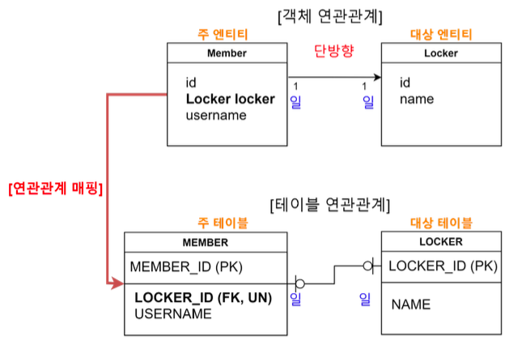

# Spring + DB

## Mybatis
: DB 연동 구현시 사용되는 Java Persistence Framework, SQL Mapper 기능 지원
<br> SQL 파일을 별도로 분리하여 관리할 수 있고, 객체-SQL 사이의 파라미터를 자동으로 매핑해준다

특징

- 생산성 : 62%정도 줄어드는 코드, 간단한 설정, 선택적 예외 처리
- 성능 : 구조적 강점(데이터 접근 속도를 높여주는 Join 매핑)
- SQL문과 애플리케이션 소스 코드의 분리<br>(SQL쿼리 변경 시마다 자바코드를 수정하거나 따로 컴파일 할 필요가 없다)
- 이식성 : 어떤 프로그래밍 언어로도 구현가능 (자바,C#,.NET,RUBY)
- 오픈소스 & 무료

### Install (Spring Boot)

1. 프로젝트 생성 시 https://start.spring.io에서 Mybatis Framework 선택하거나 <br>또는 build.gradle에 dependencies 항목 추가
``` bash
implementation 'org.mybatis.spring.boot:mybatis-spring-boot-starter:3.0.2'
```
2. application.properties 파일에 DB 접속 정보 추가
``` bash
spring.datasource.url: jdbc:{mysql}://{localhost:3306}/{db_name}?characterEncoding=UTF-8
spring.datasource.username: user
spring.datasource.password: password
spring.datasource.driver-class-name: com.mysql.cj.jdbc.Driver
```
3. SpringeduApplication 에 Mapper 파일들이 존재하는 패키지 정보 설정
``` java
@SpringBootApplication //(exclude = DataSourceAutoConfiguration.class)
@ComponentScan(basePackages={"com.example.springedu", "thymeleaf.exam"})
@MapperScan(value={"com.example.springedu.dao"})
public class SpringeduApplication {
	public static void main(String[] args) {
		SpringApplication.run(SpringeduApplication.class, args);
	}
}
```

--- 
### Example

=== "SQL Mapper Interface" 
    ``` java
    @Mapper
    public interface EmpMapper {
        @Select("select count(*) from emp")
        public int getAllDataNum();

        @Select("select empno, ename, job, date_format(hiredate, '%Y년 %m월 %d일') hiredate, sal  from emp")
        public List<EmpVO> listAll();

        @Select("select empno, ename, job, date_format(hiredate, '%Y년 %m월 %d일') hiredate, sal  from emp where empno = #{no}") // findEmp1 함수의 매개변수 사용
        public EmpVO findEmp1(int no);

        @Select("select empno, ename, job, date_format(hiredate, '%Y년 %m월 %d일') hiredate, sal  from emp where ename = #{name}")
        public EmpVO findEmp2(String name);

        // 페이징
        @Select("select empno, ename, job, date_format(hiredate, '%Y년 %m월 %d일') hiredate, sal from emp order by sal limit #{startNum}, #{countNum}")
        public List<EmpVO> listPart(PageDTO vo);
    }
    ```
=== "Mapper를 사용하는 컨트롤러 클래스"
    ``` java
    @Controller
    public class EmpController {
        @Autowired
        EmpMapper dao;
        
        @GetMapping("/empnum") // 수정
        public ModelAndView count() {
            ModelAndView mav = new ModelAndView();
            int num = dao.getAllDataNum();
            mav.addObject("num", num);
            mav.setViewName("empResult");
            return mav;
        }
        
        @GetMapping("/list")
        public ModelAndView list() {
            ModelAndView mav = new ModelAndView();
            List<EmpVO> list = dao.listAll();
            mav.addObject("list", list);
            mav.setViewName("empResult");
            return mav;
        }

        @GetMapping("/findEmp1")
        public ModelAndView findEmp1(@RequestParam(defaultValue="7788") int empno) {
            ModelAndView mav = new ModelAndView();
            EmpVO emp = dao.findEmp1(empno);
            if (emp == null)
                mav.addObject("msg", "사번이 "+empno+"인 직원은 없어요~~");
            else
                mav.addObject("emp", emp);
            mav.setViewName("empResult");
            return mav;
        }

        @GetMapping("/findEmp2")
        public ModelAndView findEmp2(String ename) {
            ModelAndView mav = new ModelAndView();
            EmpVO emp = dao.findEmp2(ename);
            if (emp == null)
                mav.addObject("msg", "성명이 "+ename+"인 직원은 없어요~~");
            else
                mav.addObject("emp", emp);
            mav.setViewName("empResult");
            return mav;
        }
        
        @GetMapping("/part")
        public ModelAndView part(PageDTO vo) {
            ModelAndView mav = new ModelAndView();
            List<EmpVO> list = dao.listPart(vo);
            mav.addObject("list", list);
            mav.setViewName("empResult");
            return mav;
        }
    }
    ```

---
## JPA 
: Java Persistence API, RDBMS와 OOP 객체 사이의 불일치에서 오는 패러다임을 해결하기 위해서 만들어진 ORM 기술
<br> 자바 ORM에 대한 API 표준 명세이자 인터페이스의 모음이므로 구현체가 없다. 따라서 ORM 프레임워크를 사용해야 하는데, 가장 대중적인 것은 **하이버네이트**이다

특징

- 생산성 : JPA에게 저장할 객체를 전달하기만 하면 되므로 코드 작성 필요 X, DDL문도 자동으로 생성해주기 때문에 데이터베이스 설계 중심을 객체 설계 중심으로 변경할 수 있다
- 유지보수 : 유지보수해야 하는 코드 :material-arrow-down:
- 패러다임의 불일치 해결 : JPA는 연관된 객체를 사용하는 시점에 SQL을 전달할 수 있고, 같은 트랜잭션 내에서 조회할 때 동 일성도 보장하기 때문에 다양한 패러다임의 불일치를 해결한다
- 성능 : 애플리케이션과 데이터베이스 사이에서 성능 최적화 기회 제공, 같은 트랜잭션안에서는 같은 엔티티를 반환하기 때문에 데이터 베이스와의 통신 횟수를 줄일 수 있으며 트랜잭션을 commit하기 전까지 메모리에 쌓고 한 번에 SQL을 전송한다
- 데이터 접근 추상화와 벤더 독립성 : RDB는 같은 기능이라도 벤더마다 사용법이 다르기 때문에 처음 선택한 데이터베이스에 종속되고 변경이 어렵다. 그러나 **JPA는 애플리케이션과 데이터베이스 사이에서 추상화된 데이터 접근을 제공**하여 종속되지 않으므로 간단하게 변경 가능하다.

??? note
    **ORM**

    - Object Relational Mapping
    - 객체-관계 매핑의 줄임말로써 OOP의 객체 구현 클래스와 RDBMS에서 사용하는 테이블을 자동으로 매핑하는 것을 의미
    - SQL문을 구현할 필요 없이 객체를 통해 간접적으로 데이터베이스 조작 가능
    - 클래스와 테이블 매핑 시, 둘은 호환 가능성을 두고 만들어진 것이 아니므로 불일치가 발생하는데, ORM을 통해 객체 간의 관계를 바탕으로 SQL문을 자동 생성함으로써 해결한다

    **ORM :octicons-arrow-both-16: SQL Mapper**

    - SQL Mapper
        - SQL <-> SQL Mapper <-> Object 필드
        - 직접 작성한 SQL 문장으로 데이터베이스 데이터 제어
        - Mybatis, JdbcTemplates(Spring)
    - ORM
        - Database data <-> ORM <-> Object 필드
        - 객체를 통해서 간접적으로 데이터베이스의 데이터 제어
        - 객체와 관계형 데이터베이스의 데이터를 자동으로 mapping
        - JPA, Hibernate

동작 과정
: JPA는 애플리케이션과 JDBC 사이에서 동작, JPA 내부에서 JDBC API를 사용하여 SQL을 호출하여 DB와 통신한다
<br> 개발자가 ORM 프레임워크에 저장하면, 적절한 INSERT SQL을 생성해 데이터베이스에 저장해주고, 검색을 하면 적절한 SELECT SQL을 생성해 결과를 객체에 매핑하고 전달한다


### 프로그래밍

1. persistence.xml 파일을 통해 JPA 설정
2. EntityManagerFactory 생성
3. EntityManager를 생성하여 Entity를 **영속성 컨텍스트(Persistence Context)**를 통해 관리
``` bash
EntityManagerFactory factory = Persistence.createEntityManagerFactory("emptest");
EntityManager em = factory.createEntityManager();
```


**EntityManagerFactory**

- 데이터베이스와 상호 작용을 위한 EntityManager 객체를 생성하기 위해 사용되는 객체
- 애플리케이션에서 한 번만 생성하고 공유해서 사용
- *Thread-Safe* 하므로 여러 스레드에서 동시에 접근해도 안전
- EntityManagerFactory 객체를 통해 생성되는 모든 EntityManager 객체는 동일한 데이터베이스에 접속한다

**EntityManager**

- Entity를 관리하는 객체
- 데이터베이스에 대한 CRUD 작업은 모두 영속성 컨텍스트를 사용하는 EntityManager 객체를 통해 이루어진다
- **동시성의 문제가 발생할 수 있으니 스레드 간에 공유하지 않는다**
- **모든 데이터 변경은 {++트랜잭션++} 안에서 이루어져야 한다**

|  Method  |  기능  | 
| :------: | :---: |
| flush() | Persistence Context의 변경 내용을 DB에 반영 <br> 일반적으로는 flush() 메서드를 직접 사용하지는 않고, 자바 애플리케이션에서 커밋 명령이 들어왔을 때 자동으로 실행된다 |
| detach() | 특정 Entity를 준영속 상태(영속 컨텍스트의 관리를 받지않음)로 변경 |
| clear() | Persistence Context 초기화 |
| close() | Persistence Context 종료 |
| merge() | 준영속 상태의 엔티티를 이용해서 새로운 영속 상태의 엔티티를 반환 |
| **find()** | 식별자 값을 통해 Entity 탐색 (DB 테이블 또는 데이터 또는 행) |
| **persist()** | 생성된 Entity 객체를 Persistence Context에 저장 |
| **remove()** | 식별자 값을 통해 영속성 Persistence Context에서 Entity 객체 삭제 |


### 엔티티
: DB 테이블에 대응하는 **@Entity** 어노테이션이 붙은 클래스, 엔티티 객체는 DB 테이블의 데이터(하나의 행)을 뜻함

``` java title="Example"
@Getter
@Setter
@ToString
@Entity
@Table(name="entitytesttbl")
public class EntityTest {
	@Id
	@GeneratedValue(strategy = GenerationType.IDENTITY)
	private int id;
	private String name;
	private int age;
	private LocalDateTime birthday;
}
```

|  Entity Annotation  |  설명  |  에제  |
| :-----------------: | :---: | :---: |
| @Entity | 클래스 레벨에 적용, 해당 클래스를 테이블과 매핑한다고 JPA에게 알려주는 역할 | |
| @Table | 클래스 레벨, 엔티티 클래스에 매핑할 테이블 이름을 JPA에게 알려주는 역할 <br> (default는 클래스 이름에서 모든 글자를 소문자로 변경하고 각 워드마다 _ 를 붙인 명칭의 테이블 이름으로 매핑) | `@Table(name = "테이블이름")` |
| @Id | 필드 레벨, 엔티티 클래스의 필드를 테이블의 기본 키 (Primary Key)에 매핑 | `@Id`, `@GeneratedValue(strategy = GenerationType.IDENTITY)` |
| @Column | 필드 레벨, 해당 필드를 컬럼에 매핑 <br>(default는 필드명으로 컬럼명 매핑) <br> nullable, unique, length 등도 설정 가능 | `@Column(name = "매핑할 컬럼명")` |

**생명주기**

1. 비영속(new/transient) : 영속성 컨텍스트와 전혀 관계가 없는 상태
2. 영속(managed) : 영속성 컨텍스트에 저장된 상태
3. 준영속(detached) : 영속성 컨텍스트에 저장되었다가 분리된 상태
4. 삭제(removed) : 삭제된 상태


**생성과 저장**

1. 자바 어플리케이션에서 어떤 엔티티 객체를 생성하여 JPA에게 데이터베이스 저장을 요구하면
2. 만들어진 엔티티는 1차적으로 영속성 컨텍스트에 저장된다 (1차 캐시)
<br> 그리고 저장한 엔티티를 데이터베이스에 저장하기 위한 쿼리문을 생성시켜 쓰기 지연 SQL 저장소에 저장한다
3. 자바 어플리케이션에서 커밋 명령이 내려지면 영속 컨텍스트에는 자동으로 flush()가 호출되고, 
4. 영속성 컨텍스트의 변경내용을 데이터베이스와 동기(flush)화 한다
5. 마지막으로 DB에게 commit 쿼리문을 명령한다

``` java hl_lines="3 5"
EntityManager em = factory.createEntityManager(); 
try {
    em.getTransaction().begin();
    em.persist(vo);
    em.getTransaction().commit();
} catch (Exception e) { 
    result = false;
}
```


**조회**

1. 자바 어플리케이션에서 JPA에게 데이터베이스 조회를 부탁하면, 1차적으로 영속성 컨텍스트에서 엔티티 탐색
2. 있으면 자바 어플리케이션에 엔티티를 넘긴다
3. 영속성 컨텍스트에 없는 엔티티 조회를 요구하면, 쿼리문을 사용해 데이터베이스에서 찾아와 영속성 컨텍스트에 엔티티로 저장하고 자바 애플리케이션에 그 엔티티를 넘긴다


**변경**
: JPA는 엔티티를 영속성 컨텍스트에 보관할 때, 최초의 상태를 복사해서 저장해 두는데 이를 스냅샷이라 한다
<br> 엔티티의 변경사항을 데이터베이스에 자동으로 반영하는 기능을 변경감지(Dirty Checking)라 한다

1. 자바 어플리케이션에서 커밋 명령이 들어오면, 영속 컨텍스트에는 자동으로 flush()가 호출되고,
2. 엔티티와 스냅샷을 비교해서 변경된 엔티티를 찾는다
3. 변경된 엔티티가 있으면 데이터베이스에 변경사항을 저장하기 위해 쿼리를 생성하고,
4. 영속성 컨텍스트의 변경내용을 데이터베이스와 동기(flush)화 한다 (SQL 저장소의 쿼리를 실행시킨다)
5. 마지막으로 데이터베이스에게 commit 쿼리문을 명령한다


``` java hl_lines="3 8"
EntityManager em = factory.createEntityManager(); 
try {
    em.getTransaction().begin();
    Visitor oldVo = em.find(Visitor.class, vo.getId()); 
    System.out.println(oldVo.getName()); 
    oldVo.setName(vo.getName()); 
    oldVo.setMemo(vo.getMemo()); 
    em.getTransaction().commit();
} catch (Exception e) { 
    result = false;
}
```

**삭제**

1. 자바 어플리케이션에서 엔티티 삭제 명령이 들어오면, 엔티티를 찾고, 쓰기 지연 SQL 저장소에 delete 쿼리를 생성한다
2. 자바 어플리케이션에서 커밋 명령이 들어오면, 자동으로 flush()가 호출되고, 영속성 컨텍스트의 변경내용을 데이터베이스와 동기(flush)화 한다 (SQL 저장소의 쿼리를 실행시킨다)
3. 데이터베이스에게 commit 쿼리문을 명령한다

``` java hl_lines="4 12"
EntityManagerFactory factory = Persistence.createEntityManagerFactory("entitytest");
EntityManager em = factory.createEntityManager();
EntityTest et;
em.getTransaction().begin();
for(int i=1; i < 6; i++) {
    et = new EntityTest();
    et.setName("둘리"+i);
    et.setAge(10+i);
    et.setBirthday(LocalDateTime.now());
    em.persist(et);
}
em.getTransaction().commit();       
em.close();
factory.close();
```


### Persistence context
: 어플리케이션과 데이터베이스 사이에 존재하는 논리적인 개념으로 엔티티를 저장하는 영역

- EntityManager 객체를 통해서만 접근 가능
- javax.persistence : JPA 애너테이션의 패키지
- 영속성 컨텍스트에 존재하는 엔티티는 플러시 호출 시 데이터베이스에 반영됨
    - entityManger.flush() 로 플러시 직접 호출
    - 트랜젝션 커밋(commit) 시 플러시 자동 호출
    - JPQL 쿼리 실행 시 플러시 자동 호출

### JPQL
: Java Persistence Query Language, SQL을 추상화한 객체 지향 쿼리 언어
<br> SQL과 문법이 유사하며 **엔티티 객체를 대상**으로 쿼리를 수행한다
<br> 특정 DB에 의존하지 않고, 실행 시 SQL로 변환된다

``` java
List<Member> result = em.createQuery("select m from Member m where m.username like '%kim%'", Member.class).getResultList();
```

!!! note
    **객체지향 쿼리 언어**
    : JPQL, JPA Criterial, QueryDSL, 네이티브 SQL, JDBC API 직접 사용, MyBatis, SpringJdbcTemplate와 함께 사용

    - JPA Criterial :  JPA 공식 기능이자 JPQL 빌더 역할, 자바코드로 쿼리문을 작성하며 복잡하고 실용성이 떨어짐
    - QueryDSL : JPQL 빌더 역할, 문자열이 아닌 자바코드로 JPQL로 작성 가능하며 Criteria 처럼 동적 쿼리를 작성하기 편하다
    - 네이티브 SQL : JPA가 제공하는 SQL을 직접 사용하는 기능, 특정 DB에 의존적이다
    - JDBC 직접 사용, SpringJdbcTemplate 등 : JPA로 JDBC 커넥션을 직접 사용하거나 SpringJdbcTemplate, MyBatis 등을 함께 사용 가능하지만 적절한 시점에 영속성 컨텍스트에 대한 강제 flush가 필요하다

기본 문법
``` java
select_문 :: = select_절 from_절 [where_절] [groupby_절] [having_절] [orderby_절]
```

1. Query문
``` mysql
select m from Member as m where m.username = 'Hello'
```
    - 대소문자 구분
    - **엔티티와 속성은 대소문자 구분**, JPQL 키워드는 대소문자를 구분하지 않음
    - Member는 테이블명, 클래스명이 아니라 **엔티티명**
    - 엔티티 명은 `@Entity(name = "")`로 지정할 수도 있다
    - **별칭 필수** : `Member as m` (as는 생략 가능)

2. 집합
``` mysql
select t.name from Member m LEFT JOIN m.team t GROUP BY t.name Having AVG(m.age) >= 10
```

3. 정렬
``` mysql
select m from Member m order by m.age DESC, m.username ASC
```

4. 서브 쿼리 : WHERE, HAVING 절에서만 사용 가능
``` mysql
select m from Member m where m.age > (select avg(m2.age) from Member m2)
```
    - [NOT] EXISTS : 서브 쿼리에 결과가 존재하면 참
    ``` mysql
    select m from Member m where exists (select t from m.team t where t.name = 'teamA')
    ```
    - {ALL | ANY | SOME} 
    ``` mysql
    select o from Order o where o.orderAmount > ALL(select p.stockAmount from Product p)
    ```
    - [NOT] IN : 서브 쿼리 결과 중 하나라도 같으면 참, 서브쿼리가 아닌 곳에서도 사용 가능
    ``` mysql
    select t from Team t where t IN (select t2 from Team t2 join t2.members m2 where m2.age >= 20)
    ```

쿼리 객체 : 작성한 JPQL을 실행

**Type Query**
: 반환할 타입을 명확하게 지정할 수 있을 때 사용

``` java
TypedQuery<Member> query = em.createQuery("select m from Member as m", Member.class);
List<Member> members = query.getResultList();

TypedQuery<String> query = em.createQuery("select m.username from Member as m", String.class);
List<String> names = query.getResultList();

TypedQuery<Long> query = em.createQuery("select count(m.username) from Member as m", Long.class);
Long su = query.getSingleResult();
```

**Query**
: 반환할 타입을 명확하게 지정할 수 없을 때 사용

1. 조회 타입이 String 타입의 username과 Integer 타입의 age
``` java
Query query = em.createQuery("select m.username, m.age from Member m");
```
2. 조회 대상이 둘 이상이면 Object[] 반환
``` java
List<Object[]> resultList = query.getResultList();
for (Object[] objects : resultList) {
    String userName = (String) objects[0]; Integer age = (Integer) objects[1];}
```
3. 조회 대상이 하나면 Object 반환
``` java
List resultList = query.getResultList();
for (Object o : resultList) {
    Object[] objects = (Object[]) o;
    String userName = (String) objects[0]; Integer age = (Integer) objects[1];}
```
4. Example
``` java
Query query = em.createQuery("select count(m.username) from Member m");
Object su = query.getSingleResult();

Query query = em.createQuery("select m.username from Member m");
List<Object> resultList = query.getResultList();
```

**결과 조회 API**

- `query.getResultList()`
: 결과가 하나 이상이거나 몇 개 일지 예측할 수 없을 때 사용, 결과가 없으면 빈 리스트 반환
``` java
TypedQuery<Member> query = em.createQuery("select m from Member as m", Member.class);
List<Member> resultList = query.getResultList();
```
- `query.getSingleResult()`
: 결과가 정확히 하나일 때 사용, 단일 객체 반환
``` java
TypedQuery<Member> query = em.createQuery("select m from Member as m where m.id = 1L", Member.class);
Member result = query.getSingleResult();
```
    - 만약, 결과가 없으면 `javax.persistence.NoResultException`
    - 만약, 결과가 둘 이상이면 `javax.persistence.NonUniqueResultException`

**파라미터 바인딩**

- 이름 기준
: 파라미터를 이름으로 구분, 앞에 `:` 사용
``` java
Member result = em.createQuery(
    "select m from Member as m where m.username= :username", Member.class)
    .setParameter("username", "member1")
    .getSingleResult();
```

- 위치 기준
: 파라미터를 위치로 구분, `?` 다음에 위치 값 선언 (1부터 시작)
``` java
TypedQuery<EmpDTO> q = em.createQuery("SELECT t FROM EmpDTO t WHERE t.ename = ?1 and t.job = ?2", EmpDTO.class);
q.setParameter(1, ename); 
q.setParameter(2, job); 
EmpDTO result = q.getSingleResult();
```

**프로젝션 Projection**
: SELECT 절에 조회할 대상 지정

- 엔티티 프로젝션
: 원하는 객체 조회, 조회한 엔티티는 Persistence Context에서 관리
``` java
select m from Member m
select m.team from Member m
```

- 스칼라 타입 프로젝션
: 숫자, 문자, 날짜와 같은 기본 데이터 타입
``` java
//전체 회원의 이름 조회
List<String> result = em.createQuery("select m.username from Member m", String.class).getResultList(); 
```

- 여러 값 조회
: 원하는 데이터들만 선택해서 조회
``` java
List<Object[]> resultList = em.createQuery("select m.username, m.age from Member as m").getResultList();
for (Object[] result : resultList) {
    String username = (String) result[0]; Integer age = (Integer) result[1];}
```

---
### 페이징 API

- `setFirstResult(int startPosition)` : 조회 시작 위치 (0부터 시작)
- `setMaxResult(int maxResult)` : 조회할 데이터 수
``` java
// 시작 index 1부터 총 10개의 데이터 조회
List<Member> result = em.createQuery(
    "select m from Member m order by m.age desc", Member.class) 
    .setFirstResult(1)
    .setMaxResults(10)
    .getResultList();
```

---
### JPA 기본키 매핑

- 직접 할당 : `@Id` annotation만 사용해서 직접 할당
- 자동 생성 : `@Id`와 `@GeneratiedValue`를 추가하고 원하는 키 생성 전략 선택
    - **IDENTITY** : 기본키 생성을 DB에 위임
    - **SEQUENCE** : DB 시퀀스를 사용해서 기본키 할당
    - TABLE : 키 생성 테이블 사용
    - AUTO : 선택한 DB에 따라 IDENTITY, SEQUENCE, TABLE 중 하나를 자동으로 선택

**IDENTITY**
: 기본키 생성을 DB에 위임하는 전략 (MySQL, PostgreSQL, SQL Server, DB2)
<br> 이 전략은 DB에 먼저 INSERT SQL을 실행해야 기본키를 알 수 있으므로, em.persist() 시점에 즉시 INSERT SQL을 실행하고 DB에서 식별자를 조회함

``` java
@Entity
public class Member {
    @Id
    @GeneratedValue(strategy = GenerationType.IDENTITY) private Long id;
}
```

**SEQUENCE**
: 유일한 값을 순서대로 생성하는 특별한 데이터베이스 오브젝트 (Oracle, PostgreSQL, DB2, H2 Database)
<br> 시퀀스 전략은 em.persist()를 호출할 때 먼저 DB 시퀀스를 사용해서 식별자를 조회하고, 조회한 식별자를 엔티티에 할당한 후에 엔티티를 영속성 컨텍스트에 저장한다. 이후 트랜잭션을 커밋해서 플러시가 일어나면 엔티티를 DB에 저장하게 된다.

``` java
@Entity 
@SequenceGenerator(
    name = "ET1_SEQ_GENERATOR", // 식별자 생성기 이름
    sequenceName = "test1_seq", initialValue = 1,
    allocationSize = 1
)
public class EntityTest {
    // 데이터베이스에 등록되어 있는 시퀀스 이름 // 처음 시작하는 수를 지정
    // 시퀀스 한 번 호출에 증가하는 수
    @Id
    @GeneratedValue(strategy = GenerationType.SEQUENCE, generator = "ET1_SEQ_GENERATOR")
}
```

---
### JPA 연관관계 매핑
: 객체의 참조와 테이블의 외래키를 매핑하는 것

- 객체의 연관관계 방식 : **참조(주소)**를 사용해서 관계 생성
- 테이블의 연관관계 방식 : **외래키**를 사용해서 관계 생성

**방향**

테이블 : 외래키 하나로 조인을 사용해서 양방향으로 쿼리가 가능하므로, 사실상 방향이라는 개념이 없다
<br>객체 : 참조용 필드를 가지고 있는 연관된 객체를 조회할 수 있다

- 단방향 : 한 쪽만 참조하는 것 (회원 -> 팀, 팀 -> 회원)
- 양방향 : 양 쪽이 서로 참조하는 것 (회원 <-> 팀)

**다중성**
: 다대일, 일대일, 일대다, 다대다

- 다대일 예시 : 여러 회원이 한 팀에 속한다. 그러므로, 회원과 팀은 다대일 관계이다
- 일대다 예시 : 한 팀에 여러 회원이 속한다. 그러므로, 팀과 회원은 일대다 관계이다

==연관관계의 주인==
: JPA는 두 객체 연관관계에서 하나 객체를 정해서 DB 외래키를 관리하는데, 이때 이 객체를 연관관계의 주인이라고 한다
<br> '외래키를 가진 테이블과 매핑되는 엔티티', 즉 해당 엔티티의 외래키 필드가 연관관계의 주인이다

{++다대일의 단방향 연관관계++}
: 1:N 관계에서 외래키는 항상 N쪽이다. 객체 양방향 관계에서 연관관계의 주인은 항상 N이다.


<br> 객체간의 연관관계에서는 단방향 관계이므로 `member.team` 조회는 가능하지만 반대는 알 수 없다.
=== "Member" 
    ``` java hl_lines="13 16"
    @Getter
    @Setter
    @ToString
    @NoArgsConstructor
    @Entity
    @Table(name="membertbl")
    public class Member {
        @Id
        @Column(name = "MEMBER_ID")
        @GeneratedValue(strategy = GenerationType.IDENTITY)
        private int id;
        private String username;
        @ManyToOne
        @JoinColumn(name = "TEAM_ID")
        private Team team;
        @OneToOne
        @JoinColumn(name = "LOCKER_ID")
        private Locker locker;

        public Member(String username, Team team, Locker locker) {
            super();
            this.username = username;
            this.team = team;
            this.locker = locker;
        }
    }
    ```
=== "Team"
    ``` java hl_lines="8 9 10"
    @Getter
    @Setter
    @ToString
    @NoArgsConstructor
    @AllArgsConstructor
    @Entity
    public class Team {
        @Id
        @Column(name = "TEAM_ID")	
        private String id;
        private String name;
    }
    ```

**@ManyToOne**

|  속성  |  기능  |  기본값  |
| :---: | :---: | :----: |
| optional | false로 설정하면, 연관된 엔티티가 항상 있어야 함 | `TRUE` |
| fetch | 글로벌 fetch 전략 설정 | `@ManyToOne=FetchType.EAGER` <br> `@OneToMany=FetchType.LAZY`|
| cascade | 영속성 전이 기능 사용 | |
| targetEntity | 연관된 엔티티 타입 정보 설정 | | 


**@JoinColumn**
: 외래키 매핑 시 사용, name 속성에는 매핑할 외래키 이름을 지정을 지정한다
<br> name 속성을 생략한다면, 외래키를 찾을 때 기본 전략을 사용한다
<br> (기본전략 : `필드명` + `_` + `참조하는 테이블의 컬럼명`)

|  속성  |  기능  |  기본값  |
| :---: | :---: | :----: |
| 값name | 매핑할 외래키 이름 | `필드명` + `_` + `참조하는 테이블의 컬럼명` |
| referemcedCp;i,mMa,e | 외래키가 참조하는 대상 테이블의 커럼명 | 참조하는 테이블의 기본키 컬럼명 |
| foreignKey(DDL) | 외래키 제약조건 직접 지정 (테이블 생성 시) | |
| unique, nullable, insertable, updatable, columnDefinition, table | @Column 속성과 같음 | | 

``` java title="JOIN Example"
String jpql = "select m from Member m join m.team t where t.name = :tn";
// 또는, String jpql = "select m from Member m where m.team.name=:tn";

TypedQuery<Member> q = em.createQuery(jpql, Member.class);
q.setParameter("tn", inputName);
List<Member> list = q.getResultList();
```


{++일대일의 연관관계++}
: 양쪽이 서로 하나의 관계를 가짐

<br> 회원은 하나의 사물함만 사용하고, 사물함도 하나의 회원에 의해서만 사용된다
<br> 주테이블만 확인해도 대상 테이블과 연관관계가 있는지 알 수 있다

---
### persistence.xml
: 설정 정보 관리, `/src/main/resource/META-INF` 경로에 위치한다
``` xml hl_lines="42"
<?xml version="1.0" encoding="UTF-8"?>
<persistence xmlns="https://jakarta.ee/xml/ns/persistence"
			 xmlns:xsi="http://www.w3.org/2001/XMLSchema-instance"
			 xsi:schemaLocation="https://jakarta.ee/xml/ns/persistence https://jakarta.ee/xml/ns/persistence/persistence_3_0.xsd"
			 version="3.0">
<persistence-unit name="emptest">
		<provider>org.hibernate.jpa.HibernatePersistenceProvider</provider>
		<class>jpamvcexam.model.dto.EmpDTO</class>
		<class>jpamvcexam.model.dto.EmpFreqDTO</class>
	    <class>jpamvcexam.model.dto.Reply</class>
		<class>jpamvcexam.model.dto.Book</class>
		<properties>
			<property name="javax.persistence.jdbc.driver" value="com.mysql.cj.jdbc.Driver" />
			<property name="javax.persistence.jdbc.user" value="user" />
			<property name="javax.persistence.jdbc.password" value="password" />
			<property name="javax.persistence.jdbc.url" value=" jdbc:mysql://localhost:3306/mysql?characterEncoding=UTF-8" />
			<property name="hibernate.dialect" value="org.hibernate.dialect.MySQL8Dialect" />
			<property name="hibernate.show_sql" value="true" />
			<property name="hibernate.format_sql" value="true" />
			<property name="hibernate.use_sql_comments" value="true" />
		</properties>
	</persistence-unit>
	<persistence-unit name="entitytest">
		<provider>org.hibernate.jpa.HibernatePersistenceProvider</provider>
		<class>jpamvcexam.model.entity.EntityTest</class>
		<class>jpamvcexam.model.entity.Member</class>
		<class>jpamvcexam.model.entity.Team</class>
		<class>jpamvcexam.model.entity.Locker</class>
		<class>jpamvcexam.model.entity.AAA</class>
		<class>jpamvcexam.model.entity.BBB</class>
		<class>jpamvcexam.model.dto.EmpDTO</class>
		<class>jpamvcexam.model.entity.MyMyTest</class>
		<properties>
			<property name="javax.persistence.jdbc.driver" value="com.mysql.cj.jdbc.Driver" />
			<property name="javax.persistence.jdbc.user" value="user" />
			<property name="javax.persistence.jdbc.password" value="password" />
			<property name="javax.persistence.jdbc.url" value=" jdbc:mysql://localhost:3306/mysql?characterEncoding=UTF-8" />
			<property name="hibernate.dialect" value="org.hibernate.dialect.MySQL8Dialect" />
			<property name="hibernate.show_sql" value="true" />
			<property name="hibernate.format_sql" value="true" />
			<property name="hibernate.use_sql_comments" value="true" />
			<property name="hibernate.hbm2ddl.auto" value="update" />
			<property name="hibernate.physical_naming_strategy" value="jpamvcexam.util.CustomPhysicalNamingStrategy"/>
		</properties>
	</persistence-unit>
</persistence>
```

**`<property name="hibernate.hbm2ddl.auto" value="update"/>`**

- create : 기존 테이블 삭제 후 다시 생성 (DROP+CREATE)
- create-drop : create와 같지만, 종료시점에 테이블 DROP
- **update** : 변경분만 반영되어 추가만 가능
- validate : 엔티티와 테이블이 정상 매핑 되는지만 확인
- **none** : DDL 명령은 사용하지 않음 (Default)

---
## Spring Data JPA
: Spring Framework에서 JPA를 편리하게 사용할 수 있도록 지원하는 프로젝트로서 CRUD 처리를 위한 공통 인터페이스 제공

- Repository 개발 시 인터페이스만 작성해도, 실행 시점에 Spring Data JPA가 구현 객체를 동적으로 생성해서 주입시키므로
- 데이터 접근 계층을 개발할 때 구현 클래스 없이 인터페이스만 작성해도 개발을 완료할 수 있도록 지원함
- 보통 `JpaRepository<T, ID>` 인터페이스를 상속한 Repository 인터페이스를 정의하여 사용
    - `T` : Class의 type
    - `ID` : PK의 type


