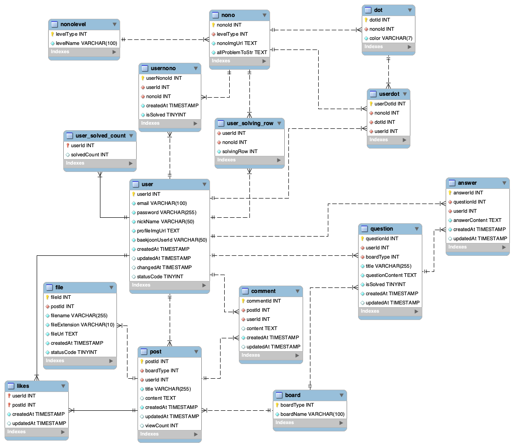

한국소프트웨어산업협회 주관 [회원사 채용연계형 MSA기반 Full Stack 개발 전문가 양성과정 3차] 

1차 프로젝트 

---
<!-- more -->

## NONOGrammers

- 팀명 : 도트리키재기 
- 팀원 : 유승희(팀장), 전승현, 송기영, 이성수

<서비스 소개> 
<서비스 동기> 

**초기 DB ERD**

---
1차 프로젝트 종료 (~10/24)

**DB ERD**

**Refactoring & Code Sharing 계획**

Controller

- PostController
    - `/post/write` : 주석/JavaDoc/네이밍, 예외처리, 파일 경로 @Value, 파일 정보 파싱 코드, 디렉토리 생성 코드, *파일 유무 확인 코드*, *상대 경로*, *UUID*, `/editPosts`/`api/change-profileimgurl`랑 합치거나 이미지 저장 코드 모듈화 
    - `/post/like` : 주석/JavaDoc/네이밍, 예외처리, StatusCode -> ResponseEntity, *RestAPI*,
     [ResponseEntity](https://stir.tistory.com/343)
- UserController -> 주석/JavaDoc/네이밍, ResponseEntity
    - `/api/join` : 프로필 기본 이미지 경로 @Value, 메세지 
    - `/api/login` : GET, POST로 나눠서 해보기
    - `/api/logout` : 얘도 `api` 빼는 게 낫지 않나..?
    - `api/check/{checkValue}` (이메일, 닉네임 중복 체크) : ResponseEntity로 Model없이 StatusCode만 전달
    - `/api/reset-password-token` (token 생성) : 얘는 `api` 빼는 게 낫겠는데
    - `/api/check-reset-password` : `/check/token`으로 변경, 
    - `/api/reset-password`: PutMapping으로 변경
- UrlController

Mapper

- UserMapper : JavaDoc/네이밍
- PostMapper : JavaDoc/네이밍, *PK 키 가져오기*

Domain

- JoinDTO
- FileDTO
- UploadImageVO
- ResponseModel : data 하나로 합치기

JS : event html로 넘기고, JS 주석에 id 달아놓기

- join.js
- home.js
- password.js

HTML

- home.html : event 변경, 반응형
- join.html : +백준 아이디 검증, JS 다시 생각
- login.html : **Controller랑 다시 생각하기**
- reset-password.html : event 변경
- forgot-password.html : event 변경, 주석
- write.html : + summernote, 이미지 취소 버튼?, script -> JS, css -> .css
- terms.html : CSS

---
1. PostController (1./write, 2./like)
2. ResponseModel
3. Mapper
4. 

