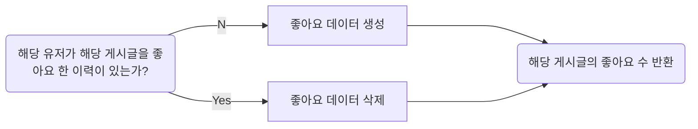

한국소프트웨어산업협회 주관 [회원사 채용연계형 MSA기반 Full Stack 개발 전문가 양성과정 3차] 

1차 프로젝트 (9/27~10/24)

---
<!-- more -->

## NONOGrammers

- 팀명 : 도트리키재기 
- 팀원 : 유승희(팀장), 전승현, 송기영, 이성수

**서비스 배경**

개발자에게서 떼어놓을 수 없는 코딩테스트 :fontawesome-solid-square-poll-horizontal:

점차 관성적으로 변하는 코딩테스트 문제 풀이에 부담을 느끼고, 힘들어하는 개발자들에게 힘이 되어 줄 수 있는 서비스를 만들어보자!

**서비스 소개**


숫자들을 계산하여 칸을 색칠하며 그림을 완성시키는 퍼즐인 '노노그램'에서 힌트를 얻어

코딩테스트 문제를 풀어나갈수록 해당 도트칸들이 색칠되면서 그림을 완성시키는 서비스인 ==노노그래머스== 를 기획했습니다

:triangular_flag_on_post: 많은 개발자분들이 '아 하루에 한 문제는 풀어야지'같은 강박에서 벗어나 스스로 문제 풀이에 활력을 느낄 수 있도록 하는 것을 목표로 잡고 시작했습니다

<br>
**협업 룰**

<a href="https://github.com/" target="_blank" rel="noreferrer">
    
</a>
<a href="https://www.atlassian.com/software/jira" target="_blank" rel="noreferrer">
    
</a>
<a href="https://slack.com/" target="_blank" rel="noreferrer">
    
</a>
<a href="https://www.notion.so/ko-kr/product" target="_blank" rel="noreferrer">
    
</a>
<a href="https://www.google.com/drive/" target="_blank" rel="noreferrer">
    
</a>
<a href="https://www.figma.com/" target="_blank" rel="noreferrer">
    
</a>
<a href="https://www.erdcloud.com/" target="_blank" rel="noreferrer">
    
</a>

1. Slack, Notion 등을 이용한 빠르고 간편한 소통 :material-comment-multiple:
2. Figma, erdcloud 등을 이용한 장소에 구애받지 않는 실시간 아이디어 논의 :material-share-variant:
3. JIRA의 스프린트 방식을 이용한 프로젝트 목표 달성 :bell:
4. [Git-Flow](../../git/git-flow.md), [Commit-Convention](../../git/commit-convention.md)을 활용한 효율적인 협업 :office_worker:
5. Github의 Pull Request 활용! :simple-github:

<br>
**Technical Skills**

Backend 

<a href="https://spring.io/" target="_blank" rel="noreferrer">
    
</a>
<a href="https://spring.io/projects/spring-boot" target="_blank" rel="noreferrer">
    
</a>
<a href="https://blog.mybatis.org/" target="_blank" rel="noreferrer">
    
</a>
<a href="https://www.mysql.com/" target="_blank" rel="noreferrer">
    
</a>
+ 


(DB는 AWS LightSail에 배포하여 사용)

Frontend 

<a href="https://developer.mozilla.org/en-US/docs/Web/CSS" target="_blank" rel="noreferrer">
    
</a>
<a href="https://developer.mozilla.org/en-US/docs/Glossary/HTML5" target="_blank" rel="noreferrer">
    
</a>
<a href="https://developer.mozilla.org/en-US/docs/Web/JavaScript" target="_blank" rel="noreferrer">
    
</a>
<a href="https://tailwindcss.com/" target="_blank" rel="noreferrer">
    
</a>
+


<br>
**DB 1차 ERD**


**DB ERD**
: 위 ERD로는 NONO 기능 구현에 여러 문제가 있다 싶어, 다시 의견을 나누었습니다
<br> -> 노노와 사용자 분리


<br>
**역할 분담**
: 주담당/부담당 기능을 맡음으로써, 혹시라도 있을 역할의 아쉬움을 해소하는 동시에 자연스럽게 코드를 공유하고, 서로 도와줄 수 있는 분위기를 조성했습니다 


---
## 1차 프로젝트 종료 (10/24)

**개발 일정**
: 처음에는 교육 수업과 병행으로 진행되어 조금씩 차근차근 수행하다, 13~23일 수업 없는 프로젝트 기간에 집중해서 개발했습니다. 


**Repository 구조**

``` css
project-root/
│
├── src/
│   ├── main/
│   │   ├── java/com/dottree/nonogrammers/
│   │   │   ├── controller/
│   │   │   │   ├── MainController.java
│   │   │   │   ├── MyPageController.java
│   │   │   │   ├── PostController.java
│   │   │   │   ├── UrlController.java
│   │   │   │   └── UserController.java
│   │   │   ├── dao/
│   │   │   │   ├── MainMapper.java
│   │   │   │   ├── PostMapper.java
│   │   │   │   └── UserMapper.java
│   │   │   ├── domain/
│   │   │   │   ├── UserDTO.java
│   │   │   │   ├── LikeDTO.java
│   │   │   │   ├── UserNonoDTO.java
│   │   │   │   ├── ..... ..... ...
│   │   │   │   └── PostDTO.java
│   │   │   ├── MyConfig.java
│   │   │   └── NonogrammersApplication.java
│   │   ├── resources/
│   │   │   ├── static/
│   │   │   │   ├── css/
│   │   │   │   │   ├── ...
│   │   │   │   │   └── input.css /* tailwindCSS */
│   │   │   │   ├── js/
│   │   │   │   │   ├── ...
│   │   │   │   │   └── join.js
│   │   │   │   ├── images/
│   │   │   │   └── fonts/
│   │   │   ├── templates/
│   │   │   │   ├── ...
│   │   │   │   └── home.html
│   │       └── banner.txt
│   └── test/java/com/dottree/nonogrammers/NonogrammersApplicationTests.java  
├── gradle/wrapper/
├── README.md
├── tailwind.config.js /* tailwindCSS config file */
├── cssrun.sh /* tailwindCSS 실행문 */
├── ...
└── .gitignore
```

**변화된 DB ERD**
: 개발 과정에서 테이블, 컬럼이 새로 추가되었습니다


---
**<------- 구현 기능 ------->**

### 로그인/로그아웃
: Login한 유저의 Session 생성 및 로그아웃 시 제거 
<br> `session.setAttribute("value", sessionValue);`

- `GET /login` : Login view
- `POST /api/login` : Login 
- `GET /api/logout` : Logout

??? note "삽질 노트"
     ==properties== -> 토큰 설정


### 회원가입
: 유저 데이터 DB에 생성

- `GET /join` : Join view
- `POST /api/join` : Join
- `POST api/check/{checkValue}` : 이메일, 닉네임 중복 체크


### 비밀번호 변경
: 총 3개의 End-point를 통해 비밀번호 변경 과정 진행

- `GET /forgot-password` : Forgot-password view
- `POST /api/reset-password-token` : 전달받은 email 검증하고, 토큰을 생성하여 해당 토큰이 달린 url("api/check-reset-password?token="+token)을 Response로 전달
- `GET /api/check-reset-password` : 전달받은 token을 검증하고, 검증된 token이면 Reset-password view로 전달
- `POST /api/reset-password` : 비밀번호 변경 

### 글 작성

- `POST /post/write` : 다중 이미지 파일 업로드 및 글 작성 (이미지 파일은 uuid로 저장)

??? note "삽질 노트"
    **octet-stream**

    처음에는, 사용자가 파일을 올리지 않으면 null 값이 들어오는 줄 알고 다음과 같이 처리했었다
    ``` java
    MultipartFile[] uploadImageFiles = vo.getUploadImageFiles(); // UploadImageVO vo
    if (vo.getUploadImageFiles() != null){...}
    ```
    그러나 null이 아닌 빈 스트링 값이 들어오는 거였고, 그렇게 octet-stream이라는 처음보는 파일이 계속 생성이 되고 있었다.. <br>파일 유무를 체크하려면 `isEmpty()`로!
    ``` java
    MultipartFile[] uploadImageFiles = vo.getUploadImageFiles();
    if (!uploadImageFiles[0].isEmpty()){...}
    ```
    ---
    **mybatis PK id 가져오기**

    Post, File 테이블이 나뉘어 있기 때문에, 새로 생성된 Post의 ID를 얻어 File 테이블에 넣어주어야 했다.
    ``` java
    @Insert("insert into post(boardType, userId, title, content) values (#{boardType}, #{userId}, #{title}, #{content})")
    @Options(useGeneratedKeys = true, keyProperty = "id")
    public boolean insertPost(PostDTO dto);
    ```
    @Options 코드를 통해 insert함으로써 생성되는 postId를 insert와 동시에 바로 얻어 사용할 수 있었당


### 글 좋아요

- `POST /post/like` : 게시글 좋아요 



### Home, Terms
: Home view, Terms view 구현