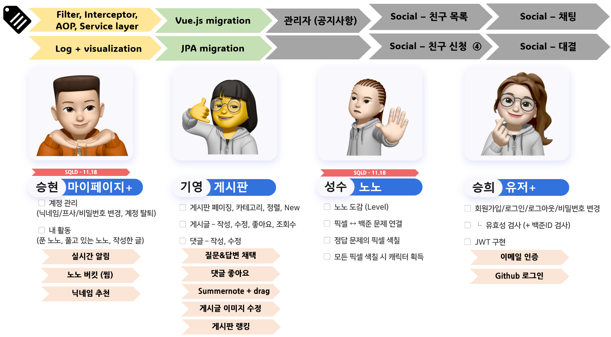
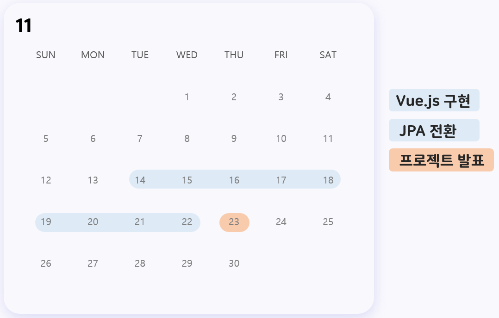

한국소프트웨어산업협회 주관 [회원사 채용연계형 MSA기반 Full Stack 개발 전문가 양성과정 3차] 

2차 프로젝트 (11/14~11/23)

---
<!-- more -->

## NONOGrammers

- 팀명 : 도트리키재기 
- 팀원 : 유승희(팀장), 전승현, 송기영, 이성수

[-> 1차 프로젝트 글 보러가기](./msa-edu-1.md)

---
### **2차 프로젝트 목표**

1. Migration: MyBatis :arrow_right: Spring Data JPA 
2. Migration: Html+CSS+Vanila JS :arrow_right: Vue.js
3. Migration: thymeleaf :arrow_right: RestAPI
4. 코드의 재사용성 및 유지보수성 향상


<br>
**Technical Skills**

Backend 

<a href="https://spring.io/" target="_blank" rel="noreferrer">
    
</a>
<a href="https://spring.io/projects/spring-boot" target="_blank" rel="noreferrer">
    
</a>

<a href="https://www.mysql.com/" target="_blank" rel="noreferrer">
    
</a>
:material-plus:


(DB는 AWS LightSail에 배포하여 사용)

Frontend 

<a href="https://developer.mozilla.org/en-US/docs/Web/CSS" target="_blank" rel="noreferrer">
    
</a>
<a href="https://developer.mozilla.org/en-US/docs/Glossary/HTML5" target="_blank" rel="noreferrer">
    
</a>
<a href="https://vuejs.org/" target="_blank" rel="noreferrer">
    
</a>
<a href="https://tailwindcss.com/" target="_blank" rel="noreferrer">
    
</a>


<br>
**역할 분담**
: Vue.js + JPA 전환과 이전에 구현하지 못했던 기능을 구현하는 것에 우선순위를 두고, 
<br>새로 개발할 기능 중 구현하고 싶은 작업들을 각각 선택하는 것으로 역할을 분담했습니다.

- 공통 작업 : JPA, Vue.js 전환
- 개인 작업 : 구현하고 싶은 기능, 이전에 구현하지 못했던 기능
- 새로운 기능 추가 : 관리자, 친구 시스템, 채팅, 대결 시스템, 알림 등



---
### **2차 프로젝트 종료 (11/23)**

**새로운 변화**
: `git Hooks with husky`를 통한 Commit Convention 실수 방지

약속된 Commit Convention을 지키지 않거나, Commit message에 Jira의 Task 번호를 작성하는 것을 잊지 않도록 강제하는 환경을 가졌습니다

**개발 일정**
: 짧은 개발 일정, 그리고 migration의 어려움을 겪게되면서 새로운 기능 추가 보다는 migration에 집중했습니다



**Repository 구조**
: \- vue.js를 사용하게 되면서 Front 레포지토리를 따로 생성하였습니다
<br>- service 레이어를 구축하여 코드 로직을 분리하였습니다

??? 구조 
    === "nonogrammers-back"
        ``` css
        project-root/
        │
        ├── src/
        │   ├── main/
        │   │   ├── java/com/dottree/nonogrammers/
        │   │   │   ├── config/
        │   │   │   │   ├── jwt/
        │   │   │   │   │    ├── JwtAuthenticationFilter.java
        │   │   │   │   │    ├── JwtAuthorizationFilter.java
        │   │   │   │   │    └── JwtProperties.java
        │   │   │   │   ├── CorsConfig.java
        │   │   │   │   ├── MyConfig.java
        │   │   │   │   ├── RedisUtil.java
        │   │   │   │   └── SpringSecurityConfig.java
        │   │   │   ├── controller/
        │   │   │   │   ├── MainController.java
        │   │   │   │   ├── MyPageController.java
        │   │   │   │   ├── PostController.java
        │   │   │   │   └── UserController.java
        │   │   │   ├── dao/
        │   │   │   │   ├── CommentMapper.java
        │   │   │   │   ├── MainMapper.java
        │   │   │   │   ├── PostMapper.java
        │   │   │   │   └── UserMapper.java
        │   │   │   ├── repository/
        │   │   │   │   ├── PostRepository.java
        │   │   │   │   ├── ...
        │   │   │   │   └── UserRepository.java
        │   │   │   ├── entity/
        │   │   │   │   ├── Board.java
        │   │   │   │   ├── ...
        │   │   │   │   └── User.java
        │   │   │   ├── domain/
        │   │   │   │   ├── UserDTO.java
        │   │   │   │   ├── ...
        │   │   │   │   └── PostDTO.java
        │   │   │   ├── service/
        │   │   │   │   ├── UserService.java
        │   │   │   │   ├── ...
        │   │   │   │   └── PostDTO.java
        │   │   │   └── NonogrammersApplication.java
        │   │   ├── resources/
        │   │   │   ├── static/
        │   │   │   │   └── images/
        │   │       └── banner.txt
        │   └── test/java/com/dottree/nonogrammers/NonogrammersApplicationTests.java  
        ├── gradle/wrapper/
        ├── README.md
        ├── ...
        └── .gitignore
        ```
    === "nonogrammers-front"
        ``` css
        project-root/
        │
        ├── src/
        │   ├── assets/
        │   │   ├── css/
        │   │   ├── fonts/
        │   │   ├── images/
        │   │   └── ...
        │   ├── components/
        │   │   ├── user/
        │   │   ├── nono/
        │   │   ├── ...
        │   │   └── Header.vue
        │   ├── js/
        │   │   ├── axiosHandler.js
        │   │   ├── ...
        │   │   └── nonodot.js
        │   ├── pages/
        │   │   ├── Login.vue
        │   │   ├── Join.vue
        │   │   ├── ...
        │   │   └── MyPage.vue
        │   ├── router/
        │   │   └── index.js
        │   ├── stores/
        │   │   ├── auth.store.js
        │   │   └── mypage.js
        │   ├── main.js
        │   └── App.vue
        ├── .env
        ├── package.json
        ├── index.html
        ├── tailwind.config.js
        ├── postcss.config.js    
        ├── ...
        └── .gitignore
        ```

---
### ==**구현 기능** :hammer_pick:==

#### MyBatis -> JPA

<U>MyBatis와 JPA를 함께 사용하기</U>

MyBatis와 JPA를 함께 사용할 때 발생하는 오류를 해결하기 위해 Config 파일 추가

=== "MybatisConfig.java"
    ``` java 
    import org.apache.ibatis.session.SqlSessionFactory;
    import org.mybatis.spring.SqlSessionFactoryBean;
    import org.mybatis.spring.annotation.MapperScan;
    import org.springframework.context.annotation.Bean;
    import org.springframework.context.annotation.Configuration;

    import javax.sql.DataSource;
    import org.springframework.core.io.support.PathMatchingResourcePatternResolver;

    @Configuration
    @MapperScan(value={"com.dottree.nonogrammers.dao"})
    public class MyBatisConfig {

        @Bean
        public SqlSessionFactory sqlSessionFactory(DataSource dataSource) throws Exception {
            SqlSessionFactoryBean sessionFactory = new SqlSessionFactoryBean();
            sessionFactory.setDataSource(dataSource);
            PathMatchingResourcePatternResolver resolver = new PathMatchingResourcePatternResolver();
            sessionFactory.setTypeAliasesPackage("com.dottree.nonogrammers.dao");
            return sessionFactory.getObject();
        }
    }
    ```
=== "ERROR"
    ``` bash
    2023-11-06T14:56:39.894+09:00 ERROR 15338 --- [    Test worker] o.s.boot.SpringApplication               : Application run failed

    org.springframework.beans.factory.UnsatisfiedDependencyException: 
    Error creating bean with name 'mainController' defined in file [/Users/yshee/workspaces/projects/nonogrammers-solve-with-nonogram/build/classes/java/main/com/dottree/nonogrammers/controller/MainController.class]: 
    Unsatisfied dependency expressed through constructor parameter 0: 
    Error creating bean with name 'mainMapper' defined in file [/Users/yshee/workspaces/projects/nonogrammers-solve-with-nonogram/build/classes/java/main/com/dottree/nonogrammers/dao/MainMapper.class]: 
    Property 'sqlSessionFactory' or 'sqlSessionTemplate' are required
    ```

<U>JPA 매핑 전략 변경</U>

Java는 카멜 케이스를 사용하지만, DB는 관례상 스네이크 케이스를 사용하므로 다음과 같은 코드 추가
``` properties title="application.properties"
spring.jpa.hibernate.naming.physical-strategy=org.hibernate.boot.model.naming.PhysicalNamingStrategyStandardImpl
```

<U>JPA Auditing</U>

`createdAt`, `updatedAt` 등 컬럼의 생성일/수정일을 자동화하기 위해 사용

=== "User.java"
    ``` java hl_lines="2 7 11"
    ...
    @EntityListeners(AuditingEntityListener.class)
    @Builder(toBuilder = true)
    public class User implements UserDetails {
        ...

        @CreatedDate
        @Column(nullable = false, updatable = false, columnDefinition = "TIMESTAMP DEFAULT CURRENT_TIMESTAMP")
        private LocalDateTime createdAt;

        @LastModifiedDate
        @Column(columnDefinition = "TIMESTAMP DEFAULT CURRENT_TIMESTAMP")
        private LocalDateTime updatedAt;
    ```
=== "NonogrammersApplication.java"
    ``` java hl_lines="1"
    @EnableJpaAuditing 
    @SpringBootApplication//(exclude= DataSourceAutoConfiguration.class)
    @ComponentScan(basePackages = {"com.dottree.nonogrammers", "templates"})
    public class NonogrammersApplication {
            public static void main(String[] args) {
                SpringApplication.run(NonogrammersApplication.class, args);
        }
    }
    ```

- `@EntityListeners(AuditingEntityListener.class)` : 엔티티를 DB에 적용하기 전후에 커스텀 콜백을 요청할 수 있는 어노테이션
- `@CreatedDate` : 해당 엔티티가 생성되는 시각을 자동으로 삽입
- `@LastModifiedDate` : 해당 엔티티가 수정되는 시각을 자동으로 삽입

??? 참고
    - [JPA 매핑 전략](https://steady-coding.tistory.com/525)
    - [JPA Auditing](https://wonit.tistory.com/484)
    - CreationTimestamp vs CreatedDate : CreationTimestamp는 Hibernate 종속, CreatedDate는 SpringData 종속이다

#### Spring Security + JWT + Pinia

Spring Security + jjwt를 이용하여 JWT 기반의 인증/인가 프로세스를 구축하고, 클라이언트에서는 Pinia를 이용하여 사용자 정보를 저장 및 관리합니다

- [JWT](https://github.com/Fours-force/nonogrammers-solve-with-nonogram/tree/master/src/main/java/com/dottree/nonogrammers/config/jwt)
- [SpringSecurityConfig](https://github.com/Fours-force/nonogrammers-solve-with-nonogram/blob/master/src/main/java/com/dottree/nonogrammers/config/SpringSecurityConfig.java)
- [auth.store.js](https://github.com/Fours-force/nonogrammers-solve-with-nonogram-front/blob/master/src/stores/auth.store.js)


??? 참고
    - [JASON - pinia+jwt](https://jasonwatmore.com/post/2022/05/26/vue-3-pinia-jwt-authentication-tutorial-example)
    - [Goorm - JWT](https://ws-pace.tistory.com/254)
    - [스프링시큐리티 로그인 실패 핸들러](https://dev-coco.tistory.com/126)
    - [스프링시큐리티 로그인 성공 핸들러](https://taesan94.tistory.com/131)
    ---
    - Session (11/3~11/9)
        - [스프링시큐리티 formLogin()](https://whwp0913.me/스프링시큐리티-formLogin-사용-시-비밀번호-인증은-언제-어디서-이루어-질까)
        - [세션 로그인 1](https://velog.io/@sorzzzzy/Spring-Boot5-6.-로그인-처리1-쿠키-세션)
        - [세션 로그인 2](https://lealea.tistory.com/188)
        - [세션 로그인 3](https://www.baeldung.com/spring-security-session)
        - [세션 로그인 4](https://spring.io/guides/gs/securing-web)
        - [세션 로그인 5](https://myeongdev.tistory.com/44)
        - [세션 로그인 6](https://jddng.tistory.com/268)

??? 아쉬운점
    - 노노그래머스는 JWT 인증이 완료되면 서버에서 인증 완료와 함께 사용자 정보를 반환하는 방식을 사용하고 있습니다. 
    
    클라이언트 측에서 JWT를 분해하여 사용자 정보를 추출하는 방법, 사용자 정보를 제공하는 End-point를 따로 생성하여 관리하는 방법 등등 여러 방식이 존재하는데 어떤 방식이 가장 보편적이면서도 성능이 좋은 방법인 지 알지 못한 채로 끝나버린 게 아쉽습니다 :face_holding_back_tears:

    - [jjwt](https://github.com/jwtk/jjwt) VS [java-jwt](https://github.com/auth0/java-jwt) 에서 star 수가 더 많고, README가 상세하게 적혀있는 jjwt를 선택해서 구현했습니다. 

    그러나 버전이 업데이트되면서 시크릿 키를 랜덤 방식으로 지정하게 되었고, 임의의 문자열로 지정할 수 없어 개발 과정에서 불편함이 있었습니다.


#### 이메일 인증 및 검증

사용자 이메일을 인증할 때, Redis를 이용하여 5분동안 인증번호 검증

- 회원가입 시 이메일 인증 : 인증번호를 입력하는 방식
- 비밀번호 찾기 시 이메일 인증 : 링크를 이용하여 인증하는 방식

=== "UserService"
    ``` java
    public void sendJoinEmail(String email) {
        String randomNumber = generateRandomNumber();
        redisUtil.setData(randomNumber, email, 300000);
        emailService.sendNumberEmail(email, randomNumber);
    }

    public void sendResetPasswordEmail(String email) throws MessagingException {
        String token = generateToken();
        redisUtil.setData(token, email, 300000);
        emailService.sendLinkEmail(email, token);
    }
    ```
=== "RedisUtil"
    ``` java
    @Component
    @RequiredArgsConstructor
    public class RedisUtil {

        private final StringRedisTemplate redisTemplate;

        // key:value 데이터 추출
        public String getData(String key) {
            ValueOperations<String, String> valueOperations = redisTemplate.opsForValue();
            return valueOperations.get(key);
        }

        // key:value 데이터 저장
        public void setData(String key, String value, long duration) {
            System.out.println("key = " + key);
            ValueOperations<String, String> valueOperations = redisTemplate.opsForValue();
            Duration expireDuration = Duration.ofMillis(duration);
            valueOperations.set(key, value, expireDuration);
        }

        // key:value 데이터 삭제
        public void deleteData(String key) {
            redisTemplate.delete(key);
        }
    }
    ```
=== "EmailService"
    ``` java
    @Service
    public class EmailService {

        private final JavaMailSender javaMailSender;

        public EmailService(JavaMailSender javaMailSender) {
            this.javaMailSender = javaMailSender;
        }

        public void sendNumberEmail(String to, String number) {
            String text = "안녕하세요!\n" +
                    "노노그래머스입니다.\n " +
                    "인증 번호는 " + number + "입니다.\n" +
                    "감사합니다.";

            SimpleMailMessage message = new SimpleMailMessage();
            message.setTo(to);
            message.setSubject("[노노그래머스] 회원가입 이메일 인증 메일입니다.");
            message.setText(text);
            javaMailSender.send(message);
        }

        public void sendLinkEmail(String to, String token) throws MessagingException {
            String verificationUrl = String.format("http://localhost:5173/reset-password?email=%s&code=%s", to, token);
            String text = "<h1> 안녕하세요! 노노그래머스입니다. </h1>" +
                    "<br><p> 아래 링크를 클릭하면 이메일 인증이 완료됩니다. </p>" +
                    "<br><a href='" + verificationUrl + "'>이메일 인증하기</a><br>" +
                    "<br><p>감사합니다.</p>";

            MimeMessage message = javaMailSender.createMimeMessage();
            message.setRecipients(MimeMessage.RecipientType.TO, to);
            message.setSubject("[노노그래머스] 회원가입 이메일 인증 메일입니다.");
            message.setText(text, "utf-8", "html");
            javaMailSender.send(message);
        }
    }
    ```

??? 참고
    - redis는 도커를 사용해서 실행 `docker run --name nono-redis -p 6379:6379 -d redis`
    - build.gralde `implementation 'org.springframework.boot:spring-boot-starter-mail'`
    - [Gmail SMTP 설정](https://hyunmin1906.tistory.com/276)
    - [스프링부트 구글 이메일 발송](https://kitty-geno.tistory.com/43)
    - [스프링부트 이메일](https://www.baeldung.com/spring-email)
    - [스프링부트 네이버 이메일, 링크 클릭 인증](https://breakthedays.tistory.com/262)
    - [스프링부트+Redis](https://velog.io/@jaewonlee/SpringBoot로-Redis-서버-설정-방법)
    - [이메일 인증](https://green-bin.tistory.com/83)
    - [인증번호 전송](https://gwamssoju.tistory.com/108)
    - [스프링부트 Redis 이메일 인증](https://velog.io/@ayoung0073/SpringBoot-이메일-인증-과정-Redis)


#### axios interceptor

axios의 interceptor를 이용하여 

- 모든 request의 로그인 여부를 판단하고, 조건에 따라 JWT를 Authorization 헤더에 담는 코드 구현
- 모든 response의 Status code를 검토하여 401 또는 403인 경우 권한이 없음으로 인지

(API 호출 코드의 중복을 줄이기 위해서 구현했습니다 )

=== "request"
    ``` javascript 
    // Request Interceptor
    axios.interceptors.request.use((config) => {
        
        // 변수 설정
        const isLoggedIn = (null === user.value) ? false : true ;// 로그인 여부
        const publicApiPaths = import.meta.env.VITE_PUBLIC_API_PATHS.split(','); // 로그인이 필요하지 않은 API 목록
        const isPublicApiPath = publicApiPaths.includes(new URL(config.url).pathname); // 로그인이 필요하지 않은 API 여부

        // 조건 만족 시, 헤더에 Authorization 추가
        if (isLoggedIn && !isPublicApiPath)
            config.headers['Authorization'] = `Bearer ${user.value.token}`;
        return config;

    }, (error) => {
        // 요청 에러 처리
        return Promise.reject(error);
    });
    ```
=== "response"
    ``` javascript
    // Response Interceptor
    axios.interceptors.response.use((response) => {
        return response;
    }, (error) => {

        const errResStatus = error.response.status;
        if ( errResStatus === 401 || errResStatus === 403) {
            alert("권한이 없습니다. 로그아웃 되었습니다. 다시 로그인해주세요.")
            store.logout();
        }
        return Promise.reject(error);
    });
    ```


#### vue-router beforeEach

vue-router의 `beforeEach` 기능을 이용하여 페이지 이동 전 로그인 여부 검토 및 페이지 이동 처리

``` javascript
// 모든 라우터 이동 전에 실행
router.beforeEach(async (to) => { // to: 탐색 될 경로 위치 객체, from: 탐색 전 현재 경로 위치 객체
    console.log("beforeEach")
    const authStore = useAuthStore();
    const { user, returnUrl } = storeToRefs(authStore);
    
    // 로그인이 필요하지 않은 페이지 목록
    const publicPages = import.meta.env.VITE_PUBLIC_PAGES.split(',');
    const authRequired = !publicPages.includes(to.path);

    // 로그인이 필요한 페이지에 접근하려고 할 때, 로그인이 되어있지 않으면 로그인 페이지로 이동
    if (authRequired && user.value===null) {
        if (to.path.startsWith('/detail')) {
            return;
        }
        returnUrl.value = to.fullPath;
        alert("로그인이 필요합니다!")
        router.push('/login');
    }
});
```


--- 
!!! quote
    **Document**

    - [Pinia](https://pinia.vuejs.kr/introduction)
    - [Axios](https://axios-http.com/kr/)
    - [Vue.js](https://ko.vuejs.org/guide/introduction.html)
    - [jjwt](https://github.com/jwtk/jjwt)

    **Post**

    - [;jsessionid=XXX 지우기](https://hothoony.tistory.com/1282)

    **Book**

    - 스프링 부트 3 백엔드 개발자 되기 (지은이: 신선영 | 출판사: 골든래빗)