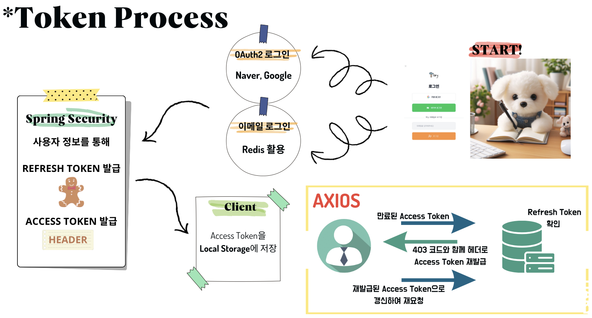
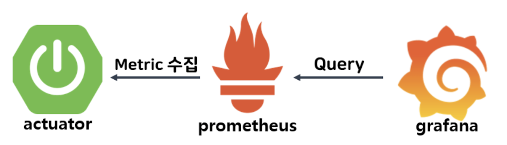
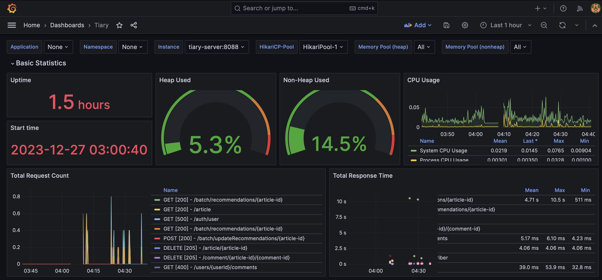
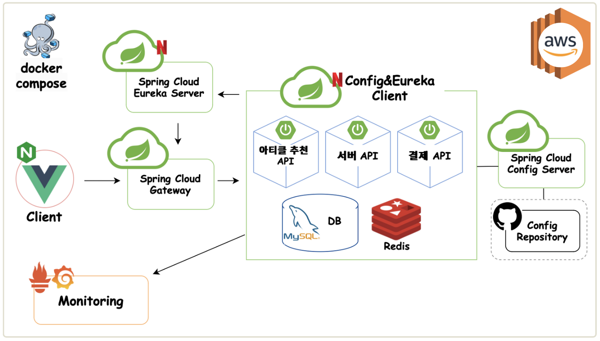

한국소프트웨어산업협회 주관 [회원사 채용연계형 MSA기반 Full Stack 개발 전문가 양성과정 3차] 

3차 프로젝트 (11/24~12/27)

---
<!-- more -->

## [Tiary](https://github.com/KOSA-ToT/tiary)

- 팀명 : ToT
- 팀원 : 유승희(팀장), 김민지, 김진수, 노은기, 송기영

**서비스 소개**

자유로운 소통을 중시하며 후원을 통해 좋은 퀄리티의 게시글을 장려하는 커뮤니티 사이트로

누구나 작가가 될 수 있는 서비스입니다.

 
**Team Rule + Tool**

1. 늦을 때는 늦는다고 미리 연락주기
2. 연락은 오전 9시 ~ 오후 9시 사이로!
3. 매주 월요일 오전 9시는 스프린트 계획 회의
4. 매주 금요일 오후 5시는 스프린트 회고 회의

 
**Technical Skills**

Backend 

:material-plus:

Frontend 

---

### ==**구현 기능** :hammer_pick:==

#### Access Token + Refresh Token

[-> Cookie/Session/Token/JWT 정리](../../backend/security.md)

(Acceess Token만 사용할 때) 사용자의 로그인이 성공하면, 

1. Access Token은 Response의 Header를 통해 클라이언트로 전달됩니다.
2. 전달된 Access Token은 사용자의 Local Storage에 저장됩니다.
3. 클라이언트에서는 저장된 Access Token을 통해 사용자의 정보를 추출 및 관리합니다

그러나 JWT는 stateless하므로 Access Token이 제3자에게 유출될 경우 토큰을 무효화시키기 어렵습니다. 
피해를 줄이기 위해서는 Access Token의 유효기간을 짧게 하는 것이 좋지만, 이렇게 되면 만료 시 다시 로그인 해야 하는 불편함을 자주 느끼게 됩니다.

그렇기 때문에 만료 시 새로운 Access Token을 받아올 수 있도록 하는 Refresh Token을 구현했습니다.
Access Token의 유효기간은 짧게 가져가면서 Refresh Token의 유효기간은 길게 가져감으로써 로그인이 오랜 기간 유지될 수 있게 합니다.

Refresh Token을 구현하는 방법으로는 아래 두 방식을 생각했습니다.

1. Redis를 이용한 Refresh Token 검증
2. Cookie를 이용한 Refresh Token 검증

고민한 결과, 

- 정해진 시간이 지나면 사라짐
- 클라이언트가 저장하고 있기에 관리 및 개발이 용이하다고 생각됨 (+ 개발 시간이 부족한 상황)
- HttpOnly를 설정하여 XSS로부터 안전함

이러한 이유로 Cookie에 저장했습니다.

따라서 사용자의 로그인이 성공하면,

1. Access Token은 Response의 Header를 통해 클라이언트로 전달됩니다.
2. Refresh Token은 사용자의 Cookie를 저장됩니다.
2. 전달된 Access Token은 사용자의 Local Storage에 저장됩니다.
3. 클라이언트에서는 저장된 Access Token을 통해 사용자의 정보를 추출 및 관리합니다

??? 참고
    - Cookie + Refresh Token
        - [Refresh Token 이야기](https://kimtruth.github.io/2021/05/30/JWT-Security/)
        - [Cookie의 MaxAge, Expires 옵션](https://velog.io/@cinephile/Cookie의-MaxAge-Expires-옵션)
        - [RefreshToken + Jwt + Redis](https://soobysu.tistory.com/60)
    - Redis + Refresh Token
        - [Spring Boot와 Redis를 사용하여 Refresh Token 구현하기](https://hudi.blog/refresh-token-in-spring-boot-with-redis/)
        - [Redis를 활용해서 Refresh Token 구현하기](https://inkyu-yoon.github.io/docs/Language/SpringBoot/RefreshToken#리프레시-토큰이-탈취-된다면)
        - [auth0 refresh token rotation](https://auth0.com/docs/secure/tokens/refresh-tokens/refresh-token-rotation)
    - [공식 문서로 Spring Security 구조 파악하기](https://loosie.tistory.com/745)
    - [자바 예외 발생시키기](https://khs0806.tistory.com/18)

#### OAuth2.0 (Naver + Google)

??? 참고
    - [Google OAuth2.0 Docs](https://developers.google.com/identity/protocols/oauth2?hl=ko)
    - [네이버 개발자 센터](https://developers.naver.com/main/)
    - OAuth2.0
        - [Springboot + OAuth 2.0 초간단 네이버 로그인](https://velog.io/@robin00q/Springboot-OAuth-2.0-초간단-네이버-로그인)
        - [Github OAuth2로그인 구현](https://velog.io/@persestitan/Spring-Github-OAuth2로그인-구현)
        - [여러 소셜 로그인을 위한 공통영역 분리](https://lealea.tistory.com/213)
        - [OAuth 와 일반로그인을 동일하게 처리하기](https://velog.io/@on5949/SpringSecurity-OAuth-와-일반로그인을-동일하게-처리하기)
        - [OAuth2, 카카오 로그인, 네이버 로그인](https://terianp.tistory.com/161)
        - [스프링 게시판 만들기 - 8 (2) (소셜 로그인 [구글,네이버,카카오,페이스북] )](https://dodokong.tistory.com/67)
        - [OAuth2 Login(구글, 네이버, 카카오) API 구현 (7) - OAuth 2.0 로그인 관련 클래스 생성](https://ksh-coding.tistory.com/66)
        - [OAuth2 Login(구글, 네이버, 카카오) API 구현 (1) - 회원(User) 관련 클래스 생성](https://ksh-coding.tistory.com/57)
        - [Spring Security와 OAuth2를 이용한 소셜 로그인](https://velog.io/@rnqhstlr2297/Spring-Security-OAuth2-소셜로그인)
        - [Oauth2 로 소셜로그인을 해보자](https://velog.io/@boo105/Oauth2-로-소셜로그인을-해보자)

#### Monitoring

배포한 서비스의 상태를 체크하기 위해 모니터링 시스템을 구축했습니다.

Prometheus는 서버의 각종 metric을 수집하는 시계열 DB이고, Grafana는 수집된 시계열 데이터를 시각화합니다. 여기서 사용한 Grafana 템플릿은 Spring Boot 3.x Statistics입니다.

spring Boot에서 제공하는 Actuator 모듈을 활용하여 Prometheus가 애플리케이션의 각종 metric을 수집하는 과정을 간단히 구현했습니다.

??? 참고
    - [스프링 actuator](https://docs.spring.io/spring-boot/docs/current/reference/html/actuator.html)
    - [그라파나 스프링 대시보드 템플릿](https://grafana.com/grafana/dashboards/19004-spring-boot-statistics/)
    - [이루다 서버의 모니터링 스택을 소개합니다](https://tech.scatterlab.co.kr/spring-boot-monitoring-with-prometheus/)
    - [스프링부트 프로메테우스 모니터링](https://brunch.co.kr/@springboot/734)
    - [스프링부트 모니터링](https://velog.io/@roycewon/Spring-boot-모니터링Prometheus-Grafana-docker)

#### MSA

- [Tiary-MSA](https://github.com/KOSA-ToT/tiary/tree/feature/SCRUM-128--MSA)
- [Tiary-MSA-Guide](https://github.com/KOSA-ToT/tiary/blob/feature/SCRUM-128--MSA/docs/msa-guide.md) :triangular_flag_on_post:

교육 시간에 배운 SpringCloud를 이용하여 MSA 방식의 서비스 구조를 구현했습니다.

아키텍처는 아래와 같으며, 도커를 이용해 컨테이너화하여 AWS EC2에 배포했습니다.

application.yml, docker-compose, 배포 과정 등의 설명은 [Tiary-MSA-Guide](https://github.com/KOSA-ToT/tiary/blob/feature/SCRUM-128--MSA/docs/msa-guide.md)에서 보실 수 있습니다.

??? 참고
    - [마이크로서비스 배포:SpringCloud vs Kubernetes](https://bryceyangs.github.io/study/2021/07/28/MSA-SpringCloud-vs-Kubernetes/)
    - [KOKODO의 첫 MSA 서비스 도전기](https://techblog.lotteon.com/뉴온이들의-첫-msa-서비스-도전기-d336186a7e31)
    - [게이트웨이 설정](https://velog.io/@ychxexn/gateway에-등록한-route를-찾지-못하는-경우-해결방법)
    - [게이트웨이 CORS 1](https://velog.io/@mdy0102/Spring-Cloud-Gateway-CORS-문제-해결하기)
    - [게이트웨이 CORS 2](https://yoo-dev.tistory.com/4)

    ---
    - [왜 host.docker.internal?](https://velog.io/@kyukim/윈도우10-spring-boot-cloud-returns-host.docker.internal-for-client-host-name)
    - [JSONException 해결](https://velog.io/@stella6767/Caused-by-java.lang.NoClassDefFoundError-orgspringframeworkbootconfigurationprocessorjsonJSONException)
    - [Spring Cloud Netflix & Docker Swarm](https://github.com/phantasmicmeans/spring-cloud-docker-swarm-example/blob/master/README.md)