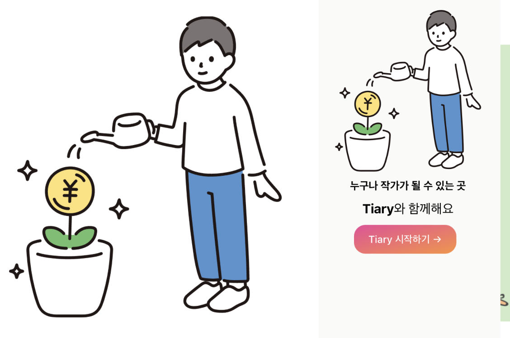

MSA 교육을 돌아보며 프로젝트 글에는 적기 애매하지만 남겨두지 않기엔 아쉬운 것들 모음집..

---
<!-- more -->

### 1. 더 나은 코드는?

교수님 코드도 보고, 책 코드도 보고, 다른 사람들 코드도 보는데..

아래 두 개의 코드 중 어떤 방식을 주로 사용하며 어떤 코드가 더 이상적인 코드인지 의문..

=== "생성자 주입 방식"
    ``` java
    @Service
    public class UserDetailService implements UserDetailsService {
        private final UserRepository ur;

        @Autowired
        public UserDetailService(UserRepository ur) {
            this.ur = ur;
        }
    }
    ```
=== "필드 주입 방식"
    ``` java
    @RequiredArgsConstructor
    @Service
    public class UserDetailService implements UserDetailsService {
        @Autowired
        private final UserRepository ur;
    }
    ```

그래서 ChatGPT한테 물어봤었다 ^^7..

```
두 코드 중에서 생성자 주입 방식 (첫 번째 코드)가 더 나은 방식이며, 이유는 다음과 같습니다:

1. 명시적 의존성 주입: 생성자 주입은 의존성 주입을 명시적으로 나타냅니다. 생성자에 필요한 의존성을 매개변수로 전달하므로 코드에서 의존성이 어떻게 주입되는지 명확하게 이해할 수 있습니다.
2. 불변성 (Immutability): `final` 키워드를 사용하여 필드를 불변으로 만듭니다. 이로써 한 번 초기화된 의존성은 변경되지 않고 안전하게 사용됩니다.
3. 테스트 용이성: 생성자 주입은 테스트에서 모의 객체(Mock)를 주입하거나 의존성을 쉽게 대체할 수 있도록 합니다. 필드 주입 방식은 테스트용 setter 메서드를 추가해야 할 수 있으므로 덜 우수합니다.
4. 런타임에 NullPointerException 방지: 필드 주입 방식은 `@Autowired` 필드에 대한 초기화 시점이 불분명하며, 런타임에 **`NullPointerException`**이 발생할 수 있습니다. 생성자 주입은 컴파일 시점에 의존성을 주입하므로 이러한 오류를 사전에 방지합니다.

따라서 생성자 주입 방식이 더 나은 선택이며, 코드의 가독성, 테스트 용이성 및 안전성을 향상시킵니다. 필드 주입 방식은 러닝커브와 테스트 가능성에서 약점을 가질 수 있으므로 일반적으로 권장되지 않습니다.
```

### 2. 스프링 시큐리티 삽질

노노그래머스 시절.. 스프링 시큐리티를 작업하는데, 문제가 하나 생겼었다

login은 성공되는데(successUrl로 넘어감) 로그인에 실패한 것처럼 다른 url에 접근하지 못하는 문제..

그래서 TRACE LOG를 다 살펴봤더니 사용자 인증 토큰이 어느 기점부터 null로 바뀌어서 그렇다.. 이유를 아는데도 원인, 해결책을 못찾아서 계속 헤맴 🤯

그러다 [https://okky.kr/questions/907030](https://okky.kr/questions/907030) 이 게시물을 보고 '나도 혹시??' 싶어서 코드 뒤적뒤적하다가 `PermissionInterceptor.java`라는 코드를 발견 ㅎ 이 파일 자체를 주석으로 처리하니까 잘 실행됐다

내가 작업하는 공간 파악은 알아서 해야하는 건데, 내가 작업한 파일이 아니라고 무슨 코드인지도 모르고.. 존재 자체도 모르고.. 그래서 시간 다 날리고.. ==코드 파악의 중요성== 을 깊이 깨닫게 되었다

### 3. Tab 포커스

아이디 비밀번호를 입력하다 보면, 사실 마우스보다는 tab 키로 많이 넘어가는데.. 자꾸 forgot-password 버튼이 중간에 걸려서 귀찮았다

그래서 혹시나 하고 찾아봤더니 기능이 있었다.. 이때 진짜 프론트엔드 UX 개선하는 게 너무 재밌었음

``` html
<!-- tab 포커스 무시 tabindex="-1" -->
<!-- 자동 포커스 autofocus=true -->
<a href="/forgot-password" tabindex="-1" class="font-brr text-sm text-main-blue hover:text-user-home-btn">Forgot password?</a>
```

### 4. svg 작업

{: style="height:60%;width:60%"}

Tiary의 사이드바에 넣을 이미지를 계속 찾다가.. 왼쪽 svg 파일을 발견했다

맘에 들었음.. 약간 `화분에 물을 주는 것 -> 나의 블로그를 키우는 것` 같은 연관도 될 것 같고 :smile: :smile: :smile:

근데 저 꽃 동그라미 안에 있는 게 엔화라서.. 안 어울리길래 이 svg를 내가 하나하나 뜯어봤다 ㅋㅋㅋㅋㅋ

그리고 엔화 아니게 만들기에 성공 ^^ !

### 5. 슬라이더 이미지 급조

Tiary의 슬라이더에 그럴싸한 이미지를 넣어야했는데, 

가로는 너무 길~고 세로는 짧아서 적당한 이미지 찾기가 어려웠다

그래서 Canva 템플릿 활용해서 직접 만듦 ㅋ ㅋ ㅋ :artist:


- [white-illustrative-creative-literature](https://www.canva.com/templates/EAFl0YX5g3Y-white-illustrative-creative-literature-project-presentation/)
- [컬러풀한 추상적인 패턴 및 도형 최고의 친구 인사말 프레젠테이션](https://www.canva.com/ko_kr/templates/EAE0jkAkbwE/)

### 6. CORS

<노노그래머스>를 EC2에 띄울 때,

vue.js가 서버에서 같이 띄워지니까.. API 호출은 `localhost`로 하면 될 것이라 생각했음..

:cry: 그 코드가 돌아가는 곳은 클라이언트라는 걸 생각못했었다 :cry:

그래서 API 호출 코드에서 `localhost`를 서버 IP로 바꾸려는데, 

나는 env 파일을 활용해서 개발했기 때문에 5초면 바꿀 수 있었지만 다른 팀원들은 하드코딩으로 개발해서 좀 고생을 했다..   

괜히 개발중인 걸 방해할까봐 제안 못했던 건데 좋은 방식이면 확실하게 바꾸자고 주장하는 게 서로서로 좋다는 걸 깨달음


<타이어리>를 EC2에 띄울 때,

vue에서 서버에 무한 요청 보냄...:face_holding_back_tears:

Lightsail에서도 해보고, EC2에서도 해보고, NGINX 설정도 바꿔보고 이거저거 다 해보는데도 똑같음..

그래서 다시 곰곰이.. '왜 local에 올리면 잘 작동하는데 AWS에만 올리면 이렇게 될까?' 생각을 하다보니 

Gateway는 AWS IP에 대해 CORS 설정이 되어 있는데, 각각의 서비스들은 설정이 안되어있는 게 생각이 나서 설정해보니까 잘 작동했다 ㅎㅋ

분명 하다가 '게이트웨이에서 설정하면, 각각 서비스들은 안해도 되는거 아닌가??' 라는 생각을 잠깐 했었는데 왜 이거 고칠 생각을 먼저 안했지 


### 기타 

- [SweetAlert2](https://inpa.tistory.com/entry/SweetAlert2-📚-설치-사용#) -> alert 이쁘게 꾸며보고 싶었는데.. :material-emoticon-sad-outline:
- [giphy](https://giphy.com/arisa0905m/) -> gif 저장소 ㅎ ㅎ 여기서 많이 얻었다
- [IT 프로젝트 파이프라인](https://brunch.co.kr/@jennyjang93/37) -> 그냥 한 번 읽었었음
??? TailwindCSS
    - [tailwindCSS Component](https://tailwindui.com/components/#product-application-ui)
    - [tailwindflex](https://tailwindflex.com)
    - [Tailwind CSS와 CSS-in-JS 무엇을 사용할까?](https://itchallenger.tistory.com/619)
    - [Play CDN으로 간편하게 Tailwind 시작하기](https://www.daleseo.com/tailwind-play/)
    - [tailwind css 똑똑하게 사용하기](https://leesangwondev.vercel.app/tailwind-css-똑똑하게-사용하기)
    - [FE개발그룹에서는 Tailwind CSS를 왜 도입했고, 어떻게 사용했을까?](https://fe-developers.kakaoent.com/2022/221013-tailwind-and-design-system/)
    - [Class 조작](https://hianna.tistory.com/469)

---

😥진짜 미리미리 정리해둘걸.. 기억도 안난다😥

---