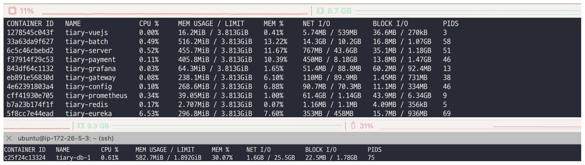
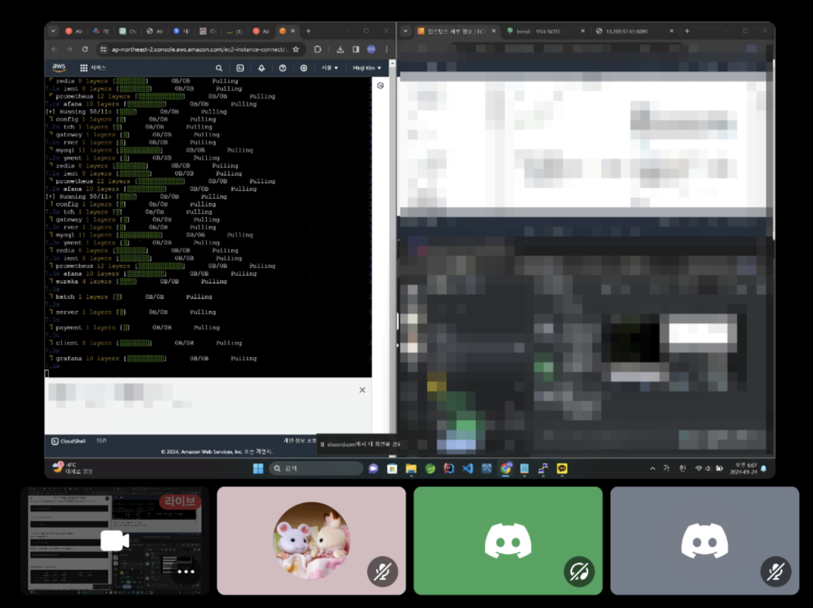

<!-- more -->

내 Free tier는 진즉 끝나버려서 내가 배포한 Tiary 서버는 돈이 나간다.. 💸

그래서 Free tier가 남아 있는 민지 언니의 EC2 서버로 이사하게 되었다

## 이삿짐 싸기

일단 Tiary는 라이트세일 서버에 DB, EC2 서버에 다른 모든 서비스가 배포 되어 있는 상태라 

DB+서비스로 합쳐서 새로운 서버에 배포해야했다

서비스 내리기 전에 컨테이너별 사용량 확인해봤는데, Free-tier 서버가 워낙 작다보니 이게 잘 돌아갈 수 있을까 싶었다..

``` bash
docker stats
```


### DB Volume 

Tiary DB는 저번 노노그래머스 DB와 달리 바인드 마운트가 아닌 볼륨을 사용한다

그래서 볼륨을 옮겨야 했다

??? quote
    아래를 참고해서 진행

    - [참고블로그 royleej9](https://royleej9.tistory.com/entry/Docker-volume-BackupRestore)
    - OpenAI ChatGPT

**volume 백업**

``` bash 
# tiary_tiary-data 볼륨의 내용을 backup.tar로 압축하여 현재 호스트의 작업 디렉토리에 생성
docker run --rm -v tiary_tiary-data: /data -v $(pwd):/backup ubuntu tar cvf /backup/backup.tar /data
```

- 백업 대상 volume을 사용하는 컨테이너 중지
- 백업 실행용 임시 컨테이너를 생성하여 백업파일(tar)을 생성한 후 해당 컨테이너 삭제
- `docker run --rm` : 도커 컨테이너를 시작 후 컨테이너가 종료되면 컨테이너 자동 삭제
- `-v tiary_tiary-data: /data` : `tiary_tiary-data` 볼륨을 컨테이너의 `/data` 디렉토리에 마운트 (해당 컨테이너에서 볼륨 데이터에 접근)
- `-v $(pwd):/backup` : 현재 작업 디렉토리를 컨테이너의 `/backup` 디렉토리에 마운트 (= 백업 파일을 호스트 시스템의 현재 작업 디렉토리에 저장하기 위함)
- `ubuntu` : ubuntu 이미지를 기반으로 새 컨테이너 생성
- `tar cvf /backup/backup.tar /data` : tar 명령을 사용하여 `/data` 디렉토리의 내용을 `/backup/backup.tar` 파일로 압축
    - `c` : 새로운 아카이브 생성
    - `v` : 처리되는 파일 표시 (상세 모드)
    - `f` : 아카이브 파일명 지정

이후 scp를 이용해 로컬로 파일을 전송받았다
``` bash title="Local"
scp -i ~/.ssh/tiary-awslight.pem ubuntu@0.0.0.0:/home/ubuntu/tiary/backup.tar ./
```

### prometheus.yml

``` yaml
global:
  scrape_interval: 5s

scrape_configs:
  - job_name: "multiple_services"
    metrics_path: "/actuator/prometheus"
    static_configs:
      - targets: [ "tiary-server:8088", "tiary-batch:8089", "tiary-payment:8889" ]
```


## 이삿날

AWS 계정주 민지 언니 + 나 + 다른 언니들까지 해서 디스코드 화상 회의로 진행했다

잠깐 라이브 해봤는데 약간 스트리머 된 것 같고 신기함..

민지 언니가 라이브를 키고, 다른 사람들이 보면서 채팅으로 방향 잡아주는 느낌으로 진행했다

{: style="height:60%;width:60%"}

1. AWS EC2 접속

2. [Install Docker](https://ysheee.github.io/docker/note/installation/)

3. Create DB volume 

    ``` bash
    ## tiary_20240124.tar : volume을 압축한 파일

    ## mkdir db_backup

    ## cd db_backup # 해당 디렉터리 안에 tiary_20240124.tar 파일 넣어두기

    docker volume create tiary-db-volume # 볼륨 생성

    docker run --rm -v tiary-db-volume:/var/lib/mysql -v $(pwd):/backup ubuntu sh -c "cd /var/lib/mysql && tar xvf /backup/tiary_20240124.tar --strip 1"

    docker volume ls
    ```

    - `-v tiary-db-volume:/var/lib/mysql` : tiary-db-volume이라는 도커 볼륨을 컨테이너의 /var/lib/mysql 디렉터리에 마운트합니다. MySQL이 이 경로를 데이터 저장소로 사용하게 되면서 컨테이너 내의 MySQL 데이터를 볼륨에 영구적으로 저장할 수 있습니다.
    - `-v $(pwd):/backup` : 현재 작업 디렉터리를 컨테이너의 /backup 디렉터리에 마운트합니다. (로컬 시스템에서 백업 파일을 컨테이너로 전송)
    - `ubuntu` : ubuntu 이미지를 기반으로 컨테이너 생성
    - `sh -c "cd /var/lib/mysql && tar xvf /backup/tiary_20240124.tar --strip 1` : 컨테이너 내에서 실행될 명령어 
    <br>
     (`var/lib/mysql` 디렉터리로 이동한 후, `/backup` 디렉터리에 있는 tiary_20240124.tar 파일을 현재 디렉터리 `/var/lib/mysql`로 압축 해제하며 `--strip 1` 옵션으로 인해 압축 해제 과정에서 최상위 디렉터리를 제거하고 파일들을 현재 경로에 직접 추출함) 

4. monitoring dir structure

    ``` bash
    monitoring/
    	 grafana/
    		 data/
    	 prometheus/
    		 prometheus.yml
    ```

5. [swap-memory](https://sundries-in-myidea.tistory.com/102)

6. docker-compose.yml 준비

    ``` yaml
    version: '3'
    services:
      client:
        container_name: tiary-vuejs
        image: dockerhub_name/tiary:client
        ports:
          - "5173:80"
        restart: always

      mysql:
        container_name: tiary-mysql
        image: mysql:8.0
        ports:
          - "3306:3306"
        restart: always
        volumes:
          - tiary-db-volume:/var/lib/mysql

      eureka:
        container_name: tiary-eureka
        image: dockerhub_name/tiary:eureka
        ports:
          - "8761:8761"
        depends_on:
          - mysql
        restart: always

      config:
        container_name: tiary-config
        image: dockerhub_name/tiary:config
        ports:
          - "9000:9000"
        depends_on:
          - eureka
        restart: unless-stopped

      server:
        container_name: tiary-server
        image: dockerhub_name/tiary:server
        environment:
          - TZ=Asia/Seoul
        ports:
          - "8088:8088"
        depends_on:
          - eureka
          - config
        restart: unless-stopped

      batch:
        container_name: tiary-batch
        image: dockerhub_name/tiary:batch
        environment:
          - TZ=Asia/Seoul
        ports:
          - "8089:8089"
        depends_on:
          - eureka
          - config
          - server
        restart: unless-stopped

      payment:
        container_name: tiary-payment
        image: dockerhub_name/tiary:payment
        environment:
          - TZ=Asia/Seoul
        ports:
          - "8889:8889"
        depends_on:
          - eureka
          - config
        restart: unless-stopped

      gateway:
        container_name: tiary-gateway
        image: dockerhub_name/tiary:gateway
        ports:
          - "8090:8090"
        depends_on:
          - eureka

      redis:
        container_name: tiary-redis
        image: redis
        ports:
          - "6379:6379"
        restart: unless-stopped

      prometheus:
        container_name: tiary-prometheus
        image: prom/prometheus
        ports:
          - "9090:9090"
        volumes:
          - ./monitoring/prometheus/prometheus.yml:/etc/prometheus/prometheus.yml

      grafana:
        container_name: tiary-grafana
        image: grafana/grafana
        ports:
          - "3000:3000"
        depends_on:
          - prometheus
        volumes:
          - ./monitoring/grafana/data:/var/lib/grafana

    volumes:
      tiary-db-volume:
        external: true
    ```

7. docker compose up

``` bash
docker-compose up -d && \
    docker-compose logs -f --tail 100
```


---
:construction: :fontawesome-solid-triangle-exclamation:

다음번에는 마냥 배포하지 말고, 효율을 위해 CPU limit도 알아보고 걸어봐야지

- [Docker Compose resources](https://docs.docker.com/compose/compose-file/compose-file-v3/#resources)
- [Docker Command config](https://docs.docker.com/config/containers/resource_constraints/)

이렇게 테스트 서버 이사하듯이 말고, 라이브 서비스 이사하는 거라 생각하면 어떻게 해야할까 :face_with_monocle:

monitoring도 볼륨으로 두어야겠다

---