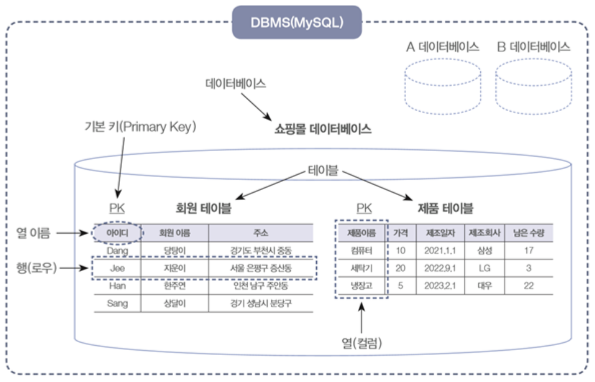
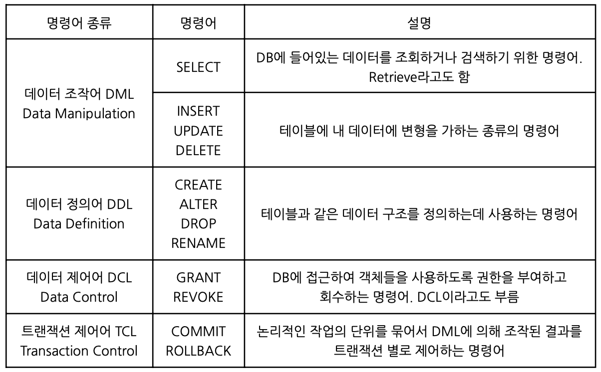

# DB

- DBMS : 효율적인 데이터 관리 뿐만 아니라 예기치 못한 사건으로 인한 데이터의 손상을 피하고, 필요한 데이터를 복구하기 위한 강력한 기능의 SW

- DB의 발전
    - 1960 : 플로우차트 중심의 개발, 파일구조 사용
    - 1970 : DB 관리기법이 처음 태동, 계층형/망형 DB 상용화 
    - 1980 : 관계형 DB 상용화, Oracle, Sybase 사용
    - 1990 : 객체 관계형 DB로 발전

## 데이터베이스 모델링

- 데이터 : 하나하나의 단편적인 정보
- 테이블 : 데이터 입력을 위해 표 형태로 표현한 것
- 데이터베이스(DB) : 테이블이 저장되는 저장소
- DBMS : 데이터베이스를 관리하는 시스템 또는 소프트웨어
- 열(=컬럼,필드,애트리뷰트) : 열 이름은 테이블 내에서 중복되지 않음
- 행(=로우,레코드,튜플,인스턴스) : 실질적인 데이터

## SQL

- 관계형 데이터베이스 관리 시스템(DBMS)의 데이터를 관리하기 위해 설계한 특수 목적의 프로그래밍 언어
- IBM에서 1970년대초에 도널드 D.챔벌린과 레이먼드 F.보이스가 개발
- SQL은 대소문자를 구분하지 않음   (서버 환경이나 DBMS 종류 따라 DB 또는 필드명에 대해 대소문자를 구분하기도 함)
- SQL 명령은 세미콜론(`;`)으로 끝난다
- 고유 값은 따옴표(``)로 감싸준다
- 한 줄 주석은 `--`, 여러 줄 주석은 `/**/`

### SQL 문법

### SQL - Key

|        종류       |       설명      | 
| :--------------: | :------------: |
| 기본키 Primary key | 테이블의 각 튜플들을 고유하게 식별하는 컬럼|
| 대체키 Alternate key | 후보키 중에서 기본키로 선택되지 않은 키|
| 후보키 Candidate key | 테이블에서 각 튜플을 구별하는 데 기준이 되는 칼럼   기본키와 대체키를 합친 키
| 슈퍼키 Super key | 릴레이션을 구성하는 모든 튜플에 대해 유일성은 만족, 최소성은 만족하지 못하는 키
| 외래키 Foreign key | 테이블 간 참조 데이터 무결성을 위한 제약 조건 한 릴레이션의 칼럼이 다른 릴레이션의 기본키로 이용되는 키 여러 개 존재할 수 있으며, Null값도 허용

---

!!! quote
    - 김정현 (unicodaum@hanmail.net)
    - 수제비 정보처리기사 실기 (저자:윤영빈, 서용욱, 김학배, 박인상 |출판사:건기원)
    - [Data-On-Air](https://www.google.com/url?sa=t&rct=j&q=&esrc=s&source=web&cd=&ved=2ahUKEwj6wqqAqaGBAxWZcvUHHUDBAOwQFnoECAYQAQ&url=https%3A%2F%2Fdataonair.or.kr%2F&usg=AOvVaw2_msrIWeT-T38KloheDWme&opi=89978449)
