# DML 데이터 조작어 
데이터를 추가/조회/수정/삭제하기 위한 언어 (INSERT, SELECT, UPDATE, DELETE)

- SELECT절에 등장하는 컬럼들이 하나의 테이블에서 모두 꺼낼 수 있으면 **서브쿼리** 사용
- SELECT절에 등장하는 컬럼들이 여러 테이블에서 꺼내야 하면 **JOIN** 사용

## SELECT

``` mysql
SELECT [ALL|DISTINCT] 속성명1, 속성명2... FROM 테이블명1, ...
[WHERE 조건]
[GROUP BY 속성명1, ...] 
[HAVING 그룹조건]
[ORDER BY 속성 [ASC|DESC]];
```
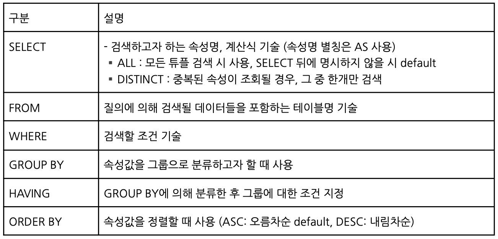

- `LIMIT` : 출력 개수 제한
``` mysql
SELECT *
FROM table
LIMIT 3;
```
- SELECT 문장의 실행 순서


### WHERE
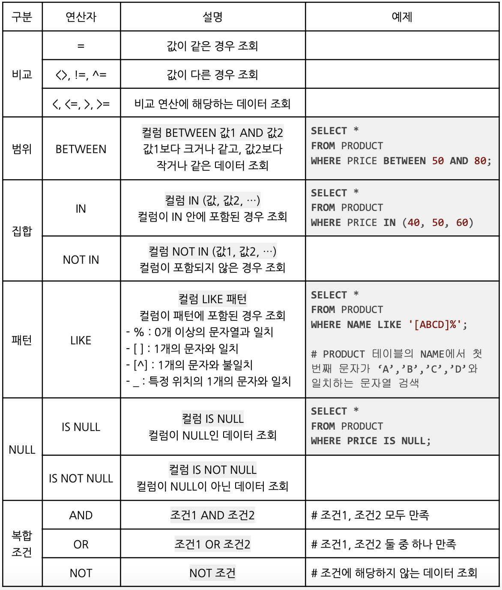

### GROUP BY & HAVING
속성값을 그룹으로 분류 & 그룹에 대한 조건 지정
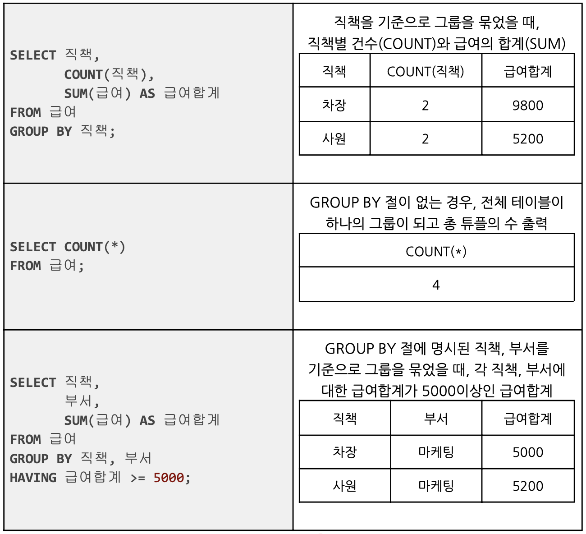

### ORDER BY
- NULL을 가장 작은 수로 보고 정렬
- Alias명, 컬럼순서 정수 혼용 O 
``` mysql
SELECT *
FROM 성적
ORDER BY 과목 DESC, 이름 ASC;
```

### JOIN
두 개 이상의 테이블을 연결하여 데이터를 검색하는 방법<br>
두 릴레이션으로부터 관련된 튜플들을 결합하여 하나의 튜플로 만드는 가장 대표적인 데이터 연결 방법
``` mysql
SELECT *
FROM emp
    JOIN dept 
    ON emp.deptno=dept.deptno;

SELECT *
FROM emp
    JOIN dept
    USING(deptno);
```
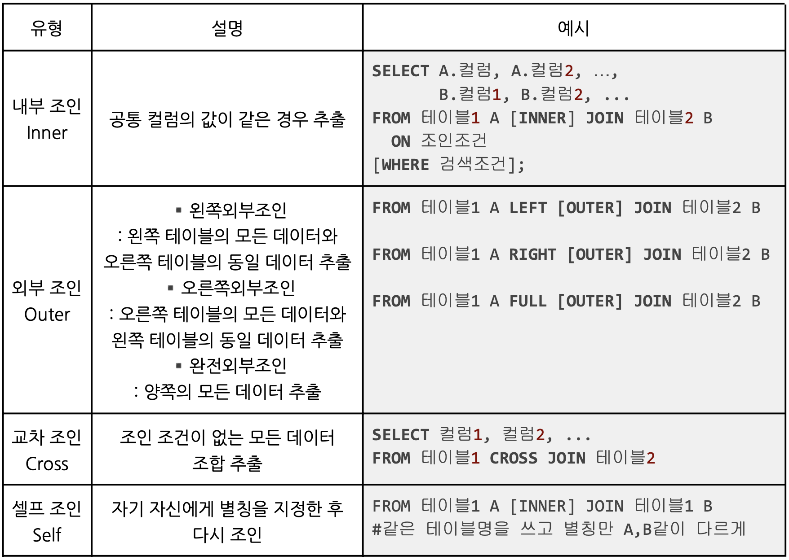

#### Example
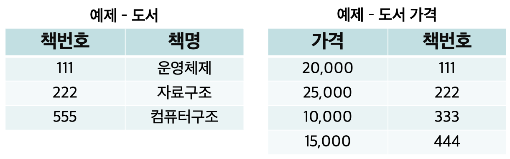

- 내부 조인 : 책번호가 같은 것끼리 조인
``` mysql
SELECT A.책번호, A.책명, B.가격 
FROM 도서 A
    JOIN 도서가격 B
    ON A.책번호 = B.책번호;
```
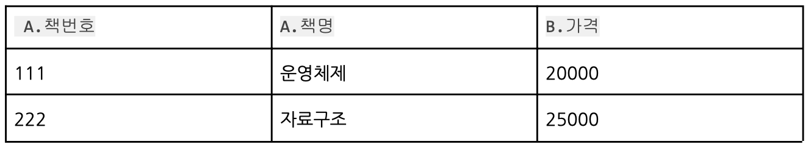

- 왼쪽 외부 조인 : 왼쪽에 위치한 도서테이블 기준으로 조인
``` mysql
SELECT A.책번호, A.책명, B.책번호, B.가격 
FROM 도서 A
    LEFT JOIN 도서가격 B 
    ON A.책번호 = B.책번호;
```
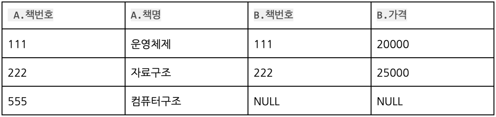

- 오른쪽 외부 조인 : 오른쪽에 위치한 도서가격 테이블 기준으로 조인
``` mysql
SELECT A.책번호, A.책명, B.책번호, B.가격 
FROM 도서 A
    RIGHT JOIN 도서가격 B 
    ON A.책번호 = B.책번호;
```
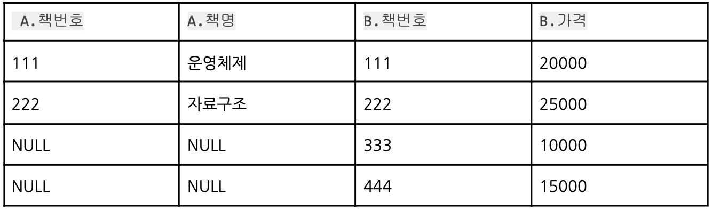

- ~~완전 외부 조인~~ : MySQL은 완전 외부 조인을 지원하지 않으므로 다음과 같이 구현
``` mysql
SELECT * FROM A
LEFT JOIN B ON A.id = B.id
UNION
SELECT * FROM A
RIGHT JOIN B ON A.id = B.id;
```
!!! Note
    - 완전 외부 조인
    ``` mysql
    SELECT A.책번호, A.책명, B.책번호, B.가격 
    FROM 도서 A
        FULL JOIN 도서가격 B 
        ON A.책번호 = B.책번호;
    ```
    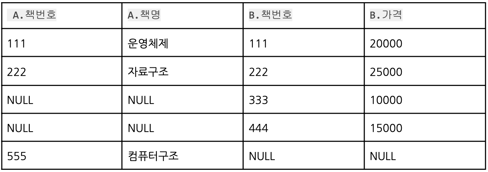

- 교차 조인 (=Cartesian product: 유효 Join 조건이 없을때 행*행 연산)
``` mysql
SELECT A.책번호, A.책명, B.책번호, B.가격 
FROM 도서 A
    CROSS JOIN 도서가격 B;
```
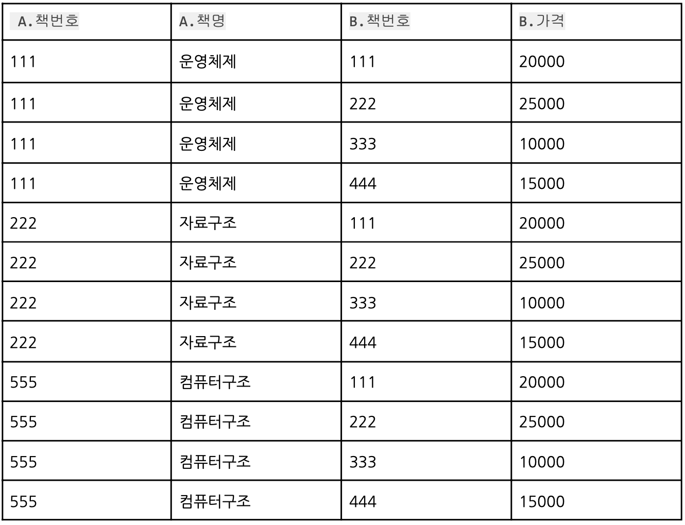

- 셀프 조인
``` mysql
SELECT A.책번호, A.책명, B.책번호, B.책명 
FROM 도서 A
    JOIN 도서 B;
    ON A.선수과목_책번호 = B.책번호;
```
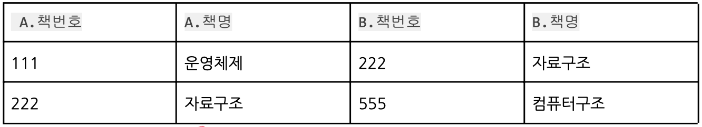

### 서브쿼리 
SQL문 안에 포함된 또다른 SQL. 알려지지 않은 기준을 검색하기 위함

- FROM 서브쿼리
<br>서브쿼리가 FROM절 안에 있는 형태. 인라인 뷰(Inline Views)라고 불림
<br>뷰처럼 결과가 동적으로 생성된 테이블 형태로 사용할 수 있음
``` mysql
-- B라는 서브쿼리의 결과 값 중 ‘책번호’가 같은 책의 최대 가격 출력
SELECT MAX(가격) AS 가격 
FROM 도서가격 A,
(SELECT 책번호
FROM 도서
WHERE 책명='자료구조') B
WHERE A.책번호=B.책번호
```
- WHERE 서브쿼리
<br>서브쿼리가 WHERE절 안에 있는 형태. 중첩 서브쿼리라고도 불림
``` mysql
-- 서브쿼리에서 나온 ‘책번호’와 <도서가격>테이블에 있는 ‘책번호’와 같은 책의 최대 가격 출력
SELECT MAX(가격) AS 가격
FROM 도서가격
WHERE 책번호 IN (SELECT 책번호
FROM 도서
WHERE 책명='자료구조');
```

#### 단일 행 연산자
연산 결과가 1건 이하인 경우
`>`, `<`, `=`, `>=`, `<=`

#### 다중 행 연산자
서브 쿼리의 결과가 여러 개의 튜플을 반환하는 다중 행 서브쿼리에서 사용되는 연산자
<br>단일 행 비교 연산자 <, >, =, <>와 결합하여 사용

- IN : 리턴되는 값 중 조건에 해당하는 값이 있으면 참
- ANY : 서브쿼리에 의해 리턴되는 각각의 값과 조건을 비교하여 하나 이상 만족하면 참
- ALL : 서브쿼리에 의해 리턴되는 모든값과 비교하여 모든 값을 만족하면 참
- EXISTS : 메인 쿼리의 비교 조건이 서브쿼리의 결과 중 하나라도 만족하면 참 

``` mysql
SELECT EMP_ID, EMP_NAME, DEPT_ID 
FROM EMP
WHERE EMP_ID IN (SELECT MGR_ID FROM DEPT);
```

### SET Operator 집합연산자
테이블을 집합 개념으로 보고, 두 테이블 연산에 집합 연산자를 사용하는 방식<br>
여러 질의 결과를 연결하여 하나로 결합하는 방식 사용

- UNION : 중복행이 제거된 쿼리 결과 반환
- UNION ALL : 중복행이 제거되지 않은 쿼리 결과 반환
- ~~INTERSECT~~ : 두 쿼리 결과에 공통적으로 존재하는 결과 반환
- ~~MINUS~~ : 첫 쿼리에 있고, 두번째 쿼리에는 없는 결과 반환

#### Example
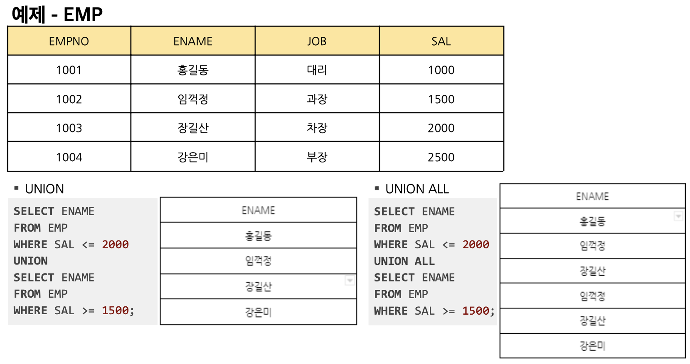

### 데이터 분석 함수

#### 집계 함수
여러 행 또는 테이블 전체 행으로부터 하나의 결과를 반환하는 함수
<br>NULL값을 가지는 행은 제외한 후 산출하며 ALIAS 사용 불가

|    함수     |     설명    | 
| :--------: | :--------: |
| `COUNT` | 행의 개수 반환|
| `COUNT(DISTINCT)` | 행의 개수 반환|
| `SUM` | 해당 컬럼 간 합 계산|
| `AVG` | 해당 컬럼 간 평균 계산|
| `MAX` | 해당 컬럼 중 최대값 계산|
| `MIN` | 해당 컬럼 중 최소값 계산|
| `STDEV` | 해당 컬럼 간의 표준편차 계산|
| `VAR_SAMP()` | 해당 컬럼 간의 분산 계산|

#### 그룹 함수
소그룹 간의 소계 및 중계 등의 중간 합계 분석 데이터를 산출하는 함수
<br> ROLLUP, CUBE, GROUPING SETS

- ROLLUP
``` mysql
SELECT 컬럼1, 컬럼2, ..., 집계함수
FROM 테이블명
[WHERE ...]
GROUP BY [컬럼...] WITH ROLLUP
[HAVING ...]
[ORDER BY ...]
```
    - 소계 등 중간 집계 값을 산출하기 위한 그룹 함수
    - 지정 컬럼의 수보다 하나 더 큰 레벨만큼의 중간 집계 값이 생성됨
    - 계층별로 구성되기 때문에 **순서가 바뀌면 수행 결과가 바뀐다**
    - SELECT 뒤에 포함되는 컬럼이 GROUP BY/ROLLUP 뒤에 기재되어야 함

- CUBE
``` mysql
SELECT 컬럼1, ..., 집계함수
FROM 테이블명
[WHERE ...]
GROUP BY CUBE (컬럼명a, ...) 
[HAVING ...]
[ORDER BY ...]
```
    - 결합 가능한 모든 값에 대해 다차원 집계를 생성하는 그룹 함수
    - 연산이 많아 시스템에 부담을 준다

- GROUPING SETS
``` mysql
SELECT 컬럼명1, ..., 집계함수 
FROM 테이블명
[WHERE ...]
GROUP BY GROUPING SETS(컬럼명1, ...) 
[HAVING ...]
[ORDER BY ...]
```
    - 집계 대상 컬럼들에 대한 개별 집계를 구할 수 있으며, ROLLUP이나 CUBE와는 달리 컬럼 간 순서와 무관한 결과를 얻을 수 있는 그룹 함수

Example
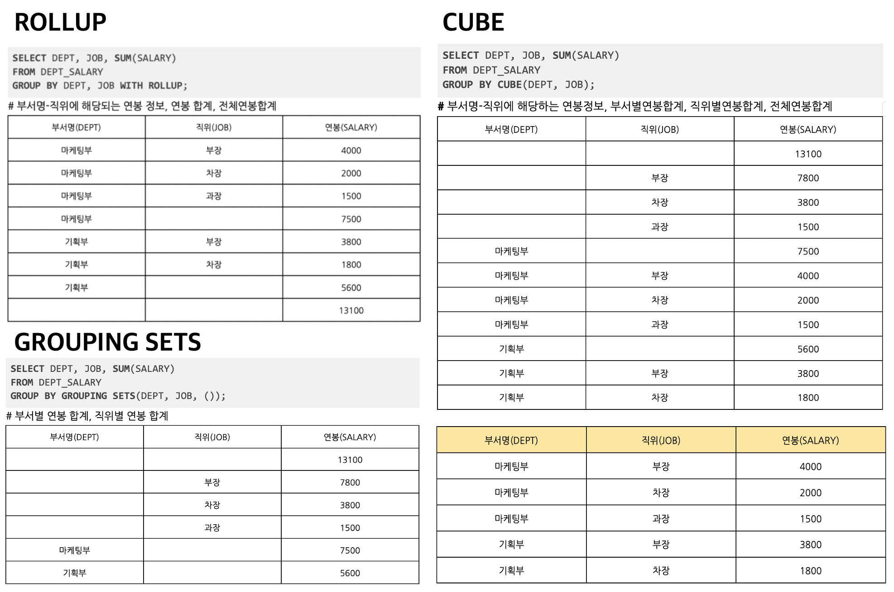

#### 윈도 함수 (=OLAP 함수)
DB를 사용한 온라인 분석 처리 용도로 사용하기 위해 표준 SQL에 추가된 기능
``` mysql
SELECT 함수명(파라미터)
OVER
([PARTITION BY 컬럼1, ...])
[ORDER BY 컬럼A, ...]
FROM 테이블명
```

- 순위 함수
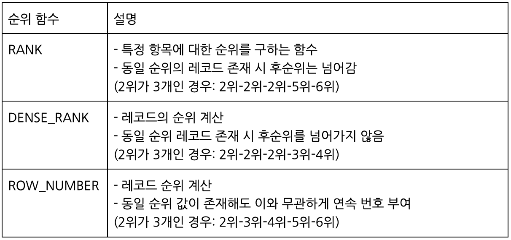
``` mysql
SELECT NAME, SARALY, 
    RANK( ) OVER (ORDER BY SALARY DESC) A,
	DENSE_RANK( ) OVER (ORDER BY SALARY DESC) B,
	ROW_NUMBER( ) OVER (ORDER BY SALARY DESC) C
FROM EMPLOYEE;
```
---
## INSERT
테이블 내 데이터 삽입
``` mysql
INSERT INTO 테이블명(속성명1, ...) 
VALUES (데이터1, ...);
```

- 속성과 데이터 개수, 데이터 타입 일치해야 가능 (속성명은 생략 가능)
- 속성 타입이 숫자인 경우 ‘ ‘ 따옴표 생략, 문자열인 경우 ‘ ‘ 따옴표 필수

Q. [학생]테이블에 학번이 6677, 성명 ‘장길산’, 학년이 3학년, 수강과목은 ‘수학’인 학생 삽입
``` mysql
INSERT INTO 학생(학번, 성명, 학년, 수강과목)
VALUES (6677, '장길산', 3, '수학');
```

---
## UPDATE
테이블 내 데이터 변경
``` mysql
UPDATE 테이블명
SET 속성명 = 데이터, ... 
WHERE 조건;
```

Q. [학생]테이블에 장길산의 주소를 인천으로 수정
``` mysql
UPDATE 학생
SET 주소='인천' 
WHERE 이름='장길산';
```

---
## DELETE
테이블 내 데이터 삭제 
``` mysql
DELETE FROM 테이블명 
WHERE 조건;
```

Q. [학생]테이블에 장길산에 대한 튜플 삭제
``` mysql
DELETE FROM 학생 
WHERE 이름='장길산'
```

---
!!! quote
    - 김정현 강사님
    - 수제비 정보처리기사 실기 (저자:윤영빈, 서용욱, 김학배, 박인상 |출판사:건기원)
    - [Data-On-Air](https://www.google.com/url?sa=t&rct=j&q=&esrc=s&source=web&cd=&ved=2ahUKEwj6wqqAqaGBAxWZcvUHHUDBAOwQFnoECAYQAQ&url=https%3A%2F%2Fdataonair.or.kr%2F&usg=AOvVaw2_msrIWeT-T38KloheDWme&opi=89978449)