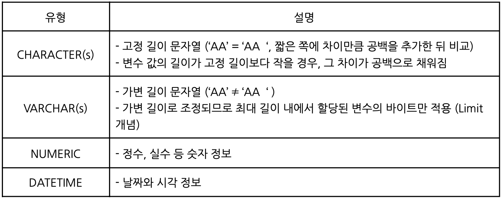
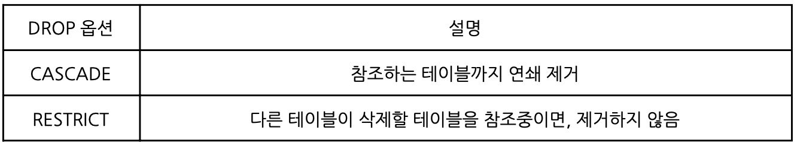
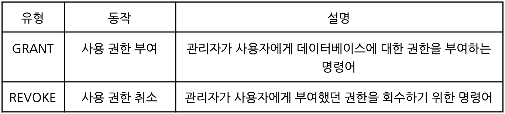
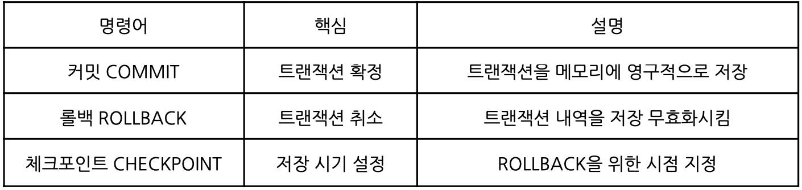

# MySQL

- 오픈 소스 DBMS
- 썬 마이크로시스템즈의 인수 후, 회사가 오라클에 인수되며 현재는 오라클 소유

## DDL 데이터 정의어
각 릴레이션을 정의하기 위해 사용하는 언어 (CREATE, ALTER, DROP)

### 테이블 생성 시 주의해야할 규칙
1. 테이블명은 객체를 의미할 수 있는 적절한 이름으로 지정 (가능한 단수형)
2. 테이블명은 다른 테이블 이름과 중복되지 않아야 함
3. 한 테이블 내에서 컬럼럼명이 중복될 수 없음
4. 각 컬럼들은 괄호`()`로 묶어 지정하고, 콤마`,`로 구분되며 항상 세미콜론`;`으로 끝난다
5. 컬럼에 대해서는 다른 테이블까지 고려하여 일관성 있게 사용한다
6. 컬럼 뒤에 데이터 유형은 꼭 지정되어야한다
7. 테이블명과 컬럼명은 반드시 문자로 시작해야하고, 벤더별로 길이 제한이 있다
8. 예약어(Reserved word)는 사용할 수 없다
9. `A-Z, a-z, 0-9, _, $, #` 문자만 허용된다

### 데이터 유형


### 제약조건 CONSTRAINT
데이터 무결성을 유지하기 위한 DB의 보편적인 방법. 테이블의 특정 칼럼에 설정하는 제약

|        구분       |       설명      | 
| :--------------: | :------------: |
| PRIMARY KEY 기본키 | 테이블의 기본키 정의<br>자동으로 **UNIQUE** 인덱스 생성, NULL 입력 불가|
| FOREIGN KEY 외래키 | 테이블 간의 관계 정의<br>여러 개 존재할 수 있으며, Null값도 허용|
| UNIQUE | 유일값을 갖는 키, NULL 가능|
| NOT NULL | NULL 값 입력 불가
| CHECK | TRUE or FALSE로 평가할 수 있는 논리식 지정
| DEFAULT | 데이터 입력 시 칼럼의 값이 지정되어 있지 않은 경우, 기본값으로 설정해주는 제약 조건

### 테이블 생성 CREATE TABLE

``` mysql
CREATE TABLE 테이블명 (
컬럼명 데이터타입 [제약조건],
사번 VARCHAR(10) PRIMARY KEY,
업무 VARCHAR(20) FOREIGN KEY REFERENCES 참조테이블(기본키), 
이름 VARCHAR(10) UNIQUE,
생년월일 CHAR(8) NOT NULL,
성별 CHAR(1) CHECK (성별 = 'M' OR 성별 = 'F'),
입사일 DATE DEFAULT SYSDATE
CONSTRAINT table_pk 제약조건 (Column)
)
```

- 테이블 구조 확인
``` mysql
sp_help 'dbo.테이블명'
```

### 테이블 수정 ALTER TABLE
- ADD COLUMN
``` mysql
ALTER TABLE 테이블명 ADD 컬럼명 데이터타입 [제약조건]; 
ALTER TABLE 사원 ADD 전화번호 VARCHAR(11) UNIQUE;
```
- MODIFY COLUMN
``` mysql
ALTER TABLE 테이블명 MODIFY 컬럼명 데이터타입 [제약조건];
ALTER TABLE 사원 MODIFY 이름 VARCHAR(30) NOT NULL;
```
- DROP COLUMN
``` mysql
ALTER TABLE 테이블명 DROP COLUMN 컬럼명; 
ALTER TABLE 사원 DROP COLUMN 생년월일;
```
- ADD CONSTRAINT
``` mysql
ALTER TABLE 테이블명 ADD CONSTRAINT 제약조건명 제약조건 (칼럼명);
ALTER TABLE PLAYER ADD CONSTRAINT PLAYER_FK FOREIGN KEY (TEAM_ID) REFERENCES TEAM(TEAM_ID);
```
- RENAME TABLE
``` mysql
sp_rename 변경전_테이블명, 변경후_테이블명;
```

### 테이블 삭제 DROP TABLE


``` mysql
DROP TABLE 테이블명 [CASCADE | RESTRICT]; 
```

테이블 내의 데이터(=모든 행) 삭제 TRUNCATE TABLE
``` mysql
TRUNCATE TABLE 테이블명; 
```

## DCL 데이터 제어어
DB 관리자가 데이터 보안, 무결성 유지, 병행 제어, 회복을 위해 사용하는 제어용 언어



- ROLE : 사용자와 권한 사이에서 중개 역할 수행
- GRANT 권한 부여
``` mysql
GRANT 권한 ON 테이블 TO 사용자;
``` 
- REVOKE 권한 회수
``` mysql
REVOKE 권한 ON 테이블 FROM 사용자;
```

## TCL 트랜잭션 제어어
트랜잭션의 결과를 허용하거나 취소하는 목적으로 사용되는 언어



``` mysql
SET TRANSACTION : 트랜잭션 모드 설정
BEGIN : 트랜잭션 시작
LOCK : TABLE 등의 자원을 차지
```

### **트랜잭션 특성 ACID** :star:

- 원자성 Atomicity : 트랜잭션의 연산 전체가 모두 정상적으로 실행되거나 모두 취소되거나
- 일관성 Consistency : 시스템의 고정요소는 트랜잭션의 수행 전과 수행 후의 상태가 같아야 함
- 고립성 Isolation : 동시에 시행되는 트랜잭션들이 서로 영향을 미치지 않아야 함
- 영속성 Durability : 성공이 완료된 트랜잭션의 결과는 영속적으로 DB에 저장되어야 함

!!! note
    고립성 Isolation이 낮을 경우 문제점

    - Dirty Read : 다른 트랜잭션에 의해 수정되고, 아직 커밋되지 않은 데이터를 읽음
    - Non-Repetable : 트랜잭션에서 같은 쿼리를 두 번 수행할 때, 그 사이에 다른 트랜잭션이 건드려 두 쿼리 결과가 다른 상황
    - Phantom-Read : 트랜잭션에서 같은 쿼리를 두 번 수행할 때, 첫번째 쿼리에서는 없던 유령 레코드가 두번째 쿼리에서 나타나는 상황

---
!!! quote
    - 김정현 강사님
    - 수제비 정보처리기사 실기 (저자:윤영빈, 서용욱, 김학배, 박인상 |출판사:건기원)
    - [Data-On-Air](https://www.google.com/url?sa=t&rct=j&q=&esrc=s&source=web&cd=&ved=2ahUKEwj6wqqAqaGBAxWZcvUHHUDBAOwQFnoECAYQAQ&url=https%3A%2F%2Fdataonair.or.kr%2F&usg=AOvVaw2_msrIWeT-T38KloheDWme&opi=89978449)