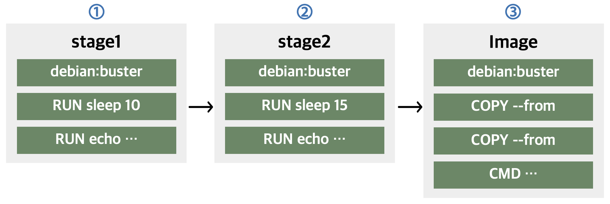
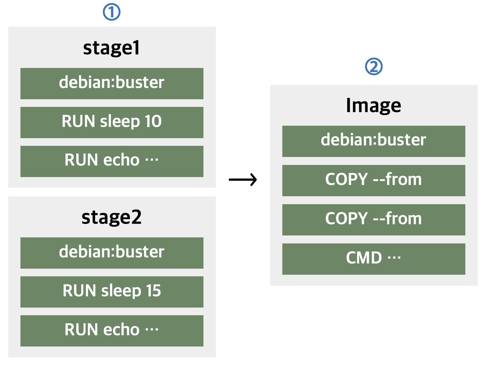

# Buildkit
\: a toolkit for converting source code to build artifacts in an efficient, expressive and repeatable manner.  
\: **It can run build steps in parallel** when possible

- Distributable workers  
- Nested build job invocations  
- Build cache import/export  
- Execution without root privileges  
- ...

---
## Setting
:fontawesome-solid-star: Docker Desktop
: **BuildKit is enabled by default for all users on Docker Desktop.**  
 you don’t have to manually enable BuildKit.   

If you want to change the buildkit setting
```bash
1. Docker Desktop → Preference → Docker Engine 
2. 다음을 false로 변경

  "features": {
    "buildkit": true
}
```

:fontawesome-solid-star: Linux   
① To set the BuildKit environment variable when running the docker build command  
```bash
DOCKER_BUILDKIT=1 docker build -t name .
```
② To set enable docker BuildKit by default,  
```bash
1. /etc/docker/daemon.json에 추가
{
  "features": {
    "buildkit" : true
  }
}
2. Restart the Docker daemon
```
---
## Comparison between `build` and `buildkit`

```Dockerfile title="Dockefile"
FROM debian:buster AS stage1
RUN sleep 10
RUN echo "Stage1" > /opt/stage1

FROM debian:buster AS stage2
RUN sleep 15
RUN echo "Stage2" > /opt/stage2

FROM debian:buster
COPY --from=stage1 /opt /opt
COPY --from=stage2 /opt /opt
CMD cat /opt/stage1 && cat /opt/stage2
```
### Build
각 스테이지를 순차적으로 수행하므로 30초가 넘는 빌드 시간이 소요된다.
{:style width=70%;height=70%}
```bash
Sending build context to Docker daemon
33.67MB
Step 1/10 : FROM debian: buster AS stagel
buster: Pulling from library/debian
15639959ffec: Pull complete
Digest: sha256:bb8c62f9f540a5f5f49f7ed5caaee2889f999cd14553f2aaccaf1fa4fcb998d
Status: Downloaded newer image for debian: buster
---› dOb8bc043c15
Step 2/10 : RUN sleep 10
-› Running in 095a95d95e15
Removing intermediate container 095a95d95e15
---› 989eeafa5fa6
Step 3/10 : RUN echo
...
Step 10/10 : CMD cat /opt/stage1 && cat /opt/stage2
---› Running in 328840ed8b40
Removing intermediate container 328840ed8b40
-› 14b7a945c606
Successfully built 14b7a945c606
Successfully tagged test: latest
```

### Buildkit
빌드하는 데 대략 21초 소요된다.  
{:style width=50%;height=50%}  
``` bash
[+] Building 21.1 (12/12) FINISHED
=› [internal] load build definition from Dockerfile
=›=› transferring dockerfile: 309B
=> [internal] load .dockerignore
=› =› transferring context: 2B
=> [internal] load metadata for docker.io/library/debian:buster
=› [auth] library/debian:pull token for registry-1.docker.io
=› [stage2 1/3] FROM docker.io/library/debian:buster...
...
=› [stage2 2/3] RUN sleep 15
=› [stage1 2/3] RUN sleep 10
=› [stage1 3/3] RUN echo "Stage1" > /opt/stage1
=› [stage-2 2/3] COPY --from=stage1 /opt /opt
=› [stage2 3/3] RUN echo "Stage2" > /opt/stage2
=› [stage-2 3/3] COPY--from=stage2 /opt /opt
=› exporting to image
=› =› writing image sha256: 06549dc573906d6f9d7cf4b2dleab251e766b2e6933068d7ad6b5fe4f3ab91f5
=› =› naming to docker.io/library/buildkit_test
```

!!!quote
    - docker-docs:BuildKit :material-arrow-right-bold:
    [BuildKit-docs](https://docs.docker.com/build/buildkit/)  
    - Github:BuildKit :material-arrow-right-bold:
    [BuildKit-Github](https://github.com/moby/buildkit)  
    - Useful Blog :material-arrow-right-bold:
    [Blog1](https://blukat.me/2021/07/docker-buildkit-speedup/)

