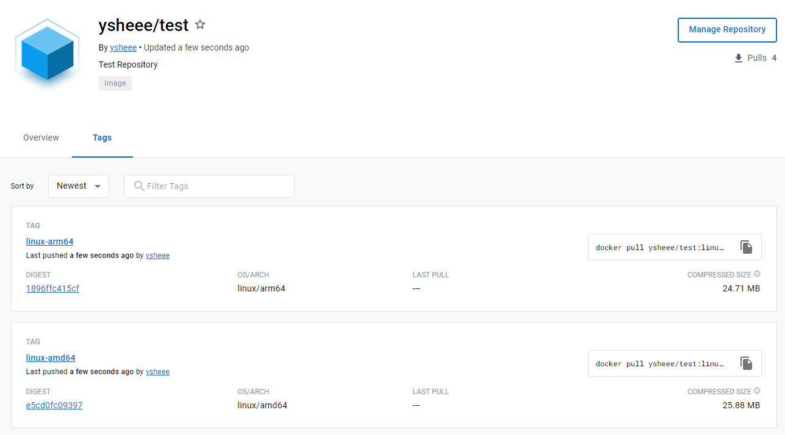
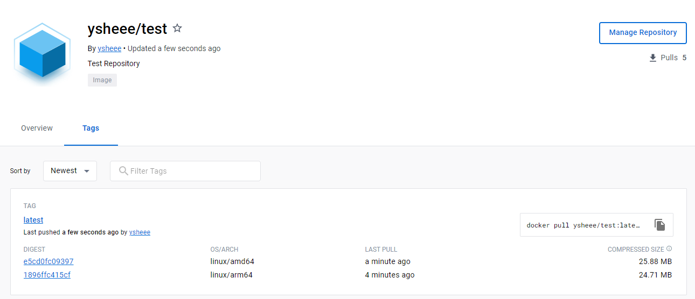
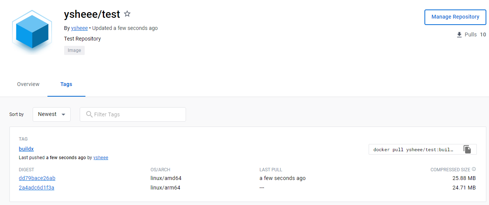

# Multi Architecture Image
:서로 다른 OS 및 Architecture에 따라 그 변형을 결합할 수 있는 컨테이너 이미지 유형  
:Multi Architecture Build의 경우, Container Client는 OS 및 Architecture와 일치하는 이미지를 자동으로 선택한다.  
---
다음과 같은 간단한 소스코드를 <**arm**>에서 이미지로 빌드했을 때
```dockefile title="Dockefile"
FROM debian:buster-20221114-slim
RUN echo "1234" >> /opt/ma
```
- 당연하게도, 해당 환경에서는 컨테이너 실행이 가능하다.
``` bash
docker run -it {image} /bin/bash
cat opt/ma
# 1234
```
- 그러나 다른 환경에서는 실행이 불가능한데, 이는 이미지가 'ARM architecture' 이미지이기 때문이다.
``` bash
# amd에서 실행할 시, 다음과 같은 오류를 출력한다.
WARNING: The requested image's platform (linux/arm64/v8) does not match the detected host platform (linux/amd64) and no specific platform was requested
exec /bin/bash: exec format error
``` 
따라서, 이미지를 여러 환경에서 실행할 수 있도록 Multi-Architecture Image로 구성해야 한다.
!!! tip
    다음 명령어를 통해서도 해당 이미지가 'ARM architecture'임을 알 수 있다.  
    `docker image inspect image_name -f '{{.Os}}/{{.Architecture}}'` 

---

## Manifest + DockerHub
- Manifest : layer, size, digest 등의 이미지 정보. 이를 통해 이미지를 고유하게 식별한다.  
- Manifest list : 하나 이상의 이미지 이름을 지정하여 생성되는 이미지 레이어 목록.   

Manifest는 아직 **Experimental Features**이므로 config.json에 다음 내용을 추가한다.
```title="~/.docker/config.json"
{
	"experimental":"true"
}
```
:octicons-arrow-down-16:manifest 명령이 실행 되는지 확인  
`docker manifest inspect`를 통해 해당 이미지의 OS, Architecture, size, digest 등 세부정보를 확인할 수 있다.
```
docker run hello-world
docker manifest insepct hello-world
```
:wink: manifest 명령이 잘 실행된다면, manifest를 생성함으로써 Multi-Architecture Image를 도커 허브로 push할 수 있다.  
① Image `build` and `push`
``` bash
# Image build
docker build -t ysheee/test:linux-arm64 --platform linux/arm64 .
docker build -t ysheee/test:linux-amd64 --platform linux/amd64 .

# 해당 태그를 가진 이미지 모두 push
docker push ysheee/test -a
```
{: style="height:60%;width:60%"}  

② Create manifest and push 
```bash
# Create manifest
# docker manifest create {manifest_name} {image_name} {image_name}
docker manifest create ysheee/test ysheee/test:linux-arm64 ysheee/test:linux-amd64 

# push manifest
# docker manifest push {manifest_name}
docker manifest push ysheee/test
```
{: style="height:60%;width:60%"}  

이제, 해당 이미지를 다시 amd 환경에서 실행시켜보면 잘 돌아가는 것을 확인할 수 있다.
```bash
docker pull ysheee/test:latest
docker run ysheee/test:latest
```
---

## BuildX 
:확장된 빌드 기능이 포함된 Docker CLI plugin  

① docker buildx 실행 확인
```bash 
docker buildx

# Builder Instance 확인
docekr buildx ls
```
② Builder Instance 생성 및 사용 설정
```
docker buildx create --name new_builder --driver docker-container --use
```   
- `--name`: builder 이름  
- `--driver`  
* docker: docker daemon에 내장된 builder  
* docker-container: docker를 통해 생성된 buildkit container 사용 (default)  
* kubernetes*  
- `--use` : default builder로 설정  

③ `Build` and `Push`
```bash
docker buildx build -t ysheee/test:buildx --platform linux/amd64,linux/arm64 --push .
```
{: style="height:60%;width:60%"}  


---
!!!info
    My environment:   
    - MacOS (arm64)  
    - Ubuntu 20.04(amd64)  

!!!quote
    **Manifest**  
    - Docker Document - manifest :material-arrow-right-bold:
    [Docs-manifest](https://Docs.docker.com/engine/reference/commandline/manifest/)  
    - MS Document :material-arrow-right-bold:
    [MS-Doc](https://learn.microsoft.com/ko-kr/azure/container-registry/push-multi-architecture-images)   
    **BuildX**  
    - Docker Document - BuildX :material-arrow-right-bold:
    [Docs-Buildx](https://docs.docker.com/engine/reference/commandline/buildx/)  
    - BuildX Github :material-arrow-right-bold:
    [Github-Buildx](https://github.com/docker/buildx)    
    - Useful Post - NHN :material-arrow-right-bold:
    [NHN-post](https://meetup.nhncloud.com/posts/255)  
    - Useful Blog :material-arrow-right-bold:
    [Blog1](https://80000coding.oopy.io/54dc871d-30c9-46cb-b609-2e8831541b5e)  

    