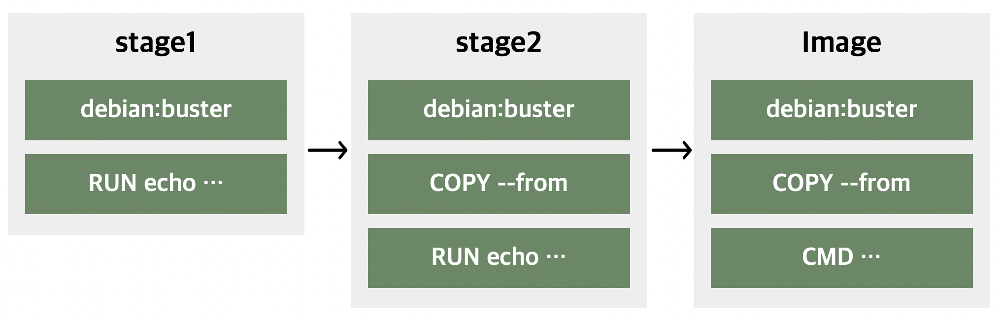
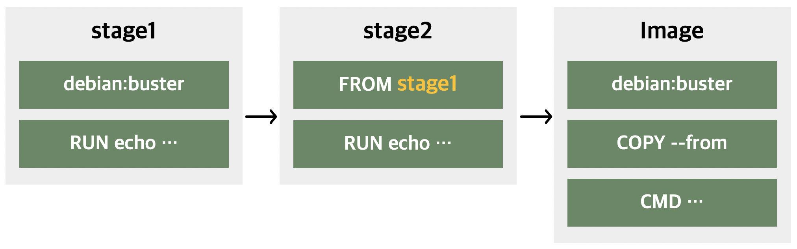

: 단계를 나누어 빌드함으로써 최종 이미지에는 필요하지 않은 환경을 제거하여 이미지를 생성하는 방법<div>
: 이미지 크기를 축소함으로써 애플리케이션의 배포 시간 단축

## Example

Builder Pattern을 준수하는 애플리케이션 형태<div>
\: 애플리케이션 **build**에 필요한 모든 것이 포함된 Dockerfile과 **production**을 위한 가벼운 Dockerfile. 총 두 파일이 필요하고,<div>
\: build.sh 스크립트를 통해 다음과 같은 과정을 거쳤어야 했다.<div>
\: 첫번째 이미지 빌드 → 컨테이너 생성하여 artifact 복사 → 두번째 이미지 빌드

```Dockerfile title="build.Dockerfile"
# syntax=docker/dockerfile:1
FROM golang:1.16
WORKDIR /go/src/github.com/alexellis/href-counter/
COPY app.go ./
RUN go get -d -v golang.org/x/net/html \
  && CGO_ENABLED=0 go build -a -installsuffix cgo -o app .
```
```Dockerfile title="Dockerfile"
# syntax=docker/dockerfile:1
FROM alpine:latest
RUN apk --no-cache add ca-certificates
WORKDIR /root/
COPY app ./
CMD ["./app"]
```
```shell title="build.sh"
#!/bin/sh
echo Building alexellis2/href-counter:build
docker build -t alexellis2/href-counter:build . -f build.Dockerfile

docker container create --name extract alexellis2/href-counter:build
docker container cp extract:/go/src/github.com/alexellis/href-counter/app ./app
docker container rm -f extract

echo Building alexellis2/href-counter:latest
docker build --no-cache -t alexellis2/href-counter:latest .
rm ./app
```

Multi-stage Builds를 이용하면 이를 간단하게 구현할 수 있다.
```Dockerfile title="Dockerfile"
# syntax=docker/dockerfile:1
FROM golang:1.16
WORKDIR /go/src/github.com/alexellis/href-counter/
RUN go get -d -v golang.org/x/net/html
COPY app.go ./
RUN CGO_ENABLED=0 go build -a -installsuffix cgo -o app .

FROM alpine:latest
RUN apk --no-cache add ca-certificates
WORKDIR /root/
COPY --from=0 /go/src/github.com/alexellis/href-counter/app ./
CMD ["./app"]
```
```
docker build -t image_name .
```
---
## Build stages
```Dockerfile title="Dockerfile"
FROM debian:buster AS stage1
RUN echo "Stage1" > /opt/stage1

FROM debian:buster AS stage2
COPY --from=stage1 /opt /opt
RUN echo "Stage2" > /opt/stage2

FROM debian:buster
COPY --from=stage2 /opt /opt
CMD cat /opt/stage1 && cat /opt/stage2
```
{:style width=70%; height=70%}<div>
① `COPY --from`을 통해 앞선 빌드 단계의 파일 시스템에 있는 파일을 가져올 수 있다.<div>
② 최종 이미지는 마지막 stage의 내용만을 담은 도커 이미지이다.

## Use a previous stage as a new stage
```Dockerfile title="Dockerfile"
FROM debian:buster AS stage1
RUN echo "Stage1" > /opt/stage1

FROM stage1 AS stage2
RUN echo "Stage2" > /opt/stage2

FROM debian:buster
COPY --from=stage2 /opt /opt
CMD cat /opt/stage1 && cat /opt/stage2
```
{:style width=70%; height=70%}

## Stop at a specific build stage
```bash
docker build --target stage2 -t image_name .
```
## Use an external image as a “stage”
``` Dockerfile
COPY --from=nginx:latest /etc/nginx/nginx.conf /nginx.conf
```

!!! quote
    - [Docs-multistage builds](https://docs.docker.com/build/building/multi-stage/)