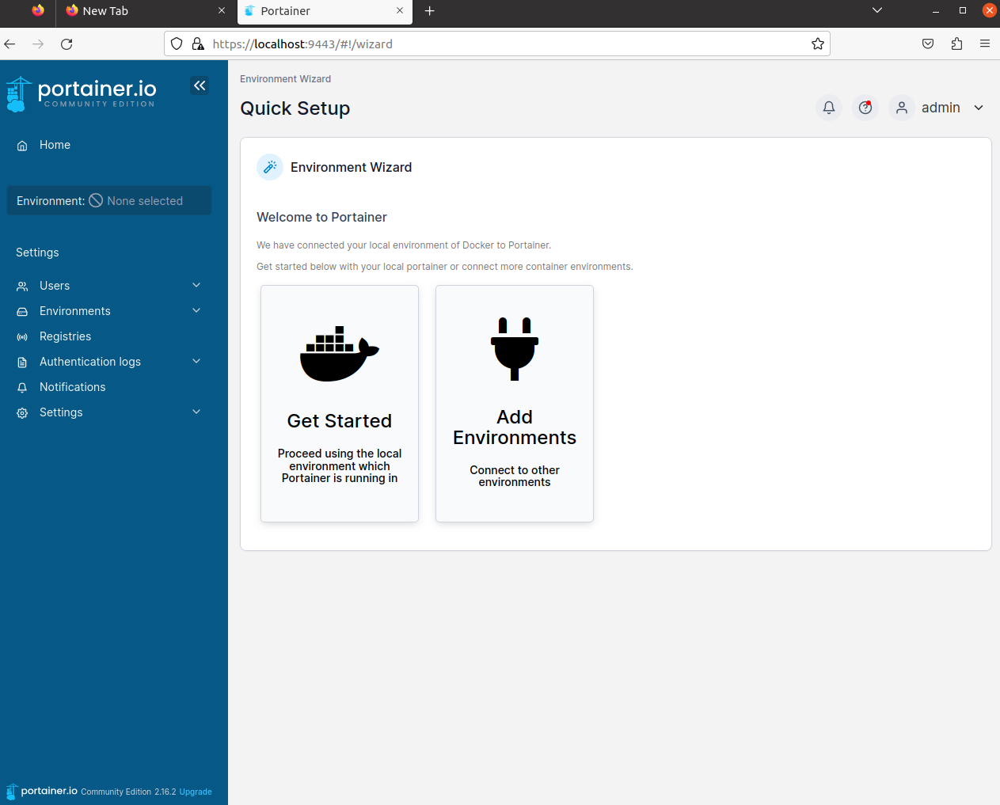

# Portainer {: style="height:8%;width:8%"}

## Install Portainer

  1. [Install-Guide](https://docs.portainer.io/start/install) 접속
  2. 자신의 환경에 맞게 선택지 고르기
    :material-circle-small: Ubuntu 20.04.5
    :material-circle-small: Docker 20.10.23

  ```
    √ Set up a new Portainer Server installation
    √ Docker Standalone
    √ Install Portainer with Docker on linux
  ```
  3. docker volume 생성
  ``` bash
  docker volume create portainer_data
  ```
  4. Portainer Server container 설치 및 실행
  ```
  docker run -d -p 8000:8000 -p 9443:9443 --name portainer --restart=always -v /var/run/docker.sock:/var/run/docker.sock -v portainer_data:/data portainer/portainer-ce:latest
  ```
  5. Web 접속
  ```
  https://localhost:9443
  ```
  6. 유저 생성<div>
  {: style="height:60%;width:60%"}<div>
  7. Get Started<div>
  {: style="height:60%;width:60%"}
---
!!!quote
    - Requirements and prerequisites :material-arrow-right-bold:
    [Requirement](https://docs.portainer.io/start/requirements-and-prerequisites)
    - Install Portainer :material-arrow-right-bold:
    [Install-Guide](https://docs.portainer.io/start/install)
    - Initial set-up :material-arrow-right-bold:
    [Set-up](https://docs.portainer.io/start/install/server/setup)
