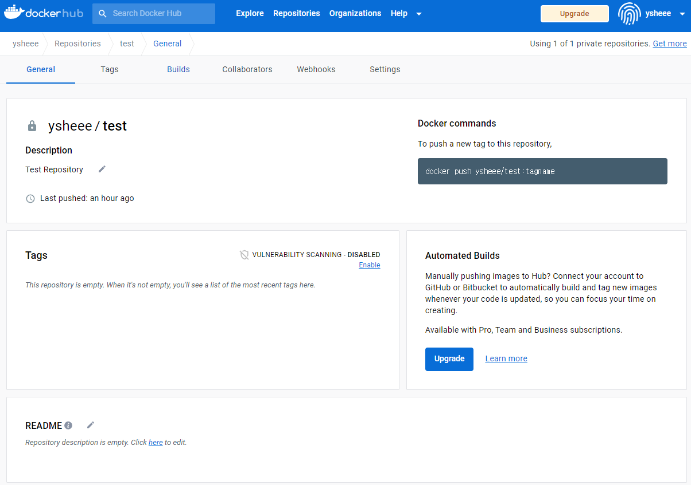
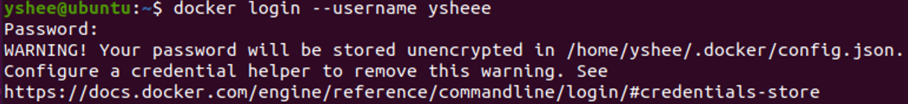
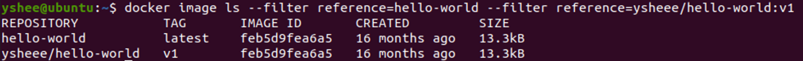
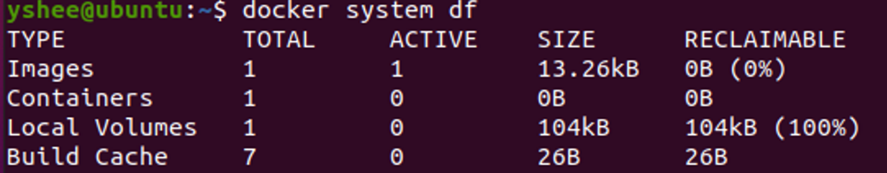
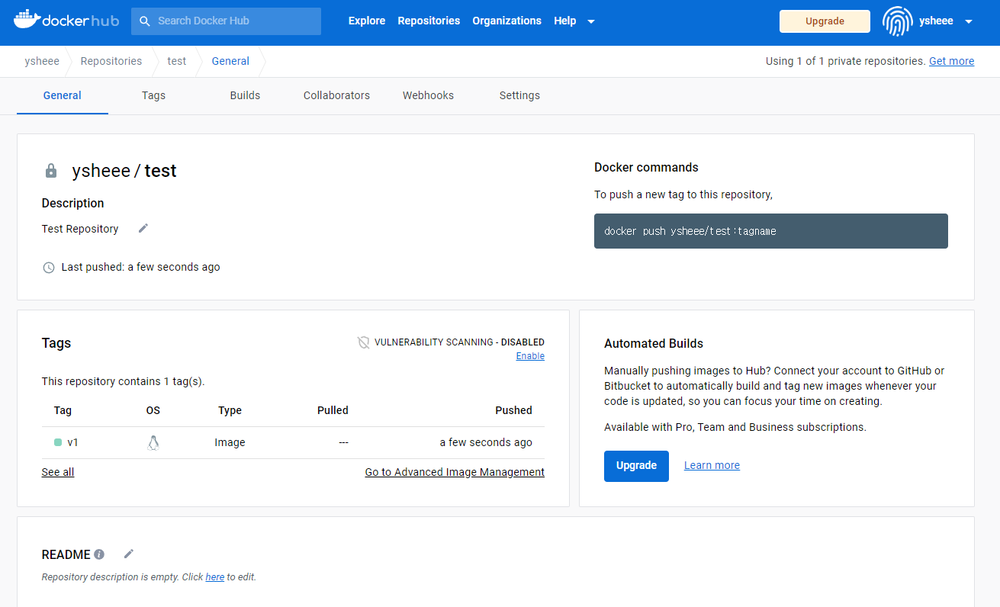

#Registry
\: 컨테이너 이미지와 관련된 아티팩트를 저장하고 배포하는 서비스

---
## Docker hub
:Docker에서 제공하는 Registry Service

1. [Docker Hub](https://hub.docker.com/) **가입** 
2. **Repository 생성**  
{: style="height:60%;width:60%"}  
3. **docker login**
``` bash
# docker login --username {your_username}
# 여기서 username이란, 도커 허브 name을 뜻함
docker login --username ysheee
```
{: style="height:60%;width:60%"}  
4. **docker image 생성**
```
docker pull hello-world
```  
5. **docker image tag 추가**  
도커 허브 내의 Repository에 이미지를 배포하기 위해서는 이미지 이름이 다음과 같은 형식이어야 한다.
{: style="height:60%;width:60%"}  
따라서, 이미지에 tag를 부여해주어야 한다.
```bash
# docker image tag {image_name} {new_image_tag}
docker image tag hello-world ysheee/test:v1
```
`docker image ls` 또는 `docker images` 명령어를 통해 이미지 목록을 확인하거나  
`docker image ls --filter reference={image_name} --filter reference={image_name}` 명령어를 통해 해당 이미지 정보 확인
{: style="height:65%;width:65%"}   
==========   
:exclamation::exploding_head:  
이미지 정보를 보면 마치 이미지가 각각 13.3kB씩 용량을 차지하고 있는 것처럼 보인다.  
하지만 `docker system df`를 확인해보면, 둘은 같은 이미지 레이어를 공유하므로 13.3kB만 사용중이다.  
{: style="height:60%;width:60%"}   
:material-arrow-right-bold: 이처럼 이미지는 여러 tag를 가질 수 있고, 서로 같은 이미지를 공유한다.  
:material-arrow-right-bold: *IMAGE ID*를 통해서도 서로가 같은 이미지임을 확인할 수 있다.  
==========     
6. **도커 허브로 이미지 배포**
```bash
# docker push {image_name}
docker push ysheee/test:v1
```
{: style="height:60%;width:60%"}    

---
## Local Registry
[registry-hub](https://hub.docker.com/_/registry/tags) : 도커 이미지를 저장하고, 배포할 수 있는 오픈소스 애플리케이션. GUI는 제공되지 않음

1. **registry 컨테이너 실행**
```bash
# docker run -d -p 5000:5000 --name {your_image_name} registry
docker pull registry:latest
docker run -d -p 5000:5000 --name my_registry registry
```
2. **도커 이미지 생성 및 Tag 추가**
```
docker pull hello-world
docker tag hello-world localhost:5000/start/hello-world:v1
```
{: style="height:60%;width:60%"} 
3. **이미지 배포**
```
docker push localhost:5000/start/hello-world:v1
```  

??? tip ":exclamation::exploding_head: Domain name 추가"
    ```bash
    # hosts 파일 확인
    cat /etc/hosts

    # 도메인 주소 쌍 추가
    echo $'\n127.0.0.1 local.registry' | sudo tee -a /etc/hosts

    # hosts 파일 확인
    cat /etc/hosts

    # 이미지 태그 추가 및 배포
    docker image tag hello-world local.registry:5000/start/hello-world:v1
    docker push local.registry:5000/start/hello-world:v1
    ```

??? question "확인 필요"
    ``` bash
    # linux
    /etc/docker/daemon.json에 {"insecure-registries":["registrly.local:5000"]} 추가
    # Mac (Docker Desktop)
    Preference -> Daemon -> insecure-registries -> registry.local:5000 추가

    service docker restart
    docker info
    ```
---
!!!quote 
    - Docker Hub :material-arrow-right-bold:
    [DockerHub-docs](https://docs.docker.com/docker-hub/)  
    - Docker login :material-arrow-right-bold:
    [Docker login-docs](https://docs.docker.com/engine/reference/commandline/login/#credentials-store)   
    - Docker Registry :material-arrow-right-bold: 
    [DockerR-docs](https://docs.docker.com/registry/)  
    - registry image :material-arrow-right-bold:
    [registry-hub](https://hub.docker.com/_/registry/tags)  
    - Useful Blog :material-arrow-right-bold:
    [Blog-1](https://waspro.tistory.com/532)
    - Various Container Registry  
        - [Amazon ECR](https://aws.amazon.com/ko/ecr/)
        - [GCP CR](https://cloud.google.com/container-registry?hl=ko)
        - [Azure CR](https://azure.microsoft.com/en-us/products/container-registry)
        - [Github CR](https://docs.github.com/en/packages/working-with-a-github-packages-registry/working-with-the-container-registry)