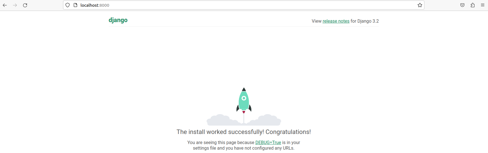
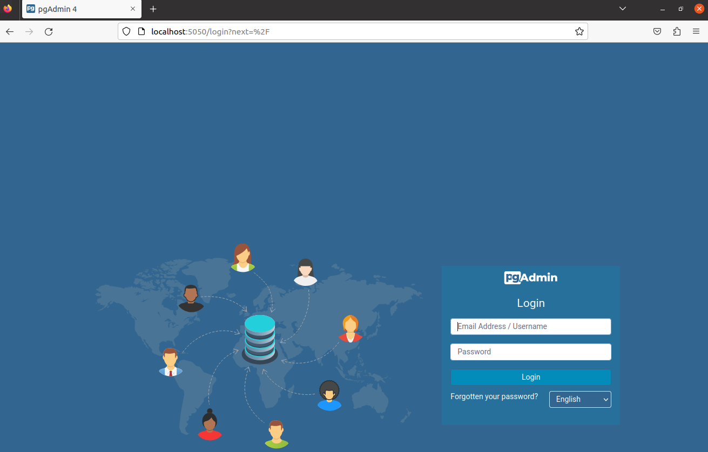
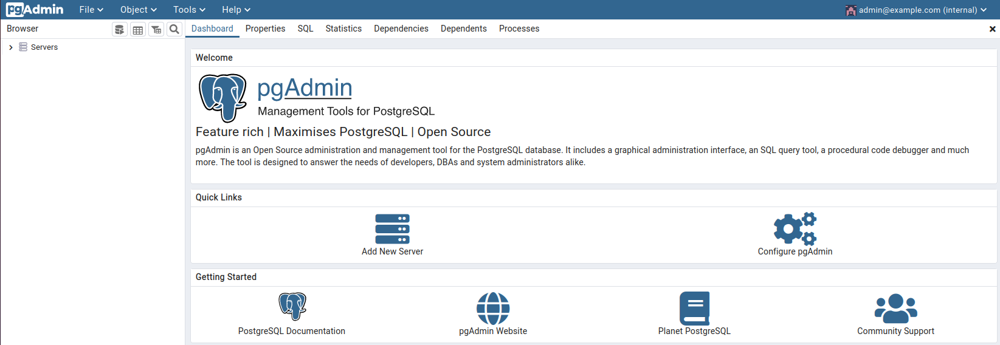

# Django + PostgreSQL + pgAdmin

- Source code Reference : [awesome-compose](https://github.com/docker/awesome-compose/tree/master/official-documentation-samples/django)

```title="Structure"
.
├ docker-compose.yml
├ Dockerfile
└ requirements.txt
```

```yaml title="docker-compose.yml"
version: '3'
services:
  db:
    image: postgres:latest
    volumes:
      - db-data:/var/lib/postgresql/data/
    environment:
      - POSTGRES_DB=postgres
      - POSTGRES_USER=postgres
      - POSTGRES_PASSWORD=postgres
  web:
    build: .
    command: python manage.py runserver 0.0.0.0:8000
    volumes:
      - .:/code
    ports:
      - "8000:8000"
    environment:
      - POSTGRES_NAME=postgres
      - POSTGRES_USER=postgres
      - POSTGRES_PASSWORD=postgres
    depends_on:
      - db
  pgadmin:
    image: dpage/pgadmin4
    ports:
      - "5050:80"
    environment:
      PGADMIN_DEFAULT_EMAIL: admin@example.com
      PGADMIN_DEFAULT_PASSWORD: password
    depends_on:
      - db
      
volumes:
  db-data:
```

### Create a Django Project
1 Create the Django project
``` bash
sudo docker compose run web django-admin startproject composeexample .

#Project structure
ls -l

drwxr-xr-x 2 root   root   composeexample
                                ├ __init__.py
                                ├ asgi.py
                                ├ settings.py
                                ├ urls.py
                                └ wsgi.py
-rw-rw-r-- 1 user   user   docker-compose.yml
-rw-rw-r-- 1 user   user   Dockerfile
-rwxr-xr-x 1 root   root   manage.py
-rw-rw-r-- 1 user   user   requirements.txt
```
2 Connect the database
```py title="composeexample/settings.py에 추가"
import os

[...]

DATABASES = {
    'default': {
        'ENGINE': 'django.db.backends.postgresql',
        'NAME': os.environ.get('POSTGRES_NAME'),
        'USER': os.environ.get('POSTGRES_USER'),
        'PASSWORD': os.environ.get('POSTGRES_PASSWORD'),
        'HOST': 'db',
        'PORT': 5432,
    }
}
```
3 Run docker compose
``` bash
docker compose up -d
```

---
### `localhost:8000`
{: style="height:70%;width:70%"}

### `localhost:5050`
초기 암호: admin@example.com/password<div>
{: style="height:70%;width:70%"}<div>
{: style="height:70%;width:70%"}

---
!!! quote
    [pgAdmin](https://www.pgadmin.org/docs/pgadmin4/latest/container_deployment.html)