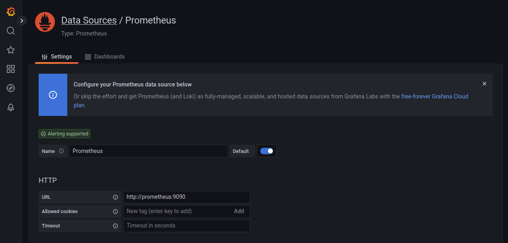

# Prometheus + Grafana (ing...)

## Set up
- Docker Desktop: `설정` - `Docker Engine` 
- Linux: `/etc/docker/daemon.json`

아래 두 가지 설정 추가
```
"metrics-addr" : "0.0.0.0:9323",
"experimental" : true
```
---

```yaml title="docker-compose.yml"
version: "3.9"
services:
  api-web:
    build: .
    environment:
     - NUM=4000
    ports:
      - "13583:13583"
    command:
      - "uvicorn"
      - "app.main:app"
      - "--host"
      - "0.0.0.0"
      - "--port"
      - "13583"

  prometheus:
    image: prom/prometheus:latest
    ports:
      - "9090:9090"

  grafana:
    image: grafana/grafana:latest
    ports:
      - "3000:3000"
    depends_on:
      - prometheus
```

---
## `http://localhost:9323/metrics`
\: 도커 엔진이 HTTP API를 통해 외부로 공개하는 상태 정보<div>
{: style="height:70%;width:70%"}

---

## Prometheus `http://localhost:9090`
\: Prometheus Web UI<div>
{: style="height:70%;width:70%"}
{: style="height:70%;width:70%"}

---

## `http://localhost:9090/metrics`
\: promethues.yml 설정을 통해 수집한 측정값
{: style="height:70%;width:70%"}

---
## Grafana `http://localhost:3000`
초기 암호: admin/admin<div>
{: style="height:70%;width:70%"}

- `Add your fisrt data source` 클릭
- `Prometheus` 선택
- HTTP - **URL**에 Prometheus 서버 정보 입력
- `Save & test`

{: style="height:70%;width:70%"}

- Create Dashboard <div>
(Grafana Example Dashboard - Promethues 2.0 Stats)
{: style="height:70%;width:70%"}


---
!!!quote
    - Github<div>
      • [Prometheus](https://prometheus.io/)<div>
      • [Grafana](https://grafana.com/docs/grafana-cloud/quickstart/docker-compose-linux/)<div>
      • [prometheus-fastapi-instrumentator](https://github.com/trallnag/prometheus-fastapi-instrumentator)<div>
      • [client_python](https://github.com/prometheus/client_python)
    - Useful<div>
      • [Github-1](https://github.com/docker/awesome-compose/tree/master/prometheus-grafana)<div>
      • [stack-1](https://stackoverflow.com/questions/74029504/spring-prometheus-grafana-err-reading-prometheus-post-http-localhost90)<div>
      • [Blog-1](https://medium.com/@ct.onyemaobi/build-and-monitor-your-fastapi-microservice-with-docker-prometheus-and-grafana-part-2-37472157a2b)<div>
      • [Blog-2](https://umanking.github.io/2021/08/19/prometheus-grafana-example/)<div>
      • [Blog-3](https://docs.netapp.com/ko-kr/storagegrid-116/monitor/commonly-used-prometheus-metrics.html)
