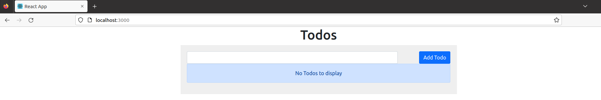
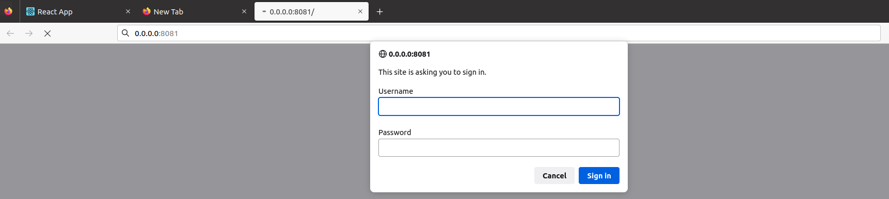
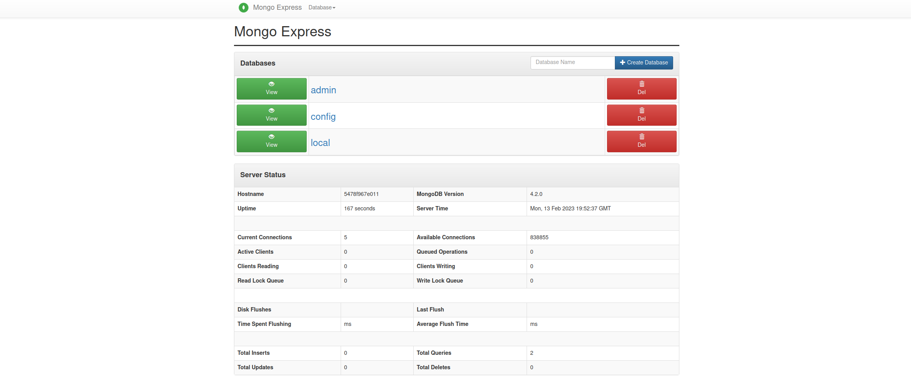

# React.js + Express.js + MongoDB + mongo-express

- Source code Reference : [awesome-compose](https://github.com/docker/awesome-compose/tree/master/react-express-mongodb)

```title="Structure"
.
├ docker-compose.yml
├ backend
│  ├ Dockerfile
│  └ ...
└ frontend
   ├ ...
   └ Dockerfile

```


``` yaml title="docker-compose.yml"
version: "3.9"
services:
  frontend:
    build:
      context: frontend
      target: development
    ports:
      - 3000:3000
    stdin_open: true
    volumes:
      - ./frontend:/usr/src/app
      - /usr/src/app/node_modules
    restart: always
    networks:
      - react-express
    depends_on:
      - backend
  backend:
    restart: always
    build:
      context: backend
      target: development
    volumes:
      - ./backend:/usr/src/app
      - /usr/src/app/node_modules
    depends_on:
      - mongo
    networks:
      - express-mongo
      - react-express
    expose: 
      - 3000
  mongo:
    image: mongo:4.2.0
    restart: always
    volumes:
      - ./data:/data/db
    networks:
      - express-mongo
    environment:
      - MONGO_INITDB_ROOT_USERNAME=root
      - MONGO_INITDB_ROOT_PASSWORD=example
    expose:
      - 27017
  mongo-express:
    image: mongo-express:0.54.0
    restart: always
    ports:
      - "8081:8081"
    environment:
      - ME_CONFIG_MONGODB_ADMINUSERNAME=root
      - ME_CONFIG_MONGODB_ADMINPASSWORD=example
      - ME_CONFIG_BASICAUTH_USERNAME=admin
      - ME_CONFIG_BASICAUTH_PASSWORD=password
    networks:
      - express-mongo
    depends_on:
      - mongo

networks:
  react-express:
  express-mongo:

```

---
### `localhost:3000`
{: style="height:70%;width:70%"}

### `localhost:8081`
암호: admin/password <div>
{: style="height:70%;width:70%"}
{: style="height:70%;width:70%"}
---
!!!quote
    [mongo-express](https://hub.docker.com/_/mongo-express)