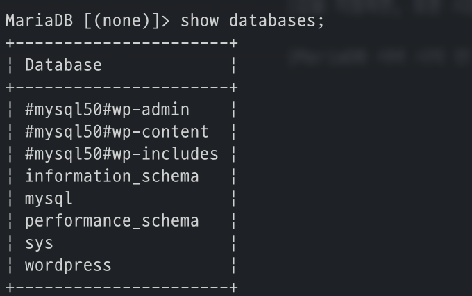
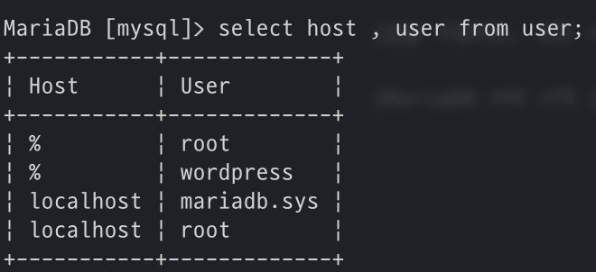

# WordPress + MariaDB + phpMyAdmin

``` yaml title="docker-compose.yml"
version: '3.7'
services:
  db:
    image: mariadb:10.6.4-focal
    volumes:
      - ${HOME}/temp/wmp:/var/lib/mysql
    environment:
      MYSQL_ROOT_PASSWORD: password
      MYSQL_DATABASE: wordpress
      MYSQL_USER: wordpress
      MYSQL_PASSWORD: password

  wordpress:
    image: wordpress:5.7.1
    volumes:
      - ${HOME}/temp/wmp:/var/www/html
    ports:
      - "8000:80"
    environment:
      WORDPRESS_DB_HOST: db:3306
      WORDPRESS_DB_USER: wordpress
      WORDPRESS_DB_PASSWORD: password
      WORDPRESS_DB_NAME: wordpress
    depends_on:
      - db

  phpmyadmin:
    image: phpmyadmin/phpmyadmin:5.0.2
    ports:
      - "8080:80"
    environment:
      PMA_HOST: db
      PMA_PORT: 3306
    depends_on:
      - db
```

### MariaDB 접속
```bash
# mariaDB 컨테이너 접속
docker exec -it MariaDB_container_ID

# MariaDB 연결
mysql -uroot -p  #그리고 MARIADB_ROOT_PASSWORD 입력
```

`show databases;` : 데이터베이스 확인 (위 compose에서 설정한 wordpress database 확인 가능)

{: style="height:40%;width:40%"}

``` bash
# 데이터베이스 사용 (use mysql)
use Database_Name;

# 데이터베이스 테이블 조회
show tables;

# user테이블에서 host, user 조회 (wordpress 계정 확인 가능)
select host , user from user;
```
{: style="height:40%;width:40%"}

---
## MariaDB Environment Variables
!!! info
    One of `MARIADB_RANDOM_ROOT_PASSWORD`, `MARIADB_ROOT_PASSWORD_HASH`, `MARIADB_ROOT_PASSWORD` or `MARIADB_ALLOW_EMPTY_ROOT_PASSWORD` (or equivalents, including *_FILE), is required.

|    Env    |    Description
| :-----------: | :-----------: |
| `MARIADB_ROOT_PASSWORD` / `MYSQL_ROOT_PASSWORD` / `MARIADB_ROOT_PASSWORD_HASH`                   |MariaDB root Super-user 계정의 암호 설정
| `MARIADB_ALLOW_EMPTY_ROOT_PASSWORD` / `MYSQL_ALLOW_EMPTY_PASSWORD`                               |root 유저의 blank password로 컨테이너 시작
| `MARIADB_RANDOM_ROOT_PASSWORD` / `MARIADB_RANDOM_ROOT_PASSWORD`                                  |root 유저에 대한 임의의 초기 암호 생성
| `MARIADB_ROOT_HOST` / `MYSQL_ROOT_HOST`                                                          |생성된 루트 유저의 호스트 이름 설정
| `MARIADB_MYSQL_LOCALHOST_USER` / `MARIADB_MYSQL_LOCALHOST_GRANTS`                                |mysql@localhot 데이터베이스 유저 생성 (health check 및 backup script에 유용)<div> Default, 유저는 [USAGE](https://mariadb.com/kb/en/grant/#the-usage-privilege) 권한을 받으며 추가적으로 글로벌 권한 설정 가능
| `MARIADB_DATABASE` / `MYSQL_DATABASE`                                                            |이미지 시작시 생성될 데이터베이스의 이름
| `MARIADB_USER` / `MYSQL_USER`, / `MARIADB_PASSWORD` / `MYSQL_PASSWORD` / `MARIADB_PASSWORD_HASH` |-새로운 유저 생성 및 암호 설정 (유저 생성을 위해서는 user/password 둘 다 필요)<div>-Default, 데이터베이스에 대한 모든 액세스 권한 부여 [GRANT ALL](https://mariadb.com/kb/en/grant/#the-all-privileges-privilege)<div>-Default, `MARIADB_ROOT_PASSWORD*` 변수로 지정된 암호 생성
| `MARIADB_INITDB_SKIP_TZINFO` / `MYSQL_INITDB_SKIP_TZINFO`                                        |값을 지정하면, 표준 시간대 로드 비활성화<div>Default, entrypoint script는 자동으로 `CONVERT_TZ()`에 필요한 표준 시간대 데이터 로드
| `MARIADB_AUTO_UPGRADE` / `MARIADB_DISABLE_UPGRADE_BACKUP`                                        |MariaDB 서버 시작 전 업그레이드 실행

## WordPress Environment Variables
|    Env    |    Description
| :-----------: | :-----------: |
| `WORDPRESS_DB_HOST`       |
| `WORDPRESS_DB_USER`       |
| `WORDPRESS_DB_PASSWORD`   |
| `WORDPRESS_DB_NAME`       |
| ...       |

## phpMyAdmin Environment Variables
|    Env    |    Description
| :-----------: | :-----------: |
| `PMA_ARBITRARY`       | 1로 설정하면, 임의의 서버 연결 허용
| `PMA_HOST`            | MySQL 서버의 주소/호스트 이름 정의
| `PMA_VERBOSE`         | MySQL 서버 상세 정의
| `PMA_PORT`            | MySQL 서버의 포트 정의
| `PMA_HOSTS`           | MySQL의 (쉼표로 구분된) 주소/호스트 이름 목록 정의
| `PMA_PORTS`           | MySQL의 (쉼표로 구분된) 포트 목록 정의
| `PMA_VERBOSES`        | MySQL의 상세 이름을 쉼표로 구분하여 정의
| `PMA_USER`/`PMA_USER` | config authentication에서 사용할 username 및 password 정의
| ...                   |


---
!!! quote
    - Docker-hub<div>
        • [WordPress](https://hub.docker.com/_/wordpress)<div>
        • [MariaDB](https://hub.docker.com/_/mariadb)<div>
        • [phpMyAdmin](https://hub.docker.com/_/phpmyadmin)
    - Useful Github<div>
        • [1](https://github.com/docker/awesome-compose/blob/master/official-documentation-samples/wordpress/README.md)<div>
        • [2](https://github.com/docker/awesome-compose/tree/master/wordpress-mysql)
    - Useful <div>
        • [stackoverflow-1](https://stackoverflow.com/questions/47844377/how-can-i-create-a-volume-for-the-current-user-home-directory-in-docker-compose)<div>
        • [UpCloud](https://upcloud.com/resources/tutorials/deploy-wordpress-with-docker-compose)<div>
        • [Blog-1](https://velog.io/@willneedme/docker-%EC%82%AC%EC%9A%A9%ED%95%98%EA%B8%B04-with-dokcer-compose-mariadb-mysql)<div>

