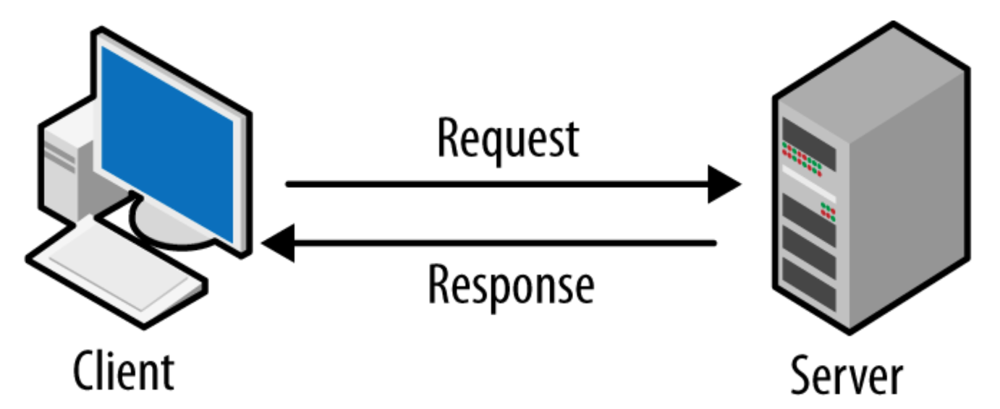

# RestAPI Design Best Practices
{ style="height:90%;width:90%"} <div>
클라이언트와 서버는 서로 직접적으로 호출하지 않고, Application Programming Interface(API)라 불리는 중간자 역할의 인터페이스를 사용합니다

여기서 API는 클라이언트와 서버 간 통신을 원활하게 하는 중요한 역할을 하므로 모범 사례를 따라 잘 설계해야 합니다

잘 디자인 된 webAPI는 다음과 같은 특성을 가집니다 :

- Platform Independence<div>
ㅤ: 모든 클라이언트는 내부에서 API가 구현되는 방식에 관계 없이 API를 호출할 수 있다<div>
ㅤ: 이를 위해 Standard protocol을 사용해야 하고, 클라이언트 및 웹 서비스가 교환할 데이터 형식에 상호 동의할 수 있는 매커니즘이 있어야 한다
- Service Evolution<div>
ㅤ: Web API는 클라이언트 애플리케이션과 독립적으로 기능을 진화시키고 추가할 수 있어야 한다

## What is a REST API?
Representational State Transfer의 약자로
2000년 Roy Fielding이 제안한 웹서비스를 디자인하는 소프트웨어 아키텍처 접근 방식입니다<div>
RestAPI는 두 컴퓨터가 HTTP 통신시 같은 형식에 맞춰 통신하도록 함으로써 일관성을 부여합니다<div>
그렇기에 API는 **Restful**이라는 REST 디자인 원칙을 잘 따라야 합니다
!!! note
    - REST<div>
    ㅤ: Hypermidia 기반의 분산 시스템을 구축하기 위한 Architectural style<div>
    ㅤ: 따라서 어떤 기본 프로토콜과도 독립적이며 HTTP에 연결될 필요가 없지만, 대부분의 일반적인 REST API 구현은 HTTP를 애플리케이션 프로토콜로 사용합니다

### Resource Oriented Design 세 가지 핵심 개념
- Resource : 데이터 조각 `User`
- Collection : Resource 그룹 `User list`
- URL : Resource 또는 Collection 위치 식별 `/user`

## 1. Use Json as the Format for Sending and Receiving Data
- Client-side에서 Json데이터를 올바르게 해석할 수 있도록 요청하는 동안 Response header에서 `Content-type`을 `application/json`으로 지정해야한다
- 반대로 다수의 Server-side 프레임워크에서는 `Content-type`을 자동으로 할당한다
- 이를 통해 Client는 요청이 성공했는지 실패했는지 등의 상황을 파악할 수 있다


## 2. Use Nouns instead of Verbs in Endpoints
- RestAPI를 설계할 때, Endpoint-path에 동사를 사용하지 않는다. 명사를 사용함으로써 endpoint가 무슨 일을 하는지 명시한다
- 이는 CRUD 작업을 설명하기 위한 목적으로 사용된 HTTP Method가 동사 형태이기 때문이다

:material-checkbox-marked-circle-outline: Good `https://mysite.com/posts`  
:material-dots-horizontal-circle-outline: Bad `https://mysite.com/getPosts` `https://mysite.com/createPost`  

요약하자면 > Endpoint-path에는 명사를 사용하고, HTTP method를 통해 endpoint의 동작을 정하세요

Common HTTP Methods: 

- `GET` : Retrieve data
- `POST` : Create data
- `PUT` : Update data
- `DELETE` : Get rid of the data

## 3. Name Collections with Plural Nouns
- API data는 사용자로부터 얻어온 다양한 resource의 collection이라 볼 수 있다
- 만약 `https://mysite.com/post/123`같은 endpoint가 있다면, 사용자가 다른 게시물들이 있음을 알아챌 수 있도록 복수 명사를 사용해야 한다

:material-checkbox-marked-circle-outline: Good `https://mysite.com/posts/123`  
:material-dots-horizontal-circle-outline: Bad `https://mysite.com/post/123` 

## 4. Use Status Codes in Error Handling
- API 요청에 응답할 때는 항상 **Regular HTTP Status**를 사용한다 
- 이를 통해 Client는 요청이 성공했는지 실패했는지 등의 상황을 파악할 수 있다


## 5. Use Nesting on Endpoints to Show Relationships
- Endpoint들은 상호 연결될 수 있다. 이대는 이해하기 쉽도록 중첩해 사용한다
- (Ex) multi-user Blog 플랫폼에서는 여러 게시물이 각기 다른 유저에 의해 작성될 수 있다. 따라서 endpoint를 
`https://mysite.com/posts/autor`처럼 만들면 유효한 중첩이 될 수 있다
- (Ex) 같은 맥락에서 게시물들은 그들만의 독립적인 댓글을 가질 수 있으므로 댓글을 검색하려면
`https://mysite.com/posts/postID/comments`가 적합하다
- 3단계 이상의 중첩은 도리어 가독성을 저하시키므로 주의해야 한다

Examples : 

- `GET/shops/2/products` 2번 shop의 모든 제품 리스트 조회
- `GET/shops/2/products/31` 2번 shop의 31번 상품 조회
- `PUT /shops/2/products/31` 2번 shop의 31번 상품 업데이트
- `POST/shops` 새로운 shop을 생성하고, 생성된 shop의 세부 정보 반환

## 6. Use Filtering, Sorting, and Pagination to Retrieve the Data Requested
- 가끔 API의 데이터베이스가 너무나 클 때, 데이터를 받아오는 게 많이 느려질 수 있다
- 이때 Filtering, Sorting, Pagination을 통해 필요한 데이터만 걸러내어 해당 request에 대한 서버 부담을 줄일 수 있다
- (Ex) `https://mysite.com/posts?tags=javascript` javascript tag를 가진 게시물들만 받아온다

## 7.Use SSL(Secure Socket layer) for Security
- SSL을 사용하면 API를 보호하고, 악의적인 공격에 대한 취약성을 줄일 수 있다
- SSL을 적용한 url과 적용하지 않은 url은 HTTPS의 's'에서 그 차이를 볼 수 있다<div>
:material-checkbox-marked-circle-outline: Good `https://mysite.com/posts`<div>
:material-dots-horizontal-circle-outline: Bad `http://mysite.com/posts`

고려해야 할 다른 조치로는 다음 두 항목이 포함됩니다 :

- 서버-클라이언트 간 통신을 비공개로 설정
- API를 사용하는 모든 사용자가 해당 request 외의 정보를 얻지 못하도록 함

## 8. Be Clear with Versioning
- RestAPI는 여러 버전을 지원함으로써 사용자들이 다양한 버전을 사용할 수 있어야 한다
- 최신 버전만 지원하게 되면, 부주의하게 버전을 올릴 시 애플리케이션에 영향이 갈 수 있다

Example:

- Facebook `https://developers.facebook.com/docs/graph-api/reference/v12.0/...`
- Spotify `https://api.spotify.com/v1/artists/...`
- Mailchimp `https://mandrillapp.com/api/1.0/...`

## 9. Provide Accurate API Documentation
- RestAPI를 제작할 때는 사용자들이 쉽게 배우고, 정확하게 사용할 수 있도록 한다
- 가장 좋은 방법은 API에 대한 좋은 Documentation을 제공하는 것이다

문서는 다음 내용을 포함해야 합니다 : 

- Relevant endpoints of the 
- Example requests of the endpoints 
- Implementation in several programming languages
- Messages listed for different errors with their status codes

API Design Tool and API Documentation Tool: 

- Swagger
- API Blueprint
- Postman

## 10. Use kebab-case for URLs
- kebab-case: 각 단어를 dash "-"로 구분하는 naming 규칙

:material-checkbox-marked-circle-outline: Good `/system-orders`  
:material-dots-horizontal-circle-outline: Bad `/systemOrders` `/system_orders`

## 11. Use camelCase for parameters
- camelCase : 첫번째 단어의 첫 글자는 소문자, 뒤따르는 각 단어의 첫 글자는 대문자로 표시하는 naming 규칙

:material-checkbox-marked-circle-outline: Good `/system-orders/{orderId}`  
:material-dots-horizontal-circle-outline: Bad `/system-orders/{order_id}` `/system-orders/{OrderId}`

## 12. Use camelCase for JSON property
- Request 또는 Response의 json 속성은 camelCase로 작성

:material-checkbox-marked-circle-outline: Good `{userName: “example” userID: “1”}`  
:material-dots-horizontal-circle-outline: Bad `{user_name: “example” user_id “1”}`

## 13. URL Starts With a Collection and Ends With an Identifier
- URL은 collection으로 시작하고, Identifier로 끝낸다

:material-checkbox-marked-circle-outline: Good `GET /shops/:shopId/` `GET /category/:categoryId`  
:material-dots-horizontal-circle-outline: Bad `/shops/:shopId/category/:categoryId/price` 

## 14. Use verbs for Non-Resource URL
- 작업 반환의 역할만 하는 Endpoint의 경우 동사를 사용하기도 한다
- (Ex) 사용자에게 경고를 다시 보내려는 경우 
- `POST /alerts/245743/resend` url은 CRUD 작업이 아닌 시스템에서 특정 작업을 수행하는 기능으로 간주된다

## 15. Monitoring
RESTful HTTP 서비스는 `/health` `/version` `/metrics` API endpoint를 구현해야 한다

- `/heatlh` : `/heatlh` 요청에 대해 `200` Status code로 응답
- `/version` : `/version` 요청에 대해 버전 번호로 응답
- `/metrics` : `/metrics` 요청에 대해 평균 응답 시간과 같은 다양한 metric 제공

## 16. Don't Use table_name for the Resource Name

## 17. Include Total Number of Resources in Your Response
- API가 Object_List를 반환하는 경우, 항상 Response에 resource의 총 개수를 포함한다
- 이를 위해 total 속성을 사용할 수 있다

``` json title="Example"
{ 
  users: [ 
     ...
  ],
  total: 34
}
```

## 18. Accept limit and offset Parameters
- **GET** 작업에서는 항상 `limit`, `offset` 파라미터를 받는다
- Frontend에서의 Pagenation에 필요하다

:material-checkbox-marked-circle-outline: Good `GET /shops?offset=5&limit=5`


## 19. Don't Pass Authentication Tokens in URL
- URL에 Authentication token을 포함하지 마세요.
- URL은 종종 기록되기 때문에 인증 토큰도 불필요하게 기록되므로 좋지 않은 방법이다
- URL 대신 Header와 함께 전달한다

:material-checkbox-marked-circle-outline: Good `Authorization: Bearer xxxxxx, Extra yyyyy`  
:material-dots-horizontal-circle-outline: Bad `GET /shops/123?token=some_kind_of_authentication_token`

## 20. Validate the Content-Type
- 서버는 Content-type을 확신해서는 안된다
- (Ex) `application/x-www-form-unrlencoded`에 대해 수락한다면, 공격자는 양식을 만들고 간단한 POST 요청을 통해 트리거를 작동할 수 있다

## 21. CORS
- 모든 공개 API에 대해 CORS(Cross-Origin Resource Sharing) Header 지원
- CORS 허용 출처 "*" 지원 및 유효한 OAuth token을 통한 권한 부여 고려

## 22. Golden Rules
API 디자인에 확신이 서지 않는 경우, 올바른 결정에 도움을 줄 수 있는 사항들 : 

- Flat > nested
- 단순함 > 복잡함
- 문자열 > 숫자
- 일관성 > 사용자 정의 

!!! quote
    - [Naming Case](https://www.freecodecamp.org/news/snake-case-vs-camel-case-vs-pascal-case-vs-kebab-case-whats-the-difference/)
    - [freecodecamp](https://www.freecodecamp.org/news/rest-api-best-practices-rest-endpoint-design-examples/) --
    [(번역)freecodecamp](https://www.freecodecamp.org/korean/news/rest-api-mobeom-sarye-rest-endeupointeu-seolgye-yesi/)
    - [22-Best-Practice](https://zzang9ha.tistory.com/388)
    - Image<div>
    • [1: madooei](https://madooei.github.io/cs421_sp20_homepage/client-server-app/)

