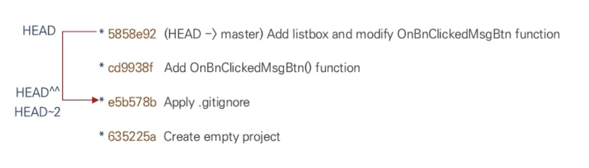

# Git command

#### main command
|    Command    |    설명    |    특징    |
| :-----------: | :-------: | :-------: |
| git init | git 저장소 생성 | |
| git help [커맨드 이름] | 도움말 출력 | |
| git status | git이 인식하고 있는 상태 정보 출력 | |
| | |
| git add [파일명 또는 디렉토리명] | 수정사항이 있는 특정 파일 및 디렉토리를 Staging area로 올리기 | |
| git add . | 수정사항이 있는 모든 파일 add | |
| git reset [파일명] | Staging area에 올렸던 파일 내리기 | |
| | |
| git commit | 이력 저장 | |
| git commit -m "Message" | 인라인으로 메시지를 추가하여 commit | |
| git commit -a   git commit -all | modified 상태인 파일을 Add 후 commit | add+commit |
| git commit -am "Message" | add+commit을 인라인으로 메시지를 추가하여 처리 | |

---
#### config
|    Command    |    설명    |    특징    |
| :-----------: | :-------: | :-------: |
| git config --global user.name | 사용자 설정 | --global: 현재 user의 모든 저장소  --local: 특정 저장소  --system: 해당 컴퓨터의 모든 저장소/사용자 |
| git config --global user.email | 사용자 이메일 설정 | |
| git config --unset <key>   git config --global --unset <key> | 설정된 사용자 삭제 | |
| **git config --global init.defaultBranch main** | 기본 브랜치 변경 | :star: |
| git config --global alias.<단축명령어> <실제명령어> | 단축 명령어 설정 | ex.`git config --global alias.ci commit`
| git config --list | config 설정 전체 출력 | |
| git config <key> | 특정 Key에 대한 값 출력 |ex. `git config user.name`|

---
#### status, log, show
: 저장소 내 정보 확인

** commit ID : SHA1 알고리즘으로 만들어진 hash 값. 중복이 없는 임의의 문자열이자 암호화된 값

|    Command    |    설명    |    특징    |
| :-----------: | :-------: | :-------: |
| git status | git이 인식하고 있는 상태 정보 출력 | |
| git status -s   git status --short | 상태 정보를 간결하게 출력 | `??` : untracked  `M` : modified   `MM`: 수정 상태가 staged된 후, 다시 modified   `A` : 경로가 staged 된 후, 경로내에 untracked 파일 발생|
| | |
| git log | 저장소의 commit history 출력 | 최근 commit : (HEAD→master) |
| git log -n | 최근 n개의 commit 이력 확인 | |
| git log -p   git log --patch | 각 log의 상세 정보 출력 | ex.`git log -p -2` |
| git log --pretty=oneline | 각 commit 이력을 한 줄로 출력 | |
| git log --oneline | commit ID의 7번째 값까지만 출력 | |
| git log --oneline --decorate=full | 브랜치, 태그 등의 관련 정보 상세 출력 | |
| git log --oneline --decorate --graph | commit 이력을 그래프 형태로 출력 | |
| | |
| git show | 가장 최신 commit의 상세 정보 확인 | `git log -p -1`와 같음 |
| git show [commit hash] | 특정 Commit의 정보 확인 | |
| git show HEAD | HEAD가 참조하는 commit의 상세 정보 | |
| git show HEAD^^^ | HEAD를 기준으로 3단계 이전의 commit 정보 출력  | |
| git show HEAD~n | HEAD를 기준으로 n단계 이전의 commit 정보 출력 | |

??? note
    

    - git은 HEAD나 특정 commit을 기준으로 상대경로 입력이 가능하다
    - 여기서 `e5b578b`는 `HEAD`를 기준으로 2단계 이전의 commit이므로
    - `git show e5b578b` = `git show HEAD^^` = `git show HEAD~2`

---
#### diff
: 파일의 수정 내용 비교

|    Command    |    설명    |    특징    |
| :-----------: | :-------: | :-------: |
| * git show | 직전 commit과 비교하여 수정된 내용 출력 | |
| git diff | 비교 대상을 지정하여 비교 | 옵션 없이 사용하면, Unstaged 상태의 파일들과 최신 commit 간의 파일 내용 비교 |
| git diff --staged | 최근 commit과 Staging Area 파일들 간의 변경사항 확인 | |
| git diff [commit hash1(변경전)] [commit hash2(변경후)] | 두 commit의 파일들 간의 변경사항 출력 | |
| git diff HEAD^ HEAD | 상대경로로 최근 commit과 직전 commit 간 비교 | |

----
#### reset, reflog, amend

- reset : `git add` | `git commit` 명령 취소
- reflog : `reset --hard` 로 인해 삭제된 commit hash 찾기
- amend : commit 메세지 변경

|    Command    |    설명    |    특징    |
| :-----------: | :-------: | :-------: |
| git reset | 파일들 Staging area에서 내리기 | --hard : 내용 제거   --mixed   --soft|
| git reset [파일명] | 특정 파일만 Staging area에서 내리기 | |
| git reset HEAD^ | HEAD를 기준으로 직전의 commit으로 reset | |
| git reset HEAD~n | HEAD를 기준으로 n 값 단계 전 commit으로 reset | |
| | |
| git reflog | HEAD가 참조했던 commit 출력 | |
| git reset --hard HEAD@{n} | HEAD가 n번 움직임 전에 참조했던 곳으로 돌아가기 | |
| | |
| git commit --amend | 최근commit 수정 | 덮어쓰기 개념으로 추가 파일 Staging |
| git commit --amend -m "commit 메시지" | commit 메시지 인라인으로 수정 | |

----
#### checkout
: 과거 이력으로 복귀

|    Command    |    설명    |    특징    |
| :-----------: | :-------: | :-------: |
| git checkout [이동할 commitdml hash] | commit 롤백 | |
| git checkout - | HEAD가 이전에 참조했던 commit으로 상태변경 | |
| git checkout master | HEAD가 master를 참조 | |
| git checkout HEAD~n | HEAD를 기준으로 n단계 이전 commit으로 상태변경 | |

--- 
!!! quote
    - [Git Docs](https://git-scm.com/book/ko/v2/시작하기-버전-관리란%3F)
    - [DaleSeo Blog](https://www.daleseo.com/git-config/#:~:text=설정%20범위와%20설정%20파일&text=Git은%20지역(local)%2C,모든%20저장소를%20포함시킵니다.)
    - Visual studio를 위한 Git -> [wikidocs](https://wikidocs.net/book/7060)