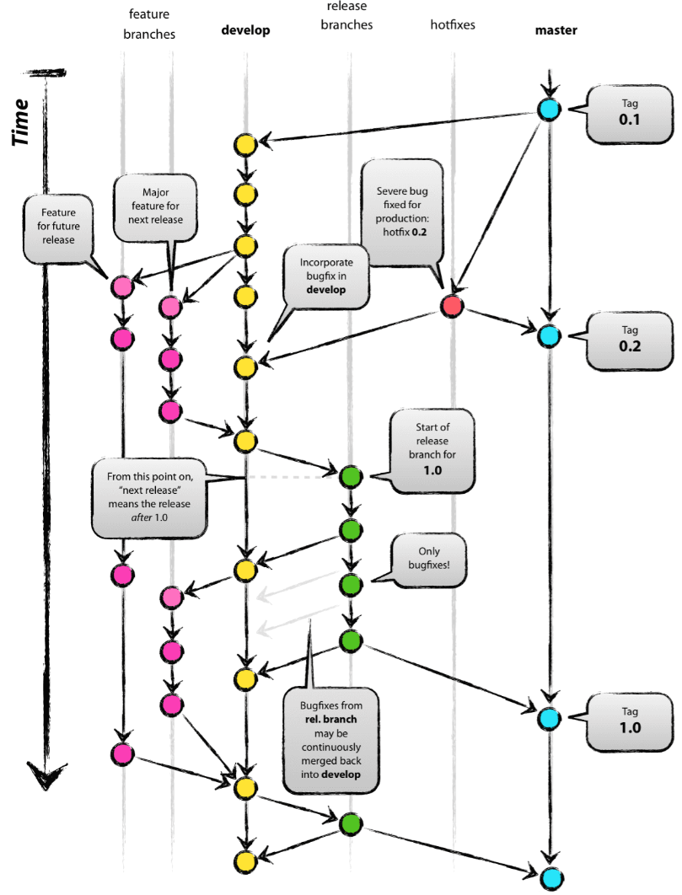
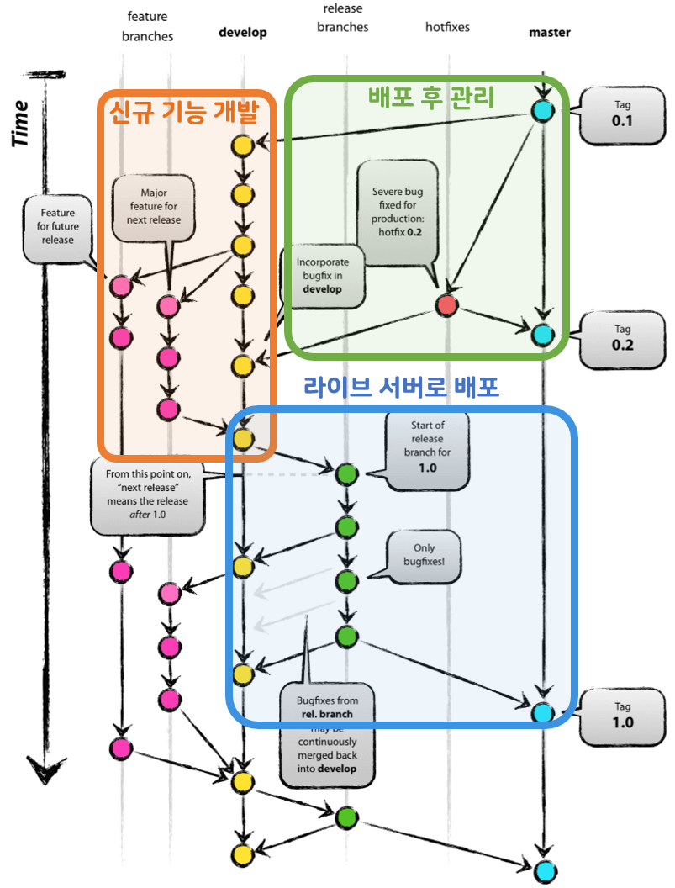
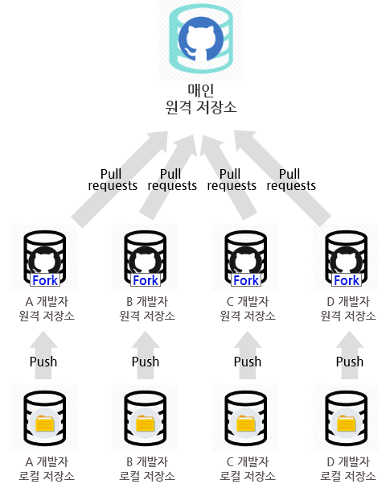
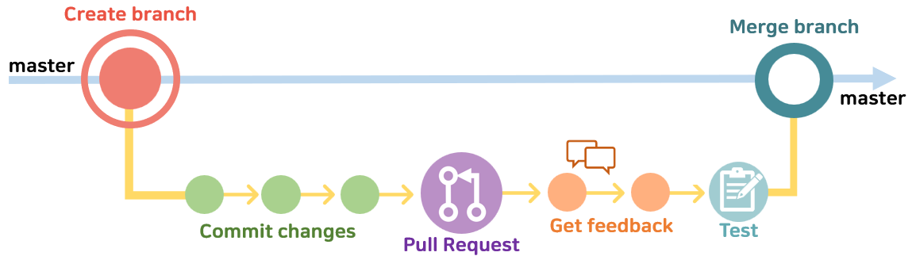

# Git Flow
: 여러 개발자가 하나의 저장소를 사용함에 있어서 저장소를 효과적으로 활용하기 위한 work flow

**feature > develop > release > hotfix > master**

- master : production, 배포용
- develop : staging, 배포 전 통합 브랜치 -> release
- feature : 추가 기능 개발 -> develop
- release : develop 브랜치가 안정화되면, QA를 위해 생성
- hotfix : master에서 발생한 버그 수정 -> release, develop, master

### 흐름

- 대부분의 작업은 devleop에서 취합, 테스트를 통해 변동사항이 없음을 체크한 후 master로 병합
- master가 아닌 branch들은 master의 변동사항을 꾸준히 주시
- 필수 : master, develop
- merge되면 사라지는 보조 : feature, release, hotfix

#### 신규 기능 개발

1. 개발자는 develop 브랜치로부터 본인이 신규 개발할 기능을 위한 **feature** 브랜치 생성
2. feature 브랜치에서 기능을 완성하면, develop 브랜치에 merge를 진행한다

#### 라이브 서버로 배포
1. feature 브랜치들이 모두 develop 브랜치에 merge 되었다면, QA를 위해 **release** 브랜치 생성
2. release 브랜치를 통해 **오류**가 확인되었다면, **release** 내에서 수정 진행 후 **develop**에도 merge 진행
3. QA와 TEST를 모두 통과했다면, 배포를 위해 **release** 브랜치, **master** 브랜치에 merge

#### 배포 후 관리
1. 만일 Production 환경(master)에서 버그가 발생된다면, **hotfix** 브랜치 생성 후 Fix 진행
2. 수정 후 **master**와 **develop** 양 쪽에 merge하여 동기화 

---

## Github Flow
: Git-flow는 좋은 방식이지만, Github에 적용하기에는 복잡하다는 Scott Chacon에 의해 만들어진 새로운 work flow

- release branch가 명확하게 구분되지 않은 시스템에 유용
- 배포의 개념이 없는 시스템인 GitHub 특성에 적합
- hotfix와 가장 작은 기능을 구분하지 않는다 -> 우선 순위 위주
- 자동화 개념이 들어간다
- **Pull request** 기능의 사용 권장

### 흐름

#### 브랜치 생성 
1. master는 항상 최신 상태이며, 엄격한 role을 통해 stable하게 product에 배포되는 브랜치이다. 
2. 기능 개발, 버그 픽스 등 어떤 이유든간에 **새로운 브랜치** 생성
    - :material-check-bold: 브랜치 이름을 통해 의도를 명확하게 드러낼 것
    - :material-check-bold: 새로운 브랜치는 항상 master에서 만들 것

#### 개발 & 커밋
1. 개발을 진행하면서 **Commit message**를 명확하게 작성한다
2. Remote branch로 **수시로 push**한다

#### Pull Request
1. 피드백이나 도움이 필요할 때, merge 준비가 완료되었을 때 **pull request** 생성
2. Pull Request는 코드 리뷰를 도와주는 시스템으로써 코드를 공유하고, 리뷰받을 수 있다

#### 리뷰 & 토의
1. 상세한 리뷰와 토의를 통해 라이브 서버로의 배포를 준비한다
2. merge 준비가 완료되었다면, master로의 반영 요구

#### 테스트
1. 리뷰 이후, 라이브 서버(또는 테스트 환경)에 배포
2. 배포시 문제가 발생한다면, 곧장 **master의 내용을 다시 배포**하여 초기화한다

#### 최종 Merge
1. 라이브 서버(또는 테스트 환경)에서 문제가 발견되지 않는다면, 그대로 **master**로 push 및 배포
2. **master로 merge되고 push되었을 때는 즉시 배포되어야한다(CI/CD)** 

---
## Git Flow vs Github Flow

If 한달 이상의 긴 호흡으로 개발하여 주기적으로 배포-> QA/테스트 -> hotfix를 수행할 수 있다면?
 -> **Git Flow**

If 수시로 Release 되어야 할 필요가 있는 서비스(=단일 버전)를 지속적으로 테스트하고 배포한다면?
 -> **Github Flow**

---
!!! quote
    - [Github Flow](https://docs.github.com/ko/get-started/quickstart/github-flow)
    - [inpa POST](https://inpa.tistory.com/entry/GIT-%E2%9A%A1%EF%B8%8F-github-flow-git-flow-%F0%9F%93%88-%EB%B8%8C%EB%9E%9C%EC%B9%98-%EC%A0%84%EB%9E%B5)
    - [github-flow 이미지 참조-1](https://ux.stories.pe.kr/183)
    - [github-flow 이미지 참조-2](https://build5nines.com/introduction-to-git-version-control-workflow/)
    - 읽어보기!
        - [sihyung92 POST: git-flow vs github-flow](https://sihyung92.oopy.io/architecture/gitflow-vs-githubflow)
        - [gangnamunni](https://blog.gangnamunni.com/post/understanding_git_flow/)
        - [woowahan](https://techblog.woowahan.com/2553/)
   