# Git
: 분산 버전 관리 시스템(Distributed Version Control System, DVCS) 중 하나로, 소스 코드의 변경 내용을 효과적으로 관리하고 추적할 수 있는 도구
<br>여러 개발자가 협업하는 상황에서 소스 코드를 효과적으로 관리할 수 있다


## 흐름

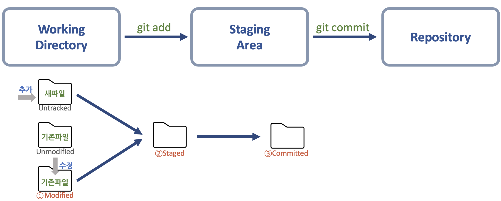

#### 동작 개념
- Working directory : 이력 관리 대상(tracked) 파일들이 위치하는 영역
    - 지정된 디렉터리에서 .git 폴더를 제외한 공간
    - 작업된 파일이나 코드가 저장되는 공간
- Staging area : commit할 대상 파일들이 위치하는 영역
    - .git 폴더 하위에 파일 형태로 존재 -> `index`
    - `git add` 명령을 입력하면, staging 할 파일들의 정보가 index 파일에 기록된다
- Repository : 이력이 기록된(committed) 파일들이 위치하는 영역
    - .git 폴더에 이력 관리를 위한 모든 정보가 저장되어 관리됨

#### Git이 관리하는 3가지 파일 상태

- Modified : 관리 대상 파일이 수정되고, commit이 되지 않은 상태
- Staged : 수정된 파일이 Staging area에 있는 상태
- Committed : 파일 변경사항 기록이 완료된 상태

-> 새로운 파일이 WD에 추가되면, 기존 tracking 대상에 없던 것이므로 Untracked 상태
<br>-> git add를 통해 Staging area로 이동시키면, Staged 상태
<br>-> Staged 파일에 git commit을 사용하면, Committed 상태 (Tracked, Unmodified)

!!! note 
    Staging Area가 필요한 이유?

    - 일부 파일만 commit : 수정된 파일들 중 일부만 선별적으로 commit해야 하는 상황에서, 원하는 파일만 선별하기 위함
    - 충돌 수정 : 둘 이상의 commit 이력을 merge하는 상황 또는 두 파일 간 자동 병합을 할 수 없는 충돌이 발생한 상황에서, 파일별 충돌을 해결하기 위해 중간에 commit을 해두는 것이 안정적
    - commit 수정 : 과거에 기록한 commit 이력을 수정하고자 할 때, 파일을 Staged 상태로 내리고 추가적으로 변경할 사항만 반영하여 commit을 하면 효율적이다


---
## START

### Repository
: git을 통하여 파일, 라이브러리, 패키지 등을 관리하는 공간

- `git init` : 빈 git 저장소 생성, 프로그램의 개발 이력이 기록되는 .git 폴더가 생성된다
``` bash
mkdir repository_name && cd repository_name
git init
```

### 사용자 설정
- global : 사용자의 PC 안 모든 저장소의 config 설정 동일하게 유지
``` bash
git config --global user.name "{name}"
git config --global user.email "{ID}@{email address}"
```

### git reset 이해하기

이미 commit을 완료한 파일을 제거하는 방법 ?

1. 파일을 삭제 후 commit 진행 -> 파일을 추가했던 이력 존재
2. 파일을 추가하기 전 상태로 복귀하고, 이후의 commit 삭제 -> 파일 추가 이력까지 삭제

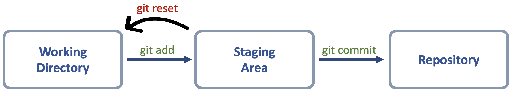

``` bash
git reset [option] [이동할 Hash]
```

| OPTION | Working dir | Staging Area | Repository | 
| :----: | :-------: | :-------: | :------: |
| --hard (내용 제거)| 변경 | 변경 | 변경 |
| --mixed | 유지 | 변경 | 변경 |
| --soft | 유지 | 유지 | 변경 | 

** git reset으로 commit이 삭제된 걸까?

- commit이 삭제되는 것은 아님
- HEAD는 브랜치를 참조하며, 브랜치는 항상 최신 commit을 참조한다
- 현재는 reset을 통해 브랜치가 참조하는 commit이 변경되어 이후의 commit 이력이 검색되지 않는 것
- 최신 commit의 hash 값을 통해 복귀할 수 있다

### git commit --amend 이해하기
: 최근 commit 수정, 내부적으로는 새로운 commit을 생성하여 기존 commit에 덮어쓰기 하는 것이므로 새로운 hash 값을 부여 받는다

``` bash
git commit --amend -m "변경될 커밋 메세지"
git push origin main -f 
```

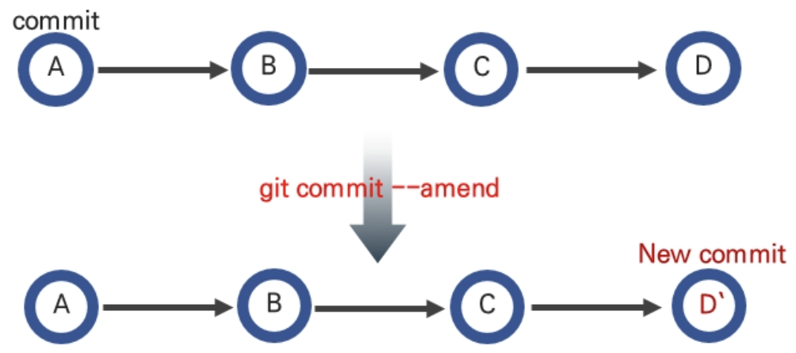{: style="width:70%; height:70%; text-align:center;"}


### HEAD & MASTER

- 브랜치 : Repository 내에 존재하는 독립적인 작업 관리 영역
    - `git init`시 자동으로 생성되는 브랜치는 **master**이다
    - 한 저장소의 브랜치는 **여러 개**일 수 있으므로 현재 작업중인 브랜치를 염두해두어야 한다
- Master 브랜치 : 저장소 생성 시 함께 만들어지는 브랜치
- :star:**master** : 해당 브랜치의 최신 commit을 참조하는 개체
- :star:**HEAD** : 어떤 commit을 가리키는 객체

#### reset & checkout

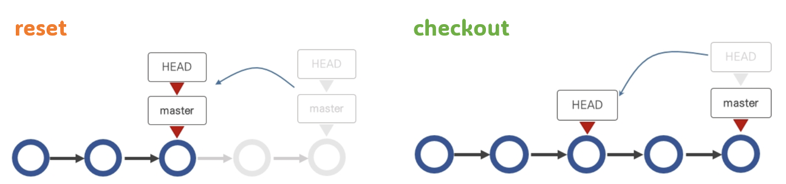

- chekcout : HEAD의 참조 commit 변경

---
## Use Github
: 원격 저장소 Remote Repository

장점 

- 안정성 : 로컬 저장소가 손상되었을 때 백업 저장소 역할
- 협업 : 원격 저장소를 중심으로 다수의 개발자가 협업 가능

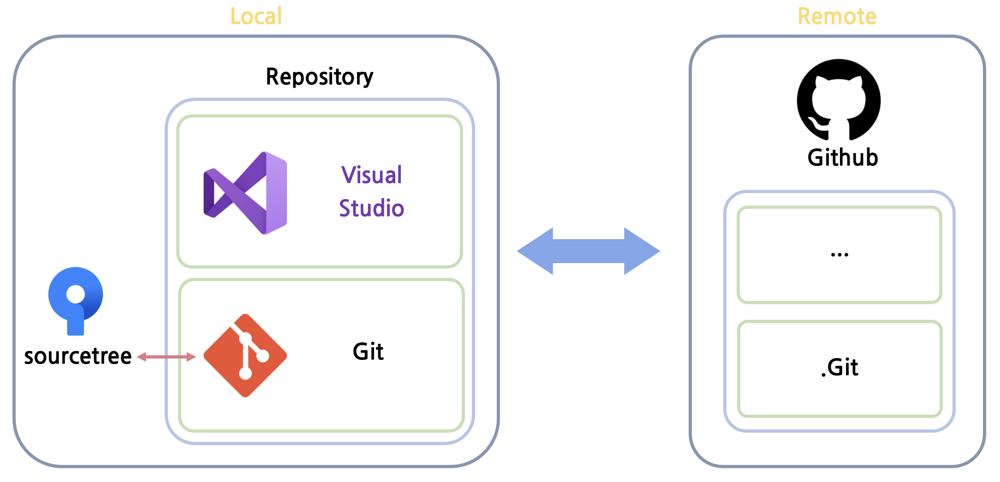

### 원격 저장소 생성과 연동

``` bash
# git remote add [원격저장소이름] [원격저장소주소] : 원격 저장소 생성
# git push -u [원격브랜치이름] [로컬브랜치이름] : Upstream 설정 및 PUSH
git remote add origin https://github.com/{}/{}.git
git push -u origin master
```

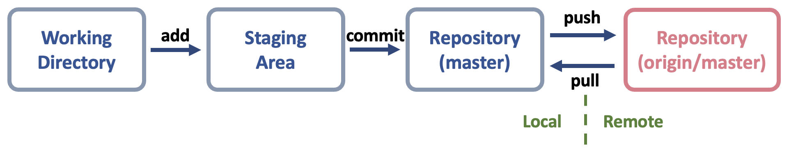

- `git push` : 로컬 저장소의 변경 사항을 원격 저장소로 업로드
- `git pull` : 원격 저장소에 업데이트 된 내용을 로컬 저장소로 가져와서 병합 (Fetch+Merge)

### Tag


- Lightweight tag : tag 이름만 기록
    -  특정 commit을 참조하는 **포인터**와 같은 기능을 가짐
    - 임시로 사용하거나 정보를 기록할 필요가 없을때 사용
- Annotated tag : tag 이름외에 설명(메시지), 서명, 작성자 정보, 날짜 등의 정보를 포함하여 기록
    - 참조 외에 다양한 내용을 포함하므로 git 내부 데이터베이스에 정보가 저장됨
    - 일반적으로 사용

``` bash
git log --oneline # 8d693ff (HEAD) Modify README.md
git tag v1.0.1 8d693ff # Lightweight tag
git tag -a v1.0.1 -m "annotated" 8d693ff # Annotated tag
git push v1.0.1
```

### 원격 저장소에 업로드된 commit 취소

#### git revert
: vim 실행 후, 과거 commit으로 파일 상태를 자동복구한 뒤 새로운 commit을 추가함
<br> (git은 되돌리기 과정도 기록해야할 부분으로 간주하므로 새로운 commit 추가)

``` bash
git log --oneline # 8d693ff (HEAD) Modify README.md, df9b41b README.md
git revert df9b41b
git push
```

#### git reset
: git reset으로 `local에서 참조하는 commit 버전 < remote에서 참조하는 commit 버전` 상태로 변경
<br> git은 내부적으로 pre-version이 최신 상태를 덮어쓰지 못하도록 막아두므로 강제 push 실행
<br> git revert와 달리 복구 이력이 남지 않음

``` bash
git reset --hard HEAD^^ # 2단계 전 commit으로 롤백
git push -f origin main # 강제 push
```

---
## Use github in Cooperation

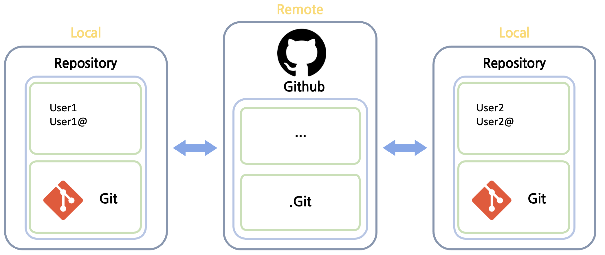

### 충돌 해결
: user1의 master가 원격 저장소보다 뒤쳐져있어 push가 진행이 안되는 상황
<br> git pull -> Error 메시지 출력 및 저장소 경로 우측이 (master|MERGING)으로 변경

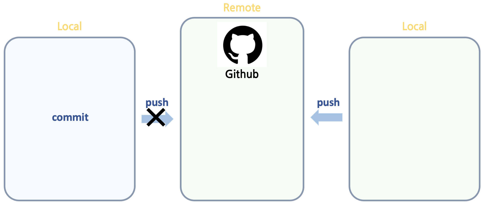

1. 로컬과 원격 저장소 차이 확인 `git diff origin/master master`
2. 소스코드 수정 (직접 파일을 열어 수정)
3. merge 진행 `merge origin/master`
4. `git push`

### 검토와 병합 (fetch/merge)

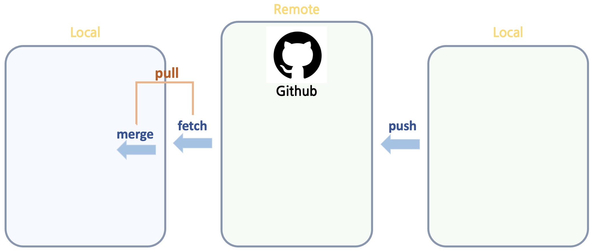

1. 원격 저장소 내용 가져오기 `git fetch`
2. 로컬과 원격 저장소 차이 확인 `git diff master origin/master`
3. user1이 수정하고 push한다 (아니면, 코드작성자 user2에게 수정하고 다시 push하라고 한다)
4. `git merge origin/master`
5. `git commit`
6. `git push`

### 코드라인 별 작성 정보 blame

- `git blame [파일경로]` : 해당 파일의 작성 내역 출력 (commit hash, 작성자명, 작성일시 등)
- `git blame [commit hash] [파일경로]` : 특정 commit의 작성자 정보 확인
- `git blame -L [시작 line],[종료 line] [파일경로]` : 해당 파일에서 출력할 범위
- `git blame -e [파일경로]` : 사용자 이름 대신 이메일 정보 출력
- `git blame -s [파일경로]` : 사용자 이름과 타임스탬프를 제외하고 hash만 표시

### 임시 저장 stash
: 작업하던 내용을 임시저장하고, pull 해야할 때 사용
<br> (ex. 하나의 저장소 안에 브랜치를 여러개 생성했는데, 엉뚱한 브랜치에서 작업을 많이 진행한 경우)

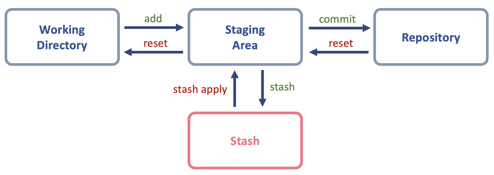

- `git stash` : default name WIP으로 임시 저장 + 메시지 자동 생성
- `git stash -u` : modified 파일 외 untracked(새로 추가한) 파일도 임시 저장
- `git stash -m “메시지”` : 메시지를 추가하여 임시 저장
- `git stash save [저장이름]` : 저장 명칭 지정
- `git stash list` : 임시 저장 내역 출력 (Stack 구조 LIFO)
- `git stash apply` : 가장 최근 저장 내용 가져오기
- `git stash apply stash@{?}` : 해당 저장 내용 가져오기
- `git stash drop` : 가장 최근 저장 내용 삭제
- `git stash drop stash@{?}` : 해당 저장 내용 삭제

---
## Branch

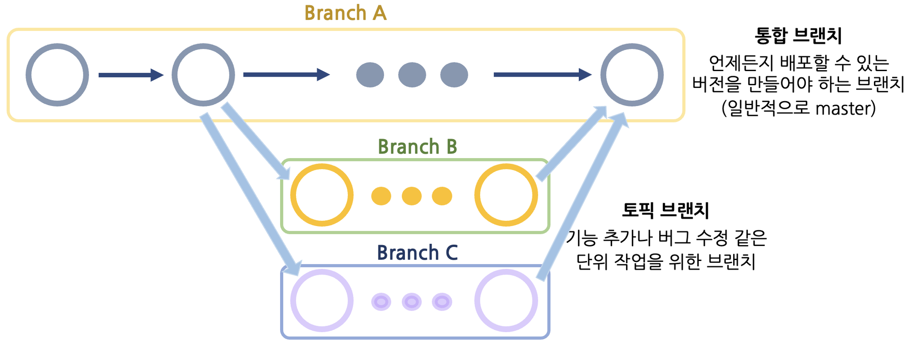

- Repository 내의 독립적인 작업관리 영역
- 한 Repository 안에 브랜치는 여러 개 생성될 수 있으며, 각 브랜치는 다른 브랜치의 영향을 받지 않음
- 브랜치 별로 각각 다른 작업을 동시에 진행할 수 있고, 필요에 따라 두 브랜치를 병합할 수도 있다
- 기능 개발, 버그해결, 배포 작업 등을 단일 저장소에서 작업할 수 있다


### 브랜치 생성/관리/삭제

1. 브랜치 생성
``` bash
git branch ex_branch
git log --oneline # 8d693ff (HEAD => master, tag:v1.0.0, origin/master, ex_branch)
```
현재는 브랜치만 생성하고, 별다른 작업을 하지 않았으므로 HEAD, master, version, branch 전부 동일한 commit을 참조하고 있다
2. 브랜치 전환 : `git checkout ex_branch`
3. 브랜치 병합 : `git checkout master`, `git merge ex_branch`
<br> (이런 식으로 merge하면, 새로운 commit이 생기는 것이 아니라 브랜치의 commit으로 옮겨진다)


### 브랜치 병합

#### Fast-forward merge
: master와 branch가 각각 참조하는 commit이 **동일 선상에 위치**하고 있는 상황

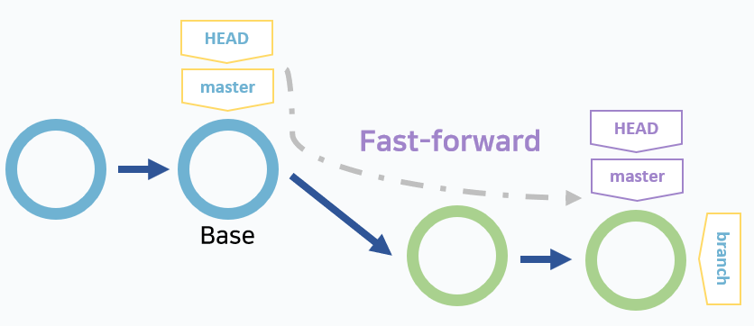

Fast-forward 관계의 브랜치를 `git merge`하면, 새로운 commit이 생가지 않는다
<br>뒤에 있는 브랜치가 '참조 개체가 앞서있는 브랜치가 가리키는 개체'를 참조하도록 이동할 뿐이다

#### 3-way merge
: master와 branch가 각각 Base에서 **분리된** commit을 참조하는 상황

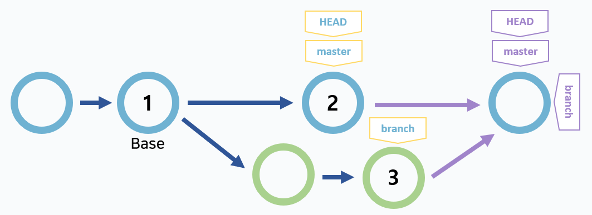

3-way 관계의 브랜치를 `git merge`하면, 새로운 commit이 생성된다
<br>내용을 병합할 때 base와 각 브랜치 2개가 참조하는 commit을 기준으로 병합을 진행하기 때문이다


<br>3-way merge 원리

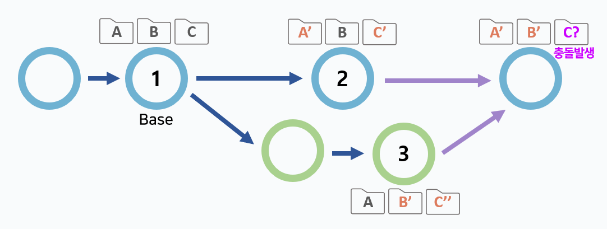

: 3-way merge는 base와 각 브랜치가 참조하는 commit을 고려하여 자동 병합을 진행한다
<br>만약 두 commit 모두에서 변경사항이 발생했다면, 해당 파일은 충돌(conflict)이 발생하므로 충돌을 해결한 뒤 commit해야 한다.

---
#### merge +

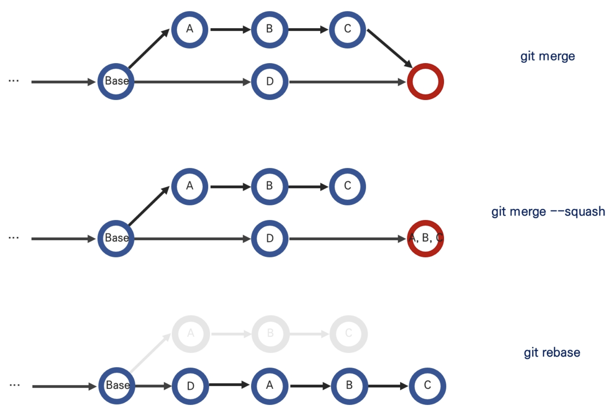

- `git merge --ff [브랜치명]`
    - fast-forward 관계가 아니라면, merge commit 생성
    - fast-forward 관계인 경우, 새로운 commit을 생성하지 않고 브랜치의 참조값만 변경되도록 한다
- `git merge --no-ff [브랜치명]` 
    - 강제 merge commit 생성 및 병합
    - 어떤 브랜치에서 merge 했는지 기록을 남길 수 있다
    - `git log --graph` 명령을 통해 어떤 브랜치로부터 merging되었는지 확인할 수 있다
- `git merge --squash`
    - commit을 생성하지 않고, 상대 브랜치의 작업 내용이 추가되어 파일 상태만 변경된다
    -  commit 이력과 merge된 브랜치 이력 모두 남기지 않는다
---
### rebase

Q. 두가지 이슈가 발생하였다. 
<br>이슈별로 작업하기 위해 2개의 브랜치를 생성하여 작업하기로 했다. 어떻게 merging 해야 할까? 

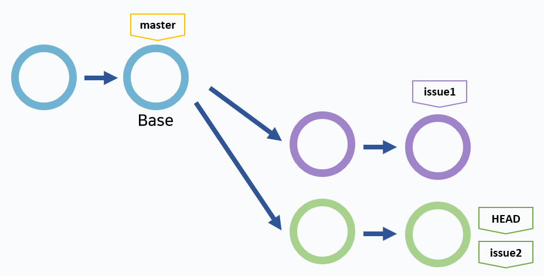{: style="height:80%;width:80%"}

- 작업용 브랜치끼리 병합 후, master 브랜치에 병합
- 작업 종류가 유사한 브랜치끼리 한줄기로 표시되도록 정리하는 방법 -> `git rebase`

``` bash title="git rebase [브랜치명]"
# 브랜치1 생성 후 전환
git checkout -b issue1
git commit -am "issue1 commit"

# 브랜치2 생성 후 전환
git checkout -b issue2
git commit -am "issue2 commit"

## 두 브랜치를 하나로 정리하여 master로 병합
## issue2가 issue1에서 분기하도록 조정 (issue2의 base를 issue1로 재배치)
# (issue2)
git rebase issue1

git checkout master
git merge --no-ff -m "Merge branch" issue2
```

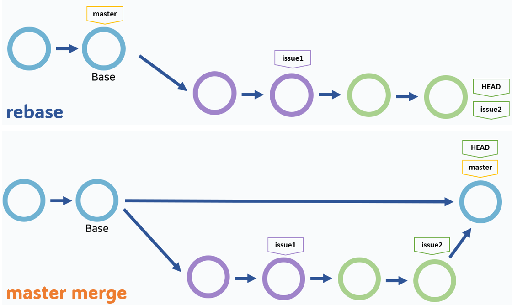

<br>충돌 발생 시

- `git rebase --abort` : rebase 취소
- `git reabse --continue`

``` bash
git reabse --abort
<<코드 정리>>
git add .
git reabse --continue
```

---
### cherry-pick

Q. branch1, branch2 작업을 마치고 병합하려는데 'branch1의 이전 commit + branch2' 병합이 적절하다고 판단된다. 어떻게 merging 해야 할까? 

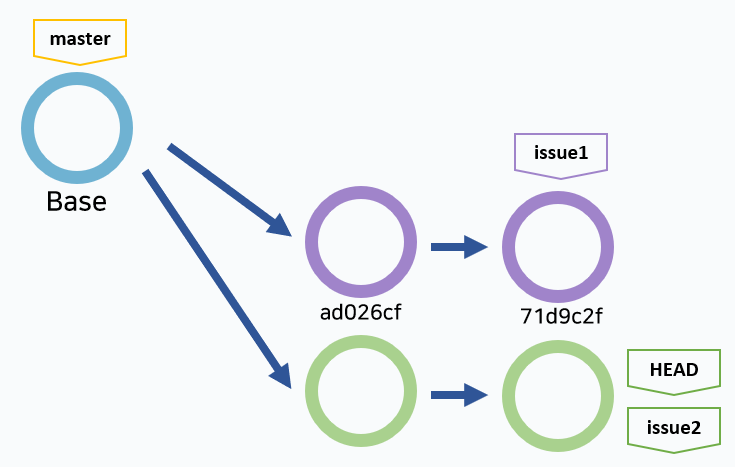{: style="height:80%;width:80%"}

- branch1 브랜치를 원하는 commit까지 hard reset한 후 merging
- `git cherry-pick [commit-hash]` : HEAD가 가리키는 현재 브랜치에 특정 commit의 내용 추가

``` bash
## 브랜치 생성
git checkout -b branch1
git commit -am "branch1"

git checkout -b branch2
git commit -am "branch2"

## git cherry-pick
git cherry-pick ad026cf
```

<br>충돌 발생 시

``` bash
## 취소
git cherry-pick --abort

## 해결
<<충돌 해결을 위한 코드 수정>>
git add .
git cherrt-pick --continue

## master 브랜치에서 merge
git checkout master
git merge --no-ff -m "master merge" branch2
git tag -a v2.1.0 -m "Release version"

## 원격 저장소로 push
git push
git push --tags
```

---
## 신규 브랜치 push
: 새로운 브랜치를 위한 원격 저장소 브랜치 추가

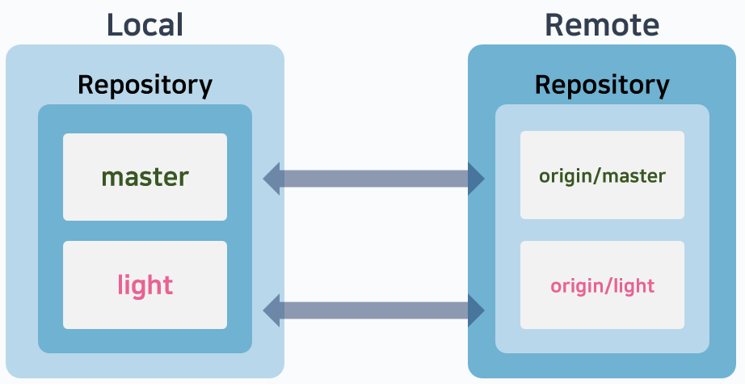

``` bash
## 브랜치 생성
git checkout -b light
git commit -am "light branch commit"

## 원격 저장소에 Branch push
git push --set-upstream origin light
OR
git push -u origin light

## upstream 이후 push
git push
```

---
## ETC

- .gitignore : 이력 관리 대상에서 제외할 경로나 파일 지정 -> [Generate .gitignore](https://www.toptal.com/developers/gitignore)

- Github에 잘못 올린 파일 지우기
``` bash
git rm -r [파일이름] # 로컬저장소 파일 삭제
git rm --cached -r [파일이름] # cached : 원격 저장소의 파일 삭제
git commit -m "commit message"
git push
```

- github에 push한 디렉토리명 변경
``` bash
# 1. 로컬 디렉토리명 변경
# 2. 
git mv '디렉토리명' '변경될 디렉토리명'
```

---
!!! quote
    - Visual studio를 위한 Git -> [wikidocs](https://wikidocs.net/book/7060)
    - openai