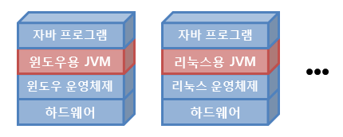
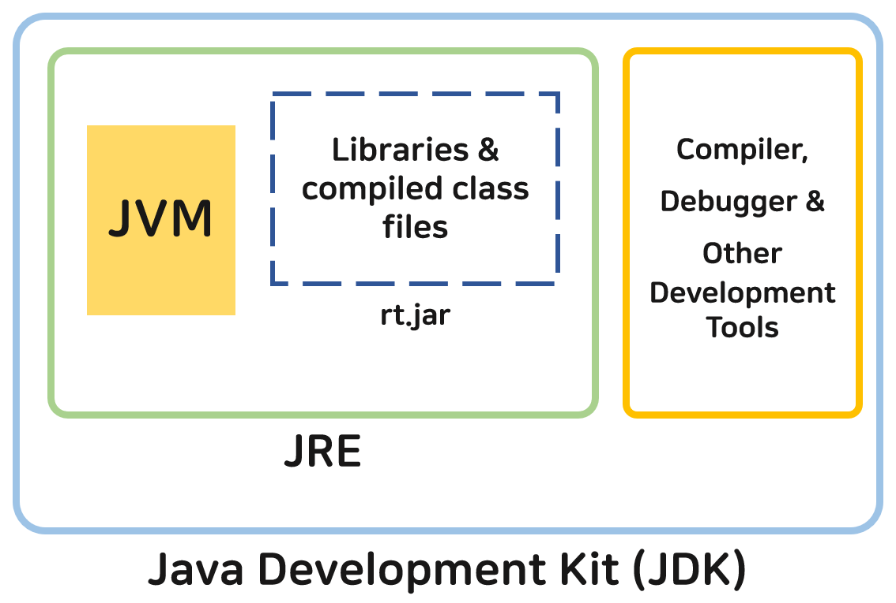
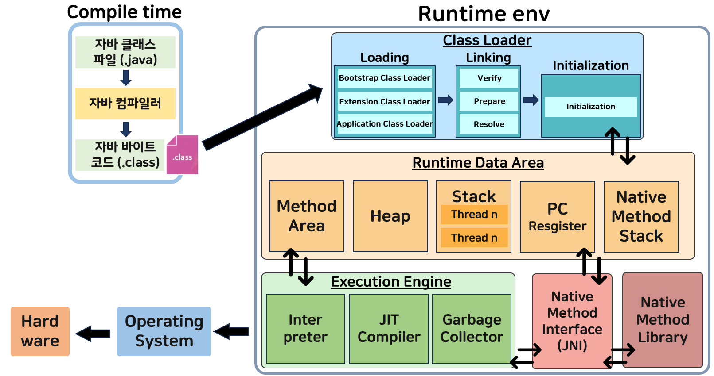

## 자바 가상 머신 (JVM)
: 자바 바이트 코드를 기계어로 변환해 실행
  JRE(Java Runtime Environment)의 일부

위 그림처럼 JVM만 설치되어 있다면, 모든 운영체제에서 실행 가능하다
  단, 자바 프로그램과 달리 JVM은 운영체제에 종속적이므로 각 운영체제에 맞는 JVM을 설치해야 함

---
# Differences Between JDK, JRE, And JVM

---

- JVM (Java Virtual Machine)
: JRE 내부에서 실행

- JRE (Java runtime environment)
: 클래스 라이브러리, JVM 및 기타 파일들(컴파일러 및 디버거와 같은 개발 도구를 제외한)이 포함되어 있다
  JDK의 subset

- JDK (Java Development Kit)
: 컴파일러, 디버거 등의 개발 도구와 함께 JRE가 포함되어 있다

# How JVM Works?

### Compile time env
- 자바 컴파일러 (Java compiler)
: Java 소스 코드를 JVM이 이해할 수 있는 자바 바이트 코드(`.class`)로 변환   자바를 설치하면 javac.exe라는 실행 파일 형태로 설치된다

- 자바 바이트 코드 (Java bytecode)
: JVM이 이해할 수 있는 언어로 변환된 자바 소스 코드
  자바 컴파일러에 의해 변환된 코드의 명령어 크기가 1바이트라 자바 바이트 코드라 불린다
  확장자는 `.class`이며, JVM만 설치되어 있다면 어떤 운영체제에서라도 실행될 수 있음

### Class Loader
: 동적으로 클래스를 로딩해주는 역할
  자바는 동적으로 클래스를 읽어오므로, 프로그램이 실행중인 런타임에서야 모든 코드가 JVM과 연결됨

:material-numeric-1-circle: Initialization
: 프로그램의 블록에서 특정 값을 가진 모든 static 변수 할당

:material-numeric-2-circle: Loading
: RAM으로 파일 로드
  `.class`파일을 읽고, binary data를 생성하여 메서드 영역에 저장

:material-numeric-3-circle: Linking
: 메인 프로그램의 서로 다른 파일을 결합하여 verification, preparation, resolution(optional) 수행

- Bootstrap Class Loader
: Extension Class Loader의 슈퍼 클래스
  rt.jar 파일 로드

- Extension Class Loader
: `$JAVA_HOME/jre/lib/ext`에 포함된 jar 파일 로드

- Application/System Class Loader
: 클래스 파일을 클래스 경로에서 로드

### JVM Memory area
- Method Area 
: method data, field data, runtime pool, metadate와 같은 각 클래스의 구조 저장

- Heap 
: object 할당이 이루어지는 런타임 영역

- Stacks 
: 프로그램의 지역 변수와 partial results 저장
  스레드가 생성될 때마다, JVM stack이 동시에 생성됨
  메서드를 호출할 때, 새로운 프레임을 생성하고 프로세스 완료 호출과 동시에 삭제됨

- PC Registers
: 현재 실행중인 JVM 명령의 주소 저장

- Native Method Stacks 
: 모든 애플리케이션에서 필요한 모든 native methods를 포함함.
  Java로 작성되지 않음

### Execution Engine

- 자바 인터프리터 (Java Interpreter)
: 자바 컴파일러에 의해 변환된 자바 바이트 코드(`.class`)를 읽고 해석하는 역할

- JIT 컴파일러 (Just-In-Time Compiler)
: 자바 바이트 코드를 프로그램이 실행중인 런타임에 실제 기계어로 변환해주는 컴파일러
  동적 번역(dynamic translation)이라고도 불리는 이 기법은 프로그램의 실행 속도를 향상시키기 위해 개발됨

- 가비지 컬렉터 (Garbage collector)
: 더는 사용하지 않는 메모리를 자동으로 회수. 개발자가 따로 메모리를 관리하지 않아도 됨

### Native Method Interface
: C, C++ 등 서로 다른 언어로 작성된 서로 다른 애플리케이션 간의 통신을 돕는 프레임워크
  이를 통해 JVM에서 실행 중인 Java 코드가 라이브러리 및 native application 호출할 수 있음

### Method Libraries
: 실행 엔진에 필수적인 Native Libraries(C, C++)의 모음

---

!!!quote
    - [techvidvan](https://techvidvan.com/tutorials/java-virtual-machine/)
    - [tcpschool](https://www.tcpschool.com/java/java_intro_programming)
    - [javatpoint](https://www.javatpoint.com/jvm-java-virtual-machine)