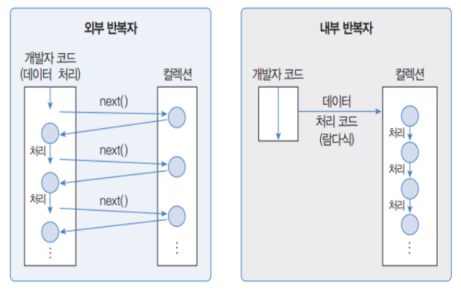
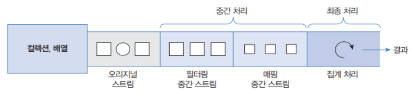
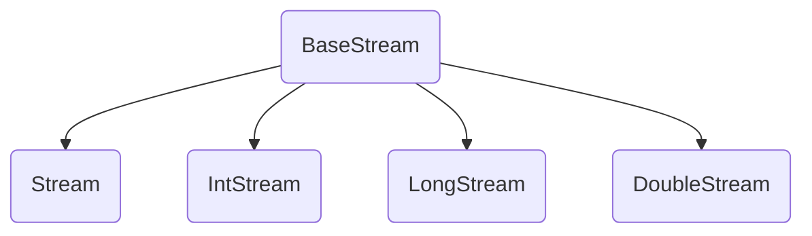

# Stream 스트림
: `java.util.stream`, 내부 반복자, 컬렉션 및 배열의 요소 반복 처리를 위해 사용

``` java
List<String> list = "";
list.add(1);
list.add(2);

// stream 객체 생성
Stream<String> stream = list.stream(); 
stream.forEach(item -> System.out.println(item);) 

// 병렬 처리
Stream<String> parallelStream = list.parallelStream();
parallelStream.forEach(item -> System.out.println(item + Thread.currentThread().getName());) 
```

- Iterator와 비슷한 반복자이지만,
    - 내부 반복자이므로 처리 속도가 빠르고, 병렬 처리에 효율적 (멀티코어CPU활용)
    - 람다식으로 다양한 요소 처리 정의 가능
    - 중간 처리와 최종 처리를 수행하도록 파이프 라인 형성 가능
- 일회성이므로 한 번 사용한 스트림은 재사용 불가
- 기존의 자료를 변경하지 않고, 새로운 메모리 위에서 동작
- 최종 연산이 수행된 이후 모든 연산이 적용되는 **지연 연산** 지원

---
## 외부 반복자 vs 내부 반복자

- 외부 반복자 : 컬렉션 바깥에서 컬렉션 요소를 하나씩 꺼내와서 반복 처리
- 내부 반복자 : 요소 처리 방법을 컬렉션 요소에 넘겨주어 반복 처리



---
## 스트림 파이프라인
: 스트림이 연결되어 있는 것



- 중간 처리 : 매핑, 필터링, 정렬 (여러 번 사용 가능)
- 최종 처리 : 반복, 카운팅, 평균, 총합 등의 집계 처리 (한 번만 사용)
<br>-> 파이프라인의 맨 끝에는 최종 처리 함수가 와야 한다

---
## 스트림 인터페이스
: `java.util.stream`에는 BaseStream 인터페이스를 부모로 둔 자식 인터페이스들이 제공된다



|  리턴 타입  |  메서드(매개변수)  |  리소스  |
| :--------: | :---------------: | :------: |
| `Stream<T>` | `java.util.Collection.stream()` | List 컬렉션 |
| | `java.util.Collection.parallelStream()` | Set 컬렉션 | 
| | |
| `Stream<T>` | `Arrays.stream(T[])`, `Stream.of(T[])`  | 배열 |
| IntStream | `Arrays.stream(int[])`, `IntStream.of(int[])` | |
| LongStream | `Arrays.stream(long[])`, `LongStream.of(long[])` | |
| DoubleStream | `Arrays.stream(double[])`, `DoubleStream.of(double[])` | 
| | |
| IntStream | `IntStream.range(int, int)` | int 범위 |
| | `IntStream.rangeClosed(int, int)` | |
| | |
| LongStream | `LongStream.range(long, long)` | long 범위 |
| | `LongStream.rangeClosed(long, long)` | |
| | |
| `Stream<Path>`| `Files.list(Path)` | 디렉토리 |
| `Stream<String>` | `Files.lines(Path, Charset)` | 텍스트 파일 |
| | |
| DoubleStream | `Random.doubles(...)` | 랜덤 수 |
| IntStream | `Random.ints()` | |
| LongStream | `Random.longs()` | |

---
## 중간 처리 Intermediate Operations

### 필터링
: 요소 걸러내기

### 매핑
: 스트림의 요소를 다른 요소로 변환

### 정렬
: 요소를 오름차순/내림차순으로 정렬

|  리턴 타입  |  메서드(매개변수)  |  설명  |
| :--------: | :---------------: | :------: |
| `Stream<T>` | `sorted()` | Comparable 요소를 정렬한 새로운 스트림 생성 |
| `Stream<T>` | `sorted(Comparator<T>)` | 요소를 Comparator에 따라 정렬한 새 스트림 생성 | 
| DoubleStream | `sorted()` | double 요소를 올림차순으로 정렬 |
| IntStream | `sorted()` | int 요소를 올림차순으로 정렬 |
| LongStream | `sorted()` | long 요소를 올림차순으로 정렬 |

### 루핑 Looping
: 스트림에서 요소를 하나씩 반복해서 가져와 처리하는 것


---
## 최종 처리 Terminal Operations

### 매칭
: 요소들이 특정 조건을 만족하는지에 대한 여부 조사

### 집계

### 커스텀 집계


### 수집
: 요소들을 필터링/매핑한 후 요소들을 수집하는 collect()

### 요소 그룹핑

---
## 병렬 처리


---
!!! quote
    - 이것이 자바다 (저자: 신용권, 임경균 | 출판사: 한빛미디어)
    - 김정현 강사님