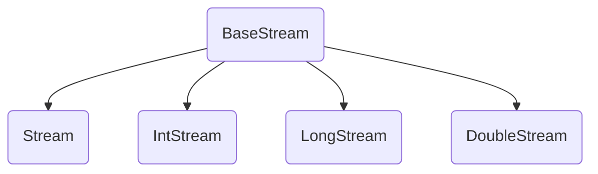

# Stream 스트림
: `java.util.stream`, 내부 반복자, 컬렉션 및 배열의 요소 반복 처리를 위해 사용

``` java title="Example"
List<String> list = new ArrayList<>();
list.add(1);
list.add(2);

// stream 객체 생성
Stream<String> stream = list.stream();  // or Arrays.stream(list)
stream.forEach(item -> System.out.println(item);) 

// 병렬 처리
Stream<String> parallelStream = list.parallelStream();
parallelStream.forEach(item -> System.out.println(item + Thread.currentThread().getName());) 
```

- Iterator와 비슷한 반복자이지만,
    - 내부 반복자이므로 처리 속도가 빠르고, 병렬 처리에 효율적 (멀티코어CPU활용)
    - 람다식으로 다양한 요소 처리 정의 가능
    - 중간 처리와 최종 처리를 수행하도록 파이프 라인 형성 가능
- 일회성이므로 한 번 사용한 스트림은 재사용 불가
- 기존의 자료를 변경하지 않고, 새로운 메모리 위에서 동작
- 최종 연산이 수행된 이후 모든 연산이 적용되는 **지연 연산** 지원

---
## 외부 반복자 vs 내부 반복자

- 외부 반복자 : 컬렉션 바깥에서 컬렉션 요소를 하나씩 꺼내와서 반복 처리
- 내부 반복자 : 요소 처리 방법을 컬렉션 요소에 넘겨주어 반복 처리


---
## 스트림 파이프라인
: 스트림이 연결되어 있는 것


- 중간 처리 : 매핑, 필터링, 정렬 (여러 번 사용 가능)
- 최종 처리 : 반복, 카운팅, 평균, 총합 등의 집계 처리 (한 번만 사용)
<br>-> 파이프라인의 맨 끝에는 최종 처리 함수가 와야 한다

---
## 스트림 인터페이스
: `java.util.stream`에는 BaseStream 인터페이스를 부모로 둔 자식 인터페이스들이 제공된다



|  리턴 타입  |  메서드(매개변수)  |  리소스  |
| :--------: | :---------------: | :------: |
| `Stream<T>` | `java.util.Collection.stream()` | List 컬렉션 |
| | `java.util.Collection.parallelStream()` | Set 컬렉션 | 
| | |
| `Stream<T>` | `Arrays.stream(T[])`, `Stream.of(T[])`  | 배열 |
| IntStream | `Arrays.stream(int[])`, `IntStream.of(int[])` | |
| LongStream | `Arrays.stream(long[])`, `LongStream.of(long[])` | |
| DoubleStream | `Arrays.stream(double[])`, `DoubleStream.of(double[])` | 
| | |
| IntStream | `IntStream.range(int, int)` | int 범위 |
| | `IntStream.rangeClosed(int, int)` | |
| | |
| LongStream | `LongStream.range(long, long)` | long 범위 |
| | `LongStream.rangeClosed(long, long)` | |
| | |
| `Stream<Path>`| `Files.list(Path)` | 디렉토리 |
| `Stream<String>` | `Files.lines(Path, Charset)` | 텍스트 파일 |
| | |
| DoubleStream | `Random.doubles(...)` | 랜덤 수 |
| IntStream | `Random.ints()` | |
| LongStream | `Random.longs()` | |

``` java title="Example"
// 숫자 범위
IntStream stream = IntStream.rangeClosed(1, 100);
stream.forEach(a -> sum+= a);

// 파일
Path path = Paths.get(className.class.getResource("data.txt").toURI()); // data.txt 파일의 경로 객체
Stream<String> stream = Files.lines(path, Charset.defaultCharset()); // 기본 UTF-8
```

---
## 중간 처리 Intermediate Operations

### 필터링
: 요소 걸러내기 

- `distinct()` : 요소의 중복 제거
    - 객체 스트림일 경우, equals() 메서드의 리턴값이 true이면 동일한 요소로 판단
    - Int/Long/Double Stream일 경우, 같은 값일 경우 중복 제거 
- `filter()` : 매개값으로 주어진 Predicate가 true를 리턴하는 요소만 필터링

|  리턴 타입  |  메서드(매개변수)  |   설명   |
| :--------: | :---------------: | :------: | 
| Stream<br>IntStream<br>LongStream<br>DoubleStream | distinct()| 중복 제거 |
| | |
| Stream | filter(Predicate<T>) | 조건 필터링<br>매개 타입은 요소 타입에 따른 함수형 인터페이스이므로 람다식 작성 가능 |
| IntStream | filter(IntPredicate) | |
| LongStream | filter(LongPredicate) | |
| DoubleStream | filter(DoublePredicate) | |

#### Predicate
: 함수형 인터페이스, 매개값을 조사한 후 boolean 값을 리턴하는 test() 메서드 소유

- `T -> {... return true;}`
- `T -> true;` 

|  인터페이스  |  추상 메서드  |   설명   |
|  :--------: | :---------------: | :------: | 
| Predicate<T> | boolean test(T t) | 객체 T를 조사 |
| IntPredicate | boolean test(int value) | int 값 조사 |
| LongPredicate | boolean test(long value) | long 값 조사 |
| DoublePredicate | boolean test(double value) | double 값 조사 |

``` java
// 중복 요소 제거
list.stream().distinct().forEach(n -> System.out.println(n));

// '신'으로 시작하는 요소 필터링 (startsWith 주어진 문자열로 시작하면 true, 아니면 false)
list.stream().filter(n -> n.startsWith("신")).forEach(n -> System.out.println(n));

// 중복 요소를 먼저 제거하고, '신'으로 시작하는 요소 필터링
list.stream().disticnt().filter(n -> n.startsWith("신")).forEach(n -> System.out.println(n));
```


### 매핑
: 스트림의 요소를 다른 요소로 변환
<br> `mapXxx()`, `asDoubleStream()`, `asLongStream()`, `boxed()`, `flatMapXxx()` 등

#### mapXxx()
: 요소를 다른 요소로 변환한 새로운 스트림 리턴
<br>매개타입으로 Function을 받는다

|  리턴 타입  |  메서드(매개변수)  |  요소 -> 변환 요소  |
|  :--------: | :---------------: | :------: | 
| `Stream<R>` | `map(Function<T,R>)` | T -> R |
| IntStream | `mapToInt(ToIntFunction<T>)` | T -> Int |
| LongStream | `mapToLong(ToLongFunction<T>)` | T -> Long |
| DoubleStream | `mapToDouble(ToDoubleFunction<T>)` | T -> Double |
| `Stream<U>` | `mapToObj(IntFunction<U>)` | Int -> U |
| | `mapToObj(LongFunction<U>)` | Long -> U |
| | `mapToObj(DoubleFunction<U>)` | Double -> U |
| DoubleStream | mapToDouble(IntToDoubleFunction) | Int -> Double |
| DoubleStream | mapToDouble(LongToDoubleFunction) | Long -> Double |
| IntStream | mapToInt(DoubleToIntFunction) | Double -> Int |
| LongStream | mapToLong(DoubleToLongFunction) | Double -> Long |

Function은 함수형 인터페이스로, 매개값을 리턴값으로 매핑하는 applyXxx() 메서드를 가진다

- `T -> {... return R;}`
- `T -> R;` 

| 인터페이스  |  추상 메서드  |  매개값 -> 리턴값  |
|  :--------: | :---------------: | :------: | 
| `Function<T,R>` | R apply(T t) | T -> R |
| `IntFunction<R>` | R apply(int value) | Int -> R |
| `LongFunction<R>` | R apply(long value) | Long -> R |
| `DoubleFunction<R>` | R apply(double value) | Double -> R |
| `ToIntFunction<T>` | int applyAsInt(T value) | T -> Int |
| `ToLongFunction<T>` | long applyAsLong(T value) | T -> Long |
| `ToDoubleFunction<T>` | double applyAsDouble(T value) | T -> Double |
| IntToLongFunction | long applyAsLong(int value) | Int -> Long |
| IntToDoubleFunction | double applyAsDouble(int value) | Int -> Long |
| LongToIntFunction | int applyAsInt(long value) | Long -> Int |
| LongToDoubleFunction | double applyAsDouble(long value) | Long -> Double |
| DoubleToIntFunction | int applyAsInt(double value) | Double -> Int |
| DoubleToLongFunction | long applyAsLong(double value) | Double -> Long |

``` java title="Example"
// Calculator를 add 스트림으로 변환
CalculatorList.stream().mapToInt(s -> s.add()).forEach(result -> System.out.println(result));
```

#### asDoubleStream(), asLongStream(), boxed()
: primitive 타입 간의 변환, 기본 타입 요소를 Wrapper 객체 요소로 변환 시 사용

|  리턴 타입  |  메서드(매개변수)  |  요소 -> 변환 요소  |
|  :--------: | :---------------: | :------: | 
| LongStream | asLongStream() | Int -> Long |
| DoubleStream | asDoubleStream() | Int -> Double <br> Long -> Double |
| `Stream<Integer>`<br>`Stream<Long>`<br>`Stream<Double>` | boxed() | Int -> Integer <br> Long -> Long <br> Double -> Double |

#### flatMapXxx()
: 하나의 요소를 여러 요소들로 변환한 새로운 스트림 리턴

|  리턴 타입  |  메서드(매개변수)  |  요소 -> 변환 요소  |
|  :--------: | :---------------: | :------: | 
| `Stream<R>` | `flatMap(Function<T, Stream<R>>)` | T -> Stream<R> |
| IntStream | `flatMap(IntFunction<IntStream>)` | Int -> IntStream |
| LongStream | `flatMap(LongFunction<LongStream>)` | Long -> LongStream |
| DoubleStream | `flatMap(DoubleFunction<DoubleStream>)` | Double -> DoubleStream |
| | |
| IntStream | `flatMapToInt(Function<T, IntStream>)` | T -> InputStream ? |
| LongStream | `flatMapToLong(Function<T, LongStream>)` | T -> LongStream |
| DoubleStream | `flatMapToDouble(Function<T, DoubleStream>)` | T -> DoubleStream |

``` java title="Example"
// 문장 스트림을 단어 스트림으로 변환
list.stream().floatMap(sequence -> Arrays.stream(sequence.split(" "))).forEach(word -> System.out.println(word));
```


### 정렬
: 요소를 오름차순/내림차순으로 정렬

|  리턴 타입  |  메서드(매개변수)  |  설명  |
| :--------: | :---------------: | :------: |
| `Stream<T>` | `sorted()` | Comparable 요소를 정렬한 새로운 스트림 생성 |
| `Stream<T>` | `sorted(Comparator<T>)` | 요소를 Comparator에 따라 정렬한 새 스트림 생성 | 
| DoubleStream | `sorted()` | double 요소를 올림차순으로 정렬 |
| IntStream | `sorted()` | int 요소를 올림차순으로 정렬 |
| LongStream | `sorted()` | long 요소를 올림차순으로 정렬 |

#### Comparable 정렬
: 객체가 Comparable을 구현하고 있다면, sorted() 메서드 사용 가능

=== "Example"
    ``` java
    Stream<String> stream = list.stream();
    Stream<String> orderedStream = stream.sorted();
    Stream<String> reverseOrderedStream = stream.sorted(Comparator.reverseOrder());
    ```
=== "Example2"
    ``` java
    public class Student implements Comparable<Student>{
        ...
        @Override
        public int compareTo(Student o){
            // score와 o.score이 같을 경우 0 리턴, 작으면 음수 리턴, 크면 양수 리턴
            return Integer.compare(score, o.score) 
        }
    }
    --------------------------------------------------------------------------------
    studentList.stream().sorted();
    studentList.stream().sorted(Comparator.reverseOrder());
    ```

#### Comparator 정렬
: 객체가 Comparable 구현이 되어있지 않다면, 비교자(Comparator)를 제공하여 요소를 정렬한다
<br> 람다식 구현 -> `sorted((o1, o2) -> {...})`

``` java
studentList.stream().sorted((s1, s2) -> Integer.compare(s1.getScore(), s2.getScore())) //오름차순
studentList.stream().sorted((s1, s2) -> Integer.compare(s2.getScore(), s1.getScore())) //내림차순
list.stream().sorted((s1, s2) -> Double.compare(s2.getScore(), s1.getScore())) //실수 오름차순
```

### 루핑 Looping
: 스트림에서 요소를 하나씩 반복해서 가져와 처리하는 것

- peek() : **중간 처리** 요소 루핑 메서드
- forEach() : **최종 처리** 요소 루핑 메서드

|  리턴 타입  |  메서드(매개변수)  |  설명  |
| :--------: | :---------------: | :------: |
| `Stream<T>` | `peek(Consumer<? super T>)` | T 반복 |
| IntStream | peek(IntConsumer action) | Int 반복 |
| DoubleStream | peek(DoubleConsumer action) | Double 반복 |
| | |
| void | `forEach(Consumer<? super T> action)` | T 반복 |
| | `forEach(IntConsumer action)` | Int 반복 |
| | `forEach(DoubleConsumer action)` | Double 반복 |


매개타입 Consumer는 함수형 인터페이스로, 매개값을 처리하는 accept() 메서드를 가진다

- `Consumer<? super T>` = `T -> {...}`, `T -> 실행문;`

| 인터페이스  |  추상 메서드  |  설명  |
|  :--------: | :---------------: | :------: | 
| `Consumer<T>` | void accept(T t) | 매개값 T를 받아 소비 |
| IntConsumer | void accept(int value) | 매개값 int를 받아 소비 |
| LongConsumer | void accept(long value) | 매개값 long을 받아 소비 |
| DoubleConsumer | void accept(double value) | 매개값 double을 받아 소비 |


---
## 최종 처리 Terminal Operations

### 매칭
: 요소들이 특정 조건을 만족하는지에 대한 여부 조사 ( allMatch, anyMatch, noneMatch )

|  리턴 타입  |  메서드(매개변수)  |  설명  |
| :--------: | :---------------: | :------: |
| boolean | `allMatch(Predicate<T> predicate)` | 모든 요소가 만족하는지 여부 |
| |  `allMatch(IntPredicate predicate)` | |
| | `allMatch(LongPredicate predicate)` | |
| | `allMatch(DoublePredicate predicate)` | |
| | |
| boolean | `anyMatch(Predicate<T> predicate)` | 최소한 하나의 요소가 만족하는지 여부 |
| |  `anyMatch(IntPredicate predicate)` | |
| | `anyMatch(LongPredicate predicate)` | |
| | `anyMatch(DoublePredicate predicate)` | |
| | |
| boolean | `noneMatch(Predicate<T> predicate)` | 모든 요소가 만족하지 않는지 여부 |
| |  `noneMatch(IntPredicate predicate)` | |
| | `noneMatch(LongPredicate predicate)` | |
| | `noneMatch(DoublePredicate predicate)` | |


### 집계
: 대량의 데이터를 가공해서 하나의 값으로 축소하는 Reduction
<br> `count()`, `sum()`, `average()`, `max()`, `min()`

|  리턴 타입  |  메서드(매개변수)  |  설명  |
| :--------: | :---------------: | :------: |
| long | count() | 요소 개수 |
| OptionalXXX | findFirst() | 첫번째 요소 |
| `Optional<T>`| `max(Comparator<T>)` | 최대값 |
| OptionalXXX | max() | |
| `Optional<T>`| `min(Comparator<T>)` | 최소값 |
| OptionalXXX | min() | |
| OptionalDouble | average() | 평균 |
| int, long, double | sum() | 합계 |

#### OptionalXXX
: OptionalXXX는 Optional, OptionalDouble, OptionalInt, OptionalLong 클래스로 최종값을 저장하는 객체이다

- `get()`, `getAsDouble()`, `getAsInt()`, `getAsLong()` 으로 최종값 호출
- 집계값이 존재하지 않을 경우, Default 값을 설정하거나 집계값을 처리하는 Consumer 등록 가능

|  리턴 타입  |  메서드(매개변수)  |  설명  |
| :--------: | :---------------: | :------: |
| boolean | isPresent() | 집계값 유무 |
| T | orElse(T) | 집계값이 없을 경우 default 값 설정 |
| double | orElse(double) | |
| int | orElse(int) | |
| long | orElse(long) | |
| void | ifPresent(Consumer) | 집계값이 있을 경우 Consumer에서 처리 |
| | ifPresent(DoubleConsumer) | |
| | ifPresent(IntConsumer) | |
| | ifPresent(LongConsumer) | |

``` java
// 집계값이 있을 경우에만 값 산출
OptionalDouble option = stream.average();
if(option.isPresent)
    optional.getAsDouble();

// default 값 설정
double avg = stream.average().orElse(0.0);

// 집계값이 있을 경우에만 동작하는 Consumer 람다식
stream.average().ifPresent(result -> System.out.println(result));
```

#### 커스텀 집계
: 다양한 집계 결과물을 생성할 수 있는 `reduce()`

| 인터페이스  |  리턴 타입  |  메서드(매개변수)  |
| :--------: | :---------: | :------: | 
| Stream | `Optional<T>` | `reduce(BinaryOperator<T> accumulator)` |
| | T | `reduce(T identify, BinaryOperator<T> accumulator)` |
| IntStream | OptinalInt | reduce(IntBinaryOperator op) |
| | int | reduce(int identity, IntBinaryOperator op) |
| LongStream | OptionalLong | reduce(LongBinaryOperator op) |
| | long | reduce(long identity, LongBinaryOperator op) | 
| DoubleStream | OptionalDouble | reduce(DoubleBinaryOperator op) |
| | double | reduce(double identity, DoubleBinaryOperator op) |

- reduce()는 스트림에 요소가 없을 경우, NoSuchElementException 예외가 발생한다
- 따라서, identity 매개값을 제공함으로써 default 값을 설정한다
- 매개값인 BinaryOperator는 함수형 인터페이스로, 두 개의 매개값을 받아 하나의 값을 리턴하는 apply() 메서드를 가진다

``` java title="Example"
// 방법1
list.stream().mapToInt(Element :: value).sum();

// 방법2 값이 없을 경우, 예외 발생
list.stream().map(Element :: value).reduce((a,b) -> a+b);

// 방법2 default 값 설정
list.stream().map(Element :: value).reduce(0, (a,b) -> a+b);
```

### 수집
: 요소들을 필터링/매핑한 후 요소들을 수집하는 collect()


### 요소 그룹핑

---
## 병렬 처리


---
!!! quote
    - 이것이 자바다 (저자: 신용권, 임경균 | 출판사: 한빛미디어)
    - 김정현 강사님