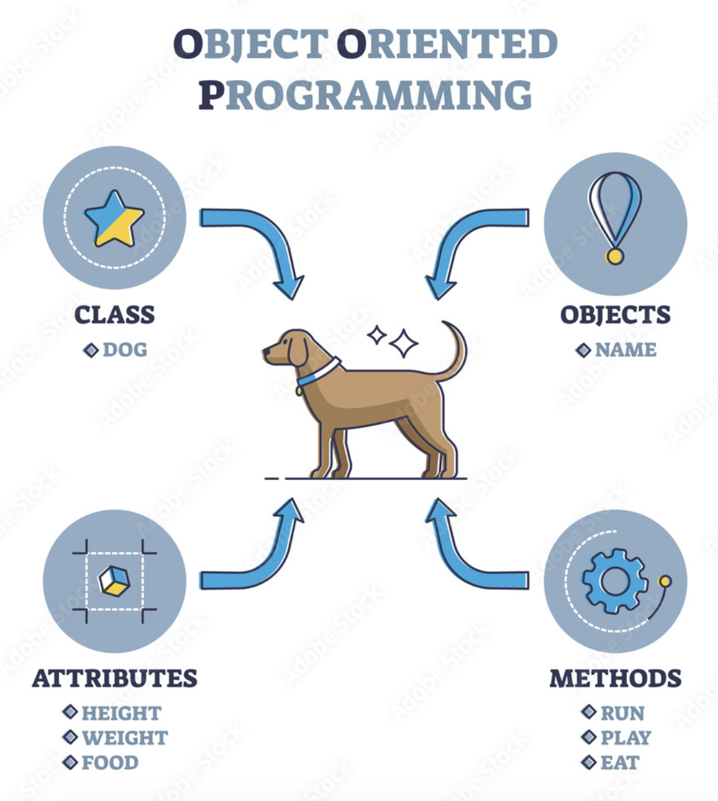
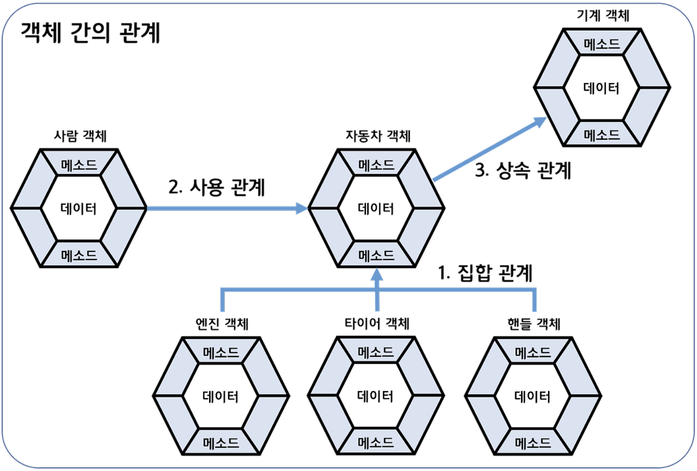

## 객체 지향 프로그래밍
: Object Oriented Programming, 객체들을 하나씩 조립해서 완성된 프로그램을 만드는 기법 


출처: [VectorMine-stock.adobe.com](https://stock.adobe.com/kr/images/object-oriented-programming-language-or-oop-paradigm-explanation-outline-diagram-labeled-educational-scheme-with-class-objects-attributes-and-methods-for-coding-system-and-type-vector-illustration/482417602)

### 객체
: 물리적으로 존재하거나 개념적인 것 중에서, 다른 것과 식별 가능한 것
<br> 물리적으로 존재하는 자동차, 자전거, 책이나 개념적인 학과, 강의, 주문 등

==객체는 속성과 동작으로 구성된다==

- 속성(Field) : 이름, 나이, 키 등
- 동작(Method) : 걷다, 뛰다, 먹다 등

객체 모델링
: 현실 세계의 객체를 소프트웨어 객체로 설계하는 것
<br> 현실 세계 객체의 대표 속성과 동작을 추려내어 소프트웨어 객체의 필드와 메서드로 정의하는 과정

객체의 상호작용
: 객체들은 메서드를 이용하여 다른 객체와 서로 상호작용하면서 동작한다. 
<br> 메서드가 실행될 때 필요한 매개값, 메서드의 실행의 결과인 리턴값

### 객체 간의 관계
: 객체는 단독으로 존재할 수 있지만, 대부분 다른 객체와 관계를 맺는다


출처 : [yuna96-tistory](https://yuna96.tistory.com/53)

**집합 관계**
: 완성품-부품 관계 (자동차 && 엔진, 타이어, 핸들)


**사용 관계**
: 다른 객체의 필드를 읽고 변경하거나 메서드를 호출하는 관계 (사람이 자동차에게 run 메서드 호출)

**상속 관계**
: 부모-자식 관계 (자동차가 기계의 특징(필드, 메서드)을 물려받았을 때, 둘의 관계)


### ==객체 지향 프로그래밍의 특징==
: 코드의 재사용을 통해 반복적인 코드를 최소화하고, 코드를 최대한 간결하게 표현할 수 있다

#### 캡슐화 Encapsulation
: 객체의 속성과 기능들을 하나의 캡슐로 만들어 데이터를 외부로부터 보호하는 것    

- 외부 객체는 해당 객체 내부의 구조를 알지 못하며, 객체가 노출해서 제공하는 필드와 메서드만 이용할 수 있다
- 외부의 잘못된 사용으로 인해 객체가 손상되지 않도록 함
- 캡슐화된 멤버의 노출 여부를 결정하기 위해 접근 제한자 Access Modifier를 사용한다

#### 상속 Inheritance
: 부모 역할의 상위 객체가 자신의 필드와 메서드를 자식 객체에게 물려주어 사용할 수 있도록 하는 것

- 상위 클래스의 속성과 기능들을 하위 클래스에서 그대로 받아 사용하거나 오버라이딩을 통해 선택적으로 재정의하여 사용
- 코드의 재사용성을 높이고, 유지 보수 시간을 최소화할 수 있다
- 데이터 보호(data protection) : 외부로부터 클래스에 정의된 속성과 기능들을 보호
- 데이터 은닉(data hiding) : 내부의 동작을 감추고 외부에는 필요한 부분만 노출

#### 다형성 Polymorphism
: 어떤 객체의 속성이나 기능이 상황에 따라 여러 가지 형태를 가질 수 있는 성질, 사용 방법은 동일하지만 실행 결과가 다양하게 나오는 성질

- 자동 타입 변환과 재정의 기술 필요
- 메서드 오버라이딩 Method Overriding
- 메서드 오버로딩 Method Overloading

#### 추상화

: 사물이나 표상에서 가장 본질적이고 공통적인 부분을 추출하여 파악하는 것

- 추상 클래스 Abstract class
- 인터페이스 Interface : 인터페이스에 정의된 추상 메서드의 내용이 하위 클래스에서 정의되어야 한다


## 클래스
: 객체를 정의해 놓은 것으로서 객체의 설계도에 해당

인스턴스 Instance
: 클래스로부터 생성된 객체

- 클래스명은 첫 문자를 대문자로 하고, Camel 스타일로 한다. 첫 문자는 숫자가 될 수 없고, 특수 문자 중 `$`, `_`를 포함할 수 있다
- 하나의 소스 파일에 복수 개의 클래스를 선언하면, 소스 파일명과 동일한 클래스만 public 클래스로 선언할 수 있다
- 공개 클래스 : 어느 위치에 있든 패키지와 상관없이 사용할 수 있는 클래스

``` java title="클래스 변수 생성"
클래스 변수 = new 클래스();

Student s1 = new Student(); // 첫번째 Student 객체
Student s2 = new Student(); // (첫번째와는 다른) 두번째 Student 객체
```

!!! info
    클래스의 두 가지 용도

    - 라이브러리 클래스 : 실행할 수 없으며 다른 클래스에서 이용하는 클래스
    - 실행 클래스 : `main()` 메서드를 가지고 있는 실행 가능한 클래스

    일반적으로 자바 프로그램은 하나의 실행 클래스와 여러 개의 라이브러리 클래스들로 구성된다.

### 클래스의 구성 멤버

``` java
public class ClassName {
    int fieldName; // 필드 선언
    ClassName(){} // 생성자 선언
    int methodName(){} // 메서드 선언
}
```

#### 필드
: 객체의 데이터 저장. 객체의 데이터에는 고유 데이터, 현재 상태 데이터, 부품 데이터가 있다


- 반드시 클래스 블록에서 선언되어야 필드 선언이 된다
- Camel 스타일

!!! info
    필드와 (로컬)변수의 차이점

    - (로컬)변수는 생성자와 메서드 블록에서 선언되며, 생성자와 메서드 호출 시에만 생성되고 사용됨
    - 필드는 클래스 블록에서 선언되며, 객체 내부에서 존재하고 객체 내/외부에서 사용 가능

    | 구분 | 필드 | (로컬)변수 |
    |:--:|:---:|:----:|
    | 선언 위치 | 클래스 선언 블록 | 생성자, 메서드 선언 블록 |
    | 존재 위치 | 객체 내부에 존재 | 생성자, 메서드 호출 시에만 존재 |
    | 사용 위치 | 객체 내/외부에서 사용 | 생성자, 메서드 블록 내에서만 사용 |

- 외부 객체에서는 참조 변수와 도트 `,` 연산자를 이용하여 필드를 읽고 변경
- 도트 `.` : 객체 접근 연산자, 객체가 갖고 있는 필드나 메서드에 접근할 때 참조 변수 뒤에 붙여 사용
- 내부에서는 필드명을 통해 필드를 읽고 변경
=== "외부 객체"
    ``` java
    void method() {
        Car myCar = new Car(); // Car 객체 생성
        myCar.speed = 60; // 값 변경 (도트 연산자 .)
    }
    ```
=== "내부 객체"
    ``` java
    int speed; // 필드

    // 생성자와 메서드는 객체가 생성된 후 호출되므로 내부에서 필드 사용 가능
    Car() { // 생성자에서 사용
        speed = 60;
    }

    void method(...) { // 메서드에서 사용
        speed = 60;
    }
    ```

객체마다 동일한 값을 갖는다면 필드 선언 시 초기값을 대입하는 것이 좋고, 객체마다 다른 값을 가진다면 생성자에서 필드를 초기화하는 것이 좋다
``` java
// 국가는 "대한민국"으로 동일하지만, 이름은 각자 다르므로 생성자에서 초기화
public Class Korean {
    String nation = "대한민국";
    String name;

    public Korean(String n){
        name = n;
    }
}
```

매개변수의 이름은 초기화시킬 필드명과 동일한 이름을 사용하는 것이 좋다
<br> 이때 필드임을 구분하기 위해 ==this== 키워드를 사용한다. this는 현재 객체를 뜻함
``` java
...
public Korean(String name){
    this.name = name; // this.name : 현재 객체의 필드로서의 name
}
```


#### 생성자
: new 연산자로 객체를 생성할 때 객체의 초기화 역할
<br>메서드 선언과 비슷하지만 리턴 타입이 없고 클래스 이름과 동일하다

- `new` 연산자는 객체를 생성한 후, 생성자를 호출해서 객체를 초기화한다. 
- 생성자가 성공적으로 실행되면 `new` 연산자는 객체의 주소를 리턴한다
- 모든 클래스는 생성자가 존재하며, 하나 이상을 가질 수 있다
- 생성자 선언이 없으면, 컴파일러는 기본 생성자를 바이트코드 파일에 자동으로 추가한다
- 클래스가 public 없이 class로만 선언되면, 기본 생성자에도 public이 붙지 않는다

``` java
public class Car{
    // 3개의 매개값을 받는 생성자 선언
    Car(String model, String color, int speed){
        ...
    }
}
```

==**생성자 오버로딩**==
: 매개변수를 달리하는(타입, 개수, 순서 등) 생성자를 여러 개 선언하는 것

``` java
public class Car(){
    Car(){...}
    Car(String name){
        this.name = name
    }
    Car(String name, String model){
        this.name = name;
        this.model = model;
    }
    Car(String name, String model, int speed){
        this.name = name;
        this.model = model;
        this.speed = speed;
    }
}
```

위처럼 생성자 오버로딩이 많아지는 경우, 생성자 간의 중복된 코드가 발생하기 때문에
<br>공통 코드를 한 생성자에 집중적으로 작성하고, 나머지 생성자는 `this`를 사용할 수 있다
``` java
public class Car(){
    Car(){...}
    Car(String name){
        this(name, "하얀색", 250);
    }
    Car(String name, String model){
        this(name, model, 250);
    }
    Car(String name, String model, int speed){
        this.name = name;
        this.model = model;
        this.speed = speed;
    }
}
```

#### 메서드
: 객체가 수행할 동작, 객체와 객체간의 상호 작용을 위해 호출

- 리턴 타입 : 메서드가 호출한 곳으로 전달하는 실행 결과값의 타입
- 메서드명 : 첫 문자를 소문자로하고, Camel 스타일
- 매개변수 : 메서드가 호출될 때 전달받는 매개값
- 실행 블록 : 메서드 호출 시 실행되는 부분
- `return` : 메서드의 실행을 강제 종료하고 호출한 곳으로 돌아간다는 의미

``` java
public class Calculator {
    void helloHi(){ // 리턴값이 없는 메서드 선언
        System.out.println("안녕하세요");
    }

    int plus(int x, int y){
        int result = x + y;
        return result;
    }
}
```

메서드는 객체의 동작이므로 객체가 존재하지 않으면 메서드를 호출할 수 없다
<br>클래스로부터 객체가 생성된 후, 메서드는 생성자와 다른 메서드 내부/객체 외부에서 호출될 수 있다

=== "외부 객체"
    ``` java
    void method() {
        Calculator calc = new Calculator();
        calc.powerOn();
        int r1 = calc.plus(3, 5)
    }
    ```
=== "내부 객체"
    ``` java
    Calculator(){
        powerOff();
    }

    void powerOn(){...};
    void powerOff(){...};
    int plus(int x, int y){...};

    void method(){
        powerOn();
        int r1 = plus(3,5);
    }
    ```

#### ==가변길이 매개변수== :star:

메서드가 가변길이 매개변수라면, 매개변수의 개수와 상관없이 매개값을 줄 수 있다

- 메서드 호출 시 매개값을 쉼표로 구분하므로 개수와 상관없이 제공할 수 있다
- 매개값들은 자동으로 배열 항목으로 변환되므로 직접 배열을 매개값으로 제공할 수 있다

``` java
int sum(int ... values){...}
---
int result = sum(1, 2, 3);
int result = sum(1, 2, 3, 4, 5);

int[] values = {1, 2, 3};
int result = sum(values);

int result = sum(new int[]{1,2,3,4,5});
```

#### ==메서드 오버로딩== :star:
: 메서드 이름은 같되 매개변수의 타입, 개수, 순서가 다른 메서드를 여러 개 선언하는 것

``` java
public class Calculator{
    double areaRectangle(double width){ // 정사각형
        return width * width;
    }

    double areaRectangle(double width, double height){ // 직사각형
        return width * height;
    }
}
```


### 인스턴스

---
!!! quote
    - 이것이 자바다 (저자: 신용권, 임경균 | 출판사: 한빛미디어)
    - [객체지향프로그래밍특징-codestates](https://www.codestates.com/blog/content/객체-지향-프로그래밍-특징)