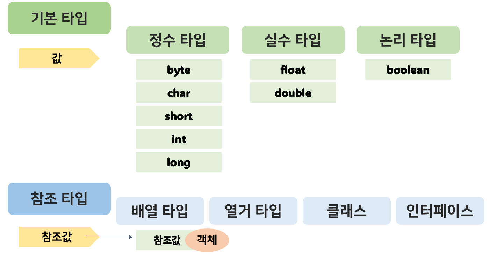

# 데이터 타입 - 기본 타입 (Primitive type)
: 값 자체를 저장하는 데이터 타입



#### 기본형(Primitive) 
- 정수 : byte, char, short, int, long
- 실수 : float, double 
- 논리(true/false) : boolean


└ S는 부호 MSBit(양수 0, 음수 1)

- 오버플로우(Overflow) 
: 해당 타입이 표현할 수 있는 범위보다 큰 수 저장
<br> 최상위 비트를 벗어난 데이터가 인접 비트를 덮어씀으로써 잘못된 결과를 얻을 수 있음
- 언더플로우(Underflow) 
: 해당 타입이 표현할 수 있는 범위보다 작은 수 저장하여 잘못된 결과값 저장

---
## 정수형 : byte, short, char, int, long

- 2진수 : `0b` 또는 `0B`로 시작하여 0과 1로 작성
- 8진수 : `0`으로 시작하고 0~7 숫자로 작성
- 10진수 : 소수점이 없는 0~9 숫자로 작성
- 16진수 : `0x` 또는 `0X`로 시작하고 0~9 숫자/A,B,C,D,E,F/a,b,c,d,e,f로 작성 

---
## 부동소수점 

---
## 문자 리터럴

Escape Sequence

- `\b` : 백스페이스
- `\t` : 탭
- `\n` : 줄바꿈 
- `\f` : 새 페이지 문자
- `r` : 리턴 문자

---
## 자동 타입 변환
: 값의 허용범위가 작은 타입 -> 허용 범위가 큰 타입으로 대입될 때 발생


``` bash 
byte < short, char < int < long < float < double
```

``` java 
byte byteValue = 10;
int intValue = byteValue; //int로 자동 타입 변환

// 예외 : char은 허용 범위로 음수를 포함하지 않지만, byte는 포함하기 때문 
char charValue = byteValue; // 컴파일 에러
```


## 강제 타입 변환 (Casting)
: 큰 허용 범위 타입을 작은 허용 범위 타입으로 쪼개어 저장하는 것
<br> 값 유지를 위해서는 작은 허용 범위 타입에 저장될 수 있는 값을 가지고 캐스팅해야한다

``` bash 
작은 허용 범위 타입 = (작은 허용 범위 타입) 큰 허용 범위 타입
```

``` java 
int intValue = 10;
byte byteValue = (byte)intValue; // int->byte (-128~127만 보존)
char charValue = (char)intValue; // int->char : 'A' 출력 (0~65535만 보존)

double doubleValue = 3.14;
int intValue = (int) doubleValue; // double->int : 정수 부분인 3만 저장
```

##  연산식에서의 타입 변환
: java는 컴파일 단계에서 연산을 수행한다
<br> 하지만 변수가 피연산자로 사용되면, 실행 시 연산을 수행하므로 자동 타입 변환 후 수행된다

``` java
byte result = 10 + 20; // 컴파일 단계에서 10+20을 미리 연산하여 30을 만들고, 변수에 30 저장

byte x = 10;
byte y = 20;
byte result2 = x + y; // 컴파일 에러 
int result3 = x + y; // 변수값은 int로 변환되어 연산되고, 결과도 int 타입으로 반환됨

float floatResult = 1.2f + 3.4f; // float = float + float이므로 결과는 float
double doubleResult = 1.2f + 3.4; // double = float + double이므로 결과는 double

double result4 = x / y; // 0.0 출력 : 정수 연산이므로 결과값이 정수가 되었기 때문
double result5 = (double)x / y; // 0.5 출력 : 실수 연산으로 변경
```

##  문자열 -> 기본 타입

|  변환 타입  |  사용 예  | 
| :-------:  | :-------: |
| String -> byte | `byte value = Byte.parseByte(str);`|
| String -> short | `short value = Short.parseShort(str);`|
| String -> int | `int value = Integer.parseInt(str);`|
| String -> long | `long value = Long.parseLong(str);`|
| String -> float | `float value = Float.parseFloat(str);`|
| String -> double | `double value = Double.parseDouble(str);`|
| String -> boolean | `boolean value = Boolean.parseBoolean(str);`|

##  기본 타입 -> 문자열

|  변환 타입  |  사용 예  | 
| :-------:  | :-------: |
| 기본 타입 -> 문자열 | `String str = String.valueOf(기본타입값);`|
| int -> String | `String str = String.valueOf(3);`|
| float -> String | `String str = String.valueOf(3.14);`|
| boolean -> String | `String str = String.valueOf(true);`|


---
!!! quote
    - [Java의 정석](https://github.com/castello/javajungsuk_basic/tree/master)
    - [점프 투 자바](https://wikidocs.net/book/31)
    - [TCP school](http://www.tcpschool.com/java/intro)
    - 이것이 자바다 (저자: 신용권, 임경균 | 출판사: 한빛미디어)
    - 뇌를 자극하는 Java Programming