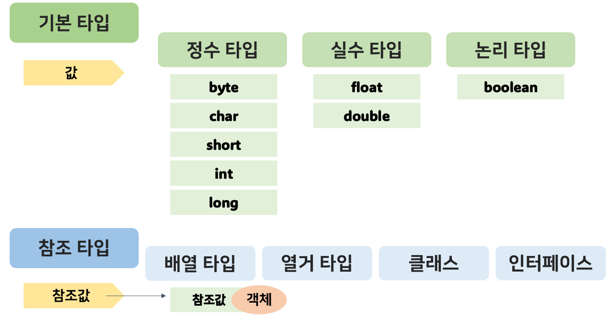
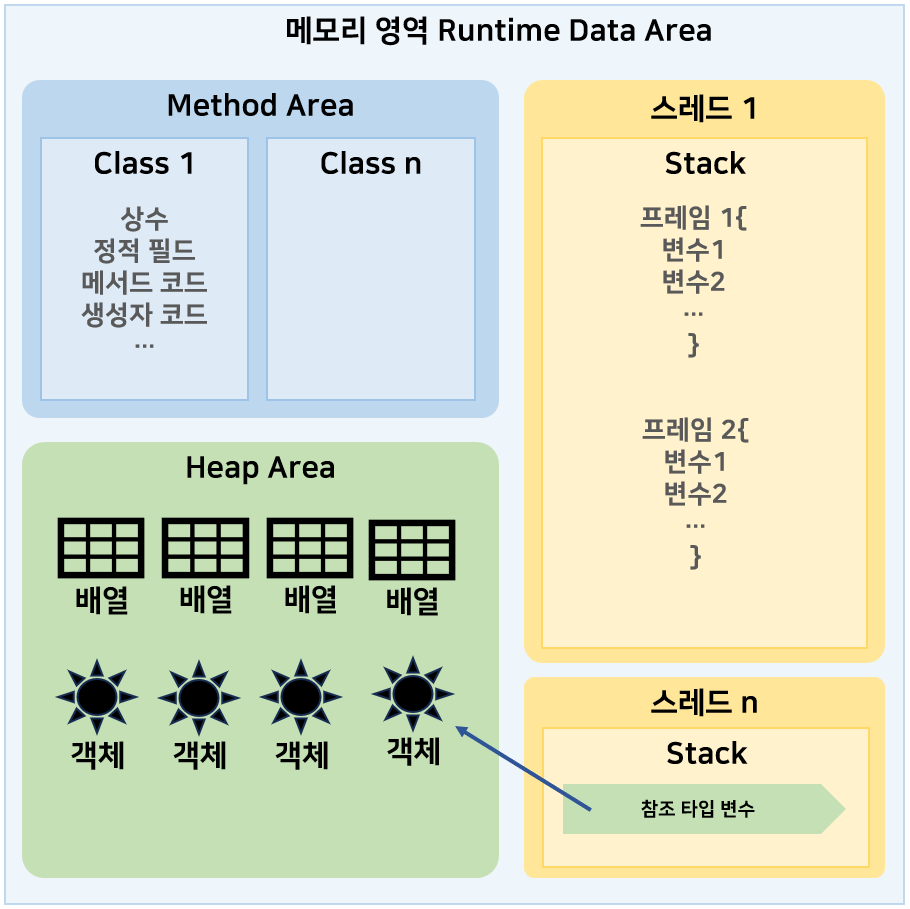

# 데이터 타입 - 참조 타입 (Reference type)
: 객체가 생성된 메모리 주소값을 저장하는 데이터 타입 (객체 = 데이터(필드) + 메서드)




## 메모리 사용 영역


#### Method Area
: 바이트코드 파일을 읽은 내용이 저장되는 영역

#### Heap Area
: 객체가 생성되는 영역

#### ==Stack Area==
: 메서드를 호출할 때마다 생성되는 Frame이 저장되는 영역
<br> 변수들은 모두 스택이라는 메모리 영역에 생성된다 
<br> 기본 타입 변수와 참조 타입 변수가 생성/제거되는 곳
<br> 메서드 호출이 끝나면 frame은 자동 제거되며, frame 내부에는 로컬 변수 스택이 있다

---
## 문자열 String
 
- `new` : 새로운 객체를 만드는 연산자 :star:
- `==`, `!=` : 참조 타입 객체에서는 참조값을 비교하는 연산자가 됨
- `equals` : String 객체의 내부 문자열 비교

``` java
String str1 = "string";
String str2 = "string";
System.out.println(str1 == str2); // true : 동일한 문자열 리터럴로 생성된 객체 참조

String str3 = new String("string");
String str4 = new String("string");
System.out.println(str3 == str4); // false : new 연산자를 통해 String 객체를 별도로 생성했으므로 false
System.out.println(str3.equals(str4)); // true : 내부 문자열 비교 (대소문자 구분)
```

### 문자 추출 & 길이
- length() : 문자열의 문자 개수 
- charAt() : 특정 인덱스의 문자 추출
``` java
String name = "ysheee";
int length = name.length(); // 6
char charValue = name.charAt(length-1); // e
```

### 문자열 대체
- replace() : 기존 문자열은 그대로 두고, 대체한 **새로운 문자열** 리턴
``` java
String name = "ysheee";
String newStr = name.replace("ysh", "jsh");
```

### 문자열 잘라내기
- substring(start) : start에서 끝까지 잘라내기
- substring(start, end) : start부터 end-1까지 잘라내기
``` java
String name = "ysheee";
System.out.println(name.substring(0,3)); // ysh
System.out.println(name.substring(3)); // eee
```

### 문자열 찾기
- indexOf() : 문자열에서 특정 문자열의 시작 index 반환 (없다면 -1 반환)
- contains() : 특정 문자열이 포함되어 있는지 반환
``` java
String name = "ysheee";
int index = name.indexOf("sh"); // 1
int index2 = name.indexOf("jsh"); // -1

boolean result = name.contains("ysh"); // true
boolean result = name.contains("jsh"); // false
```

### 문자열 분리
- split() : 구분자를 사용하여 문자열 분리 (array 배열 반환)
``` java
String category = "이름,작성일자,내용,태그";
String[] arr = category.split(","); // 이름, 작성일자, 내용, 태그가 담긴 4 length의 array 반환
```

---
## 배열 Array
: index가 부여된 연속된 공간에 각 값이 나열되어있는 구조

- 같은 타입의 값만 관리
- 배열의 길이를 늘리거나 줄일 수 없음
- 기본 타입은 각 항목에 값을 직접 저장하지만, 참조 타입은 각 항목에 해당 객체의 참조값 저장

### 배열 생성
- 타입[] 변수;
- 타입 변수[];

``` java
// 선언 후, 값 목록 대입
int[] intArray;
intArray = new int[]{0, 1, 2, 3};

// 선언과 동시에 초기화
int[] intArray = {0, 1, 2, 3};
intArray[2] = 5; // 2를 5로 변경

// null 대입
String strArray[] = null;

// new 연산자로 길이가 5이고, 값이 String 타입인 배열 생성 (기본값으로 초기화되어있음)
String names[] = new String[5]; 
```

| 데이터 타입 | | 초기값 |
| :---: | :---: | :---: |
| 기본 타입 | byte[] | 0 |
|  | char[] | '\u0000' |
|  | short[] | 0 |
|  | int[] | 0 |
|  | long[] | 0L |
|  | float[] | 0.0F |
|  | double[] | 0.0 |
|  | boolean[] | false |
| 참조 타입 | 클래스[] | null |
| | 인터페이스[] | null |
| | 배열 | null |


배열 변수를 미리 선언한 후에는 값 목록 `{}`을 변수에 대입할 수 없다
```java
int[] intArray;
intArray = {0, 1, 2, 3}; // 컴파일 에러
```

### 배열 길이
- 배열변수.length;
``` java
String names[] = new String[5];
int length = names.length; // 5
```

### 다차원 배열
``` java
int[][] scores = {
    {0, 1, 2}, // 1차원 배열의 0번째 인덱스 scores[0][0~2]
    {3, 4} // 1차원 배열의 1번째 인덱스 scores[1][0~1]
}

String[][] names = new String[2][3];
```

### 배열 복사
: 더 큰 길이의 배열을 새로 만들고, 이전 배열로부터 항목들을 복사해야 할 때,

- for문을 통해 항목을 하나씩 읽고, 새로운 배열에 저장
```java
int[] testArray1 = {1, 2, 3};
int[] testArray2 = new int[5];

for(int i=0; i<testArray1.length; i++){
    testArray2[i] = testArray1[i];
}
```
- System.arraycopy(원본배열, 복사할_원본배열의_start_index, 새배열, 붙여넣어질_새배열의_start_index, 복사항목수)
``` java
int[] intArray = {0, 1, 2, 3, 4}
int[] newIntArray = new int[10];

System.arraycopy(intArray, 0, newIntArray, 0, intArray.length); 
// newIntArray : 0, 1, 2, 3, 4, 0, 0, 0, 0, 0
```

### 배열 반복을 위한 for문
``` java
int[] intArray = {0, 1, 2, 3, 4}
for (int e: intArray){
    System.out.println(e);
}
```

---
## 열거 타입 Enum
: 상수, 한정된 값을 갖는 타입

- Enum 타입 이름으로 소스 파일 생성
- Enum 타입 이름 : Camel 스타일
- Enum 상수 : 모두 대문자로 작성하며, `_`로 단어 구분

=== "Enum.java"
    ``` java title="SeasonsExample.java"
    public enum SeasonsExample{
        WINTER,
        SPRING,
        SUMMER_SOFT,
        SUMMER_HARD,
        FALL
    }
    ```
=== "season.java"
    ``` java
    SeasonsExample seasons;

    System.out.println(seasons.WINTER);
    seasons.SPRING = null; // null 대입
    ```

---
## null
: 참조 타입 변수는 아직 참조값을 저장하고 있지 않다는 뜻으로 Null 값을 가진다
<br> null도 초기값으로 사용할 수 있기 때문에 null로 초기화된 참조 변수는 스택 영역에 생성된다

- `==`, `!=` 연산으로 참조 타입 변수가 null 값을 가지는 지 확인할 수 있다
- NullPointerException
: 변수가 null인 상태에서 객체의 데이터나 메서드를 사용하려 할 때 예외 발생
``` java
// 변수가 참조하는 String 객체가 없으므로 NullPointerException
String test = null;
System.out.println(test.length()); 

// 객체를 사용하지 않기 위해 변수에 null을 대입
String test2 = "하이";
test = null;
```

!!! note annotate "버려진 객체 처리"
    어떤 변수에서도 객체를 참조하지 않으면, 해당 객체는 힙 메모리에는 존재하지만 위치 정보를 몰라 사용할 수 없게 된다.

    자바는 ==Garbage Collector== 를 실행시켜 이런 객체를 자동으로 제거한다


---
!!! quote
    - 이것이 자바다 (저자: 신용권, 임경균 | 출판사: 한빛미디어)