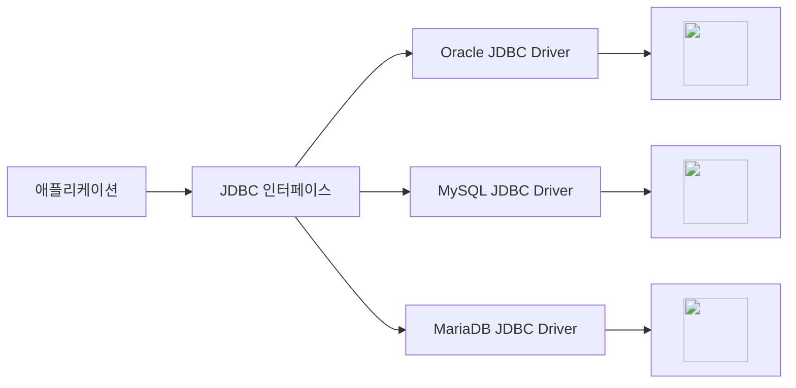
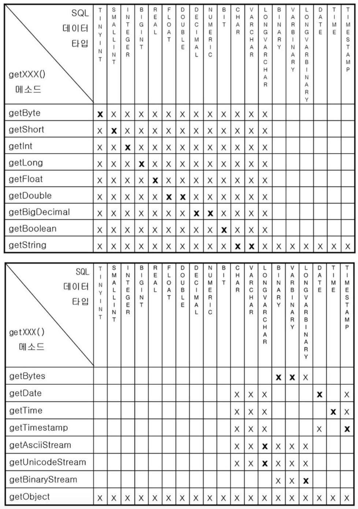

# JDBC 
Java에서 DB와 연결되어 데이터를 주고받을 수 있도록 제공하는 API
<br> **JDBC의 경우 대부분의 API가 인터페이스이다**
<br> API들을 상속하여 구현하는 자식 클래스가 필요한데, 그 자식 클래스들을 JDBC 드라이버가 제공한다

- JDBC URL : 접속할 DB 서버와 사용할 드라이버 정보를 담고 있는 주소 문자열 <br>`jdbc:DB서버공식이름:JDBC드라이버에대한정보(드라이버에 전달할 정보)`


## JDBC API
- 클래스 
    - DriverManager : JDBC를 Driver 관리, DB와 연결해서 Connection 구현 객체 생성
    - Date, Time, Timestamp
- 인터페이스
    - Connection : Statement, PreparedStatement, CallableStatement 구현 객체 생성, 트랜잭션 처리 및 DB 연결 끊을 때 사용
    - Statement : SQL의 DDL, DML을 실행할 때 사용 (주로 변경되지 않는 정적 SQL문 실행)
    - PreparedStatement : 매개변수화된 SQL 문을 사용할 수 있어 Statement에 비해 편리성과 보안성 향상
    - CallableStatement : DB에 저장되어 있는 프로시저와 함수 호출 시 사용
    - ResultSet : DB에서 가져온 데이터 읽을 때 사용
    - DatabaseMetaData, ResultSetMetaData

## Example code
``` java
// DriverManager로 사용할 DB의 Driver를 메모리로 로딩 (이제는 필요없는 코드)
Class.forName("com.mysql.cj.jdbc.Driver"); 

// DB 연결 정보 입력 및 DB 연결
String url = "jdbc:mysql:...";
String user = "username";
String passwd = "password";
Connection conn = DriverManager.getConnection(url, user, passwd); 

// DB 서버에 SQL 명령을 전달하여 실행시키기 위한 Statement 객체 생성
Statement stmt conn.createStatement(); 

// SELECT 명령을 실행, 결과는 JDBC 드라이버가 ResultSet이라는 객체로 반환
ResultSet rs = stmt.excuteQuery("SELECT ename, sal FROM emp"); 

// 데이터 꺼내오기
rs.next()
String name = rs.getString("ename"); // = rs.getString(1)
int salary = rs.getInt("sal"); // = rs.getInt(2)

//커넥션 반환
rs.close(); 
stmt.close();
conn.close();
```

### Method VS Method
- `executeQuery` : 테이블 조회, ResultSet 객체 반환 (결과가 없다면 비어있는 객체 반환)
- ` executeUpdate()` : 테이블 업데이트, 리턴값은 int(변경된 행의 수)
- `PreparedStatement` : 동적 SQL 쿼리 실행. 미리 컴파일된 쿼리를 사용하고 매개 변수를 전달하여 사용한다
- `Statement` : 정적 SQL 쿼리 실행. 매번 쿼리 문자열이 재구성되어야하며 재사용하기 어렵다
: 두 번째 매개값은 DML문이 실행된 후 가져올 키 값
<br>바이너리 타입(blob)일 때는 setBinaryStream(), setBlob(), setBytes () 중 하나 택

### ResultSet
: SELECT문에 기술된 컬럼으로 구성된 행의 집합
<br> 커서가 있는 행의 데이터만 읽을 수 있다 (최초 커서는 beforeFirst를 가리키므로 next() 메소드 사용)


## 데이터 조회 SELECT - Statement, executeQuery
``` java
...(생략)
    try (Connection connection = DriverManager.getConnection(jdbcURL, username, password);
            Statement statement = connection.createStatement()) {

        String sql = "SELECT * FROM employees";
        ResultSet resultSet = statement.executeQuery(sql);

        if (resultSet.next()){
            do {
                int id = resultSet.getInt("id");
                String name = resultSet.getString("name");
                System.out.println("ID: " + id + ", Name: " + name);
            } while (resultSet.next())
        } else System.out.print("조회 결과가 없습니다.");
    } catch (SQLException e) {
        e.printStackTrace();
    }
```

## 데이터 삽입 INSERT - PreparedStatement, executeUpdate
``` java
...(생략)
    try (Connection connection = DriverManager.getConnection(jdbcURL, username, password);
            PreparedStatement preparedStatement = connection.prepareStatement("INSERT INTO employees (name, age) VALUES (?, ?)")) {

        String newName = "John Doe";
        preparedStatement.setString(1, newName);
         preparedStatement.setString(2, 23);

        int rowsAffected = preparedStatement.executeUpdate();
        if (rowsAffected > 0) {
            System.out.println("Insertion successful.");
        } else {
            System.out.println("Insertion failed.");
        }
    } catch (SQLException e) {
        e.printStackTrace();
    }

```

## 데이터 수정 UPDATE
``` java
...(생략)
    try (Connection connection = DriverManager.getConnection(jdbcURL, username, password);
            PreparedStatement preparedStatement = connection.prepareStatement("UPDATE employees SET name = ? WHERE id = ?")) {

        String updatedName = "Updated Name";
        int employeeId = 1;

        preparedStatement.setString(1, updatedName);
        preparedStatement.setInt(2, employeeId);

        int rowsAffected = preparedStatement.executeUpdate();
        if (rowsAffected > 0) {
            System.out.println("Update successful.");
        } else {
            System.out.println("Update failed.");
        }
    } catch (SQLException e) {
        e.printStackTrace();
    }
```

## 데이터 수정 UPDATE
``` java
...(생략)
    try (Connection connection = DriverManager.getConnection(jdbcURL, username, password);
            PreparedStatement preparedStatement = connection.prepareStatement("DELETE FROM employees WHERE id = ?")) {

        int employeeIdToDelete = 1;
        preparedStatement.setInt(1, employeeIdToDelete);

        int rowsAffected = preparedStatement.executeUpdate();
        if (rowsAffected > 0) {
            System.out.println("Deletion successful.");
        } else {
            System.out.println("Deletion failed.");
        }
    } catch (SQLException e) {
        e.printStackTrace();
    }
```

---
## 트랜잭션

---

## Data Type



---

!!! note
    ### Java와 DB의 연동
    - JDBC
    - Mybatis(iBatis)
    - JPA

    ### 객체 생성
    일반 클래스의 객체 생성은 `new`와 생성자 메서드를 사용한다<br>
    일반적인 객체 생성 방식 대신 `static형 메서드`를 호출하여 생성할 수도 있다

    - 여러 이유로 자식 클래스의 객체 생성을 대신하여 사용되도록 하려는 경우
    - 클래스의 객체 생성을 여러번 하더라도 하나의 객체만을 생성하려는 경우
    
    **추상 클래스**와 **인터페이스**의 경우에는 new/생성자 메서드 대신 자식 클래스를 만들어 대신 객체를 생성하여 사용한다<br>
    **JDBC의 경우 대부분의 API가 인터페이스이다**


---

!!! quote   
    - 이것이 자바다 특별판 부록(저자: 신용권 | 출판사: 한빛미디어)
    - MSA 3기
    - OpenAI