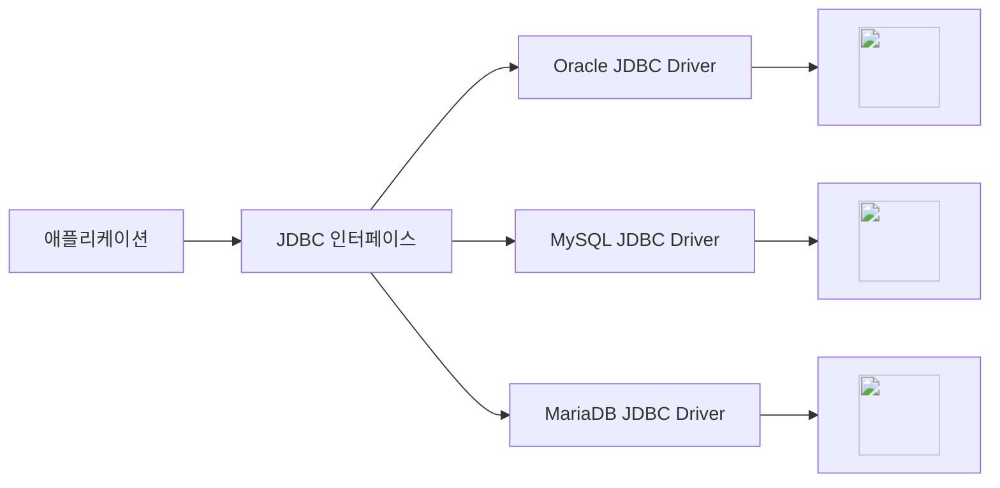

# JDBC 
Java에서 DB와 연결되어 데이터를 주고받을 수 있도록 제공하는 API
<br> **JDBC의 경우 대부분의 API가 인터페이스이다**
<br> API들을 상속하여 구현하는 자식 클래스가 필요한데, 그 자식 클래스들을 JDBC 드라이버가 제공한다

- JDBC URL : 접속할 DB 서버와 사용할 드라이버 정보를 담고 있는 주소 문자열 <br>`jdbc:DB서버공식이름:JDBC드라이버에대한정보(드라이버에 전달할 정보)`


## JDBC API
- 인터페이스 : Connection, Statement, PreparedStatement, ResultSet, DatabaseMetaData, ResultSetMetaData
- 클래스 : DriverManager, Date, Time, Timestamp

- `executeQuery()` : SELECT -----> ResultSet (결과가 없다면 비어있는 ResultSet 객체 반환)
- `executeUpdate()` : SELECT외의 SQL 명령들  -----> int(변경된 행의 개수)

## Running
``` java
// DriverManager로 사용할 DB의 Driver 로드 (이제는 필요없는 코드)
Class.forName("com.mysql.cj.jdbc.Driver"); 

// DB 연결 정보 입력
String url = "jdbc:mysql:...";
String user = "username";
String passwd = "password";
Connection conn = DriverManager.getConnection(url, user, passwd); 

// DB 서버에 SQL 명령을 전달하여 실행시키기 위한 Statement 객체 생성
Statement stmt conn.createStatement(); 

// SELECT 명령을 실행, 결과는 JDBC 드라이버가 ResultSet이라는 객체로 반환
ResultSet rs = stmt.excuteQuery("SELECT ename, sal FROM emp"); 

// 데이터 꺼내오기
rs.next()
String name = rs.getString("ename"); // = rs.getString(1)
int salary = rs.getInt("sal"); // = rs.getInt(2)

//커넥션 반환
rs.close(); 
stmt.close();
conn.close();
```

## Statement vs PreparedStatement


## Data Type


---

!!! note
    ### Java와 DB의 연동
    - JDBC
    - Mybatis(iBatis)
    - JPA

    ### 객체 생성
    일반 클래스의 객체 생성은 `new`와 생성자 메서드를 사용한다<br>
    일반적인 객체 생성 방식 대신 `static형 메서드`를 호출하여 생성할 수도 있다

    - 여러 이유로 자식 클래스의 객체 생성을 대신하여 사용되도록 하려는 경우
    - 클래스의 객체 생성을 여러번 하더라도 하나의 객체만을 생성하려는 경우
    
    **추상 클래스**와 **인터페이스**의 경우에는 new/생성자 메서드 대신 자식 클래스를 만들어 대신 객체를 생성하여 사용한다<br>
    **JDBC의 경우 대부분의 API가 인터페이스이다**


---

!!! quote
    - MSA 3기