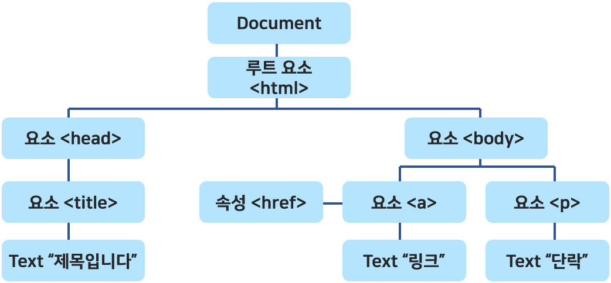

# DOM (Document Object Model)
: 구조화된 문서를 표현하는 형식으로 웹 페이지의 내용을 제어함

- 플랫폼/언어 중립적으로 구조화된 문서를 표현하는 W3C의 공식 표준으로서 W3C가 표준화한 여러 API의 기반
- window의 property인 Document 객체 사용
- Document 객체의 property는 문서 내의 주요 요소에 접근할 수 있는 객체 제공
- DOM 객체 : 브라우저가 서버로부터 응답된 웹 컨텐트 내용을 파싱한 후, 각 HTML 태그마다 DOM 기술을 적용하여 생성한 Javascript 객체
- DOM 객체를 통해 HTML 문서의 내용을 접근하여 CRUD 기능을 처리할 수 있다
 

## DOM 종류
- Core DOM : 모든 문서 타입을 위한 DOM 모델
- HTML DOM : HTML 문서를 위한 DOM 모델
- XML DOM : XML 문서를 위한 DOM 모델

---
## HTML Element Method

|  Method  |  설명  |  특징  |
| :------: | :---: | :-----:|
| document.getElementsByTagName(태그이름) | 해당 태그 요소 모두 선택 | Collection 객체 반환 [] |
| document.getElementsByClassName(클래스이름) | 해당 클래스 요소 모두 선택 | Collection 객체 반환 [] |
| document.getElementsByName(name속성값) | 해당 name 속성값 요소 모두 선택 |  Collection 객체 반환 [] |
| document.querySelectorAll(선택자) | 해당 선택자로 선택되는 요소 모두 선택 | Collection 객체 반환 [] |
| document.getElementById(아이디) | 해당 아이디 요소 선택 | 하나의 객체 반환 | 
| | | |
| document.createElement(HTML요소) | 지정된 HTML 요소 생성 | |
| document.write(텍스트) | HTML 출력 스트림을 통해 텍스트 출력 | |

``` javascript title="Example"
document.getElementsByTagName("h2")[0].innerText=`오늘은 ${d.getMonth()+1}월 ${d.getDate()}일 입니다`;

const outDom1 = document.getElementsByClassName('btn');
outDom1[i].addEventListener('click', f1);
function f1(e){
    const Dom = document.getElementsByTagName("h2")[0];
    Dom.style.color = e.target.value;	// 텍스트 색상 변경
}

const outDom2 = document.getElementsByClassName('btn');
for (let i=0; i<outDom2.length; i++){
    outDom2[i].addEventListener('click', f1);

const outDom3 = document.getElementById("content");
outDom3.innerHTML += `<p>${num} * ${i} = ${num * i}</p>`;
}
```

---
-  DOM + HTML 이벤트 핸들러

``` javascript
document.getElementById("id").onlick = function(){}
```

- 요소의 내용 변경 :star:

``` javascript
var str = document.getElementById("text");
str.innerHTML = "이 문장으로 바뀌었습니다!";
```

---
## HTML 객체 선택

|  객체 집합  |  설명  |  DOM Level  |
| :--------: | :----: | :----------:|
| document.anchors | name 속성을 가지는 `<a>`요소 모두 반환 | 1 |
| document.body    | `<body>`요소 반환                     | 1 |
| document.forms   | `<form>`요소 모두 반환                | 1 |
| document.images  | ``요소 모두 반환                 | 1 |
| document.links   | href 속성을 가지는 `<area>`, `<a>`요소 모두 반환 | 1 |
| document.title   | `<title>`요소 반환 | 1 |
| document.documentElement | `<html>` 요소 반환 | 3 |
| document.embeds | `<embed>`요소 모두 반환 | 3 |
| document.head     | `<head>` 요소 반환 | 3|
| document.scripts  | `<script>`요소 모두 반환 | 3|
| | |
| document.URL      | HTML 문서의 완전한 URL 주소 반환 | 1 |
| document.baseURI  | HTML 문서의 절대 URI 반환   | 3|
| document.documentURI | HTML 문서의 URI를 반환 | 3|
| document.doctype  | HTML 문서의 문서 타입 반환    | 3|
| document.referrer | 링크되어 있는 문서의 URI 반환 | 1 |
| | |
| document.cookie   | HTML 문서의 쿠키 반환 | 1 |
| document.documentMode | 웹 브라우저가 사용하고 있는 모드 반환 | 3|
| document.domain   | HTML 문서가 위치한 서버의 도메인 네임 반환 | 1 |
| document.implementation | HTML DOM 구현 반환 | 3|
| document.inputEncoding  | HTML 문서의 문자 인코딩 형식 반환  | 3 |
| document.lastModified   | HTML 문서의 마지막 갱신 날짜 및 시간 반환 | 3|
| document.readyState     | HTML 문서의 로딩 상태 반환 | 3|
| document.strictErrorChecking | 오류의 강제 검사 여부 반환 | 3|


---
## Node
: HTML DOM 은 Node라는 계층적 단위에 정보를 저장하며 노드 간의 관계를 설명한다



- 노드 트리 : 노드들의 집합이자 노드 간의 관계를 보여주는 계층적 구조
<br>노드 트리는 최상위 레벨인 root node부터 시작하여 가장 낮은 레벨인 Text 노드까지 뻗어 내려간다


#### 노드의 종류

- Document node : HTML 문서 전체를 나타내는 노드
- Element node : 모든 HTML 요소, 속성 노드를 가질 수 있는 유일한 노드
- Attribute node : 모든 HTML 요소의 속성, 해당 Element 노드의 자식노드에는 포함되지 않음
- Text node : HTML 문서의 모든 텍스트 (enter:`\n`도 Test dom 객체 생성)
- Comment node : HTML 문서의 모든 주석


#### 노드 접근

- getElementsByTagName() : 특정 태그 이름을 가진 모든 요소를 노드 리스트 형태로 반환
- 노드 간의 관계 이용
    - parentNode : 부모노드
    - childNodes : 자식 노드 리스트
    - firstChild : 첫번째 자식 노드
    - lastChild : 마지막 자식 노드
    - nextSibling : 다음 형제 노드
    - previousSibling : 이전 형제 노드 

---
#### 노드 정보

- nodeName : 노드 고유의 이름 저장, 수정할 수 없는 읽기 전용 property

|  노드  |  Property value |
| :--------: | :--------: | 
| Document node | #document |
| Element node | 태그 이름 (영문자로 대문자) |
| Attribute node | 속성 이름 |
| Text node     | #text     |

- nodeValue : 노드의 값 저장

|  노드  |  Property value |
| :--------: | :--------: | 
| Element node | undefined |
| Attribute node | 해당 속성값 |
| Text node     | 해당 텍스트 문자열   |

- nodeType : 노드 고유의 타입 저장, 수정할 수 없는 읽기 전용 property

|  노드  |  Property value |
| :--------: | :--------: | 
| Element node | 1 |
| Attribute node | 2|
| Text node     | 3  |
| Comment node | 8 |
| Document node | 9 |

---
#### 노드 추가

- appendChild() : 새로운 노드를 해당 노드의 자식 노드 리스트의 맨 마지막에 추가
- insertBefore() : 새로운 노드를 특정 자식 노드 바로 앞에 추가
- insertData() : 텍스트 노드의 텍스트 데이터에 새로운 텍스트 추가

#### 노드 생성

- createElement() : 새로운 요소 노드 생성
- createAttribute() : 새로운 속성 노드 생성 
    - 같은 이름의 속성 노드가 존재하면, 기존의 속성 노드를 대체
    - 이미 존재하는 요소 노드에 생성하고자 할 때에는 `setAttribute()` 사용
- createTextNode()
    - 새로운 텍스트 노드 생성

#### 노드 제거

- removeChild() : 자식 노드 리스트에서 특정 자식 노드를 제거하고, 제거한 노드 반환
- removeAttribute() : 속성의 이름을 이용하여 특정 속성 노드 제거

#### 노드 복제

- cloneNode : 기존에 존재하는 노드와 똑같은 새로운 노드를 생성하여 반환
    - 전달된 값이 true이면, 복제되는 노드의 모든 속성 노드와 자식 노드도 같이 복제
    - 전달된 값이 false이면, 속성 노드만 복제

#### 노드 값 변경

- nodeValue : 특정 노드의 값 변경
- setAttribute() : 속성 노드의 속성값 변경 
    - 변경하려는 속성이 존재하지 않으면, 해당 속성을 생성한 후 속성값 설정
    
#### Element 노드 교체

- replaceChild() : 기존의 요소 노드를 새로운 요소 노드로 교체

#### Text 노드의 데이터 교체

- replaceData(offset, 교체할 문자 수, 새로운 데이터) : offset부터 문자 수만큼 새로운 데이터로 교체


---
!!! quote
    - [TCP School](https://www.tcpschool.com/javascript/intro)