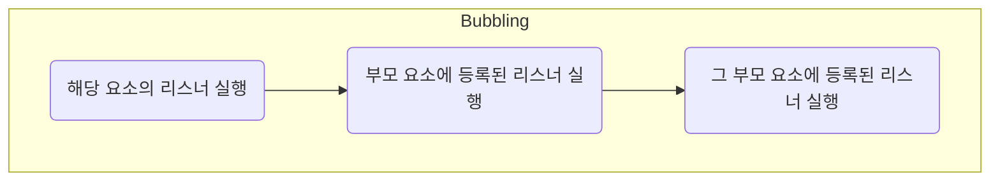
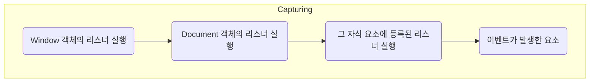

# Event
: 웹브라우저가 알려주는 HTML 요소에 대한 사건의 발생을 의미

- 이벤트 타입(=event name) : 발생한 이벤트의 종류를 나타내는 문자열
    - click, mouseover, load, keydown, keyup, change, submit,...
- 이벤트 타겟 : 이벤트가 발생한 대상 DOM 객체
- 이벤트 핸들러 : 이벤트 처리 코드를 구현한 함수
- 이벤트 명세 
    - DOM Level 3 이벤트 명세
    - HTML5 관련 이벤트 명세
    - 모바일 장치를 위한 이벤트 명세

---
## Event Model
: 웹 페이지에서 어떠한 액션이 발생했을 때, 수행되는 코드를 작성하여 등록하는 방법

- In-line 이벤트 모델 : 대상의 **HTML 태그**에 속성으로 정의하는 모델 (지역적)
``` javascript
<태그명 onxxx = "function()">;
```
- 고전 이벤트 모델 : 대상 DOM 객체를 찾아 이벤트 핸들러 등록 (전역적)<br> 오직 한 개의 이벤트 리스너 등록 가능
``` javascript
let dom  = document.querySelector("#target");
dom.onxxx = function; // xxx : 이벤트 타입
dom.onxxx = null; // 이벤트 해제
```
- 표준 이벤트 모델 : 대상 DOM 객체에 다음 method 사용 (전역적) :star:<br> 여러개의 이벤트 리스너 등록 가능
``` javascript
let dom  = document.querySelector("#target");
dom.addEventListener = (eventName, handler_func, useCapture);
dom.removeEventListener(eventName, handler_func); // 이벤트 해제
```

---
## Event 객체
: Event object. 특정 타입의 이벤트와 관련이 있는 객체로, 해당 타입의 이벤트에 대한 상세 정보를 저장하고 있다

- event.type : 이벤트의 타입
- event.target : 이벤트가 일어난 객체
- e.target.nodeName
- event.currentTarget : 이벤트가 행해지는 객체

``` javascript hl_lines="3"
function f1(e){
    const outDom = document.getElementsByTagName("h2")[0];
    outDom.style.color = e.target.value;	
}
const outDom = document.getElementById('btn');   
outDom.addEventListener('click', f1);
```

---
## Event Handler
: Event Listener, 이벤트가 발생했을 때 그 처리를 담당하는 함수

### 이벤트 리스너 등록

1. 이벤트의 대상이 되는 객체나 요소에 프로퍼티로 등록<br>-> 이벤트 타입별로 오직 하나의 이벤트 리스너만을 등록할 수 있음
    - JS 코드에서 Property로 등록
    - HTML 태그에 속성으로 등록
``` javascript
// Property로 등록
window.onload = function() { // HTML 문서가 로드될 때 실행
var text = document.getElementById("text"); // text id 선택
text.innerHTML = "HTML 문서가 로드되었습니다.";}

// HTML 태그 속성 등록 - 가독성이 안좋고, 유지보수가 힘들어짐
<p onclick="alert('문자열을 클릭했어요!')">클릭!</p>
```
2. 객체나 요소의 메소드에 이벤트 리스너를 전달
    - addEventListener() :star:
    - attachEvent()
``` javascript
/* 대상객체.addEventListener(이벤트명, 실행할이벤트리스너, 이벤트전파방식)
    - 이벤트명 : 이벤트 리스너를 등록할 이벤트 타입을 문자열로 전달 
    - 실행할 이벤트 리스너 : 지정된 이벤트가 발생했을 때 실행할 이벤트 리스너 전달
    - 이벤트 전파 방식 : true면 capturing 방식, false면 bubbling 방식
*/
var showBtn = document.getElementById("btn"); // 아이디가 "btn"인 요소
showBtn.addEventListener("click", showText);  // click 이벤트 리스너 등록
showBtn.addEventListener("mouseover", showText); // mouseover 이벤트 리스너 등록
function showText() {
    document.getElementById("text").innerHTML = "텍스트가 나타났습니다!";
}
function mouseoverBtn() {
    document.getElementById("text").innerHTML = "버튼 위에 마우스가 있네요!";
}
```

### 이벤트 리스너 삭제
- removeEventListener()
``` javascript
btn.removeEventListener("click", showText);
```

### Default 이벤트 핸들러 취소
: Default event handler에는 대표적으로 `<a>` 태그가 있다. 이때 default 이벤트 핸들러를 무시하려면,

- 인라인 이벤트 모델 : `return false;`
- 고전 이벤트 모델 : `return false;`
- 표준 이벤트 모델 
    - `preventDefalult()`
    - `returnValue`

``` javascript hl_lines="4 13 14"
<body>
<h1>디폴트 이벤트 핸들러</h1>
<hr>
<a href="http://www.w3schools.com/" onclick="test1(); return false;">HTML5 학습하기(인라인)</a><hr>
<a id="t1" href="http://www.w3schools.com/">HTML5 학습하기(고전)</a><hr>
<a id="t2" href="http://www.w3schools.com/">HTML5 학습하기(표준)</a>
<script>
function test1() {
	alert("인라인이벤트모델 버튼 클릭");	
}
function test2() {
	alert("고전이벤트모델 버튼 클릭");	
	return false;
}
function test3(e) {
	e.preventDefault();
	alert("표준이벤트모델 버튼 클릭");	
}
var link1 = document.querySelector("#t1");
var link2 = document.getElementById("t2");
link1.onclick = test2;  // 고전
link2.addEventListener("click", test3);
</script>
</body>
```

---
### 이벤트 리스너 호출
: 이벤트 리스너가 등록되고 해당 객체에 지정된 타입의 이벤트가 발생하면, 브라우저는 자동으로 이벤트 리스너를 호출한다
<br>호출된 이벤트 리스너는 인수로 이벤트 객체를 전달받으며, 식별자를 통해 전달받은 이벤트 객체를 참조한다

``` javascript
<script>    
	function f1(t) {
		alert(t.textContent);
	}
	const dom2 = document.querySelector('#t1');
    const dom3 = document.querySelector('#t2');
	function f2(e) {
		alert(e);
		alert(e.target.textContent); // 발생된 이벤트 객체의 target property
		alert(this.textContent);
	} 
    dom2.onclick = f2;
    dom3.addEventListener("click", f2);
</script>
```

### 이벤트 호출 순서
`addEventListener()` method를 사용하여 하나의 이벤트 타입에 여러 개의 이벤트 리스너를 등록했을때,

1. 이벤트의 대상이 되는 객체나 요소에 property로 등록한 이벤트 리스너 먼저 호출
2. 그 후 `addEventListener()`를 사용하여 등록한 이벤트 리스너를 등록한 순서대로 호출

---
### 이벤트 전파 Event Propagation
: 이벤트가 발생했을 때, 브라우저가 이벤트 리스너를 실행시킬 대상 요소를 결정하는 과정

이벤트의 대상이 Window 객체와 같은 단일 객체라면 이벤트의 전파는 일어나지 않지만,
<br> Document 객체 또는 HTML 요소에서 이벤트가 발생하면 대상 요소를 결정하기 위해 전파가 일어난다.


#### Bubbling 전파
: 이벤트가 발생한 요소부터 시작해서, DOM 트리를 따라 위쪽으로 올라가며 전파되는 방식 


다수의 요소에 공통으로 적용되는 이벤트리스너를 각각의 요소마다 따로 등록할 필요 없이 공통된 조상 요소에 한 번만 등록하면 처리할 수 있다는 장점을 가진다
``` javascript
// 각 요소마다 버블링 방식으로 click 이벤트 리스너 등록

document.getElementById("divBox").addEventListener("click", clickDiv);
document.getElementById("paraBox").addEventListener("click", clickPara);
document.getElementById("spanBox").addEventListener("click", clickSpan);

function clickDiv(event)  { document.getElementById("text").innerHTML += "div 요소를 click 하셨네요!<br>"; }
function clickPara(event) { document.getElementById("text").innerHTML += "p 요소를 click 하셨네요!<br>"; }
function clickSpan(event) { document.getElementById("text").innerHTML += "span 요소를 click 하셨네요!<br>"; }
```

#### Capturing 전파
: 이벤트가 발생한 요소까지 DOM 트리의 최상위부터 아래쪽으로 내려가면서 전파되는 방식


실제 이벤트의 대상이 되는 요소에 이벤트가 전달되기 전에 상위 요소에 등록된 이벤트 리스너가 이를 잡아낼 수 있다. 이렇게 걸러내어 호출되지 않도록 하는 기법을 **이벤트 취소 기법**이라 한다.

- `addEventListener`의 세번째 인수에 true 전달

``` javascript
// 각 요소마다 캡쳐링 방식으로 click 이벤트 리스너 등록

document.getElementById("divBox").addEventListener("click", clickDiv, true);
document.getElementById("paraBox").addEventListener("click", clickPara, true);
document.getElementById("spanBox").addEventListener("click", clickSpan, true);
```

### 이벤트 전파의 취소
- stopPropagation()
- cancelBubble

``` javascript
function clickLink(event) {

event.preventDefault();  // 링크의 기본 동작을 취소
document.getElementById("text").innerHTML += "링크의 기본 동작을 막았어요!<br>";

event.stopPropagation(); // 이벤트의 전파를 취소
document.getElementById("text").innerHTML += "이벤트의 전파를 막았어요!<br>";
}
```


---
!!! quote
    - [TCP School](https://www.tcpschool.com/javascript/intro)
