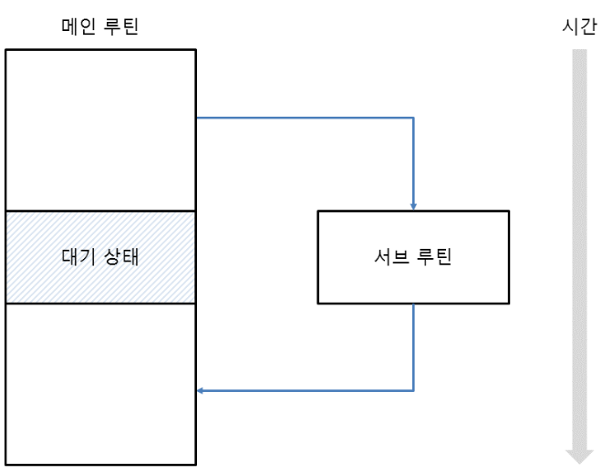
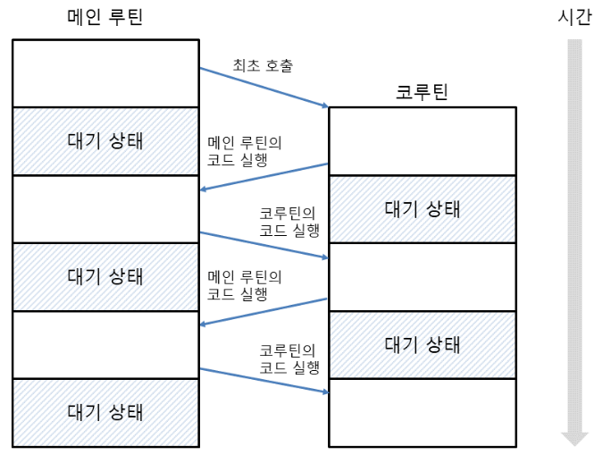
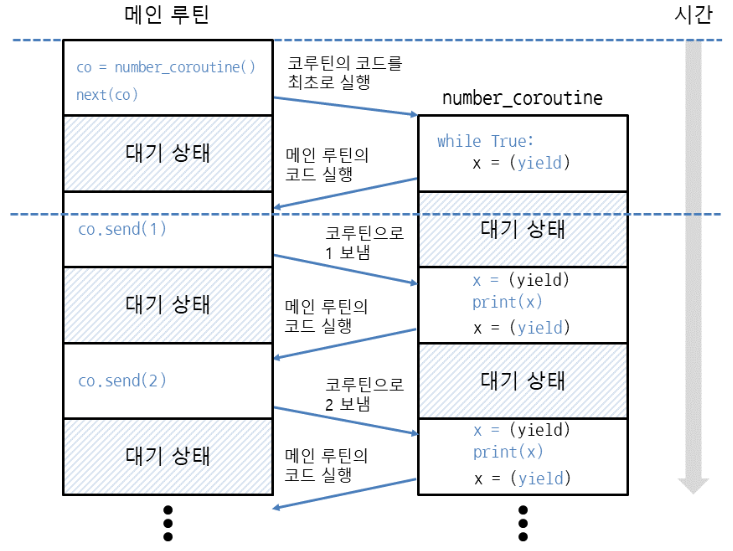

# 코루틴 Coroutine

- [나중에 참고](https://blog.humminglab.io/posts/python-coroutine-programming-1/)

---
``` python
def add(a,b):
	c = a+b # add 함수가 끝나면, 변수와 계산식은 사라짐
	print(c, 'add 함수')

def calc():
	add(1,2) # add 함수가 끝나면, 다시 calc 함수로 돌아옴
	print('calc 함수')

calc()
```
-> calc 함수 안에서 add 함수를 호출했을 때, add 함수가 끝나면 다시 calc 함수로 돌아온다.<br>
이때 add 함수 안에 들어있던 변수와 계산식은 모두 사라진다.

- calc 함수와 add 함수의 관계
    - calc : 메인 루틴
    - add : 서브 루틴
- 서브 루틴이 메인 루틴에 종속된 관계


-> 메인 루틴에서 서브 루틴을 호출하면, 서브 루틴의 코드를 실행한 뒤 다시 메인 루틴으로 돌아온다.<br>
이때, 서브 루틴이 끝나면 서브 루틴의 내용은 모두 사라진다.

---
- 진입점(entry ponit): 함수의 코드를 실행하는 지점 <br> 코루틴은 여러 번 실행할 수 있어, 진입점이 여러 개인 함수라고도 함


함수가 종료되지 않은 상태에서 메인 루틴의 코드를 실행한 뒤, 다시 돌아와서 코루틴의 코드를 실행 (따라서, 코루틴의 내용도 계속 유지)

---

### 코루틴에 값 보내기
- `yield`로 값을 받아올 수 있음
- send 메서드가 보낸 값을 받아오려면, (yield) 형식으로 변수에 저장
- `코루틴객체.send(값)` : 코루틴에 값을 보내면서 코드를 실행할 때 사용
- `변수 = (yield)`
``` python
def number_coroutine():
	while True:  # 코루틴을 유지하기 위해, 무한 루프 사용
		x = (yield) # 코루틴 바깥에서 값을 받아옴, yield를 괄호로 묶어야 함
		print(x)

co = number_coroutine() # 코루틴 객체 생성
next(co)  # 코루틴 안의 코드 최초 실행  = co.__next__() = 코루틴객체.send(None)

co.send(1) # 코루틴에 숫자 1을 보냄
co.send(2) # 코루틴에 숫자 2를 보냄
```



- next(co)로 코루틴의 코드를 최초로 실행하면 x = (yield)의 yield 에서 대기하고, 다시 메인루틴으로 돌아옴
- 메인 루틴에서 1을 보내면 코루틴은 대기 상태에서 풀리고, x = (yield)의 x = 부분이 실행된 뒤 print(x)로 숫자를 출력
- 다시 x =(yield)의 yield 에서 대기하고 메인 루틴으로 돌아옴
- (코루틴은 yield에서 함수 중간에 대기한 다음, 메인 루틴을 실행하다가 다시 코루틴을 실행한다)


### 코루틴 바깥으로 값 전달하기
- 변수 = (yield 변수)
- 변수 = next(코루틴객체)
- 변수 = 코루틴객체.send(값) 
``` python
def sum_coroutine():
	total = 0
	while True:
		# 코루틴 바깥에서 값을 받아오면서, 바깥으로 값을 전달	
		# 바깥에서 send가 보낸 값은 x에 저장되고, 코루틴 바깥으로 보낼 값은 total 
		x = (yield total) 
		total += x

co = sum_coroutine()
print(next(co))   # 0, 코루틴 안의 yield까지 코드를 실행하고, 코루틴에서 나온 값 출력
print(co.send(1)) # 1, 코루틴에 숫자 1을 보내고, 코루틴에서 나온 값 출력
print(co.send(2)) # 3, 코루틴에 숫자 2를 보내고, 코루틴에서 나온 값 출력
```
- `yield`를 사용하여 코루틴 바깥으로 값을 전달하면, next와 send의 반환값으로 받는다
- 제너레이터는 next함수(__next__메서드)를 반복 호출하여 값을 얻어내는 방식
- 코루틴은 next함수(__next__메서드)를 한 번만 호출한 뒤 send로 값을 주고 받는 방식

### 코루틴을 종료하고 예외 처리하기
- `coroutine.close` : 코루틴 종료
``` python
def number_coroutine():
    try:
        while True:
            x = (yield)
            print(x, end=' ')
    except GeneratorExit:  # 코루틴이 종료될 때 GeneratorExit 예외 발생
        print()
        print('코루틴 종료')

co = number_coroutine()
next(co)

for i in range(20): # 0 1 2 3 4 5 6 7 8 9 10 11 12 13 14 15 16 17 18 19
    co.send(i) 
co.close() # 코루틴 종료
```

### 코루틴 안에서 예외 발생시키기
- `coroutine.throw(예외이름, 에러메시지)`
``` python
# 코루틴에 숫자를 보내 누적하다가 RuntimeError 예외가 발생하면,
# 에러 메시지를 출력하고 누적값을 바깥으로 전달
def sum_coroutine():
    try:
        total = 0
        while True:
            x = (yield)
            total += x
    except RuntimeError as e:
        print(e)
        yield total # 코루틴 바깥으로 값 전달

co = sum_coroutine()
next(co)

for i in range(20):
    co.send(i)
print(co.throw(RuntimeError, "예외로 코루틴 끝내기")) ## 예외로 코루틴 끝내기 ## 190
```

### 하위 코루틴의 반환값 가져오기
- `변수 = yield from 코루틴()` : 해당 코루틴에서 return으로 반환한 값을 가져옴
``` python
def accumulate():
    total = 0
    while True:
        x = (yield)  # 코루틴 바깥에서 값을 받아옴
        if x is None:  # 받아온 값이 None이면
            return total  # total 반환, 코루틴 끝냄
        total += x
    
def sum_coroutine():
    while True:
        total = yield from accumulate()  # accumulate의 반환값을 가져옴
        print(total)

co = sum_coroutine()
next(co)

for i in range(1,11): # 1부터 10까지 반복
    co.send(i) # 코루틴 accumulate에 숫자 보냄
co.send(None) # 코루틴 accumulate에 None을 보내서 숫자 누적을 끝냄

for i in range(1,101): # 1부터 100까지 반복
    co.send(i) # 코루틴 accumulate에 숫자 보냄
co.send(None) # 코루틴 accumulate에 None을 보내서 숫자 누적을 끝냄
```

### 코루틴 초기화 자동화
``` python
def coroutine(func): # 코루틴 초기화 데코레이터
    def init(*args, **kwargs):
        co = func(*args, **kwargs)    # 코루틴 객체 생성
        next(co)                      # next 호출
        return co                     # 코루틴 객체 반환
    return init
 
@coroutine # 코루틴 초기화 데코레이터 지정
def sum_coroutine():
        total = 0
        while True:
            x = (yield total)
            total += x
 
co = sum_coroutine() # 코루틴 객체를 생성한 뒤 바로 사용
 
print(co.send(1)) # 1
print(co.send(2)) # 3
print(co.send(3)) # 6
```

### 코루틴의 이점
- 보통 두 루틴이 동시에 실행되는 멀티태스킹은 하나의 변수에 값을 동시에 쓰면(write) 동기화 문제가 발생하므로 크리티컬 섹션, 세마포어, 뮤텍스 등 동기화를 위한 lock이 필요함
- 하지만 코루틴은 시분할 방식 멀티태스킹이라 동기화를 위한 락이 필요하지 않다