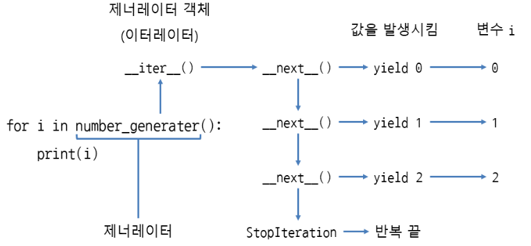
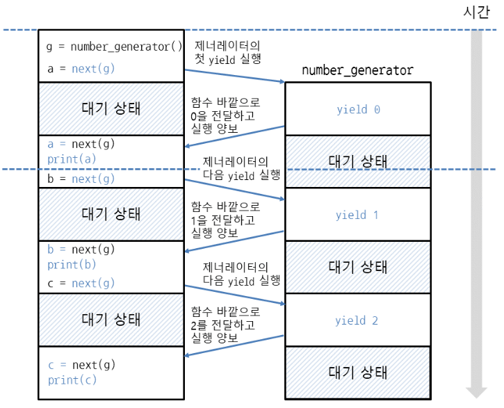

# Iterator, Generator, Decorator

## Iterator
- 반복 가능한 객체(Iterable) : 요소가 여러 개 들어있고, 한 번에 하나씩 꺼낼 수 있는 객체
    - 문자열, 리스트, 딕셔너리, 세트 등
- 이터레이터 : `__next__`메서드를 사용해서 차례대로 값을 꺼낼 수 있는 객체 (map도 이터레이터)<br>
즉, 반복 가능한 객체에서 __iter__메서드로 이터레이터를 얻는다

### 반복 가능한 객체인지 확인
- dir(객체)  : 객체가 반복 가능한 객체인지(`__iter__` 유무) 알아보는 방법
``` python
dir([1,2,3]) # ['__add__', '__class__', ...'__iter__', ..., 'append', ...'reverse', 'sort']
[1,2,3].__iter__()  # <list_iterator object at 0x03616630>
```
- `__next__()` : 이터레이터는 __next__로 요소를 계속 꺼내다가, 없으면 StopIteration 예외 발생
=== "__next__"
    ``` python
    it = [1,2,3].__iter__()
    it.__next__() # 1
    it.__next__() # 2
    it.__next__() # 3
    it.__next__() # StopIteration
    ```
=== "range"
    ``` python
    it = range(3).__iter__()
    it.__next__() # 0 -> 1 -> 2 -> StopIteration
    ```

### Iterator 구현
``` python
class Counter:
	def __init__(self, stop):
		self.current = 0  # 0부터 지정된 숫자 직전까지 반복
		self.stop = stop  # 반복을 끝낼 숫자

	def __iter__(self):  
		return self  #현재 인스턴스 반환

	def __next__(self):
		if self.current < self.stop:
			r = self.current
			self.current +=1
			return r
		else:
			raise StopIteration

for i in Counter(3):
	print(i, end = ' ')  # 0 1 2
```

### Iterator 언패킹
``` python
a, b, c, d, e = Counter(5):
print(a,b,c) # 0 1 2 3 4
```

### 인덱스로 접근할 수 있는 Iterator
- `__getitem__`
- `__getitem__`만 구현해도 이터레이터가 되며 `__iter__`, `__next__`는 생략 가능
``` python
class Counter:
	def __init__(self, stop):
		self.stop = stop

	def __getitem__(self,index):  # 인덱스로 접근할 수 있는 이터레이터 생성
		if index < self.stop:
			return index
		else:
			raise IndexError

print(Counter(3)[0], counter(3)[1], counter(3)[2]) # 0 1 2
for i in range(3): print(i, end = ' ')  # 0 1 2
```

### iter
- 반복을 끝낼 값을 지정하면, 특정 값이 나올 때 반복을 끝냄
- 반복 가능한 객체 대신 호출 가능한 객체 (callable)를 넣어줌
- iter(호출가능한객체, 반복을끝낼값)
=== "1"
    ```python
    import random
    it = iter(lambda : random.randint(0, 5), 2)  # 0~5 무작위로 숫자를 생성하다 2가 나오면 끝
    next(it)
    ```
=== "2"
    ``` python
    import random
    for i in iter(lambda : random.randint(0,5),2):
        print(i, end = ' ')
    ```

### next
기본값을 지정하여 반복이 끝나더라도 StopIteration을 발생하지 않고, 기본값을 출력

- next(반복가능한객체, 기본값)
```python
it = iter(range(3))
next(it, 10) # 0
next(it, 10) # 1
next(it, 10) # 2
next(it, 10) # 10  ## 계속 10 출력
```

## Generator
이터레이터를 생성해주는 함수

- yield 값  : 함수 안에서 사용하면, 함수는 제너레이터가 되며 yield에는 값(변수)을 지정
``` python
def number_generator():
	yield 0
	yield 1
	yield 2

for i in number_generator():
	print(i)  # 0 \n 1 \n 2
```

### 제너레이터가 이터레이터 객체인지 확인
- 제너레이터는 yield에 지정한 값이 __next__ 메서드의 반환값으로 나옴
- 제너레이터는 함수의 끝에 도달하면 StopIteration이 자동으로 발생
- 제너레이터 객체에서 `__next__` 메서드를 호출할 때마다, 함수 안의 yield까지 코드를 실행하며  yield에서 값을 발생시킴
``` python
g = number_generator()
g  # <generator object number_generator at 0x03A190F0>
dir(g) # __iter__, __next__ 객체 확인 가능
```

### for문과 제너레이터
- 반복할 때마다 `__next__` 호출. yield에서 발생시킨 값을 반환하다 StopIteraion이 발생하면 끝
- 제너레이터 함수 호출 → 제너레이터 객체 → `__iter__`는 self 반환 → 제너레이터 객체
- yield : 값을 함수 바깥으로 전달하면서, 코드 실행을 함수 바깥에 양보


### yield의 동작 과정
``` python
def number_generator():
	yield 0  # 0을 함수 바깥으로 전달하면서, 코드 실행을 함수 바깥에 양보
	yield 1  # 1을 함수 바깥으로 전달하면서, 코드 실행을 함수 바깥에 양보
	yield 2  # 2을 함수 바깥으로 전달하면서, 코드 실행을 함수 바깥에 양보

g = number_generator()

a = next(g) # yield를 사용하여 함수 바깥으로 전달한 값은, next의 반환값으로 나옴
print(g) # 0

b = next(g)
print(g)  # 1
```

- yield의 실행 양보


    - `g = number_generator()`와 같이 제너레이터 객체 생성
    - `next(g)`를 호출하면, 제너레이터 안의 `yield 0` 이 실행되어 숫자 0을 전달한 뒤, 바깥의 코드가 실행되도록 양보
    - 함수 바깥에서는 print(a)로 next(g)에서 반환된 값을 출력
    - 값을 출력했으면, next(g)로 다시 제너레이터 안의 코드 실행
    - 즉, return은 반환 즉시 함수가 끝나지만, yield 는 잠시 함수 바깥의 코드가 실행되도록 양보하여 값을 가져가게 한 뒤 다시 제너레이터 안의 코드를 계속 실행하는 방식

### 제너레이터와 return
제너레이터 안에서 return에 반환값을 지정하면, StopIteration 예외의 에러 메시지로 들어감
``` python
def one_generator():
    yield 1
    return 'return에 지정한 값'

try:
    g = one_generator()
    next(g)
    next(g)
except StopIteration as e:
    print(e) # return에 지정한 값
```

### yield 에서 함수 호출하기
``` python
def upper_generator(x):
	for i in x:
		yield i.upper()  # 함수의 반환값을 바깥에 전달

fruits = ['apple', 'pear', 'grape', 'pineapple', 'orange']
for i in upper_generator(fruits):
	print(i)  # APPLE \n PEAR ...
``` 

### yield from으로 값을 여러 번 바깥으로 전달하기
- 반복 가능한 객체, 이터레이터, 제너레이터 객체 지정
- yield from 반복가능한 객체 
- 이터레이터 객체
- 제너레이터 객체
``` python
def number_generator():
	x = [1,2,3]
	yield from x  # 리스트에 들어 있는 요소를 한 개씩 바깥으로 전달

for i in number_generator():
	print(i)  # 1 \n 2 \n 3
```

### yield from에 제너레이터 객체 지정
``` python
def number_generator(stop):
	n = 0
	while n < stop:
		yield n
		n += 1

def three_generator():
	yield from number_generator(3)  ## 숫자를 세 번 바깥으로 전달

for i in three_generator():
	print(i)  # 0 \n 1 \n 2
```

### Generator Comprehension 
- 리스트 표현식을 ( ) 괄호로 묶어 구현
- 리스트 표현식은 처음부터 리스트의 요소를 생성하는 것과 달리, 제너레이터 표현식은 필요할 때 요소를 만들어내므로 메모리를 절약할 수 있음.
``` python
[i for i in range(50) if i % 2 == 0] # List Comprehension

# Generator Comprehension
(i for i in range(50) if i % 2 == 0) # <generator object <genexpr> at 0x024F02A0>
```

## Decorator
함수를 수정하지 않은 상태에서 추가 기능을 구현할 때 사용
```python
# 함수의 시작과 끝을 출력하는 데코레이터
# 함수 안에서 함수를 만들고 반환하는 클로저 형식

def trace(func):  # 함수를 매개변수로 받음
    def wrapper():  # 호출한 함수를 감싸는 하루
        print(func.__name__, "함수 시작") # __name__으로 함수 이름 출력
        func()                          # 매개변수로 받은 함수 호출
        print(func.__name__, "함수 끝")
    return wrapper  # wrapper 함수 반환

@trace
def hello():
    print("hello")

def world():
    print('world')

hello() # hello 함수 시작 \n # hello
world() # hello 함수 끝 \n # hello
```

### 함수 매개 변수와 반환값을 처리하는 데코레이터
``` python
def trace(func):
    def wrapper(a,b): # 호출할 함수 add(a, b)의 매개변수와 똑같이 지정
        r = func(a,b) # func에 매개변수 a, b를 넣어서 호출하고 반환값을 변수에 저장
        print('{0}(a={1}, b={2}) -> {3}'.format(func.__name__, a, b, r))  # 매개변수와 반환값 출력
        return r
    return wrapper
@trace
def add(a,b):
    return a+b
print(add(10,20)) # 30
```

### 가변 인수 함수 데코레이터
```python
def trace(func):
    def wrapper(*args, **kwargs): # 가변 인수, 키워드 인수 둘 다 적용 가능
        r = func(*args, **kwargs) # func에 args, kwargs를 언패킹하여 넣어줌
        print('{0}(args={1}, kwargs={2}) -> {3}'.format(func.__name__, args, kwargs, r))
        return r
    return wrapper

@trace # @데코레이터
def get_max(*args): # 위치 인수를 사용하는 가변 인수 함수
    return max(args)
 
@trace # @데코레이터
def get_min(**kwargs): # 키워드 인수를 사용하는 가변 인수 함수
    return min(kwargs.values())
 
print(get_max(10, 20)) # 20
print(get_min(x=10, y=20, z=30)) # 10
```

### 매개 변수 데코레이터
``` python
### 함수의 반환값이 특정 수의 배수인지 확인하는 데코레이터
def is_multiple(x):
    def real_decorator(func):  # 호출할 함수를 매개변수로 받음
        def wrapper(a,b):  # 호출할 함수의 매개변수와 똑같이 지정
            r = func(a,b)  # func를 호출하고 반환값을 변수에 저장
            if r % x == 0:  # func의 반환값이 x의 배수인지 확인
                print('{0}의 반환값은 {1}의 배수입니다.'.format(func.__name__, x))
            else:
                print('{0}의 반환값은 {1}의 배수가 아닙니다.'.format(func.__name__, x))
            return r  # func의 반환값을 반환
        return wrapper  # wrapper 함수 반환
    return real_decorator  # real_decorator 함수 반환

@is_multiple(3) # @데코레이터(인수)
def add(a,b):
    return a+b
    
print(add(10, 20)) # add의 반환값은 3의 배수입니다. \n 30
print(add(2, 5)) # add의 반환값은 3의 배수가 아닙니다. \n 7
```

### 매개변수가 있는 데코레이터를 여러 개 지정
``` python
@is_multiple(3)
@is_multiple(7)
def add(a, b):
    return a + b
 
add(10, 20)
# add의 반환값은 7의 배수가 아닙니다.
# wrapper의 반환값은 3의 배수입니다.

# ↑ 원래 이름을 출력하고 싶다면,
import functools  # functools.wraps: 함수의 정보 유지
def is_multiple(x):
    def real_decorator(func):
        @functools.wraps(func) # @functools.wraps에 func를 넣은 뒤 wrapper 함수 위에 지정
        def wrapper(a, b):
            r = func(a, b)
            if r % x == 0:
                print('{0}의 반환값은 {1}의 배수입니다.'.format(func.__name__, x))
            else:
                print('{0}의 반환값은 {1}의 배수가 아닙니다.'.format(func.__name__, x))
            return r
        return wrapper
    return real_decorator

```

### 클래스로 데코레이터 만들기
``` python
class Trace:
    def __init__(self, func):  # 호출할 함수를 인스턴스의 초깃값으로 받음
        self.func = func  # 호출한 함수를 속성 func에 저장
    
    def __call__(self):
        print(self.func.__name__, '함수 시작') # __name__으로 함수 이름 출력
        self.func()
        print(self.func.__name__, '함수 끝')

@Trace
def hello():
    print('hello')

hello()
```

### 함수의 매개변수와 반환값을 처리하는 클래스 데코레이터
``` python
class Trace:
    def __init__(self, func):
        self.func = func
    
    def __call__(self, *args, **kwargs): # 호출할 함수의 매개변수를 처리
        r = self.func(*args, **kwargs) # self.func에 매개변수를 넣어서 호출하고 반환값을 변수에 저장
        print('{0}(args={1}, kwargs={2}) -> {3}'.format(self.func.__name__, args, kwargs, r))
        return r
@Trace
def add(a,b):
    return a+b
    
print(add(10, 20))
print(add(a=10, b=20))
```

### 매개변수 클래스 데코레이터
``` python
class IsMultiple:
    def __init__(self, x):  # 데코레이터가 사용할 매개변수를 초깃값으로 받음
        self.x = x  # 매개변수를 속성 x에 저장
    
    def __call__(self, func):
        def wrapper(a,b): # 호출할 함수의 매개변수와 똑같이 지정(가변 인수로 작성해도 됨)
            r = func(a,b)  # func를 호출하고 반환값을 변수에 저장
            if r % self.x == 0:
                print('{0}의 반환값은 {1}의 배수입니다.'.format(func.__name__, self.x))
            else:
                print('{0}의 반환값은 {1}의 배수가 아닙니다.'.format(func.__name__, self.x))
            return r  # func의 반환값을 반환
        return wrapper  # wrapper 함수 반환

@IsMultiple(3)
def add(a,b):
    return a+b
    
print(add(10, 20))
print(add(2, 5))
```