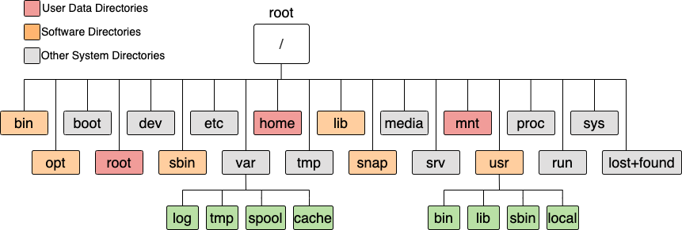

# Filesystem Hierarchy Standard
Linux는 Unix 운영체제 기반의 오픈소스 운영체제이다. 유닉스와 같이 모든 것들을 파일로 관리한다.  
Linux 파일 시스템은 FHS(Filesystem Hierachy Standard)라는 표준 구조로 정의되어 있으며, 트리 구조의 디렉토리를 가진다.

## 파일 종류
### 1. 일반 파일 (Regular File)
데이터 저장에 사용되는 파일로 대부분의 Linux 파일들이 이에 속한다.
실행 파일, 데이터 파일, 이미지 파일은 바이너리 형태로 데이터를 저장한다. 해당 파일들은 파일의 내용을 확인할 수 있는 특정 응용프로그램을 사용해야 열람하거나 수정할 수 있다.
텍스트 파일은 ASCII 코드로 구성되어 문서 편집기를 통해 내용을 보거나 수정할 수 있다.

### 2. 디렉토리 파일 (Directory)
Linux는 디렉토리도 파일로 취급한다.
해당 디렉토리에 저장되어 있는 정보와 하위 디렉토리에 대한 정보를 담고 있다.

### 3. 심볼릭 링크 (Symbolik Link)
원본 파일을 대신해서 사용하기 위해 다른 파일명으로 링크된 파일을 뜻함

### 4. 장치 파일
장치(하드웨어)들을 관리하는 파일이다.
하드 디스크나 CPU, CD-ROM과 같은 장치들을 파일화하여 관리한다.

## 디렉토리 구조

- User Data Directories
: 사용자는 종종 분석 입출력, 인터넷에서 다운받은 프로그램 패키지 및 기타 파일 등 '사용자 데이터'를 홈 디렉토리에 저장한다.
또한, 사용자는 더 많은 공간이 필요하거나 한 시스템에서 다른 시스템으로 데이터를 이동하는 경우에 별도의 스토리지 드라이브에 데이터를 저장할 수 있다.

- Software Directories
: 많은 표준 Linux 디렉토리에는 운영 체제에서 필요로 하는 소프트웨어나 사용자가 사용하는 소프트웨어가 포함되어 있다.
각 Linux 배포판은 모든 시스템에서 자동으로 포함되는 다양한 표준 기본 소프트웨어 패키지를 제공한다.
Debian 기반의 Ubuntu의 경우 apt와 같은 패키지 관리자를 통해 기본 소프트웨어 디렉토리에 추가 소프트웨어를 설치할 수 있다. 또한, Red Hat Enterprise Linux의 경우 YUM을 사용할 수 있으며 Linux용 앱스토어인 snap을 사용할 수도 있다.

- Other System Directories
: Linux 시스템 및 사용자 애플리케이션의 실행 및 구성과 관련된 정보가 포함되어 있다.

|      위치      |   이름 및 요약   |       설명       |
| :-----------: | :-----------: | :-------------- |
/ | 루트 root | 최상위 디렉토리
/root | 루트 Root Home Directory | 관리자 계정 root 사용자의 홈 디렉토리
/home | 홈 Users home Directory | 각 사용자의 홈 디렉토리 (e.g. /home/ubuntu)  사용자가 시스템에 로그인/연결할 때 시작되는 기본 디렉토리로 사용자를 추가하면, 사용자의 ID와 동일한 디렉토리가 이곳에 자동으로 생성된다.
/mnt | 마운트 Mount Directory for Storage Volumes | 연결된 Storage Volume의 파일 시스템을 마운트하기 위한 표준 Directory.   media는 OS에서 자동으로 마운팅해주는 포인트로 주로 사용되고, mnt는 사용자가 직접 마운트하는 경로로 사용된다는 차이점이 있다.   예를들어 컴퓨터에 USB를 꽂았을 때, OS에 자동으로 마운팅된다면 대부분 media 내에 위치 ; 외부에 있는 디스크 등을 직접 마운트한다면 mnt 내에 위치
 | |
/bin | 바이너리 Essential User Executable | cat, chmod, chown, cp, echo, mkdir 등등 CLI에서 자주 사용하는 기본적인 사용자 Command가 저장된 Directory   부팅 및 표준 작업 중 필요한 모든 실행파일들이 포함되어 있다. (ls -F를 사용하면, /bin의 파일들 대부분이 파일명 끝에 *가 추가되어 있는데, 이는 해당 파일이 실행 가능한 파일임을 표시하는 것이다)
/sbin | 시스템 바이너리 System Administration Executables | ifconfig, ethtool, e2fsck 등 컴퓨터 관리자가 시스템을 컨트롤하기 위한 실행 프로그램을 저장하고 있는 Directory.   해당 명령어의 대부분은 sudo를 사용하여 실행해야 하며, root 권한이 없으면 PATH에 포함되어 있지 않을 수 있다.
/usr | 유저 User Executables And Data | 일반 사용자들이 사용하는 Directory.시스템 파일과 달리 사용자가 필요에 의해 설치한 실행 파일 및 파일 포함   • /usr/bin : 필요에 의해 설치된 비필수 응용프로그램이 위치한 Dir (yum 등 패키지 관리자가 관리)  • /usr/sbin : 필요에 의해 설치된 비필수 시스템 관리 바이너리 파일이 위치한 Dir (yum 등 패키지 관리자가 관리)  • /usr/lib : 각각의 라이브러리가 저장되는 Dir   • /usr/include : 기본 C라이브러리 헤더 파일과 각종 라이브러리 헤더파일 포함   • /usr/src : 프로그램 소스 및 커널 소스들이 저장된 Dir   • /usr/local : 사용자 자체 소프트웨어를 설치할 수 있는 Dir   • /usr/local/bin : 기타 사용자 커맨드 파일이 위치한 Dir (사용자 또는 설치 파일이 해당 dir에 파일 설치)   • /usr/local/sbin : 기타 시스템 커맨드 파일이 위치한 Dir (사용자 또는 설치 파일이 해당 dir에 파일 설치)
/opt | 옵트 Operation Optional Packages | 추가 응용프로그램 패키지 설치 Directory.  패키지 매니저가 자체적으로 설치/삭제 수행
/lib | 라이브러리 Essential libraries | 커널이 필요로 하는 각종 라이브러리 파일, 커널 모듈 파일 등이 저장된 Directory.  /bin 및 /sbin에 있는 실행파일에서 필요로 하는 라이브러리가 포함되어 있다.
/snap | 스냅 Snap Packages | 설치된 snap 패키지가 저장된 Directory.
| | |
/boot | 부트 Boot Files | 시스템(Linux) 부팅에 필요한 정보를 가진 파일들이 저장된 Directory
/dev | 디바이스 Device Files | 시스템 디바이스 파일들이 저장된 Directory /dev/sda(하드디스크 장치 파일), /dev/cdrom(CD-ROM 장치 파일)과 같이 물리적 장치가 파일화되어 저장된다
/etc | ETCetera Configuration Files | 시스템 애플리케이션 구성 파일들이 저장된 Directory • /etc/X11 : X window 관련 설정 파일 • /etc/cron.d : crontab 명령 설정 파일 • /etc/cron.daily : 매일 작동하도록 하는 crontab 스크립트 파일 포함 • /etc/httpd : Apache 웹 서버 설정 및 로그 파일 • / etc/logrotate.d : logrotate 설정 파일 • /etc/profile.d :  • /etc/rc.d : 시스템 초기화와 관련된 스크립트 파일 포함 • /etc/security : 터미널 보안 관련 설정 • /etc/skel : 새로운 사용자를 추가할 때, 자동으로 생성되는 dir와 파일 존재 • /etc/ssh : Secure Shell 설정 파일 • /etc/sysconfig : 시스템과 네트워크 설정
/var | 바, Variable/Variable Data Files | 로그 파일, 데이터베이스 캐싱 파일, 웹서버 이미지 파일, 임시 파일 및 기타 시스템 정보와 같이 시스템의 정상 작동 중 자주 변경될 것으로 예상되는 파일을 저장하는 Directory. • /var/log : 다양한 시스템 서비스 및 응용프로그램에서 생성한 로그 파일 저장 • /var/dll : 인쇄 및 메일과 같은 다양한 서비스에 대한 Spool을 포함(e.g. 인쇄 대기는 일반적으로 /var/spool/cups에 저장) • /var/run : 다양한 시스템 서비스의 런타임 파일이 들어있는 Directory(e.g. Daemon 프로세스의 PID 파일은 /var/run에 저장될 수 있다) • /var/tmp : 재부팅 후에도 유지되는 임시파일을 포함하는 Directory(재부팅 시 지워지는 /tmp와 달리 자동으로 삭제되지 않는다.) • /var/named : 네임서버 설정 파일 포함
/tmp | 템프 Temporary Files | 임시 파일을 저장하기 위한 Directory 시스템 유틸리티에 의해 삭제되거나 재부팅 시 삭제된다.
/media | 미디어 Removable Media | DVD, CD-ROM, USB 등 외부 장치들의 마운트 포인트로 사용되는 Directory
/srv | Service Data | 웹사이트 파일같은 시스템에서 제공하는 서비스 데이터
/proc | 프로세스 Kernel and Process Files | 시스템 및 실행 중인 프로세스에 대한 정보를 저장하는 Directory
/run | 런 Application Run Files | 애플리케이션 런타임 파일을 위한 임시 파일 저장. 부팅 후의 시스템 정보를 관리한다.
/sys | 시스템 SYSFS Filesystem | 시스템에 연결된 디바이스를 관리하기 위한 가상 파일 시스템 Directory
lost+found | 로스트 Recovered Files | 파일 시스템 손상 후 fsck 유틸리티에 의해 복구된 파일들

### /lib & /lib32 & /libx32 & /lib64
시스템 부팅이나 /bin, /sbin 디렉토리에 있는 바이너리 파일 실행에 필요한 공유 라이브러리 Directory

⦿ lib : 32bit 아키텍처용으로 컴파일된 라이브러리 포함  
⦿ lib32 : 64bit 시스템의 32bit 아키텍처용으로 컴파일된 라이브러리 포함  
⦿ libx32 : 64bit 시스템에서 64bit 포인터로 32bit 아키텍처용으로 컴파일된 라이브러리 포함  
⦿ lib64 : 64bit 아키텍처용으로 컴파일된 라이브러리 포함

### etc
대부분의 설정 파일들이 저장되어 있는 Directory 
네트워크 관련 설정 파일, 사용자 정보 및 암호 정보, 파일시스템 정보, 시스템 초기화 파일 등 중요 설정 파일들이 위치해있다.

/etc에서 .d를 붙여 디렉토리임을 구별하기도 하고 (Optional, 안 붙일 수도 있음)
설정파일은 .conf 라는 이름의 형식으로 많이 관리되어 있다
 
예시로 passwd는 사용자에 관한 내용을 담고 있는 곳으로, Command를 통해 사용자를 추가하거나 삭제하면 해당 파일이 변경되며 운영체제에서 사용자를 관리하게 된다.
 
-----
!!!quote
    - [1](https://inpa.tistory.com/entry/LINUX-📚-리눅스-디렉토리-구조)  
    - [2](https://blog.ronin.cloud/linux-directories-paths/)
    - [3](https://firedev.tistory.com/entry/Linux-Unix-리눅스시스템-디렉토리-구조와-기능)