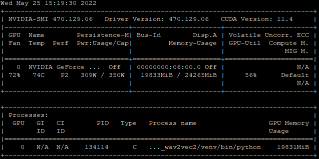

# Nvidia

## `nvidia-smi`



- `CUDA Version: 11.4` : **사용할 수 있는 CUDA의 최대 버전**

### nvidia-smi를 활용한 Train 실시간 모니터링 `watch --help`
- `-d`  : 실시간으로 업데이트 하면서, 변경 되는 부분을 하이라이트
- `-n`  : 업데이트 간격 (second 단위)
``` bash
watch -d -n 1 nvidia-smi # 1초 간격으로 업데이트하면서 변경되는 부분 하이라이트
## ctrl-c : 실시간 모니터링 정지
```

### :heart_exclamation:**현재 사용중인 CUDA 버전**을 확인하려면,
``` bash
nvcc -V
nvcc --version
```