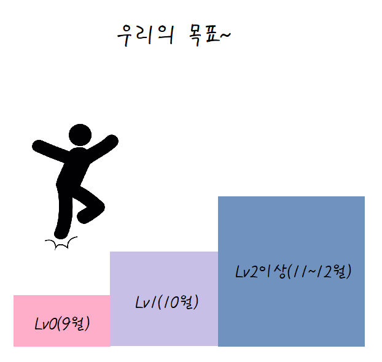

# MSA-3기 코테 소그룹 공간 😃

{:style width=50%;height=50%}

---

### [23.09.06 Level0] 181943 문자열 겹쳐쓰기 [note](../../language/java/note/1.md)
문자열 my_string, overwrite_string과 정수 s가 주어집니다. 문자열 my_string의 인덱스 s부터 overwrite_string의 길이만큼을 문자열 overwrite_string으로 바꾼 문자열을 return 하는 solution 함수를 작성해 주세요.

| my_string | overwrite_string |    s   |  result
| :-------: | :--------------: | :----: | :-----:
|"He11oWor1d" | "lloWorl" | 2 | "HelloWorld" |
|"Program29b8UYP" | "merS123" | 7 | "ProgrammerS123" |

=== "java"
    ``` java
    class Solution {
        public String solution(String my_string, String overwrite_string, int s) {
            return my_string.substring(0,s) + overwrite_string + my_string.substring(overwrite_string.length()+s);
        }
    }
    ```
=== "java_Others"
    ``` java
    class Solution {
        public String solution(String my_string, String overwrite_string, int s) {
            String answer = "";
            StringBuffer sb = new StringBuffer(my_string);
            sb.replace(s, s+overwrite_string.length(), overwrite_string);
            answer = sb.toString();
            return answer;
        }
    }
    ```
=== "python"
    ``` python
    # replace 쓰려다가 index를 기준으로 분리하는 데에 쓰는 건 아니라는 것을 깨달았다..
    # 함수의 기능을 잘 생각해보고 쓰자 
    def solution(my_string, overwrite_string, s):
        return my_string[0:s] + overwrite_string + my_string[s+len(overwrite_string):]
    ```

---

### [23.09.07 Level0] 181936 공배수 [note](../../language/java/note/1.md)
정수 number와 n, m이 주어집니다. number가 n의 배수이면서 m의 배수이면 1을 아니라면 0을 return하도록 solution 함수를 완성해주세요.
=== "java"
    ``` java
    class Solution {
        public int solution(int number, int n, int m) {
            return (number%n==0 && number%m==0) ? 1 : 0;
        }
    }
    ```
=== "python"
    ``` python
    solution = lambda number,n,m: int(not(number%n | number%m))
    ```

---

### [23.09.11 Level0] 주사위 게임 2 
1부터 6까지 숫자가 적힌 주사위가 세 개 있습니다. 
<br>세 주사위를 굴렸을 때 나온 숫자를 각각 a, b, c라고 했을 때 얻는 점수는 다음과 같습니다.

1. 세 숫자가 모두 다르다면 a + b + c 점을 얻습니다.
2. 세 숫자 중 어느 두 숫자는 같고 나머지 다른 숫자는 다르다면 (a + b + c) × (a2 + b2 + c2 )점을 얻습니다.
3. 세 숫자가 모두 같다면 (a + b + c) × (a2 + b2 + c2 ) × (a3 + b3 + c3 )점을 얻습니다.

세 정수 a, b, c가 매개변수로 주어질 때, 얻는 점수를 return 하는 solution 함수를 작성해 주세요.

=== "java"
    ``` java
    import java.util.HashSet;
    class Solution {
        public int solution(int a, int b, int c) {
            HashSet<Integer> numList = new HashSet<>();
            numList.add(a);
            numList.add(b);
            numList.add(c);
            
            int stNum = 4;
            int answer = 1;
            
            for (int i=stNum-numList.size(); i>0; i--)
                answer *= Math.pow(a,i)+Math.pow(b,i)+Math.pow(c,i);
            
            return answer;
        }
    }
    ```
=== "python"
    ``` python
    def solution(a, b, c):
        check = len({a,b,c})
        result = 1
        for num in range(4-check):
            result *= a**(num+1)+b**(num+1)+c**(num+1)
        return result
    ```

---
### [23.09.12 Level0] 옹알이 (1)
머쓱이는 태어난 지 6개월 된 조카를 돌보고 있습니다. 조카는 아직 "aya", "ye", "woo", "ma" 네 가지 발음을 최대 한 번씩 사용해 조합한(이어 붙인) 발음밖에 하지 못합니다. 문자열 배열 babbling이 매개변수로 주어질 때, 머쓱이의 조카가 발음할 수 있는 단어의 개수를 return하도록 solution 함수를 완성해주세요.

- babbling의 각 문자열에서 "aya", "ye", "woo", "ma"는 각각 최대 한 번씩만 등장합니다.
- 문자열은 알파벳 소문자로만 이루어져 있습니다.

=== "java"
    ``` java
    class Solution {
        public int solution(String[] babbling) {
            int count = 0;
            for (String word:babbling) {
                if (word.matches("(aya|ye|woo|ma)+"))
                    count ++;
            }
            return count;
        }
    }
    ```
=== "python"
    ``` python
    import re
    def solution(babbling):
        pattern = re.compile("aya|ye|woo|ma")
        count = 0
        for word in babbling:
            if re.sub(pattern, '', word) == '':
                count += 1
        return count
    ```


---
### [23.09.13 Level1] 정수 제곱근 판별
임의의 양의 정수 n에 대해, n이 어떤 양의 정수 x의 제곱인지 아닌지 판단하려 합니다.
n이 양의 정수 x의 제곱이라면 x+1의 제곱을 리턴하고, n이 양의 정수 x의 제곱이 아니라면 -1을 리턴하는 함수를 완성하세요.

=== "java"
    ``` java
    class Solution {
        public long solution(long n) {
            double x = Math.sqrt(n);
            return x%1==0 ? (long)(Math.pow(x+1,2)) : -1 ;
        }
    }
    ```
=== "python"
    ``` python
    def solution(n):
        num = n**0.5
        return (num+1)**2 if num%1==0 else -1
    ```

---
### [23.09.14 Level1] 하샤드 수
양의 정수 x가 하샤드 수이려면 x의 자릿수의 합으로 x가 나누어져야 합니다. 예를 들어 18의 자릿수 합은 1+8=9이고, 18은 9로 나누어 떨어지므로 18은 하샤드 수입니다. 자연수 x를 입력받아 x가 하샤드 수인지 아닌지 검사하는 함수, solution을 완성해주세요.

=== "My code"
    ``` java
    class Solution {
        public boolean solution(int x) {
            int numSum = 0;
            String numStr = Integer.toString(x);
            
            for (int i=0; i<numStr.length(); i++)
                numSum += Character.getNumericValue(numStr.charAt(i));
            
            return x % numSum == 0;
        }
    }
    ```
=== "Others"
    ``` java 
    // 내 코드가 약 3-4배 정도 더 빠르다 왜지
    class Solution {
        public boolean solution(int x) {
            int numSum = 0;
            String [] tmp = String.valueOf(x).split("");
            
            for (String ch:tmp)
                numSum += Integer.parseInt(ch);
    
            return x%numSum==0;
        }
    }
    ``` 

---
### [23.09.15 Level1] 수박수박수박수박수박수?
길이가 n이고, "수박수박수박수...."와 같은 패턴을 유지하는 문자열을 리턴하는 함수, solution을 완성하세요. 예를들어 n이 4이면 "수박수박"을 리턴하고 3이라면 "수박수"를 리턴하면 됩니다.

=== "java"
    ``` java
    import java.util.ArrayList;
    class Solution {
        public String solution(int n) {
            ArrayList<String> tmp = new ArrayList<>();
            for (int i=1; i<=n; i++){
                tmp.add(i%2==0 ? "박" : "수");
            }
            String str = String.join("", tmp);
            return str;
        }
    }
    ```
=== "python"
    ``` python
    def solution(n):
        answer = ["박" if i%2==0 else "수" for i in range(1, n+1)]
        return ''.join(answer)
    ```
=== "python Others"
    ``` python
    def solution(n):
        return "".join(["수박"[i%2] for i in range(n)])
    ```

---
### [9월 2주차] 기사단원의 무기