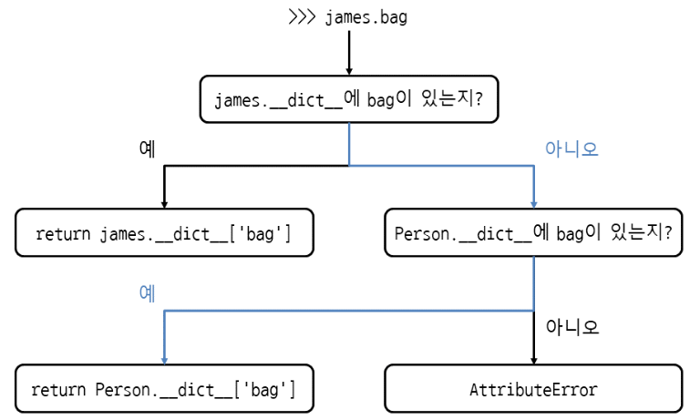

# Class

- 속성(Attribute) : 요소
- 메서드(Method) : 기능
``` python
class Person: # 클래스의 이름은 대문자로 시작
	def greeting(self): # 첫번째 매개변수는 반드시 self
		print('Hello')

james = Person()  ## james는 Person의 인스턴스(instance)
james.greeting() # Hello ## 인스턴스 메서드: 인스턴스를 통해 호출하는 메서드
```

### 빈 클래스
``` python
class Person:
	pass
```

### 메서드 안에서 메서드 호출
- self.메서드() 형식으로 호출
``` python
class Person:
	def greeting(self):
		print('Hello')

	def hello(self):
		self.greeting()  ## self.메서드() 형식으로 클래스 안의 메서드를 호출

james = Person()
james.hello() # Hello
```

### 특정 클래스의 인스턴스인지 확인
- 주로 객체의 자료형을 판단할 때 사용
- isinstance(인스턴스, 클래스) : 특정 클래스의 인스턴스가 맞으면 True, 아니면 False
``` python
def factorial(n)
	if not isinstance(n, int) or n < 0:  ## n이 정수가 아니거나 음수이면 함수를 끝냄
		return None
	if n == 1:
		return 1
	return n*factorial(n-1)
```

---

### 인스턴스 속성
- `__init__` 메서드 안에서 self.속성에 값을 할당
- def __init__(self):  인스턴스를 만들 때 호출되는 특별한 메서드, 인스턴스 초기화
- 스페셜 메서드(=매직메서드) : __가 붙은 메서드, 파이썬이 자동으로 호출해주는 메서드
``` python
class Person:
	def __init__(self):  ## init 메서드에서 속성을 만들고, 
			self.hello = '안녕하세요'
	def greeting(self):  ## greeting 메서드에서 속성 사용
		print(self.hello)

james = Person()
james.greeting()  # 안녕하세요
```

### Self


### 인스턴스를 만들 때 값 받기
```python
class 클래스이름:
    def __init__(self, 매개변수1, 매개변수2):
        self.속성1 = 매개변수1
        self.속성2 = 매개변수2
```
- 인스턴스 속성: 인스턴스를 통해 접근하는 속성 
```python
class Person:
		def __init__(self, name,  age, address):
            # 매개변수를 그대로 self에 넣어서 속성화 
			self.hello = '안녕하세요.'
			self.name = name
			self.age = age
			self.address = address

		def greeting(self):
			print('{0} 저는 {1}입니다.'.format(self.hello, self.name))

maria = Person(마리아, 20, '서울시 서초구 반포동')
maria.greeting()  # 안녕하세요. 저는 마리아입니다.

# 클래스 바깥에서 속성에 접근할 땐, 인스턴스.속성
print(f"{maria.name}, {maria.age}, {maria.address}")
```

### 클래스의 위치 인수, 키워드 인수
- 위치 인수
```python
class Person:
	def __init__(self, *args):
		self.name = args[0]
		self.age = args[1]
		self.address = args[2]

maria = Person(*['마리아', 20, '서울시 서초구 반포동'])
```
- 키워드 인수
```python
class Person:
	def __init(self, **kwargs):
		self.name = kwargs['name']
		self.age = kwargs['age']
		self.address = kwargs['address']

maria1 = Person(name = '마리아', age = '20', address = '서울시 서초구 반포동')
maria2 = Person(**{'name':'마리아', 'age':20, 'address':'서울시 서초구 반포동'})
```

### 인스턴스를 생성한 뒤에 속성 추가하기 / 특정 속성만 허용하기
- 클래스로 인스턴스를 만든 뒤에도, `인스턴스.속성 = 값` 으로 속성을 계속 추가할 수 있음
- 추가된 속성은 해당 인스턴스에만 생성된 것으로,  다른 인스턴스에서는 생성되지 않음
```python
class Person:
	pass

maria = Person()
maria.name = '마리아' # maria 인스턴스에 속성 추가
maria.name  # '마리아'
```

- __init__ 메서드가 아닌 다른 메서드에서도 속성 추가 가능 (메서드를 호출해야 속성이 생성됨)
```python
class Person:
	def greeting(self):
		self.hello = '안녕하세요'  # greeting 메서드에서 hello 속성 추가

maria = Person()
maria.greeting() # greeting 메서드를 호출해야
maria.hello  # hello 속성이 생성됨
```

- 인스턴스에 추가할 속성 중, 특정 속성만 허용하고 다른 속성은 제한하고 싶을 때
```python
class Person:
	__slots__ = ['name', 'age']  # name, age만 허용 (다른 속성은 생성 제한)

maria = Person()
# 이 두 속성을 제외한 다른 속성은 추가할 때 에러 발생
maria.name = '마리아'
maria.age = 20  
```

### 비공개 속성 (private attribute)
클래스 바깥에서는 접근할 수 없고, 클래스 안에서만 사용할 수 있는 속성

- 중요한 값이고, 바깥에서 함부로 바꾸면 안될 때 주로 사용
- `self.__속성 = 값`
```python
class Person:
	def __init__(self, name, age, address, wallet):
		self.name = name
		self.age = age
		self.address = address
		self.__wallet = wallet  ## 비공개 속성

maria = Person('마리아', 20, '서울시 서초구 반포동', 10000)
maria.__wallet -= 10000 # AttributeError # 클래스 바깥에서 비공개속성에 접근하면 에러 발생
```
- 클래스 안의 메서드에서 접근
```python
class Person:
	def __init__(self, name, age, address, wallet):
		self.name = name
		self.age = age
		self.address = address
		self.__wallet = wallet

	def pay(self, amount):
		if amount > self.__wallet:
			print('돈이 모자라네...')
			return
		self.__wallet -= amount

maria = Person('마리아', 20, '서울시 서초구 반포동', 10000)
maria.pay(3000)
```

### 비공개 메서드
```python
class Person:
	def __init__(self):
		return 

	def __greeting(self):  # 비공개 메서드 생성
		print('Hello')

	def hello(self):
		self.__greeting()  # 클래스 안에서는 비공개 메서드 호출 가능

james = Person()
james.__greeting()  # Error # 클래스 바깥에서는 비공개 메서드 호출 X
```

---

### 클래스 속성
- 클래스 속성은 클래스에 속해 있으며, 모든 인스턴스에서 공유된다
```python
class Person:
	bag = []
	def put_bag(self, stuff):
		Person.bag.append(stuff) # 클래스 이름으로 클래스 속성 접근
		#또는 self.bag.append(stuff)

james = Person()
james.put_bag('책')

maria = Person()
maria.put_bag('열쇠')

print(james.bag) # ['책', '열쇠']
print(maria.bag) # ['책', '열쇠']
```

### 인스턴스 속성
```python
class Person:
	def __init__(self):
		self.bag = []

	def put_bag(self, stuff):
		self.bag.append(stuff)

james = Person()
james.put_bag('책')

maria = Person()
maria.put_bag('열쇠')

print(james.bag) # ['책']
print(maria.bag) # ['열쇠']
```

### 비공개 클래스 속성
```python
class knight:
	__item_limit = 10  ## 비공개 클래스 속성

	def print_item_limit(self):
		print(knight.__item__limit)  ## 클래스 안에서만 접근할 수 있음

x = knight()
x.print_item_limit() # 10
```

### 속성, 메서드 이름을 찾는 순서
- 인스턴스, 클래스 순으로 찾는다
- 인스턴스 속성이 없으면 클래스 속성을 찾게 되므로 james.bag, maria.bag도 문제 없이 동작한다
- 겉보기에는 인스턴스 속성을 사용하는 것 같지만 실제로는 클래스 속성
- 인스턴스와 클래스에서 dict 속성을 출력해보면 현재 인스턴스와 클래스의 속성을 딕셔너리로 확인 가능
```python
james.__dict__  # 인스턴스.__dict__
Person.__dict__ # 클래스.___dict__
```
- james.bag을 사용했을 때 클래스 속성을 찾는 과정



### 클래스와 메서드의 독스트링
- `클래스.__doc__`
- `클래스.메서드.__doc__`
- `인스턴스.메서드.__doc__`
```python
class Person:
""" 클래스입니다. """
	def greeting(self):
	"""메서드입니다."""
		print('Hello')

print(Person.__doc__) # 클래스입니다.
print(Person.greeting.__doc__) # 메서드입니다.

x = Person()
print(x.greeting.__doc__) # 메서드입니다.
```

---

### 정적 메서드
인스턴스를 통하지 않고 클래스에서 바로 호출할 수 있는 메서드

- @staticmethod
- self를 받지 않으므로 인스턴스 속성에 접근 X
- 메서드의 실행이 외부 상태에 영향을 끼치지 않는 순수 함수를 만들 때 사용 <br>(= 인스턴스의 상태를 변화시키지 않는 메서드)
```python
class Calc:
	@staticmethod
	def add(a,b):
		print(a+b)

	@staticmethod
	def mul(a,b):
		print(a*b)

Calc.add(10,20) # 30  ## 클래스에서 바로 메서드 호출
Calc.mul(10,20) # 200 ## 클래스에서 바로 메서드 호출
```

### 클래스 메서드
- @classmethod
- 메서드 안에서 클래스 속성, 클래스 메서드에 접근해야 할 때 사용
- cls를 사용하면, 메서드 안에서 현재 클래스의 인스턴스를 생성할 수 있음
```python
class Person:
	count = 0  # 클래스 속성

	def __init__(self):
		Person.count += 1  # 인스턴스가 만들어질 때, 클래스 속성 count에 1을 더함

	@classmethod
	def print_count(cls):
		print(f"{cls.count}명 생성되었습니다.")  ## cls로 클래스 속성에 접근

james = Person()
maria = Person()
Person.print_count() # 2명 생성되었습니다.
```

---

## 클래스 상속 (Inheritance)
물려받은 기능을 유지한 채로 다른 기능을 추가할 때 사용하는 기능
```python
class 기반클래스이름:
    코드

class 파생클래스이름(기반클래스이름):
    코드
```

- 같은 종류이자 동등한 관계일 때 사용
- is a 관계 (Student is a Person)
- 기반 클래스 base class (= 부모 클래스, 슈퍼 클래스) : 기능을 물려주는 클래스 
- 파생 클래스 derived class (= 자식 클래스, 서브 클래스) : 상속을 받아 새롭게 만드는 클래스
```python
class Person:
	def greeting(self):
		print('안녕하세요')

class Student(Person):  # Person 클래스를 상속받은 Student 클래스
	def study(self):
		print('공부하기')

james = Student()  # Student 클래스 호출
james.greeting()  # 안녕하세요  #기반 클래스, Person의 메서드 호출
james.study()  # 공부하기  #파생 클래스, Student에 추가한 study 메서드 호출
```

### 상속 관계 확인
- `issubclass(파생,기반)` : 기반 클래스의 파생 클래스이면 True, 아니면 False 반환
```python
issubclass(Student, Person)  # True
```

### 포함 관계 Has a
- 리스트 속성에 Person 인스턴스를 넣어서 관리
- PersonList가 Person을 포함함 = PersonList has a Person
- 같은 종류에 동등한 관계일 때(=is a) 상속 사용
- 그 이외에는 속성에 인스턴스를 넣는 포함 방식(=has a) 사용
```python
class Person:
	def greeting(self):
		print('안녕하세요')

class PersonList:
	def __init__(self):
		self.person_list = []

	def append_person(self, person):
		self.person_list.append(person)

p = Person()
pl = PersonList()
pl.append_person(p)
```

### 기반 클래스의 속성 사용하기
