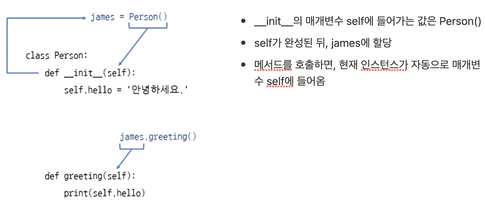
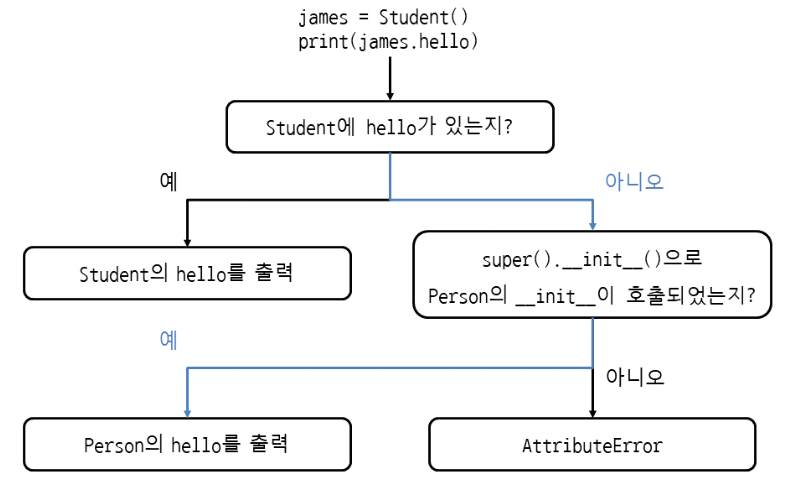

# Class

- 속성(Attribute) : 요소
- 메서드(Method) : 기능
``` python
class Person: # 클래스의 이름은 대문자로 시작
	def greeting(self): # 첫번째 매개변수는 반드시 self
		print('Hello')

james = Person()  ## james는 Person의 인스턴스(instance)
james.greeting() # Hello ## 인스턴스 메서드: 인스턴스를 통해 호출하는 메서드
```

### 빈 클래스
``` python
class Person:
	pass
```

### 메서드 안에서 메서드 호출
- self.메서드() 형식으로 호출
``` python
class Person:
	def greeting(self):
		print('Hello')

	def hello(self):
		self.greeting()  ## self.메서드() 형식으로 클래스 안의 메서드를 호출

james = Person()
james.hello() # Hello
```

### 특정 클래스의 인스턴스인지 확인
- 주로 객체의 자료형을 판단할 때 사용
- isinstance(인스턴스, 클래스) : 특정 클래스의 인스턴스가 맞으면 True, 아니면 False
``` python
def factorial(n)
	if not isinstance(n, int) or n < 0:  ## n이 정수가 아니거나 음수이면 함수를 끝냄
		return None
	if n == 1:
		return 1
	return n*factorial(n-1)
```

---

### 인스턴스 속성
- `__init__` 메서드 안에서 self.속성에 값을 할당
- def __init__(self):  인스턴스를 만들 때 호출되는 특별한 메서드, 인스턴스 초기화
- 스페셜 메서드(=매직메서드) : __가 붙은 메서드, 파이썬이 자동으로 호출해주는 메서드
``` python
class Person:
	def __init__(self):  ## init 메서드에서 속성을 만들고, 
			self.hello = '안녕하세요'
	def greeting(self):  ## greeting 메서드에서 속성 사용
		print(self.hello)

james = Person()
james.greeting()  # 안녕하세요
```

### Self


### 인스턴스를 만들 때 값 받기
```python
class 클래스이름:
    def __init__(self, 매개변수1, 매개변수2):
        self.속성1 = 매개변수1
        self.속성2 = 매개변수2
```
- 인스턴스 속성: 인스턴스를 통해 접근하는 속성 
```python
class Person:
		def __init__(self, name,  age, address):
            # 매개변수를 그대로 self에 넣어서 속성화 
			self.hello = '안녕하세요.'
			self.name = name
			self.age = age
			self.address = address

		def greeting(self):
			print('{0} 저는 {1}입니다.'.format(self.hello, self.name))

maria = Person(마리아, 20, '서울시 서초구 반포동')
maria.greeting()  # 안녕하세요. 저는 마리아입니다.

# 클래스 바깥에서 속성에 접근할 땐, 인스턴스.속성
print(f"{maria.name}, {maria.age}, {maria.address}")
```

### 클래스의 위치 인수, 키워드 인수
- 위치 인수
```python
class Person:
	def __init__(self, *args):
		self.name = args[0]
		self.age = args[1]
		self.address = args[2]

maria = Person(*['마리아', 20, '서울시 서초구 반포동'])
```
- 키워드 인수
```python
class Person:
	def __init(self, **kwargs):
		self.name = kwargs['name']
		self.age = kwargs['age']
		self.address = kwargs['address']

maria1 = Person(name = '마리아', age = '20', address = '서울시 서초구 반포동')
maria2 = Person(**{'name':'마리아', 'age':20, 'address':'서울시 서초구 반포동'})
```

### 인스턴스를 생성한 뒤에 속성 추가하기 / 특정 속성만 허용하기
- 클래스로 인스턴스를 만든 뒤에도, `인스턴스.속성 = 값` 으로 속성을 계속 추가할 수 있음
- 추가된 속성은 해당 인스턴스에만 생성된 것으로,  다른 인스턴스에서는 생성되지 않음
```python
class Person:
	pass

maria = Person()
maria.name = '마리아' # maria 인스턴스에 속성 추가
maria.name  # '마리아'
```

- __init__ 메서드가 아닌 다른 메서드에서도 속성 추가 가능 (메서드를 호출해야 속성이 생성됨)
```python
class Person:
	def greeting(self):
		self.hello = '안녕하세요'  # greeting 메서드에서 hello 속성 추가

maria = Person()
maria.greeting() # greeting 메서드를 호출해야
maria.hello  # hello 속성이 생성됨
```

- 인스턴스에 추가할 속성 중, 특정 속성만 허용하고 다른 속성은 제한하고 싶을 때
```python
class Person:
	__slots__ = ['name', 'age']  # name, age만 허용 (다른 속성은 생성 제한)

maria = Person()
# 이 두 속성을 제외한 다른 속성은 추가할 때 에러 발생
maria.name = '마리아'
maria.age = 20  
```

### 비공개 속성 (private attribute)
클래스 바깥에서는 접근할 수 없고, 클래스 안에서만 사용할 수 있는 속성

- 중요한 값이고, 바깥에서 함부로 바꾸면 안될 때 주로 사용
- `self.__속성 = 값`
```python
class Person:
	def __init__(self, name, age, address, wallet):
		self.name = name
		self.age = age
		self.address = address
		self.__wallet = wallet  ## 비공개 속성

maria = Person('마리아', 20, '서울시 서초구 반포동', 10000)
maria.__wallet -= 10000 # AttributeError # 클래스 바깥에서 비공개속성에 접근하면 에러 발생
```
- 클래스 안의 메서드에서 접근
```python
class Person:
	def __init__(self, name, age, address, wallet):
		self.name = name
		self.age = age
		self.address = address
		self.__wallet = wallet

	def pay(self, amount):
		if amount > self.__wallet:
			print('돈이 모자라네...')
			return
		self.__wallet -= amount

maria = Person('마리아', 20, '서울시 서초구 반포동', 10000)
maria.pay(3000)
```

### 비공개 메서드
```python
class Person:
	def __init__(self):
		return 

	def __greeting(self):  # 비공개 메서드 생성
		print('Hello')

	def hello(self):
		self.__greeting()  # 클래스 안에서는 비공개 메서드 호출 가능

james = Person()
james.__greeting()  # Error # 클래스 바깥에서는 비공개 메서드 호출 X
```

---

### 클래스 속성
- 클래스 속성은 클래스에 속해 있으며, 모든 인스턴스에서 공유된다
```python
class Person:
	bag = []
	def put_bag(self, stuff):
		Person.bag.append(stuff) # 클래스 이름으로 클래스 속성 접근
		#또는 self.bag.append(stuff)

james = Person()
james.put_bag('책')

maria = Person()
maria.put_bag('열쇠')

print(james.bag) # ['책', '열쇠']
print(maria.bag) # ['책', '열쇠']
```

### 인스턴스 속성
```python
class Person:
	def __init__(self):
		self.bag = []

	def put_bag(self, stuff):
		self.bag.append(stuff)

james = Person()
james.put_bag('책')

maria = Person()
maria.put_bag('열쇠')

print(james.bag) # ['책']
print(maria.bag) # ['열쇠']
```

### 비공개 클래스 속성
```python
class knight:
	__item_limit = 10  ## 비공개 클래스 속성

	def print_item_limit(self):
		print(knight.__item__limit)  ## 클래스 안에서만 접근할 수 있음

x = knight()
x.print_item_limit() # 10
```

### 속성, 메서드 이름을 찾는 순서
- 인스턴스, 클래스 순으로 찾는다
- 인스턴스 속성이 없으면 클래스 속성을 찾게 되므로 james.bag, maria.bag도 문제 없이 동작한다
- 겉보기에는 인스턴스 속성을 사용하는 것 같지만 실제로는 클래스 속성
- dict 속성을 출력해보면 현재 인스턴스와 클래스의 속성을 딕셔너리로 확인 가능
```python
james.__dict__  # 인스턴스.__dict__
Person.__dict__ # 클래스.___dict__
```
- james.bag을 사용했을 때 클래스 속성을 찾는 과정


### 클래스와 메서드의 독스트링
- `클래스.__doc__`
- `클래스.메서드.__doc__`
- `인스턴스.메서드.__doc__`
```python
class Person:
""" 클래스입니다. """
	def greeting(self):
	"""메서드입니다."""
		print('Hello')

print(Person.__doc__) # 클래스입니다.
print(Person.greeting.__doc__) # 메서드입니다.

x = Person()
print(x.greeting.__doc__) # 메서드입니다.
```

---

### 정적 메서드
인스턴스를 통하지 않고 클래스에서 바로 호출할 수 있는 메서드

- @staticmethod
- self를 받지 않으므로 인스턴스 속성에 접근 X
- 메서드의 실행이 외부 상태에 영향을 끼치지 않는 순수 함수를 만들 때 사용 <br>(= 인스턴스의 상태를 변화시키지 않는 메서드)
```python
class Calc:
	@staticmethod
	def add(a,b):
		print(a+b)

	@staticmethod
	def mul(a,b):
		print(a*b)

Calc.add(10,20) # 30  ## 클래스에서 바로 메서드 호출
Calc.mul(10,20) # 200 ## 클래스에서 바로 메서드 호출
```

### 클래스 메서드
- @classmethod
- 메서드 안에서 클래스 속성, 클래스 메서드에 접근해야 할 때 사용
- cls를 사용하면, 메서드 안에서 현재 클래스의 인스턴스를 생성할 수 있음
```python
class Person:
	count = 0  # 클래스 속성

	def __init__(self):
		Person.count += 1  # 인스턴스가 만들어질 때, 클래스 속성 count에 1을 더함

	@classmethod
	def print_count(cls):
		print(f"{cls.count}명 생성되었습니다.")  ## cls로 클래스 속성에 접근

james = Person()
maria = Person()
Person.print_count() # 2명 생성되었습니다.
```

---

## 클래스 상속 (Inheritance)
물려받은 기능을 유지한 채로 다른 기능을 추가할 때 사용하는 기능
```python
class 기반클래스이름:
    코드

class 파생클래스이름(기반클래스이름):
    코드
```

- 같은 종류이자 동등한 관계일 때 사용
- is a 관계 (Student is a Person)
- 기반 클래스 base class (= 부모 클래스, 슈퍼 클래스) : 기능을 물려주는 클래스 
- 파생 클래스 derived class (= 자식 클래스, 서브 클래스) : 상속을 받아 새롭게 만드는 클래스
```python
class Person:
	def greeting(self):
		print('안녕하세요')

class Student(Person):  # Person 클래스를 상속받은 Student 클래스
	def study(self):
		print('공부하기')

james = Student()  # Student 클래스 호출
james.greeting()  # 안녕하세요  #기반 클래스, Person의 메서드 호출
james.study()  # 공부하기  #파생 클래스, Student에 추가한 study 메서드 호출
```

### 상속 관계 확인
- `issubclass(파생,기반)` : 기반 클래스의 파생 클래스이면 True, 아니면 False 반환
```python
issubclass(Student, Person)  # True
```

### 포함 관계 Has a
- 리스트 속성에 Person 인스턴스를 넣어서 관리
- PersonList가 Person을 포함함 = PersonList has a Person
- 같은 종류에 동등한 관계일 때(=is a) 상속 사용
- 그 이외에는 속성에 인스턴스를 넣는 포함 방식(=has a) 사용
```python
class Person:
	def greeting(self):
		print('안녕하세요')

class PersonList:
	def __init__(self):
		self.person_list = []

	def append_person(self, person):
		self.person_list.append(person)

p = Person()
pl = PersonList()
pl.append_person(p)
```

### 기반 클래스의 속성 사용하기

```python title="Error 예시"
class Person:
	def __init__(self):
		print('Person __init__')
		self.hello = '안녕하세요'

class Student(Person):
	def __init__(self):
		print('Student __init__')
		self.school = '파이썬 코딩 도장'

james = Student()
print(james.school) # Student __init__  # 파이썬 코딩 도장
print(james.hello)  ## 기반 클래스의 속성을 출력하고 하면, 에러 발생 (__init__ 메서드가 호출되지 않았기 때문)
```
- `super().메서드()` : super()를 사용하여 기반 클래스의 메서드 호출
```python title="super"
class Person:
	def __init__(self):
		print('Person __init__')
		self.hello = '안녕하세요'

class Student(Person):
	def __init__(self):
		print('Student __init__')
		super().__init__()  ## super()로 기반 클래스의 __init__ 메서드 호출
		self.school = '파이썬 코딩 도장'

james = Student() # Student __init__  # Person __init__
print(james.school)  # 파이썬 코딩 도장
print(james.hello) # 안녕하세요
```
- `super(파생클래스, self).메서드()` : 현재 클래스가 어떤 클래스인지 명확하게 표시하는 방법
```python
class Student(Person):
	def __init__(self):
		print('Student __init__')
		super(Student, self).__init__()  ## super(파생클래스, self)로 기반 클래스의 메서드 호출
		self.school = '파이썬 코딩 도장'
```
### 기반 클래스의 속성을 찾는 과정


### 기반 클래스를 초기화하지 않아도 되는 경우
파생 클래스에서 init 메서드를 생략한다면, 기반 클래스의 init이 자동으로 호출되므로 생략 가능
```python
class Person:
	def __init__(self):
		print('Person __init__')
		self.hello = '안녕하세요'

class Student(Person):
	pass

james = Student()  # Person __init__
print(james.hello)  # 안녕하세요
```

### 메서드 오버라이딩
파생 클래스에서 기반 클래스의 메서드를 새로 정의하는 것

- 원래 기능을 유지하면서 새로운 기능을 덧붙일 때
- 프로그램에서 어떤 기능이 같은 메서드 이름으로 계속 사용되어야 할 때 활용
```python
class Person:
	def greeting(self):
		print('안녕하세요')

class Student(Person):
	def greeting(self):  ## Person 클래스의 greeting 메서드를 무시하고, 새로 정의
		print('안녕하세요. 저는 파이썬 코딩 도장 학생입니다')

james = Student()
james.greeting()  # 안녕하세요. 저는 파이썬 코딩 도장 학생입니다
```

### 다중 상속
여러 기반 클래스로부터 상속을 받아 파생 클래스를 만드는 방법
```python
class Person:
	def greeting(self):
		print('안녕하세요')

class University:
	def manage_credit(self):
		print('학점 관리')

class Undergraduate(Person, University):
	def study(self):
		print('공부하기')

james = Undergraduate()

james.greeting()  # 안녕하세요 #기반 클래스 Person의 greeting 메서드 호출
james.manage_credit() # 학점 관리 # 기반 클래스 University의 메서드 호출
james.study() # 공부하기 # 기반 클래스 Undergraduate의 메서드 호출
```

### 다이아몬드 상속 (죽음의 다이아몬드)
- D -> B, C
- B,C -> A
```python
class A:
	 def greeting(self):
		print('안녕하세요. A입니다.')

class B:
 def greeting(self):
		print("안녕하세요. B입니다.")

class C:
 def greeting(self):
		print("안녕하세요. C입니다.")

class D(B,C)
	pass

x=D()
x.greeting()  # 안녕하세요. B입니다.
```

--- 

### 메서드 탐색 순서 MRO (Method Resolution Order)
- `class.mro()`
- MRO에 따르면, D의 호출 순서는 자기 자신 D 다음이 B이므로 D로 인스턴스를 만들고, greeting을 호출하면 B의 greeting이 호출됨
```python
D.mro() # [<class '__main__.D'>, <class '__main__.B'>, <class '__main__.C'>, <class '__main__.A'>, <class 'object'>]
```

### object 클래스
- 모든 클래스의 조상
- 모든 클래스는 object 클래스를 상속받으므로, 기본적으로 object를 생략
- int의 MRO를 출력해보면 int 자기 자신과 object가 출력됨
```python
int.mro()  # [<class 'int'>, <class 'object'>]
```

### 추상 클래스 (abstract class)
메서드의 목록만 가진 클래스, 상속받는 클래스에서 메서드 구현을 강제하기 위해 사용

- 추상 클래스는 인스턴스로 만들 수 없다
- 오로지 상속에만 사용
- 추상 클래스를 상속받았다면, @abstractmethod가 붙은 추상 메서드를 모두 구현
- @abstractmethod
```python
from abc import *

class StudentBase(metaclass=ABCMeta):
	@abstractmethod
	def study(self): # 추상 메서드는 호출할 일이 없으므로 빈 메서드로 생성
		pass

	@abstractmethod
	def go_to_school(self):
		pass

class Student(StudentBase):
	def study(self):  
		print('공부하기')
	
	def go_to_school(self):
		print('학교가기')

james = Student()

james.study()  # 공부하기
james.go_to_school()  # 학교가기
```

---

### 덕 타이핑
- "만약 어떤 새가 오리처럼 걷고, 헤엄치고, 꽥꽥거리는 소리를 낸다면 나는 그 새를 오리라 부르겠다"에서 유래
-  (다른클래스라도) 객체의 적합성은 객체의 실제 유형이 아니라 특정 메소드와 속성의 존재에 의해 결정되는 것 [wikidocs](https://wikidocs.net/16076)
```python
# 오리 클래스를 만들고 quack과 feathers 메서드 정의
class Duck: 
    def quack(self): 
		print('꽥~!')
    def feathers(self): 
		print('오리는 흰색과 회색 털을 가지고 있습니다.')

# 사람 클래스를 만들고 quack과 feathers 메서드 정의
class Person:              
    def quack(self): 
		print('사람은 오리를 흉내냅니다. 꽥~!')
    def feathers(self): 
		print('사람은 땅에서 깃털을 주워서 보여줍니다.')
 
def in_the_forest(duck):    # 덕 타이핑을 사용하는 함수. 클래스의 종류는 상관하지 않음
    duck.quack()            # quack 메서드와 feathers 메서드만 있으면
    duck.feathers()         # 함수를 호출할 수 있음
 
donald = Duck()             # 오리 클래스로 donald 인스턴스를 만듦
james = Person()            # 사람 클래스로 james 인스턴스를 만듦
in_the_forest(donald)       # in_the_forest에 오리 클래스의 인스턴스 donald를 넣음
in_the_forest(james)        # in_the_forest에 사람 클래스의 인스턴스 james를 넣음
```

### 믹스인 Mix-In
- 다른 클래스에서 사용할 수 있도록 공통적인 메서드를 모아 놓은 클래스
- 자체 인스턴스 속성을 가지고 있으며, __init__ 메서드를 구현하지 않음
```python
# 인사하는 메서드는 공통적인 메서드
class HelloMixIn:
    def greeting(self):
        print('안녕하세요.')
        
class Person():
    def __init__(self, name):
        self.name = name

# HelloMixIn과 Person을 상속받아 학생 클래스를 만듦
class Student(HelloMixIn, Person):
    def study(self):
        print('공부하기')

# HelloMixIn과 Person을 상속받아 선생님 클래스를 만듦
class Teacher(HelloMixIn, Person):
    def teach(self):
        print('가르치기')
```

--- 

### What is Dunder? Magic method?
- [POST-1](https://armin.tistory.com/596)
- [POST-2 geeksforgeeks](https://www.geeksforgeeks.org/dunder-magic-methods-python/)
- [POST-3](https://www.tutorialsteacher.com/python/magic-methods-in-python)
- [Method vs Function](https://www.tutorialspoint.com/difference-between-method-and-function-in-python)

Dunder = Double Under(Underscores) = `__`

- 주로 연산자 오버로딩(operator overloading)에 사용
- `dir(int)` -> int의 Dunder 리스트 확인 가능

Initialization and Construction

- __new__: To get called in an object’s instantiation
- __init__: To get called by the __new__ method
- __del__: It is the destructor

Numeric magic methods

- __trunc__(self): Implements behavior for math.trunc()
- __ceil__(self): Implements behavior for math.ceil()
- __floor__(self): Implements behavior for math.floor()
- __round__(self,n): Implements behavior for the built-in round()
- ...

Arithmetic operators

- __add__(self, other): Implements behavior for math.trunc()
- __mul__(self, other): Implements behavior for math.floor()
- __floordiv__(self, other): Implements behavior for the built-in round()

String Magic Methods

- __str__(self): Defines behavior for when str() is called on an instance of your class.
- __repr__(self): To get called by built-int repr() method to return a machine readable 
- ...

Comparison magic methods

- __eq__(self, other): Defines behavior for the equality operator, ==.
- __gt__(self, other): Defines behavior for the greater-than operator, >.
- ...

### What's the difference method vs function?
Method와 Function은 그 기능이 비슷하나, **Method는 Object/Class와 연관이 있다는 것**. <br>
따라서 호출된 개체에 대해 암시적으로 사용되며 클래스 내에 포함된 데이터에 액세스할 수 있다는 점에서 차이를 보인다

- The method is implicitly used for an object for which it is called
- The method is accessible to data that is contained within the class